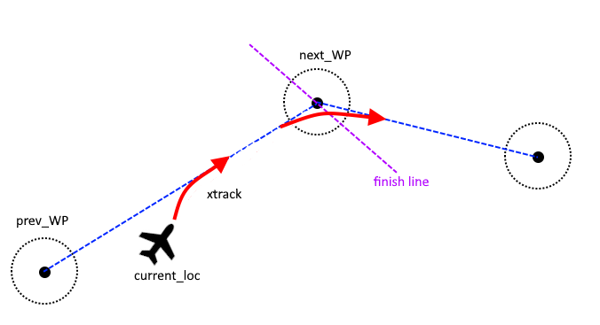

.. _plane-navigation-overview:

==============================================
Plane Navigation and Altitude Control Overview
==============================================

Navigation
==========
In auto-navigating modes like AUTO and CRUISE, or when responding to MAVLink navigation commands, ArduPlane usually uses two WAYPOINT locations (see `location object <https://github.com/ArduPilot/ardupilot/blob/master/libraries/AP_Common/Location.h>`__) and flies a wind compensated path between them:

- ``next_WP``: the destination
- ``prev_WP``: the beginning point



The code usually uses ``do_xxx`` to setup these waypoints (see `commands logic module <https://github.com/ArduPilot/ardupilot/blob/master/ArduPlane/commands_logic.cpp>`__). Sometimes, rather than having an existing starting point to use as ``prev_WP``, code can use the ``set_``next_WP```` method using ``auto_state.next_WP_crosstrack`` variable value to set the ``prev_WP`` to either the current waypoint destination (``next_WP``), or current location. Usually, you want to have the crosstrack false for the first waypoint so you proceed directly from your current position, instead of tracking to the line from a previously set destination. When entering a new mode, the ``prev_WP`` is always set to the current location, and crosstracking is initially disabled to assure navigation directly to whatever the new ``next_WP`` is set by the mode.

Auto-navigating modes call their ``navigation method``, usually involving a ``verify_xxx`` command, to determine if the destination has been reached and setup the next destination, if needed. Determining course correction and navigation roll angles is done by the `L1 Controller <https://github.com/ArduPilot/ardupilot/tree/master/libraries/AP_L1_Control>`__ .

`AP_Common:Location.h <https://github.com/ArduPilot/ardupilot/blob/master/libraries/AP_Common/Location.h>`__ has many useful methods for manipulation locations.

Altitude Control
================

Altitude control is managed by :ref:`tecs-total-energy-control-system-for-speed-height-tuning-guide` using demanded altitude from the mode, in altitude controlled mode. Modes use the ``update_target_altitude`` to calculate demanded altitude for TECS which will calculate the altitude profile between waypoints(`setup_glide_slope <https://github.com/ArduPilot/ardupilot/blob/master/ArduPlane/altitude.cpp#L55>`__ or maintain current altitude. Altitude target can be changed by MAVLink command (DO_CHANGE_ALT) or by stick control using ``update_fbwb_speed_height`` method.

.. note:: if you are actually moving away from the next waypoint, as usually the case if RTL climbing before turning toward home option is set, the prev_WP will have to be continuously reset to present position and the glide slope re-setup in order to continue to climb.