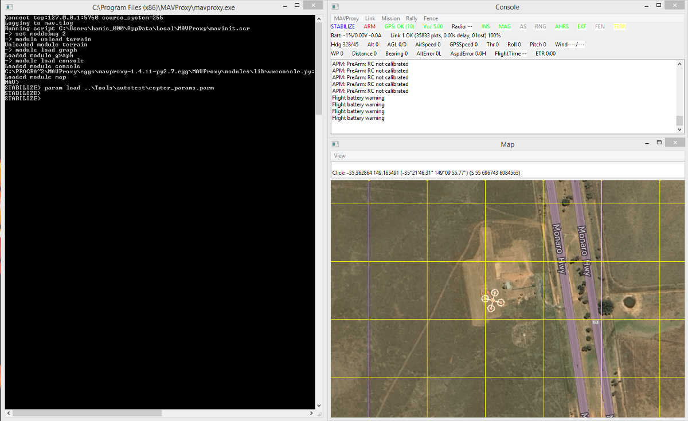
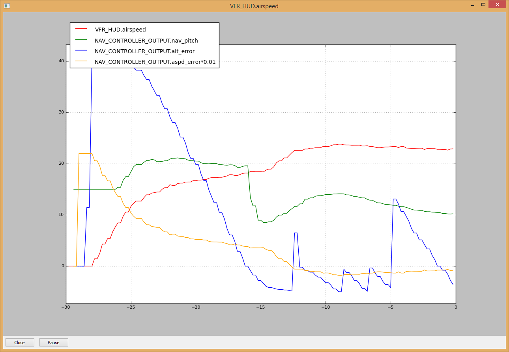
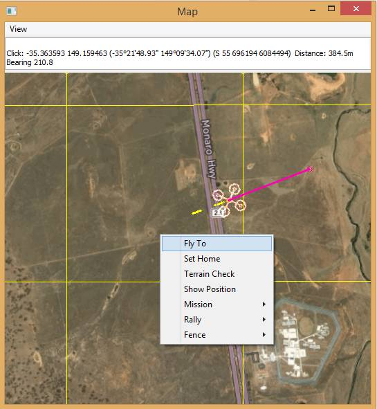

.. _plane-sitlmavproxy-tutorial:

============================
Plane SITL/MAVProxy Tutorial
============================

This tutorial provides a basic walk-through of how to use
:ref:`SITL <sitl-simulator-software-in-the-loop>` and
`MAVProxy <http://ardupilot.github.io/MAVProxy/>`__ for *Plane* testing.

Overview
========

The article is intended primarily for developers who want to test new
Plane builds and bug fixes using SITL and *MAVProxy*. It shows how to
take off, run missions, fly in ``GUIDED`` mode, set a geofence, and
perform a number of other basic testing tasks.

The tutorial is complementary to the topic :ref:`Using SITL for ArduPilot Testing <using-sitl-for-ardupilot-testing>`.

.. note::

   -  We use *MAVProxy* here, but you can :ref:`attach another ground station to SITL <using-sitl-for-ardupilot-testing_connecting_otheradditional_ground_stations>`
      if you prefer (similar instructions can be used in any GCS).
   -  This tutorial is for Plane - see
      :ref:`Copter <copter-sitl-mavproxy-tutorial>` and :ref:`Rover <rover-sitlmavproxy-tutorial>` for similar
      tutorials on the other vehicles.

Preconditions
=============

The tutorial assumes you have already set up :ref:`SITL on Windows <sitl-native-on-windows>` or
:ref:`Linux <setting-up-sitl-on-linux>` and that you have started SITL
using the ``--map`` and ``--console`` options:

::

    cd ~/ardupilot/ArduPlane
    sim_vehicle.py --map --console

.. note::

   If you wish to start the simulation at a different map location or use a different frame type
   (-f option for quadplane,firefly,etc.) than a standard aileron/elevator/rudder/throttle plane, see
   :ref:`SITL Advance Testing <using-sitl-for-ardupilot-testing>`. A complete list of startup
   options for the simulator can be found using the --help option:

::

    sim_vehicle.py --help

The *MAVProxy Command Prompt*, *Console* and *Map* should be arranged
conveniently so you can observe the status and send commands at the same
time.

Taking off
==========

To take off with Plane you can use a mission (AUTO mode) that
contains the
:ref:`MAV_CMD_NAV_TAKEOFF <plane:mav_cmd_nav_takeoff>`
command, or use the TAKEOFF mode. If it's a quadplane, you can also takeoff in a VTOL mode such as QLOITER, QHOVER, or QSTABILIZE, by raising the throttle above mid-stick (using normal defaults, RC 3 1600 command for example). Once you are airborne you can switch to other :ref:`flight modes <plane:flight-modes>` (be sure your throttle is set at an appropriate value for that mode).

First load the **CMAC-circuit.txt** test mission using the ``wp load``
command as shown below (this mission contains the takeoff command):

::

    wp load ..\Tools\autotest\CMAC-circuit.txt
    wp list

Once the mission is loaded you can take off by arming the throttle and
setting the mode to ``AUTO`` (the order of these operations does not
matter):

::

    mode auto 
    arm throttle

The plane should take off to an altitude of 40 metres and then proceed
through the other mission waypoints (most of which have an altitude of
100m). You can stop/pause the mission at any time by changing the mode.

Monitoring
----------

During takeoff you can watch the altitude increase on the console in the
*Alt* field.

Developers may find it useful to **graph** the takeoff by first entering
the ``gtakeoff`` command.

   MAVProxy: PlaneTakeoff Graph (gtakeoff)

Troubleshooting
---------------

The most common sources of difficulty taking off are:

#. Using a mission that does not contain a takeoff command!
#. Attempting to takeoff when the vehicle is not armed. This can happen
   if the vehicle fails pre-arm checks.

You can list all *enabled* checks using the command ``arm list``:

::

    LAND> arm list
    LAND> all
    params
    voltage
    compass
    battery
    ins
    rc
    baro
    gps

You can enable and disable checks using ``arm check n`` and
``arm uncheck n`` respectively, where n is the name of the check. Use
``n`` value of of ``all`` to enables/disable all checks.

Flying a mission
================

You can load a mission at any time using the ``wp load`` command. The
mission will start as soon as the vehicle is armed and you're in
``AUTO`` mode.

The example below shows how to load and start one of the test missions,
skip to the second waypoint using ``wp set n``, and *loop* the mission:

::

    wp load ..\Tools\autotest\CMAC-circuit.txt
    mode auto
    wp set 2
    wp loop

The `MAVProxy Waypoints documentation <http://ardupilot.github.io/MAVProxy/html/uav_configuration/waypoints.html>`__
lists the full set of available commands (or you can get them using
auto-completion by typing "wp" on the command line).

If you want to create a waypoint mission, this is most easily done on
the map:

#. Right-click on the map and then select **Mission \| Draw**.

   .. figure:: ../images/MAVProxyCopter_Mission_Draw.jpg
      :target: ../_images/MAVProxyCopter_Mission_Draw.jpg

      MAVProxy: Draw Mission Menu

#. Left-click on the map where you want the points to appear.

   .. note::

      Nothing visible will happen when you make the first click.
      After the second click, lines will join your points to show the path.
         
#. When you're done, you can loop the mission by right-clicking on the
   map and selecting **Mission \| Loop**.

This approach only allows you to create
:ref:`MAV_CMD_NAV_WAYPOINT <plane:mav_cmd_nav_waypoint>`
commands. You can edit missions and use other commands on Linux using
the *misseditor* module (``module load misseditor``). This is currently
broken on Windows. It is also possible to load other types of commands
from files.

Changing flight modes
=====================

Plane supports a :ref:`number of flight modes <plane:flight-modes>`, which
you can list in *MAVProxy* using the ``mode`` command:

::

    AUTO> mode
    (AUTO> ''LAND', 'AUTOTUNE', 'STABILIZE', 'AUTO', 'GUIDED', 'LOITER', 'MANUAL', 'FBWA', 'FBWB', 'CRUISE', 'INITIALISING', 'CIRCLE', 'ACRO'])

You can set the mode by entering ``mode MODENAME`` on the *MAVProxy
command prompt*.

For example, the command below shows how to put Plane into :ref:`CIRCLE mode <plane:circle-mode>` (this
is like Loiter, except that the plane does not attempt to hold
position).

::

    mode circle

Guiding the vehicle
===================

Once you've taken off you can move the vehicle around the map in
``GUIDED`` mode. Plane will fly to a specified point, and then circle
it.

First change the mode:

::

    mode guided

The easiest way to set a target point is to right-click on the map where
you want to go, select **Fly to**, and then enter the target altitude.

   MAVProxy: Fly toLocation

You can also enter the target position manually on the command line
using the two formats below. If only the altitude is specified, the last
specified LAT/LON will be used.

::

    guided ALTITUDE
    guided LAT LON ALTITUDE

.. note::

   Unlike with Copter, you can't do much with Plane in ``GUIDED``
   mode because the mode does not support many commands. This mode is
   primarily useful for simply flying to a point.

Setting a GeoFence
==================

A GeoFence is is a virtual barrier that Plane uses to constrain the
movement of the vehicle (and move it to a safe location if control is
lost). Plane allows you to specify an arbitrarily shaped region on the
map for the fence, and an upper and lower altitude. If the fence is
breached, Plane will fly to the centre of the fence and circle (or a
rally poin)t. :ref:`Geo-Fencing in Plane <plane:geofencing>`
describes the fence in more detail.

The fence behaviour is set using the :ref:`Plane Fence Parameters <plane:FENCE_ACTION>`.
You can list these with ``param show``:

::

    GUIDED> param show fence*
    GUIDED> FENCE_ACTION     1.000000
    FENCE_AUTOENABLE 0.000000
    FENCE_CHANNEL    0.000000
    FENCE_MAXALT     0.000000
    FENCE_MINALT     0.000000
    FENCE_RETALT     0.000000
    FENCE_RET_RALLY  0.000000
    FENCE_TOTAL      7.000000

Creating the fence is very similar to creating a waypoint mission:

#. Right-click on the map and then select **Fence \| Draw**.

   .. figure:: ../images/mavproxy_plane_select_draw_fence.jpg
      :target: ../_images/mavproxy_plane_select_draw_fence.jpg

      MAVProxy: Draw Fence Menu

#. Left-click on the map at points where you want the fence "posts" to
   appear.

   .. note::

      Nothing visible will happen when you make the first click.
      After the second click, lines will join your points to show the path.
      
#. When you're done, you can loop the fence by right-clicking on the
   map.

   .. figure:: ../images/mavproxy_plane_draw_geofence_points.jpg
      :target: ../_images/mavproxy_plane_draw_geofence_points.jpg

      MAVProxy: Draw Fence Points

#. The fence is initially disabled. To turn it on set the value to one:

   ::

       GUIDED> fence enable

#. Now lets make the plane cross the barrier. Assuming you are already
   flying you can use the following to make it fly straight ahead into
   the fence:

   ::

       GUIDED> mode cruise

#. When the fence is crossed, the plane will fly to the centre of the
   fence region and then circle. The console shows that the breach has
   occurred.

   .. figure:: ../images/MAVProxyPlane_Fence_Breach.jpg
      :target: ../_images/MAVProxyPlane_Fence_Breach.jpg

      MAVProxy: Fence Breach shown on Console and Map

Instead of flying to the centre of the fence you can instead add a
:ref:`rally point <plane:common-rally-points>`
to the map and fly to it by enabling the parameter ``FENCE_RET_RALLY``.

Testing the vehicle
===================

*MAVProxy* allows you to list all the parameters affecting the vehicle
and simulation using ``param show *``, and to set any parameter using:
``param set PARAM_NAME VALUE``. In addition to affecting the vehicle
itself some parameters simulate the performance/failure of specific
hardware components and the environment (for example, the wind). These
can be listed using: ``param show sim*``. The topic :ref:`Using SITL
for ArduPilot Testing <using-sitl-for-ardupilot-testing>` explains
more about how you can test using SITL.
