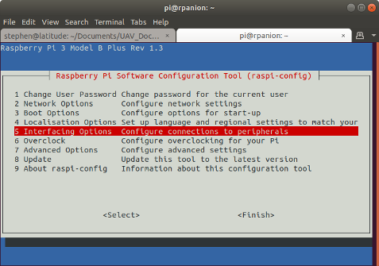
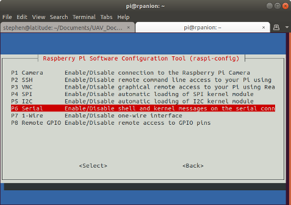

.. _raspberry-pi-via-mavlink:

===========================================
Communicating with Raspberry Pi via MAVLink
===========================================

This page explains how to connect and configure a Raspberry Pi (RPi) so
that it is able to communicate with a flight controller using
the MAVLink protocol over a serial connection. This can be used to
perform additional tasks such as image recognition which simply cannot
be done by the flight controller due to the memory requirements for storing
images.

Connecting the Flight controller and RPi Hardware
=================================================

.. image:: ../images/RaspberryPi_Pixhawk_wiring1.jpg
    :target: ../_images/RaspberryPi_Pixhawk_wiring1.jpg

Connect the flight controller's TELEM2 port to the RPi's Ground, TX and RX pins as
shown in the image above. More details on the individual RPi's pin
functions can be found
`here <http://elinux.org/RPi_Low-level_peripherals>`__.

The RPi can be powered by connecting +5V source to the +5V pin  **or** from USB in.

.. tip::

   Depending on the model of RPi used and internal/external peripherals used, +5V power requirements can vary from 80mA to close to 2.5A. The power budget for the particular system configuration should be assessed to determine the requirements for the +5V supply current. It is usually not recommended that +5v be supplied via the flight controller's TELEM port connector.

.. _raspberry-pi-via-mavlink_setup_the_rpi:

Setting up the flight controller
================================

Connect to the flight controller with a ground station (i.e. Mission Planner) and set the following parameters:

-  :ref:`SERIAL2_PROTOCOL <copter:SERIAL2_PROTOCOL>` = 2 (the default) to enable MAVLink 2 on the serial port.
-  :ref:`SERIAL2_BAUD <copter:SERIAL2_BAUD>` = 921 so the flight controller can communicate with the RPi at 921600 baud.
-  :ref:`LOG_BACKEND_TYPE <copter:LOG_BACKEND_TYPE>` = 3 if you are using APSync to stream the dataflash log files to the RPi

Setup the RPi Software (Automatic)
==================================

The easiest way to setup the RPi is to flash one of the existing :ref:`APSync <apsync-intro>` images:

- purchase a formatted 8GB or 16GB SD card (16GB is better because some 8GB cards will not be quite large enough to fit the image) and insert into your laptop/desktop computer's SD card slot
- download the latest `image from firmware.ardupilot.org <https://firmware.ardupilot.org/Companion/apsync>`__.  Look for the file starting with "apsync-rpi".
- Use the `Etcher <https://www.balena.io/etcher/>`__ software to load the image onto the RPi's SD card.

   .. note::

    There is a more recent APSync build for the RPi in the `forums <https://discuss.ardupilot.org/t/new-apsync-build-for-raspberry-pi/49528>`__.

Setup the RPi (Manual)
======================

This section shows how to configure the RPi as a minimal server to read
and route telemetry from the autopilot. It does not install the full
APSync software.

.. _raspberry-pi-via-mavlink_connecting_to_rpi_with_an_sshtelnet_client:

Connecting to RPi with an SSH/Telnet client
-------------------------------------------

See the `RPi Documentation <https://www.raspberrypi.org/documentation/remote-access/ssh/>`__

.. _raspberry-pi-via-mavlink_install_the_required_packages_on_the_raspberry_pi:

Install the required packages on the Raspberry Pi
-------------------------------------------------

After the internet connection is confirmed to be working install these
packages:

::

    sudo apt-get update    #Update the list of packages in the software center
    sudo apt-get install python3-dev python3-opencv python3-wxgtk3.0 libxml2-dev python3-pip python3-matplotlib python3-lxml
    sudo pip3 install future
    sudo pip3 install pymavlink
    sudo pip3 install mavproxy

.. note::

   The packages are :ref:`mostly the same as when setting up SITL <setting-up-sitl-on-windows>`. Reply Reply 'y' when
   prompted re additional disk space.

Configure the serial port (UART)
--------------------------------

Use the Raspberry Pi configuration utility for this.

Type:

::

    sudo raspi-config

And in the utility, select "Interfacing Options":

   RasPiConfiguration Utility

And then "Serial":

When prompted, select ``no`` to "Would you like a login shell to be accessible over serial?".

When prompted, select ``yes`` to "Would you like the serial port hardware to be enabled?".

Reboot the Raspberry Pi when you are done.

The Raspberry Pi's serial port will now be usable on ``/dev/serial0``.

Testing the connection
----------------------

To test the RPi and flight controller are able to communicate with each other
first ensure the RPi and flight controller are powered, then in a console on the
RPi type:

::

    python3 mavproxy.py --master=/dev/serial0 --baudrate 921600 --aircraft MyCopter
    

Once MAVProxy has started you should be able to type in the following
command to display the ``ARMING_CHECK`` parameters value

::

    param show ARMING_CHECK
    param set ARMING_CHECK 0
    arm throttle

.. image:: ../images/RaspberryPi_ArmTestThroughPutty.png
    :target: ../_images/RaspberryPi_ArmTestThroughPutty.png

.. note::

   If you get an error about not being able to find log files or if
   this example otherwise doesn't run properly, make sure that you haven't
   accidentally assigned these files to another username, such as
   Root.

Entering the following at the Linux command line will ensure that all
files belong to the standard Pi login account:

::

    sudo chown -R pi /home/pi

Installing mavlink-router
-------------------------

Mavlink-router is used to route telemetry between the RPi's serial port
and any network endpoints. See the `documentation <https://github.com/intel/mavlink-router>`__
for install and running instructions.

After installing, edit the mavlink-router config file's (``/etc/mavlink-router/config.d``)
UART section to:

::

    [UartEndpoint to_fc]
    Device = /dev/serial0
    Baud = 921600

Configuring the Pi as a Wifi Access Point
-----------------------------------------

To configure the RPi to stream telemetry over it's own
Wifi network, see the `official RPi documention
<https://www.raspberrypi.org/documentation/configuration/wireless/access-point.md>`__
for details.

If not already present, you will also need to add an additional
UDP endpoint to the mavlink-router config file (``/etc/mavlink-router/config.d``).

::

    [UdpEndpoint to_14550_external]
    Mode = eavesdropping
    Address = 0.0.0.0
    Port = 14550
    PortLock = 0

Installing DroneKit on RPi
--------------------------

The most up-to-date instructions for `Installing DroneKit <https://dronekit-python.readthedocs.io/en/latest/guide/quick_start.html>`__ on Linux are in the DroneKit-Python documentation.

.. _raspberry-pi-via-mavlink_connecting_with_the_mission_planner:

Connecting with the Mission Planner
===================================

The flight controller will respond to MAVLink commands received through Telemetry
1 and Telemetry 2 ports (see image at top of this page) meaning that
both the RPi and the regular ground station (i.e. Mission planner, etc)
can be connected. In addition it is possible to connect the Mission
Planner to the MAVProxy application running on the RPi :ref:`similar to how it is done for SITL <setting-up-sitl-on-windows_connecting_with_the_mission_planner>`.

Primarily this means adding an ``--out <ipaddress>:14550`` to the
MAVProxy startup command with the being the address of the PC running
the mission planner.  On windows the ``ipconfig`` can be used to
determine that IP address. On the computer used to write this wiki page
the MAVProxy command became:

::

    mavproxy.py --master=/dev/ttyAMA0 --baudrate 57600 --out 192.168.137.1:14550 --aircraft MyCopter

Connecting with the mission planner is shown below:

.. image:: ../images/RaspberryPi_MissionPlanner.jpg
    :target: ../_images/RaspberryPi_MissionPlanner.jpg

Example projects
================

`FPV with raspberry Pi <https://diydrones.com/profiles/blogs/fpv-setup-with-raspberry-pi>`__

Can't get it to work? Try posting your question in the `Companion Computer discussion board <https://discuss.ardupilot.org/c/apsync-companion-computers>`__.

