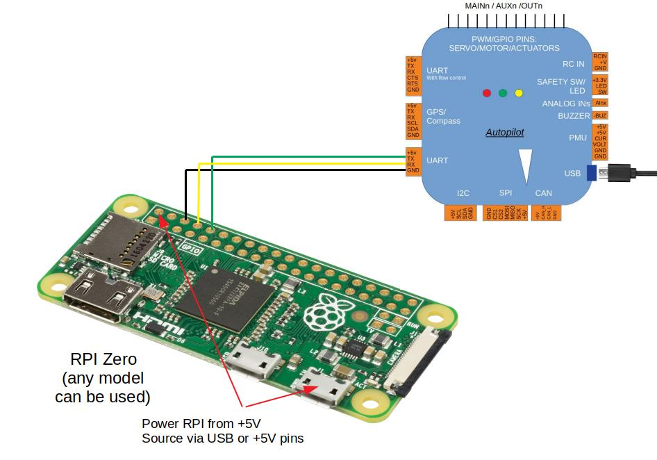

.. _raspberry-pi-via-mavlink:

===========================================
Communicating with Raspberry Pi via MAVLink
===========================================

This page explains how to connect and configure a Raspberry Pi (RPi) so
that it is able to communicate with a Pixhawk flight controller using
the MAVLink protocol over a serial connection. This can be used to
perform additional tasks such as image recognition which simply cannot
be done by the Pixhawk due to the memory requirements for storing
images.

Connecting the Pixhawk and RPi
==============================

Connect the Pixhawk's TELEM2 port to the RPi's Ground, TX and RX pins as
shown in the image above. More details on the individual RPi's pin
functions can be found
`here <http://elinux.org/RPi_Low-level_peripherals>`__.

The RPi can be powered by connecting the red V+ cable to the +5V pin (as
shown above) **or** from USB in (for example, using a separate 5V BEC
hooked up to the USB power).

.. tip::

   Powering via USB is recommended as it is typically safer - because
   the input is regulated. If powering via USB, do not also connect the +5V
   pin as shown (still connect common ground).

.. _raspberry-pi-via-mavlink_setup_the_rpi:

Setup the RPi
=============

The easiest way to setup the RPi is to flash one of the existing :ref:`APSync <apsync-intro>` images:

- purchase a formatted 8GB or 16GB SD card (16GB is better because some 8GB cards will not be quite large enough to fit the image) and insert into your laptop/desktop computer's SD card slot
- download the latest `image from firmware.ardupilot.org <http://firmware.ap.ardupilot.org/Companion/apsync>`__.  Look for the file starting with "apsync-rpi".
- extract the image.  On Windows you may use `7-zip <http://www.7-zip.org/>`__.
- For Windows download and install Win32DiskImager and follow the `instructions here <https://www.raspberrypi.org/documentation/installation/installing-images/windows.md>`__.
- For `Linux follow these instructions <https://www.raspberrypi.org/documentation/installation/installing-images/linux.md>`__.
- For `Mac follow these instructions <https://www.raspberrypi.org/documentation/installation/installing-images/mac.md>`__.

.. note::

   When extracting the contents of the compressed file on Mac you may get into an infinite loop of extraction (.xz to .cpgz and vice versa) using the default Archiver. In order to correctly extract the .img file you will need to use the Unarchiver (http://unarchiver.c3.cx/unarchiver).

Setting up the Pixhawk
======================

Connect to the Pixhawk with a ground station (i.e. Mission Planner) and set the following parameters:

-  :ref:`SERIAL2_PROTOCOL <copter:SERIAL2_PROTOCOL>` = 1 (the default) to enable MAVLink on the serial port.
-  :ref:`SERIAL2_BAUD <copter:SERIAL2_BAUD>` = 921 so the Pixhawk can communicate with the RPi at 921600 baud.
-  :ref:`LOG_BACKEND_TYPE <copter:LOG_BACKEND_TYPE>` = 3 if you are using APSync to stream the dataflash log files to the RPi

.. _raspberry-pi-via-mavlink_connecting_to_rpi_with_an_sshtelnet_client:

Connecting to RPi with an SSH/Telnet client
===========================================

.. note::

   These steps assume that you have `set-up your RPi <http://www.raspberrypi.org/downloads>`__ so that it is running Raspbian.  These instructions are not required if you are using APSync as described above.

   To avoid the requirement to plug a keyboard, mouse and HDMI screen into
   your RPi it is convenient to be able to connect from your Desktop/Laptop
   computer to your RPi using an SSH/Telnet client such as
   `PuTTY <http://www.putty.org/>`__.

#. Connect the RPi to your local network by one of the following
   methods:

   -  Connecting an Ethernet LAN cable from the RPi board to your
      Ethernet router, or
   -  `Use a USB dongle to connect your RPi to the local wireless network <http://pingbin.com/2012/12/setup-wifi-raspberry-pi/>`__,
      or
   -  Connect the Ethernet LAN cable between the RPi and your
      desktop/laptop computer. Open the control panel's Network and
      Sharing Center, click on the network connection through which your
      desktop/laptop is connected to the internet, select properties and
      then in the sharing tab, select "Allow other networks to connect
      through this computer's Internet connection"

      .. image:: ../images/RaspberryPi_EthernetBridge.png
          :target: ../_images/RaspberryPi_EthernetBridge.png

#. Determine the RPi's IP address:

   -  If you have access to the RPi's terminal screen (i.e.you have a
      screen, keyboard, mouse connected) you can use the /sbin/ifconfig
      command.
   -  If your Ethernet router has a web interface it may show you the IP
      address of all connected devices

#. Connect with `Putty <http://www.putty.org/>`__:

   .. image:: ../images/RaspberryPi_Putty.png
       :target: ../_images/RaspberryPi_Putty.png

   If all goes well you should be presented with the regular login
   prompt to which you can enter the username/password which defaults to
   pi/raspberry

.. _raspberry-pi-via-mavlink_install_the_required_packages_on_the_raspberry_pi:

Install the required packages on the Raspberry Pi
=================================================

Log into the RPi board (default username password is pi/raspberry) and
check that its connection to the internet is working:

::

    ping google.com

OR

::

    ping 173.194.126.196

If the first fails but the second succeeds then there is a problem with
the DNS server that your RPi is attempting to use.  Please edit the
/etc/resolv.conf file and add the IP address of a nearby DNS server. 
During the creation of this wiki, the first two parts of the desktop
machine's IP address plus ".1.1" worked.  To stop other processes from
later updating this file you may wish to run the
``chattr +i /etc/resolv.conf`` command (this can be undone later with
``chattr -i /etc/resolv.conf``). That sets the "immutable" bit on
resolv.conf to prevent other software from updating it.

.. image:: ../images/RaspberryPi_DNS.png
    :target: ../_images/RaspberryPi_DNS.png

After the internet connection is confirmed to be working install these
packages:

::

    sudo apt-get update    #Update the list of packages in the software center
    sudo apt-get install screen python-wxgtk2.8 python-matplotlib python-opencv python-pip python-numpy python-dev libxml2-dev libxslt-dev python-lxml
    sudo pip install future
    sudo pip install pymavlink
    sudo pip install mavproxy

.. note::

   The packages are :ref:`mostly the same as when setting up SITL <setting-up-sitl-on-windows>`. Reply Reply 'y' when
   prompted re additional disk space.

Disable the OS control of the serial port
=========================================

Use the Raspberry Pi configuration utility for this.

Type:

::

    sudo raspi-config

And in the utility, select "Advanced Options":

.. figure:: ../images/dev_RasPi_Config_Utility_SerialSetting_AdvancedOptions.png
   :target: ../_images/dev_RasPi_Config_Utility_SerialSetting_AdvancedOptions.png

   RasPiConfiguration Utility: Serial Settings: Advanced Options

And then "Serial" to disable OS use of the serial connection:

.. image:: ../images/dev_RasPi_Config_Utility_SerialSetting_Capture2-300x78.png
    :target: ../_images/dev_RasPi_Config_Utility_SerialSetting_Capture2-300x78.png

Reboot the Raspberry Pi when you are done.

Testing the connection
======================

To test the RPi and Pixhawk are able to communicate with each other
first ensure the RPi and Pixhawk are powered, then in a console on the
RPi type:

::

    sudo -s
    mavproxy.py --master=/dev/ttyAMA0 --baudrate 57600 --aircraft MyCopter
    
.. note::

    On newer versions of Raspberry Pi 3 the uart serial connection may be disable by default. In order to enable serial
    connection on the Raspberry Pi edit **/boot/config.txt** and ``set enable_uart=1``.
    the build-in serial port is ``/dev/ttyS0``.

Once MAVProxy has started you should be able to type in the following
command to display the ``ARMING_CHECK`` parameters value

::

    param show ARMING_CHECK
    param set ARMING_CHECK 0
    arm throttle

.. note::

   If you get an error about not being able to find log files or if
   this example otherwise doesn't run properly, make sure that you haven't
   accidentally assigned these files to another username, such as
   Root.

Entering the following at the Linux command line will ensure that all
files belong to the standard Pi login account:

::

    sudo chown -R pi /home/pi

Configure MAVProxy to always run
================================

To setup MAVProxy to start whenever the RPi is restarted open a terminal
window and edit the **/etc/rc.local** file, adding the following lines
just before the final "exit 0" line:

::

    (
    date
    echo $PATH
    PATH=$PATH:/bin:/sbin:/usr/bin:/usr/local/bin
    export PATH
    cd /home/pi
    screen -d -m -s /bin/bash mavproxy.py --master=/dev/ttyAMA0 --baudrate 57600 --aircraft MyCopter
    ) > /tmp/rc.log 2>&1
    exit 0

Whenever the RPi connects to the Pixhawk, three files will be created in
the /home/pi/MyCopter/logs/YYYY-MM-DD directory:

-  **mav.parm** : a text file with all the parameter values from the
   Pixhawk
-  **flight.tlog** : a telemetry log including the vehicles altitude,
   attitude, etc which can be opened using the mission planner (and a
   number of other tools)
-  **flight.tlog.raw** : all the data in the .tlog mentioned above plus
   any other serial data received from the Pixhawk which might include
   non-MAVLink formatted messages like startup strings or debug output

If you wish to connect to the MAVProxy application that has been
automatically started you can log into the RPi and type:

::

    sudo screen -x

To learn more about using MAVProxy please read the `MAVProxy documentation <http://ardupilot.github.io/MAVProxy/>`__.

It is also worth noting that MAVProxy can do a lot more than just
provide access to your Pixhawk. By writing python extension modules for
MAVProxy you can add sophisticated autonomous behaviour to your vehicle.
A MAVProxy module has access to all of the sensor information that your
Pixhawk has, and can control all aspects of the flight. To get started
with MAVProxy modules please have a look at the `existing modules <https://github.com/tridge/MAVProxy/tree/master/MAVProxy/modules>`__
in the MAVProxy source code.

Installing DroneKit on RPi
==========================

.. tip::

   The most up-to-date instructions for `Installing DroneKit <http://python.dronekit.io/guide/quick_start.html#installation>`__
   on Linux are in the DroneKit-Python documentation. This information is a
   summary, and might go out of date.

To install DroneKit-Python dependencies (most of which will already be
present from when you installed MAVProxy) and set DroneKit to load when
MAVProxy starts:

::

    sudo apt-get install python-pip python-dev python-numpy python-opencv python-serial python-pyparsing python-wxgtk2.8 libxml2-dev libxslt-dev
    sudo pip install droneapi
    echo "module load droneapi.module.api" >> ~/.mavinit.scr

Then open the MAVProxy terminal in the location where your DroneKit
script is located and start an example:

::

    MANUAL> api start vehicle_state.py

.. note::

   If you get a warning that droneapi module has not loaded, you can
   do so manually in MAVProxy:

   ::

       MANUAL> module load droneapi.module.api

.. _raspberry-pi-via-mavlink_connecting_with_the_mission_planner:

Connecting with the Mission Planner
===================================

The Pixhawk will respond to MAVLink commands received through Telemetry
1 and Telemetry 2 ports (see image at top of this page) meaning that
both the RPi and the regular ground station (i.e. Mission planner, etc)
can be connected. In addition it is possible to connect the Mission
Planner to the MAVProxy application running on the RPi :ref:`similar to how it is done for SITL <setting-up-sitl-on-windows_connecting_with_the_mission_planner>`.

Primarily this means adding an ``--out <ipaddress>:14550`` to the
MAVProxy startup command with the being the address of the PC running
the mission planner.  On windows the ``ipconfig`` can be used to
determine that IP address. On the computer used to write this wiki page
the MAVProxy command became:

::

    mavproxy.py --master=/dev/ttyAMA0 --baudrate 57600 --out 192.168.137.1:14550 --aircraft MyCopter

Connecting with the mission planner is shown below:

.. image:: ../images/RaspberryPi_MissionPlanner.jpg
    :target: ../_images/RaspberryPi_MissionPlanner.jpg

Example projects
================

`FPV with raspberry Pi <http://diydrones.com/profiles/blogs/fpv-setup-with-raspberry-pi>`__

Can't get it to work? Try posting your question in the `APM Forum's APM Code section <http://ardupilot.com/forum/viewforum.php?f=69>`__.

.. toctree::
    :maxdepth: 1

    Making a Mavlink WiFi bridge using the Raspberry Pi <making-a-mavlink-wifi-bridge-using-the-raspberry-pi>
