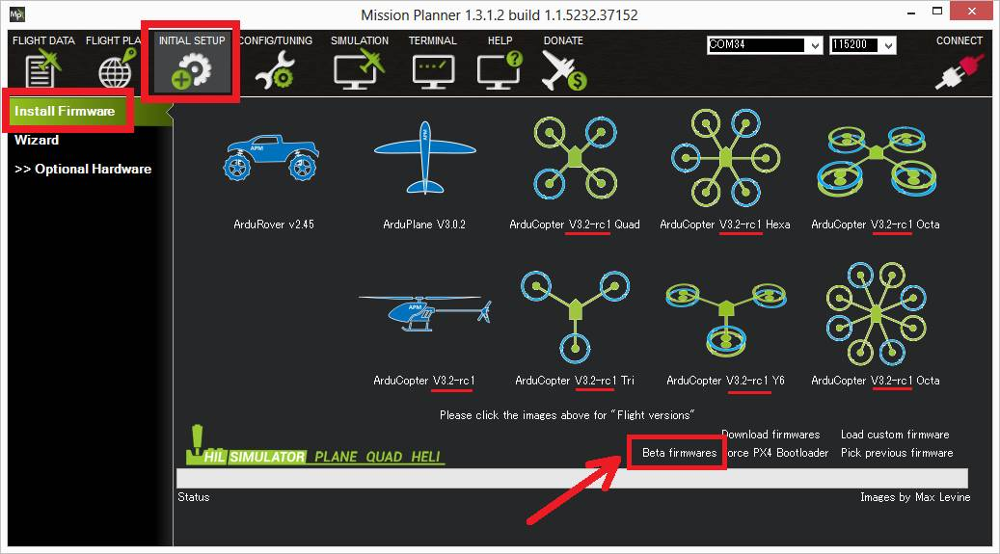

.. _release-procedures:

=========================
Copter Release Procedures
=========================

ArduPilot is very reliable because bug fixes are prioritised over new features and releases are performed carefully and only after sufficient testing has been completed.

This page outlines the steps that are normally followed for a Copter release.  Listed mostly as a reference so that we don't forget the steps.

Alpha Testing
=============

The `AutoTester <http://autotest.ardupilot.org/>`__ runs after each
commit and highlights issues that it has been setup to test.

Developers and some Alpha testers perform intermittent tests of master
especially after new features have been added.

Releasing Beta Versions / Release Candidates
============================================

Beta Testing / Release candidates are made available to beta testers through the
mission planner's "Beta firmwares" link.  The Mission Planner "Beta
firmware" link pulls the firmware from the `Copter/beta directory of firmware.ardupilot.org. <http://firmware.ardupilot.org/Copter/beta/>`__

Someone with ardupilot GitHub commit access (normally Randy) makes the new firmware available through the following steps:

Create a new release branch or switch to an existing release branch
-------------------------------------------------------------------

Open a Git Bash terminal in the ardupilot repository.

If this release involves a major or minor version increase (i.e. 3.5 to 3.6) create a new branch in your local ardupilot repository:

- ``git checkout -b Copter-3.6`` ("Copter-3.6" should be replaced with the corrrect major and minor version numbers)
- ``git push`` to create the new directory in the shared repo
- click the `"New Project" button <https://github.com/ArduPilot/ardupilot/projects>`__ on the GitHub projects page to create the corresponding "Copter 3.x Backports" project.  This is used to track features to be included in future releases

Alternatively if this release is built on an earlier release branch checkout the branch:

- ``git checkout Copter-3.6`` to switch to the existing release branch ("Copter-3.6" should be replaced with the corrrect major and minor version numbers)

Pull in changes from master
---------------------------

Check the `ArduPilot Github Projects <https://github.com/ArduPilot/ardupilot/projects>`__ to determine which PRs and commits should be included in this release.
For example the `Copter 3.5 Backports project <https://github.com/ArduPilot/ardupilot/projects/4>`__ holds the list of PRs and commits that should be included in the next Copter-3.5 release.

- ``git reset --hard origin/master``, ``git submodule update --recursive`` can be used to reset the release branch to master if all of master should be included (this is normal for at least the first few beta releases)

OR

- use ``gitk master`` to cherry-pick in just some changes from master

Update version, release notes and tags
--------------------------------------

1. update the THISFIRMWARE and FIRMWARE_VERSION definitions in `version.h <https://github.com/ArduPilot/ardupilot/blob/master/ArduCopter/version.h>`__
2. update `ReleaseNotes.txt <https://github.com/ArduPilot/ardupilot/blob/master/ArduCopter/ReleaseNotes.txt>`__
3. ``git show ArduCopter-beta`` and record the old git tag in case a backout is required
4. ``git tag -d ArduCopter-beta`` to delete the beta tag from the local repo
5. ``git push origin :refs/tags/ArduCopter-beta`` to delete the beta tag from the shared repo
6. ``git tag ArduCopter-beta HEAD`` to create a new beta tag in the local repo
7. ``git push origin ArduCopter-beta`` to push the new beta tag to the shared repo
8. check the `ArduPilot GitHub release list <https://github.com/ArduPilot/ardupilot/releases>`__ to ensure all tags have been updated in the shared repo

Steps 4 to 8 above should be repeated for the ``ArduCopter-beta-heli`` tag to release for Traditional Helicopters.

Check the versions are available in Mission Planner
---------------------------------------------------

Wait a few hours for the binaries to be built and then open the Mission Planner's Initial Setup > Install Firmware page and
click the "Beta firmwares" link and ensure that the version displayed
below each multicopter icon has updated.

Announce the release to the beta testers
----------------------------------------

Let Beta testers know the new version is available by creating a post in `Discourse's Copter category <https://discuss.ardupilot.org/c/arducopter>`__ (create a new category if required)
and by posting on the `ArduPilot facebook group <https://www.facebook.com/groups/ArduPilot.org>`__.  Include the contents of the ReleaseNotes.txt so people know what has changed and a video if possible.

Issue Tracking
--------------

- beta testers should report issues in the appropriate `discourse Copter forum <https://discuss.ardupilot.org/c/arducopter>`__
- the release manager (Randy) with help from other developers should investigate issues and respond with the cause of the problem
- confirmed bugs should be added to the `ArduPilot Issues List <https://github.com/ArduPilot/ardupilot/issues>`__.  The issue's label should be set to "Copter" and Projects and Milestone set to the upcoming release if it should be addressed before release.

Releasing Stable Versions
=========================

Stable releases are done after weeks or months of beta testing and normally only after two weeks have passed with no unexplained crashes.

The go-no-go decision on a stable release is discussed on the preceding :ref:`weekly development call <ardupilot-mumble-server>`.  This discussion normally includes a review of the outstanding issues.

Releasing a stable version is the same as a beta version except the ``ArduCopter-stable`` and ``ArduCopter-stable-heli`` tags are used.

An additional tag is created including the patch release number:

- ``git tag Copter-3.6.0``
- ``git push origin Copter-3.6.0``

Didn't find what you are looking for?
=====================================

If you think of something that should be added to this site, please
`open an issue <https://github.com/ArduPilot/ardupilot/issues>`__ or
post a comment on the
`drones-discuss <https://groups.google.com/forum/#!forum/drones-discuss>`__
mailing list.
