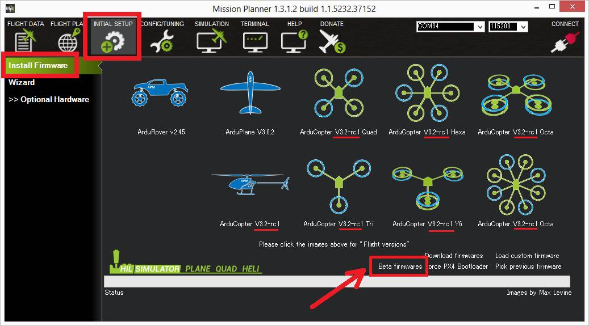

.. _release-procedures:

==================
Release Procedures
==================

ArduPilot is very reliable because bug fixes are prioritised over new features and releases are performed carefully and only after sufficient testing has been completed.

This page outlines the steps that are normally followed for a new release.  Listed mostly as a reference so that we don't forget the steps.

Alpha Testing
=============

The `AutoTester <https://autotest.ardupilot.org/>`__ runs after each
commit and highlights issues that it has been setup to test.

Developers and some Alpha testers perform intermittent tests of master
especially after new features have been added.

Releasing Beta Versions / Release Candidates
============================================

Beta Testing / Release candidates are made available to beta testers through the
mission planner's "Beta firmwares" link.  The Mission Planner "Beta
firmware" link pulls the firmware from the `beta directories of firmware.ardupilot.org. <https://firmware.ardupilot.org/Copter/beta/>`__

Someone with ardupilot GitHub commit access (normally Randy) makes the new firmware available through the following steps:

For major releases create a new branch
--------------------------------------

Open a Git Bash terminal in the ardupilot repository.

For major releases (e.g 4.6 to 4.7) create a new branch in the ardupilot repository based on master:

- ``git checkout -b ArduPilot-4.7`` ("ArduPilot-4.7" should be replaced with the correct major version number)
- ``git push`` to create the new directory in the ardupilot repo
- On GitHub ensure the new branch is protected under the `Branch protection rules <https://github.com/ArduPilot/ardupilot/settings/branches>`__
- On the `GitHub projects <https://github.com/ArduPilot/ardupilot/projects?query=is%3Aopen>`__ page, push the "New Project" button and create a new "4.x Backports" project.  This is used to track features to be included in this release
- Create a new `GitHub issue <https://github.com/ArduPilot/ardupilot/issues>`__ for issue tracking (e.g. `ArduPilot 4.7 Issues list <https://github.com/ArduPilot/ardupilot/issues/32385>`__)

Create a Release Pull Request
-----------------------------

1. In your local repo, create a new branch based on the upstream release branch:

  - ``git checkout upstream/ArduPilot-4.7`` ("ArduPilot-4.7" should be replaced with the correct major version number)
  - ``git checkout -b ap-470-xxx`` to create a new branch for the release PR

2. Check the `Backports Projects <https://github.com/orgs/ArduPilot/projects>`__ to determine which PRs should be included in this release. For example the `4.7 Backports <https://github.com/orgs/ArduPilot/projects/25/views/2>`__ "pending" column holds the list of PRs that should be included in the next ArduPilot-4.7 release.
3. Create a new column in the project for this release (e.g. 4.7.1-beta1)

  - use ``gitk upstream/master`` to cherry-pick in each PR's commits from master

4. As PRs are included in the new branch, move the PR from the "No Status" or "Pending" column of the project to the column for this release

5. Update version, release notes and tags

  - update the THISFIRMWARE and FIRMWARE_VERSION definitions in `version.h <https://github.com/ArduPilot/ardupilot/blob/master/ArduCopter/version.h>`__
  - update `ReleaseNotes.txt <https://github.com/ArduPilot/ardupilot/blob/master/ArduCopter/ReleaseNotes.txt>`__ for each vehicle

6. Create the PR and gather signatures from other developers
7. Merge the PR

Update Release Tags
-------------------

New firmwares will be built and made available to the ground stations once these ardupilot repo tags are updated:

Update Beta tags for Plane

- ``git show ArduPlane-beta``
- ``git tag -d ArduPlane-beta``
- ``git push origin :refs/tags/ArduPlane-beta``
- ``git tag ArduPlane-beta HEAD``
- ``git push origin ArduPlane-beta``

Update Beta tags for Copter and TradHeli

- ``git show ArduCopter-beta`` and record the old git tag in case a backout is required
- ``git show ArduCopter-beta-heli``
- ``git tag -d ArduCopter-beta`` to delete the beta tag from the local repo
- ``git tag -d ArduCopter-beta-heli``
- ``git push origin :refs/tags/ArduCopter-beta`` to delete the beta tag from the shared repo
- ``git push origin :refs/tags/ArduCopter-beta-heli``
- ``git tag ArduCopter-beta HEAD`` to create a new beta tag in the local repo
- ``git tag ArduCopter-beta-heli HEAD``
- ``git push origin ArduCopter-beta`` to push the new beta tag to the shared repo
- ``git push origin ArduCopter-beta-heli``

Update Beta tags for Rover

- ``git show APMrover2-beta``
- ``git tag -d APMrover2-beta``
- ``git push origin :refs/tags/APMrover2-beta``
- ``git tag APMrover2-beta HEAD``
- ``git push origin APMrover2-beta``

Update Beta tags for Sub

- ``git show ArduSub-beta``
- ``git tag -d ArduSub-beta``
- ``git push origin :refs/tags/ArduSub-beta``
- ``git tag ArduSub-beta HEAD``
- ``git push origin ArduSub-beta``

Update Beta tags for AntennaTracker

- ``git show AntennaTracker-beta``
- ``git tag -d AntennaTracker-beta``
- ``git push origin :refs/tags/AntennaTracker-beta``
- ``git tag AntennaTracker-beta HEAD``
- ``git push origin AntennaTracker-beta``

Update Beta tags for Periph

- ``git show AP_Periph-beta``
- ``git tag -d AP_Periph-beta``
- ``git push origin :refs/tags/AP_Periph-beta``
- ``git tag AP_Periph-beta HEAD``
- ``git push origin AP_Periph-beta``

Check the `GitHub Tags <https://github.com/ArduPilot/ardupilot/tags>`__ to ensure all tags have been updated

Pull the release notes commits into the ardupilot/master branch

Check the firmwares have been updated
-------------------------------------

Wait 8hrs to 24hrs for the binaries to be built.  Check the "Build Dates" have updated on these links:

- `Build list <https://firmware.ardupilot.org/Tools/BuildSizes/builds.html>`__
- `Mission Planner SITL firmware <https://firmware.ardupilot.org/Tools/MissionPlanner/sitl/Beta/>`__

In case the firmwares have not updated it may help to check these links:

- `manifest.json <https://firmware.ardupilot.org/manifest.json>`__
- `autotest-output.txt <https://autotest.ardupilot.org/autotest-output.txt>`__

Finally open Mission Planner's Setup / Install Firmware page, push the "Beta firmwares" link and check the versions displayed under each icon are correct.

Announce the release to the beta testers
----------------------------------------

Let Beta testers know the new version is available by posting on discuss and facebook

- `Discuss's Plane category <https://discuss.ardupilot.org/c/arduplane>`__ (create a new category if required)
- `Discuss's Copter category <https://discuss.ardupilot.org/c/arducopter>`__ (create a new category if required)
- `Discuss's Rover category <https://discuss.ardupilot.org/c/ardurover>`__ (create a new category if required)
- `Discuss's Sub category <https://discuss.ardupilot.org/c/sub>`__ (create a new category if required)
- `Discuss's AntennaTracker category <https://discuss.ardupilot.org/c/antennatracker>`__ (create a new category if required)
- `ArduPilot facebook group <https://www.facebook.com/groups/ArduPilot.org>`__.  Include the contents of the ReleaseNotes.txt so people know what has changed and a video if possible

Issue Tracking
--------------

- Beta testers should report issues in the appropriate category mentioned above (e.g. `Discuss Copter-4.7 forum <https://discuss.ardupilot.org/c/arducopter/copter-47/184>`__)
- The release manager, with help from other developers, should investigate issues, identify developers to tackle them and keep the beta testers updated on progress
- User reports should be tracked in the release's GitHub issue (e.g. `ArduPilot 4.7 Issues list <https://github.com/ArduPilot/ardupilot/issues/32385>`__)

Releasing Stable Versions
=========================

Stable releases are done after weeks or months of beta testing and normally only after two weeks have passed with no unexplained crashes.

The go-no-go decision on a stable release is discussed on the preceding :ref:`weekly development call <ardupilot-discord-server>`.  This discussion normally includes a review of the outstanding issues.

Releasing a stable version is the same as a beta version except these tags are updated:

Update Stable tags for Plane

- ``git show ArduPlane-stable``
- ``git tag -d ArduPlane-stable``
- ``git push origin :refs/tags/ArduPlane-stable``
- ``git tag ArduPlane-stable HEAD``
- ``git push origin ArduPlane-stable``

Update Stable tags for Copter and TradHeli:

- ``git show ArduCopter-stable``
- ``git show ArduCopter-stable-heli``
- ``git tag -d ArduCopter-stable``
- ``git tag -d ArduCopter-stable-heli``
- ``git push origin :refs/tags/ArduCopter-stable``
- ``git push origin :refs/tags/ArduCopter-stable-heli``
- ``git tag ArduCopter-stable HEAD``
- ``git tag ArduCopter-stable-heli HEAD``
- ``git push origin ArduCopter-stable``
- ``git push origin ArduCopter-stable-heli``

Update Stable tags for Rover

- ``git show APMrover2-stable``
- ``git tag -d APMrover2-stable``
- ``git push origin :refs/tags/APMrover2-stable``
- ``git tag APMrover2-stable HEAD``
- ``git push origin APMrover2-stable``

Update Stable tags for Sub

- ``git show ArduSub-stable``
- ``git tag -d ArduSub-stable``
- ``git push origin :refs/tags/ArduSub-stable``
- ``git tag ArduSub-stable HEAD``
- ``git push origin ArduSub-stable``

Update Stable tags for AntennaTracker

- ``git show AntennaTracker-stable``
- ``git tag -d AntennaTracker-stable``
- ``git push origin :refs/tags/AntennaTracker-stable``
- ``git tag AntennaTracker-stable HEAD``
- ``git push origin AntennaTracker-stable``

Update Stable tags for Periph

- ``git show AP_Periph-stable``
- ``git tag -d AP_Periph-stable``
- ``git push origin :refs/tags/AP_Periph-stable``
- ``git tag AP_Periph-stable HEAD``
- ``git push origin AP_Periph-stable``

An additional tag is created for each vehicle that includes the patch release number

- ``git tag Plane-4.7.0``
- ``git push origin Plane-4.7.0``
- ``git tag Copter-4.7.0``
- ``git push origin Copter-4.7.0``
- ``git tag Rover-4.7.0``
- ``git push origin Rover-4.7.0``
- ``git tag Sub-4.7.0``
- ``git push origin Sub-4.7.0``
- ``git tag AntennaTracker-4.7.0``
- ``git push origin AntennaTracker-4.7.0``
- ``git tag AP_Periph-4.7.0``
- ``git push origin AP_Periph-4.7.0``

Announcements are done in much the same way as beta releases by posting on these sites:

- `Discuss's Plane category <https://discuss.ardupilot.org/c/arduplane>`__
- `Discuss's Copter category <https://discuss.ardupilot.org/c/arducopter>`__
- `Discuss's Rover category <https://discuss.ardupilot.org/c/ardurover>`__
- `Discuss's Sub category <https://discuss.ardupilot.org/c/sub>`__
- `Discuss's AntennaTracker category <https://discuss.ardupilot.org/c/antennatracker>`__
- `ArduPilot facebook group <https://www.facebook.com/groups/ArduPilot.org>`__.  Include the contents of the ReleaseNotes.txt so people know what has changed and a video if possible
- `LinkedIn <https://www.linkedin.com>`__
- On Github, `Draft a new release <https://github.com/ArduPilot/ardupilot/releases>`__ and add the Discuss link from above

Mission Planner will also show a pop-up informing users that a new version is available.

Didn't find what you are looking for?
=====================================

If you think of something that should be added to this site, please
`open an issue <https://github.com/ArduPilot/ardupilot/issues>`__ or
post a comment on the
`ArduPilot Discord Chat <https://ardupilot.org/discord>`__.
