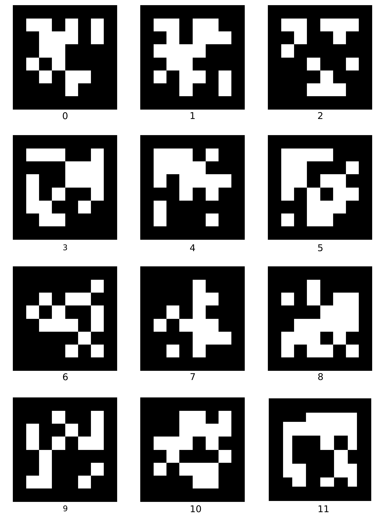

.. _ros-apriltag-detection:

========================================================================
Indoor autonomous flight with ArduCopter, ROS and AprilTag Detection
========================================================================

This wiki page describes how to setup a system capable to realize indoor autonomous flight. The system is based on a quadcopter with a Raspberry Pi 3 and a USB camera. Images from the camera are used to calculate poses estimation on the Raspberry Pi and the result are sent as MAVLink messages to the Flight Controller.
The camera is downward looking and on the floor there is an AprilTag board like this:

System overview
===============

The system uses `ROS <http://www.ros.org/>`__ for all the tasks it has to do. The images from a `USB camera module <https://www.tindie.com/products/exlene/8mp-usb-camera-module-for-linuxwind7wind8/>`__ are captured by `usb_cam node <http://wiki.ros.org/usb_cam>`__, the pose estimations are calculated by `apriltag_ros node <https://github.com/AprilRobotics/apriltag_ros>`__, then processed by `vision_to_mavros node <https://github.com/hoangthien94/vision_to_mavros>`__, and the relevant messages are sent to the Flight Controller using `MAVROS <http://wiki.ros.org/mavros>`__. All of theses ROS packages runs on the Raspberry Pi 3.

The ``usb_cam`` node publishes ``camera/image`` and ``camera/camera_info`` topics, the ``apriltag_ros`` node subscribes to these topics and publish a camera_pose message to the ``mavros/vision_pose/pose`` topic, ``mavros`` translates ROS messages in MAVLink messages and send it to the Flight Controller.

The messages `SET_GPS_GLOBAL_ORIGIN <https://mavlink.io/en/messages/common.html#SET_GPS_GLOBAL_ORIGIN>`__ and a `SET_HOME_POSITION <https://mavlink.io/en/messages/common.html#SET_HOME_POSITION>`__ are sent before the system is ready to run. Two methods of setting EKF home:

- with Mission Planner (Right Click > Set EKF Home > Set Origin)

- with the script `set_origin.py <https://github.com/anbello/aruco_gridboard/blob/master/script/set_origin.py>`__. 

The Flight Controller and the Raspberry Pi 3 on the quadcopter are connected via serial port whereas the Rapsberry Pi 3 and the desktop PC are connected via WiFi. The desktop PC is used only for configuration and visualization purposes. `RViz <http://wiki.ros.org/rviz>`__ is used for visualization on PC in ROS.

Components of the system
========================

- A small quadcopter equipped with `Pixhack Autopilot <http://www.helipal.com/pixhack-autopilot-kit.html>`__, `CUAV PX4FLOW <https://store.cuav.net/index.php?id_product=52&id_product_attribute=0&rewrite=cuav-px4flow-21-optical-flow-sensor-smart-camera-for-px4-pixhawk-flight-control-without-sonar-or-with-sonar&controller=product&id_lang=3>`__, `TeraRanger One <https://ardupilot.org/copter/docs/common-teraranger-one-rangefinder.html>`__. With this setup, you can follow the wiki to achieve `non-GPS flight with PX4FLOW <https://ardupilot.org/copter/docs/common-px4flow-overview.html>`__.

- `Raspberry Pi 3 Model B <https://www.raspberrypi.org/products/raspberry-pi-3-model-b/>`__ with a 16GB micro SD card running `Ubuntu Mate 16.04 <https://ubuntu-mate.org/>`__, connected to a `USB camera <https://www.tindie.com/products/exlene/8mp-usb-camera-module-for-linuxwind7wind8/>`__ down-facing to the ground, with the x-axis of the camera to the right.

.. note::
    There is no hard restriction on the mounting orientation of the camera beside it being down-facing, but frame transformation is needed to align the frames for different camera orientation.

Software setup
==============

- :ref:`Install ROS and MAVROS <ros-install>`.

- :ref:`Connect RPi to ArduPilot with MAVROS <ros-connecting>`.

- Install ROS driver for your camera: 

  - For USB camera: ``sudo apt-get install ros-kinetic-usb-cam``

  - For RPi camera module: you can follow `this instruction <https://larrylisky.com/2016/11/24/enabling-raspberry-pi-camera-v2-under-ubuntu-mate/>`__ to enable the camera, then install `raspicam_node <https://github.com/UbiquityRobotics/raspicam_node>`__.

- Install `Apriltag library <https://github.com/AprilRobotics/apriltag>`__,  `Apriltag ROS wrapper <https://github.com/AprilRobotics/apriltag_ros>`__ and `vision_to_mavros <https://github.com/hoangthien94/vision_to_mavros.git>`__ packages.

.. code-block:: python

    # Install Apriltag library
    cd 
    git clone https://github.com/AprilRobotics/apriltag.git
    cd apriltag
    cmake .
    sudo make install

    # Install Apriltag ROS wrapper
    cd ~/catkin_ws/src
    git clone https://github.com/hoangthien94/apriltags2_ros.git
    git clone https://github.com/hoangthien94/vision_to_mavros.git
    cd ../
    catkin_make

Camera calibration
===================

- Follow the `ROS wiki <http://wiki.ros.org/camera_calibration/Tutorials/MonocularCalibration>`__ to calibrate and obtain the calibration file for your camera.

- Replace the ``camera_info_url param`` in the `gsoc.launch <https://github.com/hoangthien94/apriltags2_ros/blob/master/apriltag_ros/launch/gsoc.launch#L13>`__ file with the correct path to the calibration file.

Prepare the tags board
======================

- You can print out an `example A3 size tag <https://github.com/hoangthien94/apriltags2_ros/blob/master/apriltag_ros/config/A3_bundle.pdf>`__. 

- Depends on your printer setting, the actual size and location of the tags might be slightly different. Measure the true dimension of the tags and modify the `layout file <https://github.com/hoangthien94/apriltags2_ros/blob/master/apriltag_ros/config/A3_bundle.yaml>`__ accordingly.

.. tip::

    Pre-generated tags images can be found at `apriltag-imgs <https://github.com/AprilRobotics/apriltag-imgs>`__. You can also design your own tags with `apriltag-generation <https://github.com/AprilRobotics/apriltag-generation>`__.

Configure ArduPilot
===================

Connect to the flight controller with a ground station (i.e. Mission Planner) and check that the following parameters are set as shown below:

.. code-block:: none

    AHRS_EKF_TYPE 2
    BRD_RTC_TYPES 2
    EKF2_ENABLE 1
    EKF3_ENABLE 0
    EK2_GPS_TYPE 3
    EK2_POSNE_M_NSE 0.1
    EK2_VELD_M_NSE 0.1
    EK2_VELNE_M_NSE 0.1
    EK2_EXTNAV_DELAY 80
    GPS_TYPE 0
    COMPASS_USE 0
    COMPASS_USE2 0
    COMPASS_USE3 0
    SERIAL1_BAUD 921   (the serial port used to connect to Raspberry Pi)
    SERIAL1_PROTOCOL 2
    SYSID_MYGCS 1   (to accept control from mavros)

Instruction to reproduce the system
===================================

1. Running all the nodes
------------------------

First, let’s test each ROS node separately and fix any problems that arise:

- ``usb_cam`` node:

  - On RPi: ``roslaunch usb_cam usb_cam-test.launch``

  - If RPi is not connected to a display, view the raw image on PC with Linux Ubuntu: ``export ROS_MATER_URI=http://<rpi-ip>:11311 && rqt_image_view``
  
  - Verify that there are images coming from the camera.

- ``MAVROS`` node:

  - On RPi: ``roslaunch mavros apm.launch fcu_url:=<tty-port>:<baud-rate>``
  
  - Verify that MAVROS is running OK. For example, ``rostopic echo /mavros/state`` should show that FCU is “CONNECTED”.
  
- ``Apriltag node`` and ``vision_to_mavros`` node:

  - Make sure the ``camera_info_url`` points to the correct path to your camera’s calibration file.
  
  - On RPi: ``roslaunch vision_to_mavros apriltags_to_mavros.launch``

  - Open up RViz and view ``/tf`` and ``/mavros/vision_pose/pose`` topics. With ``/tf``, you should see the camera pose in the tag frame, with z-axis pointing downwards. If your camera’s x-axis is pointing to the right, then ``/mavros/vision_pose/pose`` will be aligned with body frame. If the camera’s x-axis is pointing in a different direction, you need to modify the params of ``vision_to_mavros`` accordingly.
  
2. Ground test
--------------
If each node can run successfully, you can perform ground test:

- On RPi: launch all the nodes as described above. View the topic ``/mavros/vision_pose/pose`` on RViz. Move the vehicle around and see if the pose changes according to the movement.

- **Set EKF home** by sending the MAVLink messages `SET_GPS_GLOBAL_ORIGIN <https://mavlink.io/en/messages/common.html#SET_GPS_GLOBAL_ORIGIN>`__ and `SET_HOME_POSITION <https://mavlink.io/en/messages/common.html#SET_HOME_POSITION>`__.

  - **Using Mission Planner**: Right-click on any point on the map > ``Set Home Here`` > ``Set EKF Origin Here``.

    .. image:: ../../../images/zed-set-ekf-origin.png
        :target: ../../../images/zed-set-ekf-origin.png
  
  - **Using code**: you can use this Python script `set_origin.py <https://github.com/anbello/aruco_gridboard/blob/master/script/set_origin.py>`__.

    - Install ``pymavlink``: Follow the instructions `here <https://github.com/ArduPilot/pymavlink#installation>`__.

    - Run the script: ``rosrun vision_to_mavros set_origin.py``.

- After the origin of the EKF is set, a quadcopter icon will appear on the map.

- Hold the vehicle up, move around while keeping the tag board in the field of view of the camera, and observe the trajectory of the vehicle on Mission Planner.

If the last step is successful, you can go ahead with flight test.

3. Flight test
--------------

- Takeoff in Stabilize to check whether the quadcopter is stable.

- At a height that the camera can have a good view of the tags, switch to Alt-Hold to adjust level position. Observe the feedback on RViz as well as Mission Planner to see if tags are detected.

- Take a look at Mission Planner map, confirm that the system is still tracking.

- Switch to Loiter, but always ready to switch back to Alt-Hold if anything goes awry.

Otherwise, the quadcopter should hover stably above the tags.

.. note::
    For external navigation data to be accepted by EKF, the data rate needs to be higher than a certain threshold (usually 10Hz). If you are also using RPi, firstly we need to tune the params related to computational costs to achieve an acceptable detection rate, either by increasing ``tag_decimate``, which will increase detection rate at the expense of lower accuracy, or increase ``tag_threads``, if you are not running anything else and have some CPU to spare. The related tuning parameters are located in the file `settings.yaml <https://github.com/hoangthien94/apriltags2_ros/blob/master/apriltag_ros/config/settings.yaml>`__.

Some Useful links
=================

- Original `blog post <https://discuss.ardupilot.org/t/indoor-non-gps-flight-using-apriltags-ros-based/42878>`__.

- Indoor autonomous flight with Arducopter, ROS and Aruco Boards - :ref:`wiki page <ros-aruco-detection>` and `blog post <https://ardupilot.org/dev/docs/ros-aruco-detection.html>`__.

- Indoor Autonomous Flight with Cube, ROS and Aruco Board - `blog post <https://discuss.cubepilot.org/t/indoor-autonomous-flight-with-cube-ros-and-aruco-board-ongoing/351>`__.

- Vision Positioning Experiments using SKYVIPER - `blog post <https://discuss.ardupilot.org/t/vision-positionning-experiments-using-skyviper/38348>`__.

- Experiment with Visual Odometry - ROVIO, blog posts `part 1 <https://discuss.ardupilot.org/t/experiment-with-visual-odometry-rovio/40120>`__ and `part 2 <https://discuss.ardupilot.org/t/experiment-with-visual-odometry-rovio-part-2/40486>`__.

- Indoor flight with external navigation data - `blog post <https://discuss.ardupilot.org/t/indoor-flight-with-external-navigation-data/29980>`__.
