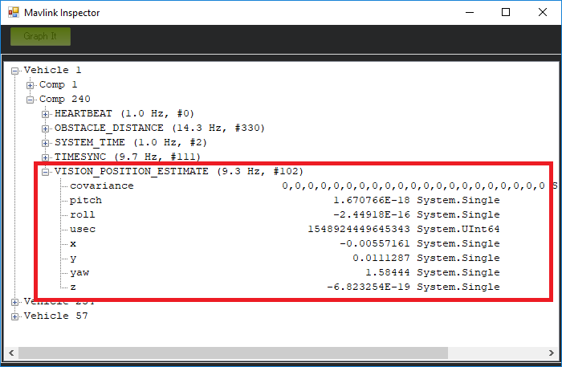

.. _ros-cartographer-slam:

========================================
Cartographer SLAM for Non-GPS Navigation
========================================

This page shows how to setup ROS and `Google Cartographer SLAM <https://google-cartographer.readthedocs.io/en/latest>`__ using an `RPLidarA2 lidar <http://wiki.ros.org/rplidar>`__ to provided a local position estimate for ArduPilot so that it can operate without a GPS.

These instructions were tested on an :ref:`NVidia TX2 <companion-computer-nvidia-tx2>` flashed with :ref:`APSync <apsync-intro>` and then ROS and MAVROS were :ref:`installed as described here <ros-install>`.

.. note::

    these pages are a work-in-progress

Mounting the RPLidar and Pixhawk
--------------------------------

.. image:: ../images/ros-pixhawk-rplidara2-orientation.png
    :target: ../_images/ros-pixhawk-rplidara2-orientation.png

The RPLidar should be oriented so that its USB cable wire is pointing forward in the same direction as the arrow on the flight controller.

The USB cable should be plugged into a USB port on the companion computer running ROS.

Check the RPLidar's serial port
-------------------------------

- plug the RPLidarA2 into the companion computer.  If using a TX2 mounted on an AUVidea J120 board, ensure the lidar is plugged into the lower USB port.

::

    ls -l /dev/tty*

- the lidar should appear as /dev/ttyUSB0 or /dev/ttyACM0.
- if you type "lsusb" the device should also be listed as "Cygnal Integrated Products, Inc. CP210x UART Bridge / myAVR mySmartUSB light"
- allow anyone to read from the device by entering just one of the following two commands depending upon which serial port was found above

::

    sudo usermod -a -G dialout

Install more packages
---------------------

- install the ROS dektop full:

::

    sudo apt-get install ros-kinetic-desktop

- OR install each of these individual packages (this list is not yet complete):

::

    sudo apt-get install ros-kinetic-tf ros-kinetic-tf-conversions ros-kinetic-laser-geometry
    sudo apt-get install ros-kinetic-cv-bridge ros-kinetic-image-transport
    sudo apt-get install qt4-qmake qt4-dev-tools
    sudo apt-get install protobuf-compiler

Create a Catkin WorkSpace
-------------------------

In your home directory:

.. code-block:: bash

    cd $HOME
    mkdir -p catkin_ws/src
    cd catkin_ws
    catkin_init_workspace

Install RPLidar node
--------------------

Install the RPLidar node in the workspace

::

    cd $HOME/catkin_ws/src
    git clone https://github.com/Slamtec/rplidar_ros.git

Install Google Cartographer
---------------------------

Install some more packages

::

    sudo apt-get install python-wstool python-rosdep ninja-build

Re-initialise the workspace with `wstool <http://wiki.ros.org/wstool>`__ then merge the cartographer_ros.rosinstall file and fetch code for dependencies.

::

    cd $HOME/catkin_ws
    wstool init src
    wstool merge -t src https://raw.githubusercontent.com/googlecartographer/cartographer_ros/master/cartographer_ros.rosinstall
    wstool update -t src

Install proto3 and deb dependencies

::

    src/cartographer/scripts/install_proto3.sh
    sudo rosdep init   # if error message appears about file already existing, just ignore and continue
    rosdep update
    rosdep install --from-paths src --ignore-src --rosdistro=${ROS_DISTRO} -y

.. note::

   Cartographer installs a version of protobuf that overrides the system defaults and can only be removed with "make uninstall"

Clone the `Robot Pose Publisher <http://wiki.ros.org/robot_pose_publisher>`__ package into the workspace

::

    cd $HOME/catkin_ws/src
    git clone https://github.com/GT-RAIL/robot_pose_publisher.git

Modify the robot_pose_publisher.cpp file

::

    cd $HOME/catkin_ws/src/robot_pose_publisher/src
    gedit robot_pose_publisher.cpp

    # modify line 40 to look like below ("false" has been changed to "true")
    nh_priv.param<bool>("is_stamped", is_stamped, true);

Create the cartographer_ros launch file using your favourite editor (like "gedit")

::

    cd $HOME/catkin_ws/src/cartographer_ros/cartographer_ros/launch
    gedit cartographer.launch

Copy-paste the contents below into the file

::

    <?xml version="1.0"?>
       <launch>
          <param name="/use_sim_time" value="false" />
          <node name="cartographer_node"
                pkg="cartographer_ros"
                type="cartographer_node"
                args="-configuration_directory $(find cartographer_ros)/configuration_files -configuration_basename cartographer.lua"
                output="screen">
          </node>
          <node name="cartographer_occupancy_grid_node"
                pkg="cartographer_ros"
                type="cartographer_occupancy_grid_node" />
          <node name="robot_pose_publisher"
                pkg="robot_pose_publisher"
                type="robot_pose_publisher"
                respawn="false"
                output="screen" />
          <node pkg="tf" type="static_transform_publisher" name="base_to_laser_broadcaster" args="0 0 0 0 0 0 base_link laser 100" />
       </launch>

Create the cartographer.lua script using our favourite editor (like "gedit")

::

    cd $HOME/catkin_ws/src/cartographer_ros/cartographer_ros/configuration_files
    gedit cartographer.lua

Copy-paste the contents below into the file

::

    include "map_builder.lua"
    include "trajectory_builder.lua"

    options = {

        map_builder = MAP_BUILDER,
        trajectory_builder = TRAJECTORY_BUILDER,
        map_frame = "map",
        tracking_frame = "base_link",
        published_frame = "base_link",
        odom_frame = "odom",
        provide_odom_frame = true,
        use_odometry = false,
        use_nav_sat = false,
        use_landmarks = false,
        publish_frame_projected_to_2d = false,
        num_laser_scans = 1,
        num_multi_echo_laser_scans = 0,
        num_subdivisions_per_laser_scan = 1,
        rangefinder_sampling_ratio = 1,
        odometry_sampling_ratio = 1,
        fixed_frame_pose_sampling_ratio = 1,
        imu_sampling_ratio = 1,
        landmarks_sampling_ratio = 1,
        num_point_clouds = 0,
        lookup_transform_timeout_sec = 0.2,
        submap_publish_period_sec = 0.3,
        pose_publish_period_sec = 5e-3,
        trajectory_publish_period_sec = 30e-3,
    }

    MAP_BUILDER.use_trajectory_builder_2d = true

    TRAJECTORY_BUILDER_2D.use_imu_data = false

    TRAJECTORY_BUILDER_2D.use_online_correlative_scan_matching = true

    POSE_GRAPH.optimization_problem.huber_scale = 1e2

    return options

Modify mavros's node.launch file with your favourite editor (like gedit shown below)

::

    roscd mavros
    cd launch
    sudo gedit node.launch

After <rosparam command="load" file="$(arg config_yaml)" /> add a line like below.   This causes the `mavros vision_pose_estimate plugin <https://github.com/mavlink/mavros/blob/master/mavros_extras/src/plugins/vision_pose_estimate.cpp>`__ (which uses the "/mavros/vision_pose/pose" topic) to pull data from the "/robot_pose" topic output by cartographer

::

    <remap from="/mavros/vision_pose/pose" to="/robot_pose" />

Build the Packages
------------------

.. code-block:: bash

    cd $HOME/catkin_ws
    catkin build
    source devel/setup.bash

Start Cartographer
------------------

Plug the RPLidarA2 into the companion computer and then open up four terminals and in each terminal type:

.. code-block:: bash

    cd catkin_ws
    source devel/setup.bash

Then in Terminal1:

.. code-block:: bash

    roscore

In Terminal2:

.. code-block:: bash

    roslaunch rplidar_ros rplidar.launch

In Terminal3:

.. code-block:: bash

    roslaunch cartographer_ros cartographer.launch

In Terminal4:

Start mavros as described on the :ref:`Connecting with ROS page <ros-connecting>` which involves running a command like below:

.. code-block:: bash

    roslaunch mavros apm.launch fcu_url:=udp://:14855@

Configure ArduPilot
-------------------

Connect to the flight controller with a ground station (i.e. Mission Planner) and check that the following parameters are set as shown below:

-  :ref:`AHRS_EKF_TYPE <copter:AHRS_EKF_TYPE>` = 2 (the default) to use EKF2 (at the time this page was written the EKF3 did not yet support external position estimates)
-  :ref:`EK2_ENABLE <copter:EK2_ENABLE>` = 1 (the default)
-  :ref:`EK3_ENABLE <copter:EK3_ENABLE>` = 0 (the default)
-  :ref:`GPS_TYPE <copter:GPS_TYPE>` = 0 to disable the GPS
-  :ref:`EK2_GPS_TYPE <copter:EK2_GPS_TYPE>` = 3 to disable the EKF's use of the GPS
-  MAG_ENABLE = 0, :ref:`COMPASS_USE <copter:COMPASS_USE>` = 0, :ref:`COMPASS_USE2 <copter:COMPASS_USE2>` = 0, :ref:`COMPASS_USE3 <copter:COMPASS_USE3>` = 0 to disable the EKF's use of the compass and instead rely on the heading from ROS and Hector SLAM

After changing any of the values above, reboot the flight controller.

If all is working, vision position estimates should begin flowing in from ROS to ArduPilot.  This can be confirmed by connecting to the flight controller using the Mission Planner (or similar) and check the Flight Data screen's Messages tab (bottom left) for messages from the EKF like below:

::

    EKF2 IMU1 initial pos NED = 0.0,0.0,0.0 (m)
    EKF2 IMU1 is using external nav data
    EKF2 IMU0 initial pos NED = 0.0,0.0,0.0 (m)
    EKF2 IMU0 is using external nav data

Using the Mission Planner (or similar) go to the Flight Data screen and right-mouse-button click on the map and select "Set Home Here" >> "Set EKF Origin".  The vehicle should appear immediately on the map where you clicked.

Testing
-------

To confirm the ROS side is working correctly type the command below and live updates of position estimates from cartographer should be displayed

::

    rostopic echo /robot_pose

Mission Planner's MAVLink Inspector (press Ctrl-F and then press the "MAVLink Inspector" button) can be used to check if VISION_POSITION_ESTIMATE messages are being successfully sent to the flight controller

Video
-----

..  youtube:: RRjOyaj2hNk
    :width: 100%

.. note::

   We are keen to improve ArduPilot's support of ROS so if you find issues (such as commands that do not seem to be supported), please report them in the `ArduPilot issues list <https://github.com/ArduPilot/ardupilot/issues>`__ with a title that includes "ROS" and we will attempt to resolve them as quickly as possible.
