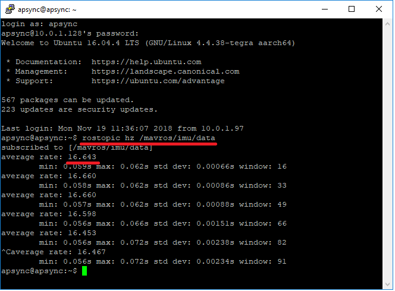

.. _ros-data-from-ap:

Data from AP to ROS
===================

Mavros consumes MAVLink sensor data messages from ArduPilot and places the data within the /mavros/ topic

IMU data
--------

ArduPilot sends accelerometer, gyro and compass (aka "mag") data to ROS/mavros using MAVLink's `RAW_IMU <https://mavlink.io/en/messages/common.html#RAW_IMU>`__ message.

mavros consumes this data and places it within the following topics:

- /mavros/imu/data and /mavros/imu/data_raw hold the accelerometer (called "linear_acceleration") and gyro (called "angular_velocity) data
- /mavros/imu/mag holds the compass data.  This may be all zero if AP's COMPASS_USE parameters have been set to zero

Checking and setting the data rate
----------------------------------

Run the following command to view the accelerometer and gyro data and update rate on the companion computer running ROS

::

    rostopic echo /mavros/imu/data    <-- to see the data itself
    rostopic hz /mavros/imu/data      <-- to view the update rate

mavros can be used to send a command to ArduPilot to change the rate of the data as shown below

::

    rosrun mavros mavsys rate --all 10     <-- to set the data rate for all data to 10hz
    rosrun mavros mavsys rate --extra1 10  <-- to set the data rate for IMU_RAW to 10hz
    rosrun mavros mavsys rate --help       <-- to see help on this command

From within ArduPilot the default update rate of the IMU data sent to ROS/mavros can be set by changing the SRx_EXTRA1 parameter (where "x" is normally the serial port number on the flight controller)

.. warning::

    Users of :ref:`APSync <apsync-intro>` may notice that `APWeb <https://github.com/ArduPilot/APWeb>`__ resets the data stream rates to 4hz every 10 seconds.  This is a `known issue <https://github.com/ArduPilot/APWeb/issues/15>`__ that can be worked around by editing the /etc/rc.local file and commenting out the line that starts APWeb.

.. note::

    If you notice AP is sending data at a higher rate than requested it may be because of `this issue <https://github.com/ArduPilot/ardupilot/issues/9878>`__
