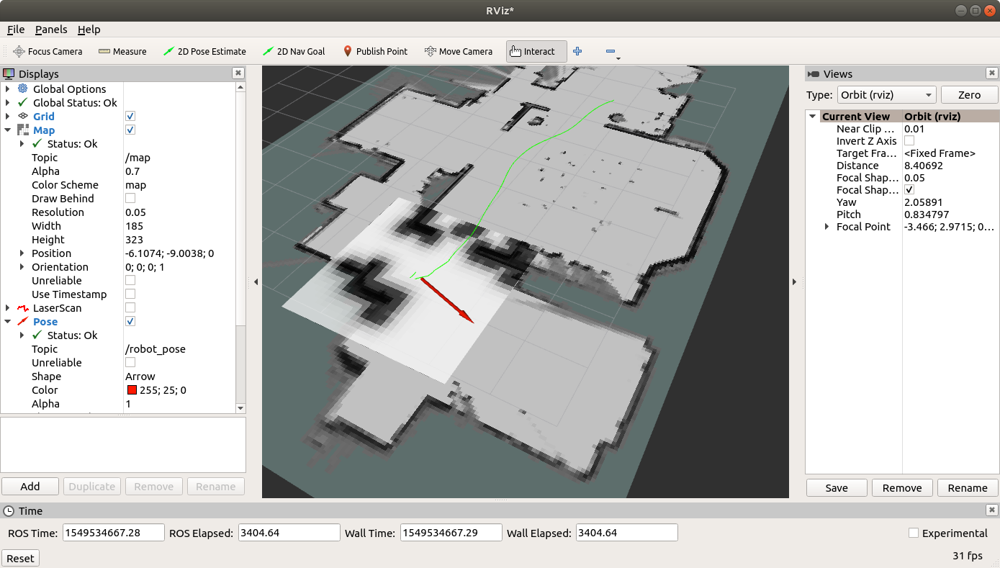

.. _ros-object-avoidance:

========================
ROS for Object Avoidance
========================

This page describes how to setup `ROS's base local planner <http://wiki.ros.org/base_local_planner>`__ to provide velocity commands to ArduPilot to steer a rover around obstacles.  This assumes all the previous setup including :ref:`Cartographer <ros-cartographer-slam>` and :ref:`rviz <ros-rviz>` have already been completed.

These instructions were tested on a :ref:`Nvidia TX2 <companion-computer-nvidia-tx2>` running an :ref:`APSync image <apsync-intro>` with ROS installed as described :ref:`here <ros-install>`.

Some of the information on this page was found on these wiki pages:

- `Officinerobotiche's robot wandering demo <https://github.com/officinerobotiche/ros_robot_wandering_demo>`__
- `Husarion Doc's Path Planning <https://husarion.com/tutorials/ros-tutorials/7-path-planning/#7-path-planning-launching-path-planning-node>`__

.. note::

    these pages are a work-in-progress

Companion Computer Setup
------------------------

- ssh onto the companion computer.  If using APsync the following should work (password is "apsync")

::

    ssh apsync@apsync.local

- Configure mavros to send velocity targets to ArduPilot by modifying mavros's node.launch file with your favourite editor (like gedit shown below)

::

    roscd mavros   <-- this assumes mavros has been installed with rosdep
    cd launch
    sudo gedit node.launch

- After ``<rosparam command="load" file="$(arg config_yaml)" />`` add a line like below

::

    <remap from="/mavros/setpoint_velocity/cmd_vel_unstamped" to="/cmd_vel" />

- Install ros-kinetic-navigation package

::

    sudo apt-get install ros-kinetic-navigation

- Download `ArduPilot/companion/Common/ROS/ap_navigation.zip <https://github.com/ArduPilot/companion/tree/master/Common/ROS>`__ to the catkin_ws/src directory

::

    cd ~/catkin_ws/src
    wget https://github.com/ArduPilot/companion/raw/master/Common/ROS/ap_navigation.zip
    unzip ap_navigation.zip

- Rebuild all packages including ap_navigation

::

    cd ~/catkin_ws
    source devel/setup.bash
    catkin build

Start ap_navigation
-------------------

- restart all packages (roscore, rplidar, mavros and cartographer) and then start ap_navigation package

::

    cd ~/catkin_ws
    source devel/setup.bash
    roslaunch ap_navigation ap_nav.launch

Sending Position Targets
------------------------

- Arm the vehicle and switch to Guided mode
- Use :ref:`rviz <ros-rviz>`'s "2D Nav Goal" button to set a position target.  If all goes well a green line will appearing showing the route the vehicle will take to the target (see top image)
