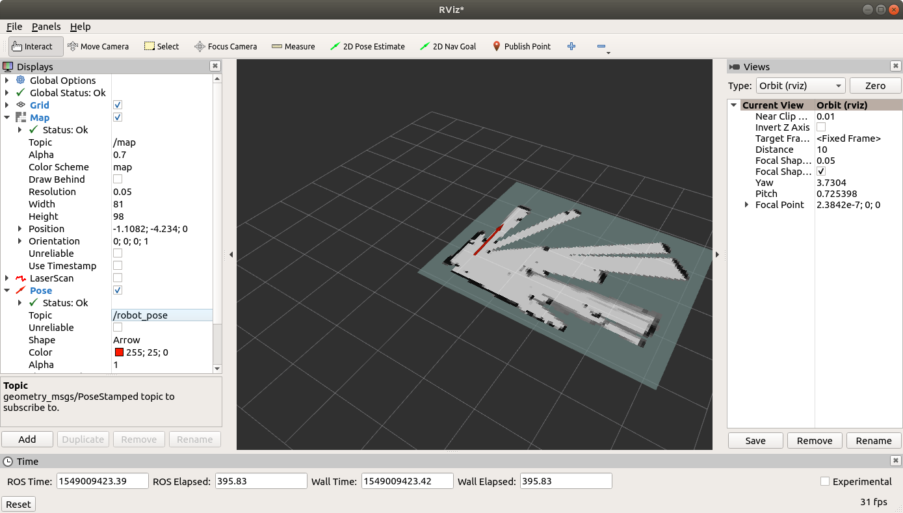

.. _ros-rviz:

==========================
Sending Commands from rviz
==========================

`rviz <http://wiki.ros.org/rviz>`__ allows real-time viewing of the vehicle's local position and attitude, lidar data and :ref:`cartographer's 3D map <ros-cartographer-slam>`.  It is also possible to set a local position target and have ROS's navigation libraries (with help from ArduPilot's velocity controller) move the vehicle to the target.

These instructions were tested on a :ref:`Nvidia TX2 <companion-computer-nvidia-tx2>` running an :ref:`APSync image <apsync-intro>` with ROS installed as described :ref:`here <ros-install>`.  Some of the information on this page was found on these wiki pages:

- `ros.org's NetworkSetup <http://wiki.ros.org/ROS/NetworkSetup>`__
- `answers.ros.org's "How to run Rviz remotely" <https://answers.ros.org/question/10343/how-to-run-rviz-remotely/>`__
- `answers.ros.org's "rostopic list works but rostopic echo does not" <https://answers.ros.org/question/48240/rostopic-list-works-but-rostopic-echo-does-not/>`__

Client PC Setup
---------------

- Install ROS "Desktop-Full" on the client side PC (where rviz will run).  Ubuntu 16.04 users should `install ROS Kinetic <http://wiki.ros.org/kinetic/Installation>`__.  Ubuntu 18.x users should `install ROS melodic <http://wiki.ros.org/melodic/Installation/Ubuntu>`__.
- Connect to the vehicle's wifi access point (if using APSync the default username/password is ardupilot/ardupilot)
- Open a command prompt and check that that you can "ping" the companion computer running ROS.  If using APSync, both of these commands should work

::

    ping 10.0.1.128
    ping apsync.local

- Using your favourite editor, open the ``/etc/hosts`` file (may require using sudo) and ensure the companion computer appears in the list.  Below is what should appear if the companion computer is running APSync

::

    10.0.1.128  apsync.local
    10.0.1.128  apsync

- In a new command prompt, type ``hostname`` to get the name of the client PC
- Using your favourite editor add the following two lines to the bottom of ``~/.bashrc``

::

    export ROS_HOSTNAME=your-host-name.local    <--- substitute the client PC's name here
    export ROS_MASTER_URI=http://apsync.local:11311

Companion Computer Setup
------------------------

- ssh onto the companion computer.  If using APsync the following should work (password is "apsync")

::

    ssh apsync@apsync.local

- With your favourite editor add the following lines to the bottom of ``~/.bashrc``

::

    export ROS_HOSTNAME=apsync.local
    export ROS_MASTER_URI=http://apsync.local:11311

Check ROS data is available on the Client
-----------------------------------------

To confirm the client laptop can retrieve data from the vehicle try the following commands

::

    rostopic list
    rostopic echo /robot_pose

Start rviz
----------

- On the client PC start rviz

::

    rosrun rviz rviz

- To see a real-time Lidar data

    - In the Display area, select "Add", "LaserScan"
    - once added, expand the "LaserScan" section and set "Topic" to "/scan"

- To see a map of the environment

    - select "Add", "Map"
    - once added, expand the "Map" section and set the "Topic" to "/map"

- To see the vehicle's current heading (according to ROS)

    - select "Add", "Pose"
    - once added, expand the "Pose" section and set the "Topic" to "/robot_pose"

Sending Position Targets
------------------------

- To allow ROS to send position targets to ArduPilot via mavros, log onto the Companion Computer running ROS and modify mavros's node.launch file with your favourite editor (like gedit shown below)

::

    roscd mavros   <-- this assumes mavros has been installed with rosdep
    cd launch
    sudo gedit node.launch

- After ``<rosparam command="load" file="$(arg config_yaml)" />`` add a line like below and restart the all ROS processes

::

    <remap from="/mavros/setpoint_position/local" to="/move_base_simple/goal" />

- Arm the vehicle and switch to Guided mode
- From within rviz, click the "2D Nav Goal" button and then click and hold the mouse button on the map to aim the green arrow (this sets the target position and final attitude) and then release the mouse button
- The ground station should show the target position that the vehicle is moving towards (Mission Planner drops a green marker at the target position and draws an orange line towards the target from the vehicle)

If everything does not go as expected the following commands may help diagnose the issue

- ``rostopic info /move_base_simple/goal`` should show Publishers as "rviz" and Subscribers as "mavros"
- ``rostopic echo /move_base_simple/goal`` should display a "position" and "orientation" the moment after the "2D NavGoal" has been set
- ``rosrun rqt_graph rqt_graph`` shows a graphical diagram of ROS's nodes and their connections
