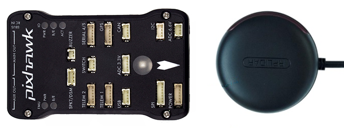

.. _ros-slam:

==========================================
ROS and Hector SLAM for Non-GPS Navigation
==========================================

This page shows how to setup ROS and `Hector SLAM <http://wiki.ros.org/hector_slam>`__ using an `RPLidarA2 lidar <http://wiki.ros.org/rplidar>`__ to provided a local position estimate for ArduPilot so that it can operate without a GPS.

These instructions were tested on an :ref:`NVidia TX2 <companion-computer-nvidia-tx2>` flashed with :ref:`APSync <apsync-intro>` and then ROS and MAVROS were :ref:`installed as described here <ros-install>`.

They were also tested on an :ref:`RaspberryPi 3 B+ <raspberry-pi-via-mavlink>` with ROS and MAVROS installed :ref:`installed as described here <ros-install>`.

.. note::

    these pages are a work-in-progress

Mounting the RPLidar and Pixhawk
--------------------------------

The RPLidar shoulid be oriented so that its USB cable wire is pointing forward in the same direction as the arrow on the flight controller.

The USB cable should be plugged into a USB port on the companion computer running ROS.

Check the RPLidar's serial port
-------------------------------

- plug the RPLidarA2 into the companion computer.  If using a TX2 mounted on an AUVidea J120 board, ensure the lidar is plugged into the lower USB port.

::

    ls -l /dev/tty*

- the lidar should appear as /dev/ttyUSB0 or /dev/ttyACM0.
- if you type "lsusb" the device should also be listed as "Cygnal Integrated Products, Inc. CP210x UART Bridge / myAVR mySmartUSB light"
- allow anyone to read from the device by entering just one of the following two commands depending upon which serial port was found above

::

    sudo usermod -a -G dialout $USER

Install more packages
---------------------

- install the ROS desktop full:

::

    sudo apt-get install ros-kinetic-desktop-full

- OR install each of these individual packages (this list is not yet complete):

::

    sudo apt-get install ros-kinetic-tf ros-kinetic-tf-conversions ros-kinetic-laser-geometry
    sudo apt-get install ros-kinetic-cv-bridge ros-kinetic-image-transport
    sudo apt-get install qt4-qmake qt4-dev-tools
    sudo apt-get install protobuf-compiler

Create a Catkin WorkSpace
-------------------------

In your home directory:

.. code-block:: bash

    cd $HOME
    mkdir -p catkin_ws/src
    cd catkin_ws
    catkin_init_workspace

Install RPLidar node and Hector SLAM
------------------------------------

Install the RPLidar node and Hector SLAM software in the workspace

::

    cd $HOME/catkin_ws/src
    git clone https://github.com/Slamtec/rplidar_ros.git
    git clone https://github.com/tu-darmstadt-ros-pkg/hector_slam.git

Using your favourite editor open Hector SLAM's launch file which can be found at `$HOME/catkin_ws/src/hector_slam/hector_mapping/launch/mapping_default.launch <https://github.com/tu-darmstadt-ros-pkg/hector_slam/blob/catkin/hector_mapping/launch/mapping_default.launch>`__ and modify the "base_frame", "odom_frame" and commented out "tf" lines to look like below:

::

    <arg name="base_frame" default="base_link"/>
    <arg name="odom_frame" default="base_link"/>

    <node pkg="tf" type="static_transform_publisher" name="base_to_laser_broadcaster" args="0 0 0 0 0 0 base_link laser 100" />

Edit Hector SLAM's `hector_imu_attitude_to_tf/launch/example.launch <https://github.com/tu-darmstadt-ros-pkg/hector_slam/blob/catkin/hector_imu_attitude_to_tf/launch/example.launch>`__ file which can be found at `$HOME/catkin_ws/src/hector_slam/hector_imu_attitude_to_tf/launch/example.launch <https://github.com/tu-darmstadt-ros-pkg/hector_slam/blob/catkin/hector_imu_attitude_to_tf/launch/example.launch>`__ and change it to consume IMU data from the flight controller (via mavros) by replacing "thumper_imu" with "/mavros/imu/data" so that it looks like below:

::

    <remap from="imu_topic" to="/mavros/imu/data" />

Edit Hector SLAM's tutorial.launch file which can be found at `$HOME/catkin_ws/src/hector_slam/hector_slam_launch/launch/tutorial.launch <https://github.com/tu-darmstadt-ros-pkg/hector_slam/blob/catkin/hector_slam_launch/launch/tutorial.launch>`__ and change the "use_sim_time" line to look like below:

::

    <param name="/use_sim_time" value="false"/>

Continue editing the `tutorial.launch <https://github.com/tu-darmstadt-ros-pkg/hector_slam/blob/catkin/hector_slam_launch/launch/tutorial.launch>`__ and add a new line (just below the existing include line) so that the `example.launch <https://github.com/tu-darmstadt-ros-pkg/hector_slam/blob/catkin/hector_imu_attitude_to_tf/launch/example.launch>`__ file modified above is included:

::

    <include file="$(find hector_imu_attitude_to_tf)/launch/example.launch"/>

By default, once started, Hector SLAM will pop-up a window to show the map in real-time but this can be disabled by commenting out one line of `tutorial.launch <https://github.com/tu-darmstadt-ros-pkg/hector_slam/blob/catkin/hector_slam_launch/launch/tutorial.launch>`__ file so that it looks like below:

::

    <!--node pkg="rviz" type="rviz" name="rviz"
      args="-d $(find hector_slam_launch)/rviz_cfg/mapping_demo.rviz"/-->

Build the Packages
------------------

.. code-block:: bash

    cd $HOME/catkin_ws
    catkin build
    source devel/setup.bash

Start Hector SLAM
-----------------

Plug the RPLidarA2 into the companion computer and then open up four terminals and in each terminal type:

.. code-block:: bash

    cd catkin_ws
    source devel/setup.bash

Then in Terminal1:

.. code-block:: bash

    roscore

In Terminal2:

.. code-block:: bash

    roslaunch rplidar_ros rplidar.launch

In Terminal3 (For RaspberryPi we recommend running this on another Machine explained `here <http://wiki.ros.org/ROS/Tutorials/MultipleMachines>`__):

.. code-block:: bash

    roslaunch hector_slam_launch tutorial.launch

In Terminal4:

Start mavros as described on the :ref:`Connecting with ROS page <ros-connecting>` which involves running a command like below:

.. code-block:: bash

    roslaunch mavros apm.launch fcu_url:=udp://:14855@

Configure ArduPilot
-------------------

Connect to the flight controller with a ground station (i.e. Mission Planner) and check that the following parameters are set as shown below:

-  :ref:`AHRS_EKF_TYPE <copter:AHRS_EKF_TYPE>` = 2 (the default) to use EKF2 (at the time this page was written the EKF3 did not yet support external position estimates)
-  :ref:`EK2_ENABLE <copter:EK2_ENABLE>` = 1 (the default)
-  :ref:`EK3_ENABLE <copter:EK3_ENABLE>` = 0 (the default)
-  :ref:`GPS_TYPE <copter:GPS_TYPE>` = 0 to disable the GPS
-  :ref:`EK2_GPS_TYPE <copter:EK2_GPS_TYPE>` = 3 to disable the EKF's use of the GPS
-  MAG_ENABLE = 0, :ref:`COMPASS_USE <copter:COMPASS_USE>` = 0, :ref:`COMPASS_USE2 <copter:COMPASS_USE2>` = 0, :ref:`COMPASS_USE3 <copter:COMPASS_USE3>` = 0 to disable the EKF's use of the compass and instead rely on the heading from ROS and Hector SLAM

After changing any of the values above, reboot the flight controller.

If all is working, vision position estimates should begin flowing in from ROS to ArduPilot.  This can be confirmed by connecting to the flight controller using the Mission Planner (or similar) and check the Flight Data screen's Messages tab (bottom left) for messages from the EKF like below:

::

    EKF2 IMU1 initial pos NED = 0.0,0.0,0.0 (m)
    EKF2 IMU1 is using external nav data
    EKF2 IMU0 initial pos NED = 0.0,0.0,0.0 (m)
    EKF2 IMU0 is using external nav data

Using the Mission Planner (or similar) go to the Flight Data screen and right-mouse-button click on the map and select "Set Home Here" >> "Set EKF Origin".  The vehicle should appear immediatley on the map where you clicked.

Video
-----

..  youtube:: P0Xblybi0aw
    :width: 100%

.. note::

   We are keen to improve ArduPilot's support of ROS so if you find issues (such as commands that do not seem to be supported), please report them in the `ArduPilot issues list <https://github.com/ArduPilot/ardupilot/issues>`__ with a title that includes "ROS" and we will attempt to resolve them as quickly as possible.
