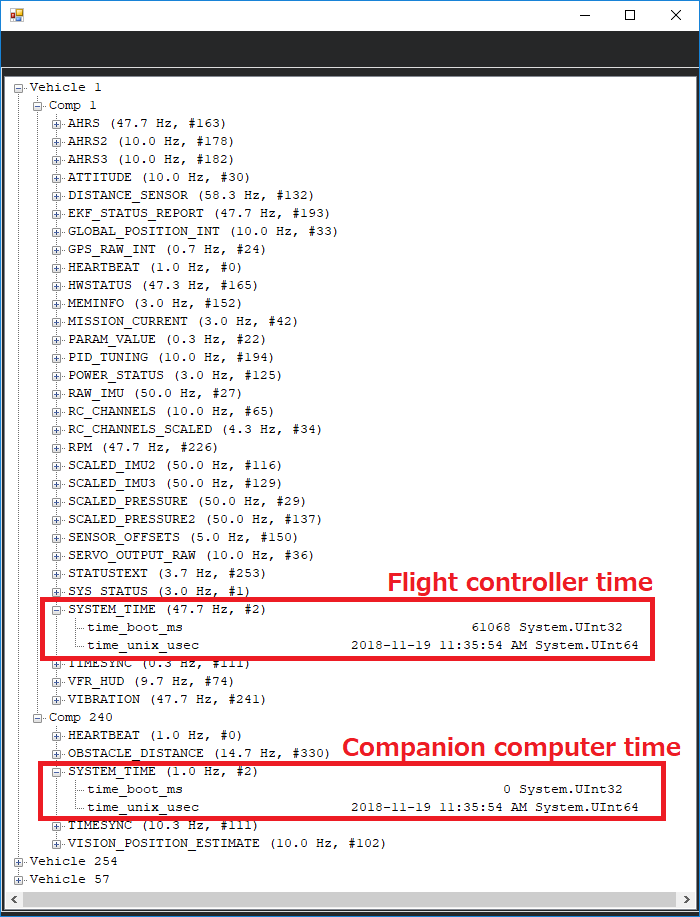

.. _ros-timesync:

=========================
Clock/Time Syncronisation
=========================

The flight controller and companion computer clocks can be syncronised using MAVLink's `SYSTEM_TIME <https://mavlink.io/en/messages/common.html#SYSTEM_TIME>`__ and `TIMESYNC <https://mavlink.io/en/messages/common.html#TIMESYNC>`__ messages.  This is important so that each side can blend data from the other side into its EKF.

- `mavros's sys_time plugin <https://github.com/mavlink/mavros/blob/master/mavros/src/plugins/sys_time.cpp>`__ implements the mavros/ROS side
- ArduPilot's `AP_RTC <https://github.com/ArduPilot/ardupilot/tree/master/libraries/AP_RTC>`__ library implements the ArduPilot side

Mavros Configuration
--------------------

Mavros's `apm_config.yaml <https://github.com/mavlink/mavros/blob/master/mavros/launch/apm_config.yaml>`__ file can be modified to configure the rate of the `SYSTEM_TIME <https://mavlink.io/en/messages/common.html#SYSTEM_TIME>`__ and `TIMESYNC <https://mavlink.io/en/messages/common.html#TIMESYNC>`__ messages.  Below are the recommended settings.

::

    conn:
      timesync_rate: 10.0
      system_time_rate: 1.0

    time:
      timesync_mode: MAVLINK

ArduPilot Configuration
-----------------------

The flight controller's time is set from the GPS by default but can be set from one of three sources(GPS, MAVLINK, onboard HW clock) using the `BRD_RTC_TYPES <https://ardupilot.org/copter/docs/parameters.html?highlight=parameters#brd-rtc-types-allowed-sources-of-rtc-time>`__ parameter as a bit mask for the time syncronisation source. When using mavros set BRD_RTC_TYPES = 2 to only allow the "MAVLINK_SYSTEM_TIME" source which uses the `SYSTEM_TIME <https://mavlink.io/en/messages/common.html#SYSTEM_TIME>`__ MAVLINK message.

For Rover or Plane, the SCHED_LOOP_RATE parameter should be increased to 200 because mavros ignores TIMESYNC messages if the round trip time is more than 10ms.  It may also be necessary to increase the update rate of the `gcs related tasks in the scheduler <https://github.com/ArduPilot/ardupilot/blob/master/Rover/Rover.cpp#L67>`__.

For rover, open `Rover.cpp <https://github.com/ArduPilot/ardupilot/blob/master/Rover/Rover.cpp>`__ and within the scheduler_tasks[] array ensure the gcs entries have their update rate set to 200 like below:

::

    SCHED_TASK(gcs_retry_deferred,    200,    500),
    SCHED_TASK(gcs_update,            200,    500),
    SCHED_TASK(gcs_data_stream_send,  200,   1000),

After making this change you will need to compile rover and upload the new binary to the flight controller.  Hopefully this will not be necessary in future versions of Plane or Rover.

Testing
-------

A MAVLink inspector (available using QGC or MissionPlanner) can be used to check that the system times are syncronised.  If using Mission Planner, press Ctrl-F and push the "MAVLink Inspector" button.

