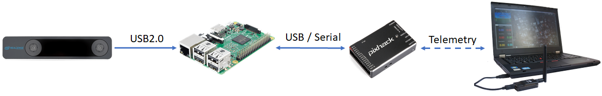

.. _ros-vio-tracking-camera:

==================================================
ROS and VIO tracking camera for non-GPS Navigation
==================================================

This wiki page describes how a `VIO tracking camera <https://www.intelrealsense.com/visual-inertial-tracking-case-study/>`__ such as the `Intel RealSense T265 <https://www.intelrealsense.com/tracking-camera-t265/>`__ can be used with ROS to facilitate non-GPS flight.

.. note::
    Explanation for some parts of the system will be kept short for the sake of brevity. More in-depth discussion can be found in the following blog posts `part 1 <https://discuss.ardupilot.org/t/integration-of-ardupilot-and-vio-tracking-camera-part-1-getting-started-with-the-intel-realsense-t265-on-rasberry-pi-3b/43162>`__, `part 2 <https://discuss.ardupilot.org/t/integration-of-ardupilot-and-vio-tracking-camera-part-2-complete-installation-and-indoor-non-gps-flights/43405>`__, `part 3 <https://discuss.ardupilot.org/t/integration-of-ardupilot-and-vio-tracking-camera-part-3-indoor-autonomous-flights-and-performance-tests/43626>`__.

Video
-----

..  youtube:: YZm6bmGDB5U
    :width: 100%

Hardware Requirements
=====================
- Sensor: `Intel RealSense Tracking Camera T265 <https://www.intelrealsense.com/tracking-camera-t265/>`__
- Companion computer: `Raspberry Pi 3 Model B <https://www.raspberrypi.org/products/raspberry-pi-3-model-b/>`__ 

.. note::
    Depends on what you need from the T265, the companion computer should have USB2 (**pose** data only) or USB3 (**pose** + **image** data). For localization and navigation, we only need to capture pose data, so RPi 3B is sufficient for the task.

System Overview
===============

The position data obtained from ``realsense-ros`` node will be processed by ``vision_to_mavros`` node and send to ``mavros`` node via the topic ``/mavros/vision_pose/pose``. ``mavros`` will take care of the ENU - NED frames transformation and send it to ArduPilot through MAVLink.

Install ``librealsense``
========================

.. note::
    The Realsense T265 is supported via `librealsense <https://github.com/IntelRealSense/librealsense>`__ on Windows and Linux. Installation process varies widely for different systems. Refer to `the official github page <https://github.com/IntelRealSense/librealsense>`__ for instructions on specific system, such as `Jetson <https://github.com/IntelRealSense/librealsense/blob/master/doc/installation_jetson.md>`__, `Odroid <https://github.com/IntelRealSense/librealsense/blob/master/doc/installation_odroid.md>`__, `Windows <https://github.com/IntelRealSense/librealsense/blob/master/doc/installation_windows.md>`__, `Raspbian <https://github.com/IntelRealSense/librealsense/blob/master/doc/installation_raspbian.md>`__.

The following steps are intended for Ubuntu Linux. Since no Debian package is available for RPi, ``librealsense`` must be built from source.

- **Install OS** (if you have not done so): `Ubuntu MATE 16.04 LTS <https://ubuntu-mate.org/blog/ubuntu-mate-xenial-final-release/>`__.
- **Increase swap size**: RPi does not have enough RAM to compile the SDK, hence swap size needs to be increased. Swap size of 2048 (2GB) seems to work well, but you can go with less.

.. code-block:: bash

    # Toggle swap off
    sudo dphys-swapfile swapoff

    # Edit the config file 
    sudo nano /etc/dphys-swapfile
    
    # Find and edit the variable CONF_SWAPSIZE=2048

    # Toggle swap back on
    sudo dphys-swapfile swapon

    # Reboot your raspberry
    sudo reboot

    # After reboot, check that swap size changed
    free

    # Should show something like Swap: 2097148

- **Clone librealsense repo and compile SDK**

.. code-block:: bash

    # Update system
    sudo apt update
    sudo apt upgrade -y

    # Install dependencies
    sudo apt install git libssl-dev libusb-1.0-0-dev pkg-config -y
    sudo apt install cmake python3-dev raspberrypi-kernel-headers -y

    # Clone the repository under directory of your chosing
    cd ~
    git clone https://github.com/IntelRealSense/librealsense.git
    cd librealsense

    # Install udev rules
    sudo cp config/99-realsense-libusb.rules /etc/udev/rules.d/
    sudo udevadm control --reload-rules && udevadm trigger

    # Create the destination directory
    mkdir build
    cd build

    # Remove extra files if this is not your first run
    xarg sudo rm < install_manifest.txt
    rm CMakeCache.txt
    export CC=/usr/bin/gcc-6
    export CXX=/usr/bin/g++-6
    cmake -D CMAKE_BUILD_TYPE="Release"\
    -D FORCE_LIBUVC=ON \
    -D BUILD_PYTHON_BINDINGS=ON \
    -D BUILD_EXAMPLES=ON ..
    make -j4
    sudo make install
    sudo ldconfig

    # Finally, reboot the pi:
    sudo reboot

- **Test that librealsense is installed correctly**: The easiest way is to plug in the T265 and play with the `examples <https://github.com/IntelRealSense/librealsense/tree/master/examples>`__ and `tools <https://github.com/IntelRealSense/librealsense/tree/master/tools>`__ included in the SDK.

  - If you have a monitor plugged in, you can open `Intel Realsense Viewer <https://github.com/IntelRealSense/librealsense/tree/master/tools/realsense-viewer>`__ by typing in into the terminal: ``realsense-viewer``. If the T265 is connected, the device will be available on the left panel. Click on the slider to start the device and switch to 3D view. Move the T265 around and you should see its trajectory.
  - If no monitor is connected, other demos can also be launched from the terminal, for example ``rs-pose``, ``rs-pose-predict``, ``rs-capture`` etc.

- **Test pyrealsense2 python wrapper**: If you enabled building Python wrapper (``BUILD_PYTHON_BINDINGS`` flag), the compiled library is located in the build folder: ``~/librealsense/build/wrappers/python``. 

  - Update the ``PYTHONPATH`` environment variable to add the path to the ``pyrealsense`` library: ``export PYTHONPATH=$PYTHONPATH:/usr/local/lib``. Alternatively, copy the build output (``librealsense2.so`` and ``pyrealsense2.so`` files, located in ``~/librealsense/build/``) next to your script.
  - The basic examples provided by Intel can be found in the folder ``~/librealsense/wrappers/python/example``. Run it with Python3.

.. code-block:: bash

    export PYTHONPATH=$PYTHONPATH:/usr/local/lib

    cd ~/librealsense/wrappers/python/example

    # You should see a stream of data coming from the T265.
    python3 t265_example.py

.. note::
    The RPi 3B with USB2 cannot handle the image streams. Trying to display the fisheye images might crash the application.

Install ``realsense-ros``
=========================

- The installation steps for ROS are straightforward and you can follow the instruction on the official repo `here <https://github.com/IntelRealSense/realsense-ros#installation-instructions>`__.
- Launch the node: ``roslaunch realsense2_camera rs_t265.launch``. All sensor data will be published as ROS topics: 

.. code-block:: bash

    /camera/odom/sample
    /camera/accel/sample
    /camera/gyro/sample
    /camera/fisheye1/image_raw (not viewable on RPi 3B)
    /camera/fisheye2/image_raw (not viewable on RPi 3B)

- In another terminal, run ``top`` to view current CPU usage.

.. note::
    The version of ``realsense-ros`` needs to match with the version of ``librealsense``, so every time you update ros/lib, the other should be updated as well.

Install ``mavros``
==================

- Establish serial connection: :ref:`Connect RPi to ArduPilot with MAVLink <raspberry-pi-via-mavlink>`.

  - If the connection between RPi-ArduPilot is established via the UART serial port, also `change the setting in /boot/config.txt <https://discuss.ardupilot.org/t/communicating-with-raspberry-pi-3b/39269/8>`__.

- Install ``mavros``: follow instructions on our :ref:`wiki page <ros-install>`.

- Establish connection in ROS: :ref:`Connect to ArduPilot with MAVROS <ros-connecting>`.

Install ``vision_to_mavros``
============================

- Clone and build the package:

.. code-block:: bash

    # Navigate to catkin workspace
    cd ~/catkin_ws/src

    # Clone and build the repo
    git clone https://github.com/hoangthien94/vision_to_mavros.git
    cd ..
    catkin_make
    source ~/.bashrc

    # Add source command to .bashrc for future use
    # echo "source ~/catkin_ws/devel/setup.bash" >> ~/.bashrc

- Modify parameters according to your T265 camera's orientation: The default parameters are set for a **front-facing camera**. In the launch file ``t265_tf_to_mavros.launch``, modify params ``roll_cam``, ``pitch_cam``, ``yaw_cam``, ``gamma_world`` from the list of values or with your own values corresponding to your setup.

.. note::
    There is a `known issue <https://github.com/IntelRealSense/librealsense/issues/4080>`__ about inconsistent yaw angle for **down facing** orientation and some workarounds have been discussed. As of this writing, here is what seems to work: the camera needs to be slightly tilted (i.e. not completely flat out) when it starts streaming poses (launching ``realsense-ros`` or calling ``librealsense``’s API to invoke pose data. Otherwise, the yaw angle of the world coordinates might be randomly initialized.

Configure ArduPilot
===================

Connect to the flight controller with a ground station (i.e. Mission Planner) and check that the following parameters are set as shown below:

- `AHRS_EKF_TYPE <https://ardupilot.org/copter/docs/parameters.html#ahrs-ekf-type>`__ = 2 (the default) to use EKF2 (as of this writing, EKF3 is not supported for handling external navigation data)
- `EK2_ENABLE <https://ardupilot.org/copter/docs/parameters.html#ek2-enable>`__ = 1 (the default)
- `EK3_ENABLE <https://ardupilot.org/copter/docs/parameters.html#ek3-enable>`__ = 0 (the default)
- `GPS_TYPE <https://ardupilot.org/copter/docs/parameters.html#gps-type>`__ = 0 to disable the GPS
- `EK2_GPS_TYPE <https://ardupilot.org/copter/docs/parameters.html#ek2-gps-type>`__ = 3 to disable the EKF’s use of the GPS
- `EK2_POSNE_M_NSE <https://ardupilot.org/copter/docs/parameters.html#ek2-posne-m-nse-gps-horizontal-position-measurement-noise-m>`__ = 0.1            
- `EK2_VELD_M_NSE <https://ardupilot.org/copter/docs/parameters.html#ek2-veld-m-nse-gps-vertical-velocity-measurement-noise-m-s>`__ = 0.1             
- `EK2_VELNE_M_NSE <https://ardupilot.org/copter/docs/parameters.html#ek2-velne-m-nse-gps-horizontal-velocity-measurement-noise-m-s>`__ = 0.1
- MAG_ENABLE = 0,  `COMPASS_USE <https://ardupilot.org/copter/docs/parameters.html#compass-use-use-compass-for-yaw>`__ = 0, `COMPASS_USE2 <https://ardupilot.org/copter/docs/parameters.html#compass-use2>`__ = 0, `COMPASS_USE3 <https://ardupilot.org/copter/docs/parameters.html#compass-use3>`__ = 0 to disable the EKF’s use of the compass and instead rely on the heading from external navigation data.

After the parameters are modified, reboot the flight controller.

Verify that all ROS nodes are working
=====================================

There are 3 ROS nodes running in this setup: ``realsense-ros``, ``mavros`` and ``vision_to_mavros``. Launch in 3 separated terminals on:

- ``realsense-ros`` node: ``roslaunch realsense2_camera rs_t265.launch``. 

  - The topic ``/camera/odom/sample/`` and ``/tf`` should be published at 200Hz.

- ``mavros`` node: ``roslaunch mavros apm.launch`` (with ``fcu_url`` and other parameters in ``apm.launch`` modified to your setup).

  - ``rostopic echo /mavros/state`` should show that FCU is connected.
  - ``rostopic echo /mavros/vision_pose/pose`` is not published.

- ``vision_to_mavros`` node: ``roslaunch vision_to_mavros t265_tf_to_mavros.launch``

  - ``rostopic echo /mavros/vision_pose/pose`` should now show pose data from the T265.
  - ``rostopic hz /mavros/vision_pose/pose`` should show that the topic is being published at 30Hz.

- To verify that ArduPilot is receiving ``VISION_POSITION_ESTIMATE`` on Mission Planner: press ``Ctrl+F`` and click on “Mavlink Inspector”, you should be able to see data coming in.

.. image:: ../images/ros-vio-check-data.png
    :target: ../_images/ros-vio-check-data.png

- Once all of the nodes can run successfully, next time you can launch all of them at once with ``roslaunch vision_to_mavros t265_all_nodes.launch``, which will launch:

  - ``rs_t265.launch``, as originally provided by ``realsense-ros``, no modification needed.

  - ``apm.launch``, modified with your own configuration.

  - ``t265_tf_to_mavros.launch`` with parameters according to your T265’s orientation.

Ground Test
===========

- After power on, launch all of the ROS nodes.

- Generally (but not always), once ``mavros`` is running and the FCU starts receiving ``VISION_POSITION_ESTIMATE`` message, you will see the messages “GPS Glitch” and “GPS Glitch cleared” confirming that the external localization data is being recognized by the system.

- Now you need to tell the EKF where the vehicle is in the world (i.e. **set EKF home**), otherwise incoming data will not be fused. To do this, you need to send the MAVLink messages `SET_GPS_GLOBAL_ORIGIN <https://mavlink.io/en/messages/common.html#SET_GPS_GLOBAL_ORIGIN>`__ and `SET_HOME_POSITION <https://mavlink.io/en/messages/common.html#SET_HOME_POSITION>`__. There are a number of options for this to be done:

  - **Use Mission Planner**: Right-click on any point on the map > ``Set Home Here`` > ``Set EKF Origin Here``.

    .. image:: ../../../images/zed-set-ekf-origin.png
        :target: ../../../images/zed-set-ekf-origin.png
  
  - **Use code**: to send the required messages to the FCU through MAVLink. In Python, you can use this script `set_origin.py <https://github.com/anbello/aruco_gridboard/blob/master/script/set_origin.py>`__.

    - Install ``pymavlink``: Follow the instructions `here <https://github.com/ArduPilot/pymavlink#installation>`__.

    - Run the script: ``rosrun vision_to_mavros set_origin.py``.

- You should see a quadcopter icon appear on the map. 

- Pick-up the vehicle and walk it around, check that the vehicle’s position movements are shown on the map. The trajectory of the vehicle on the map should reflect the real movements without too much distortion or overshoot. Below is an example of walking in a 2m x 2m square.

Flight Test
===========

For your first flight:
- Takeoff in Stabilize or Alt-Hold, check that the vehicle is stable.

- Move the vehicle around and observe the position on Mission Planner as well as ``rviz`` to see if tracking is stable.

- Switch to Loiter, but always ready to switch back to Stabilize/Alt-Hold if anything goes awry.

- Otherwise, the vehicle should hover stably and able to keep its position. Move the vehicle back and forth 2-3 meters, verify the scale (easier to view on ``rviz``).

- Move the vehicle around (translate, rotate) at varying speed, always ready to switch back to Stabilize/Alt-Hold.

If everything works as expected, next time you can arm and take-off in Loiter mode.

.. tip::

   Always confirm that position feedback is running ok before switching to Loiter mode. Look out for the working boundary in your environment, i.e. where tracking might be lost due to lack of features, fast or rotation movement.

..  youtube:: Gqja_gBFBuA
    :width: 100%  

..  youtube:: 2rVqm-05apw
    :width: 100%  

Data Logging
============

- Visual odometry information will appear in the ``VISO`` dataflash log messages.

References
==========

- Original blog posts: `part 1 <https://discuss.ardupilot.org/t/integration-of-ardupilot-and-vio-tracking-camera-part-1-getting-started-with-the-intel-realsense-t265-on-rasberry-pi-3b/43162/1>`__, `part 2 <https://discuss.ardupilot.org/t/integration-of-ardupilot-and-vio-tracking-camera-part-2-complete-installation-and-indoor-non-gps-flights/43405/1>`__, `part 3 <https://discuss.ardupilot.org/t/integration-of-ardupilot-and-vio-tracking-camera-part-3-indoor-autonomous-flights-and-performance-tests/43626>`__.

- `ROS frame convention <http://www.ros.org/reps/rep-0105.html>`__

- `ENU-NED coordinate <https://dev.px4.io/en/ros/external_position_estimation.html#setup_specific_systems>`__.