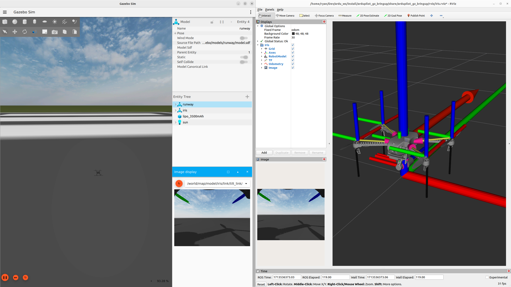

.. _ros2-gazebo:

=================
ROS 2 with Gazebo
=================

The purpose of this guide is to show how to integrate ArduPilot with Gazebo using ROS 2.

Prerequisites
=============

Ensure you have the prerequisites complete and working before beginning this Gazebo tutorial.

#. :ref:`Install ROS 2 <ros2>` 
#. :ref:`Install and Run ROS 2 with ArduPilot SITL <ros2-sitl>`

Install Gazebo
==============

First, install `Gazebo Harmonic (recommended) <https://gazebosim.org/docs/harmonic/install>`__ or `Gazebo Garden <https://gazebosim.org/docs/garden/install>`__.

Next, set up all the necessary ROS 2 packages in the workspace.

We will clone the required repositories using `vcstool <https://github.com/dirk-thomas/vcstool>`__ and a `ros2.repos` files:

.. code-block:: bash

    cd ~/ros2_ws
    vcs import --input https://raw.githubusercontent.com/ArduPilot/ardupilot_gz/main/ros2_gz.repos --recursive src

Set the Gazebo version to either ``harmonic`` (recommended) or ``garden``.
It's recommended to set this in your `~/.bashrc` file.

.. code-block:: bash

    export GZ_VERSION=harmonic

Update ROS dependencies:

.. code-block:: bash

    cd ~/ros2_ws
    source /opt/ros/humble/setup.bash
    sudo apt update
    rosdep update
    rosdep install --from-paths src --ignore-src -r

Build and Run Tests
===================

Build:

.. code-block:: bash

    cd ~/ros2_ws
    colcon build --packages-up-to ardupilot_gz_bringup

If you'd like to test your installation, run:

.. code-block:: bash

    cd ~/ros2_ws
    source install/setup.bash
    colcon test --packages-select ardupilot_sitl ardupilot_dds_tests ardupilot_gazebo ardupilot_gz_applications ardupilot_gz_description ardupilot_gz_gazebo ardupilot_gz_bringup
    colcon test-result --all --verbose

Run the Simulation
==================

Finally, you can source the workspace and launch one of the example Gazebo simulations: 

.. code-block:: bash

    source install/setup.bash
    ros2 launch ardupilot_gz_bringup iris_runway.launch.py

By default, this launch file starts ArduPilot SITL, Gazebo, and RViz with a single command.

For more information regarding the `ardupilot_gz` package refer to `ardupilot_gz/README.md <https://github.com/ArduPilot/ardupilot_gz#ardupilot_gz>`__.

Examples available
==================

- Iris Runway (Copter)

.. code-block:: bash

    ros2 launch ardupilot_gz_bringup iris_runway.launch.py

- Iris Maze (Copter)

.. code-block:: bash

    ros2 launch ardupilot_gz_bringup iris_maze.launch.py

- WildThumper (Rover)

.. code-block:: bash

    ros2 launch ardupilot_gz_bringup wildthumper.launch.py

Here is a demo video of ArduPilot working with ROS 2 and Gazebo:

..  youtube:: HZKXrSAE-ac
    :width: 100%

Next up
=======

Run Cartographer SLAM in :ref:`Cartographer SLAM with ROS 2 in SITL <ros2-cartographer-slam>`