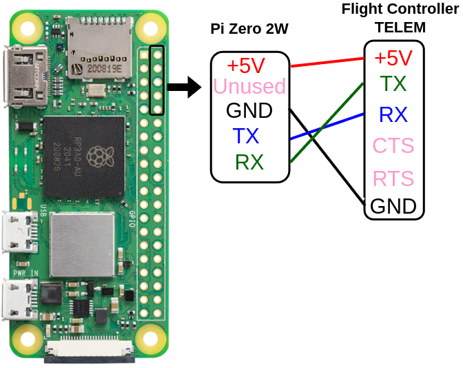

.. _ros2-pi:

=====================
ROS 2 on Raspberry Pi
=====================

Purpose
=======

Learn how to install the ROS onto a companion computer and run a sample ROS 2 application that communicated with ArduPilot over Micro XRCE DDS.
For this demonstation, a Raspberry Pi Zero 2W will be used, however other Linux computers are also capable.

Required Hardware
=================

* `Raspberry Pi Zero 2W <https://www.raspberrypi.com/products/raspberry-pi-zero-2-w/>`__
* A Linux computer to flash an SD card and configure the Pi

Initial Configuration
=====================

For the first section, we will follow `Ubuntu's tutorial <https://ubuntu.com/tutorials/how-to-install-ubuntu-on-your-raspberry-pi#1-overview>`__ , with specifics noted below.

Use ``rpi-imager``.

When selecting the operating system, we will install Ubuntu 22 Server.
Find it in "Other general-purpose OS -> Ubuntu -> Ubuntu Server 22.04.5 LTS (64-bit) which is supported
by `ROS 2 humble <https://www.ros.org/reps/rep-2000.html#humble-hawksbill-may-2022-may-2027>`__.
When prompted to do "OS Customisation", select that.
* In "General", Configure wireless LAN
* In "Services", enable SSH
* Save and flash the image onto the device

Install the SD card, let it boot for 2 minutes, then either through a HDMI display and keyboard, or by plugging the Pi's SD card back into your computer, edit the file:
``/etc/avahi/avahi-daemon.conf`` and change the line that has ``publish-workstation`` to ``publish-workstation=yes``.

Now, put the SD card back into the Pi, boot it up with the USB, and you can now connect.

.. code-block:: bash

    # Find the address of the PI
    avahi-resolve -n ubuntu.local
    # SSH into it (the first time)
    ssh ubuntu@ubuntu.local

Once you SSH, create your username and password, and test you can still login, it's time to set up ROS 2.
We'll install all the packages before it's wired into the drone.

ROS 2 Install
=============

When using Ubuntu 22.04, it's easiest to install ROS 2 through binaries.
https://docs.ros.org/en/humble/Installation/Ubuntu-Install-Debs.html

First off, if you can't use ``apt update`` due to "Waiting for cache lock: Could not get lock /var/lib/dpkg/lock-frontend. It is held by process 912 (unattended-upgr)",
try removing unattended upgrades

.. code-block:: bash

    sudo systemctl stop unattended-upgrades
    sudo apt-get purge unattended-upgrades

When installing ROS 2, install ``ros-humble-ros-base`` and ``ros-dev-tools``.

Finally, source the ROS environment automatically by adding it to your ``.bashrc``:

.. code-block:: bash

    LINE='source /opt/ros/humble/setup.bash'
    FILE=~/.bashrc
    grep -qF -- "$LINE" "$FILE" || echo "$LINE" >> "$FILE"
    . $FILE

Finally, check you have the ROS 2 CLI:

.. code-block:: bash

    ros2 --help

Serial Connection
=================

Now, wire a serial connection to your flight controller. Ensure your power supply is capable of powering the Pi Zero 2W.
The simplest solution is to wire an open telemetry port.

.. warning::

   Do not abuse the power supply for the flight controller.
   For robust applications, it is recommended to power non-flight-critical devices,
   such as a Raspberry Pi, with a separate 5V power supply.
   Although many flight controller power supplies may support the power draw of 
   a Raspberry Pi Zero 2W, a problem on the PI can bring down the entire vehicle.

