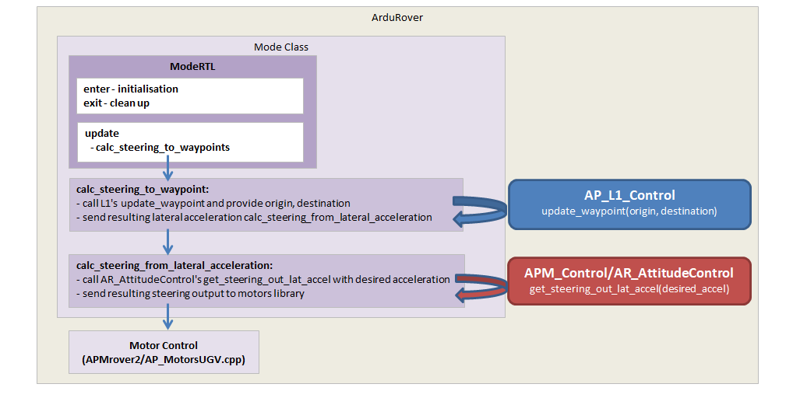
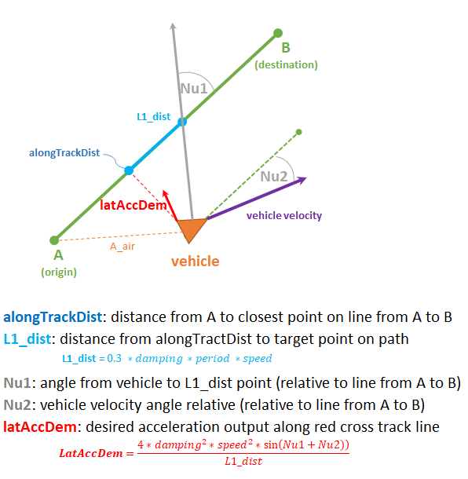

.. _rover-L1:

=============================
Rover: L1 navigation overview
=============================

This page provides an overview of Rover's navigation feature including the `L1 controller <https://github.com/ArduPilot/ardupilot/tree/master/libraries/AP_L1_Control>`__ which is also used in Plane.
The L1 controller is based on `this paper by Sanghyuk Park, John Deyst and Jonathan P How of MIT <http://mercury.kau.ac.kr/park/Archive/PCUAV/gnc_park_deyst_how.pdf>`__.

Overview
--------

-  on every iteration of the main loop (50hz) a call is made to the active mode's update method (`here is RTL's update function <https://github.com/ArduPilot/ardupilot/blob/master/APMrover2/mode_rtl.cpp#L37>`__).
   While in Auto, Guide, RTL and SmartRTL mode, the update calls into the Mode class's `calc_steering_to_waypoint <https://github.com/ArduPilot/ardupilot/blob/master/APMrover2/mode.cpp#L303>`__ method.

-  Mode's `calc_steering_to_waypoint <https://github.com/ArduPilot/ardupilot/blob/master/APMrover2/mode.cpp#L303>`__ then call's the AP_L1_controller library's `update_waypoint method <https://github.com/ArduPilot/ardupilot/blob/master/libraries/AP_L1_Control/AP_L1_Control.cpp#L198>`__ providing it the location that the rover should drive towards.

-  The AP_L1_controller's `update_waypoint method <https://github.com/ArduPilot/ardupilot/blob/master/libraries/AP_L1_Control/AP_L1_Control.cpp#L198>`__ returns a desired lateral acceleration which is passed into Mode's `calc_steering_from_lateral_acceleration <https://github.com/ArduPilot/ardupilot/blob/master/APMrover2/mode.cpp#L331>`__

-  Mode's `calc_steering_from_lateral_acceleration <https://github.com/ArduPilot/ardupilot/blob/master/APMrover2/mode.cpp#L331>`__ sends the desired acceleration to `APM_Control/AR_AttitudeControl's get_steering_out_lat_accel <https://github.com/ArduPilot/ardupilot/blob/master/libraries/APM_Control/AR_AttitudeControl.cpp#L158>`__ which uses a PID controller to calculate a steering output

-  The steering output is sent into the AP_MotorsUGV library using the `set_steering  <https://github.com/ArduPilot/ardupilot/blob/master/APMrover2/AP_MotorsUGV.cpp#L146>`__ method

L1 Controller
-------------

The final output of the L1 controller's `update_waypoint method <https://github.com/ArduPilot/ardupilot/blob/master/libraries/AP_L1_Control/AP_L1_Control.cpp#L198>`__ is a desired lateral acceleration (shown as "latAccDem" in red below) which should bring the vehicle back to the line between the origin and destination.

The formulas used are also shown below.  *damping* is from the :ref:`NAVL1_DAMPING <NAVL1_DAMPING>` parameter. *period* is from the :ref:`NAVL1_PERIOD <NAVL1_PERIOD>` parameter.

