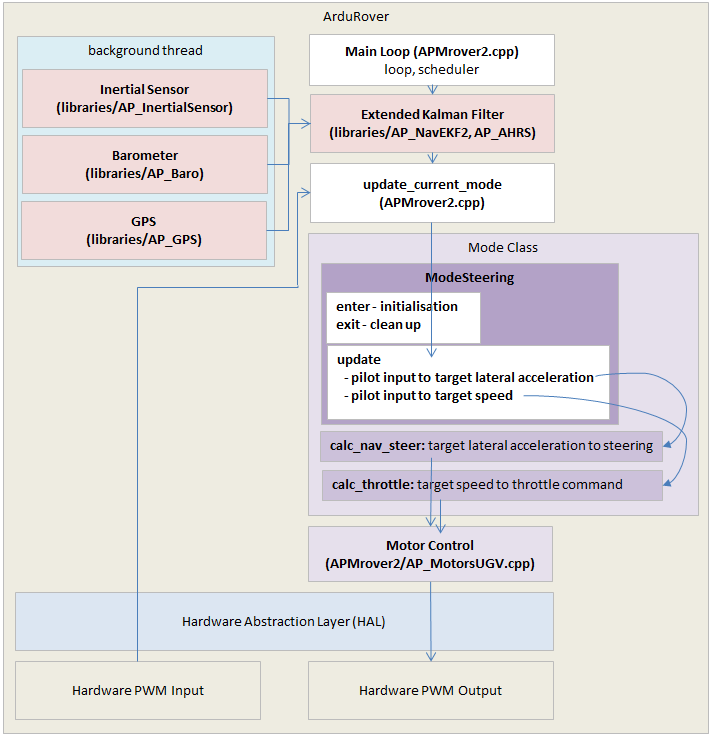
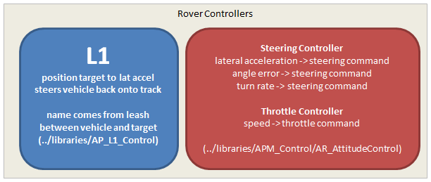

.. _rover-adding-a-new-drive-mode:

===============================
Rover: Adding a New Drive Mode
===============================

This page covers the basics of how to create a new driving (i.e. the equivalent of Manual, Steering, etc).  A real example of adding a new flight mode can be found in `this commit <https://github.com/ArduPilot/ardupilot/commit/04e9228fa073c10ebe6f6f1f83f9d3c29a974315>`__ that first added the ACRO mode.

As a reference the diagram below provides a high level view of Rover's architecture.

#. Pick a name for the new mode (i.e. "NEW_MODE") and add it to the mode enum in `mode.h <https://github.com/ardupilot/ardupilot/blob/master/Rover/mode.h#L21>`__ as "NEW_MODE" has been added below.

   ::

        // Auto Pilot modes
        // ----------------
        enum mode {
            MANUAL       = 0,
            ACRO         = 1,
            STEERING     = 3,
            HOLD         = 4,
            NEW_MODE     = 5,
            AUTO         = 10,
            RTL          = 11,
            GUIDED       = 15,
            INITIALISING = 16
        };

#. Define a new class for the mode in
   `mode.h <https://github.com/ArduPilot/ardupilot/blob/master/Rover/mode.h>`__.
   It is probably easiest to copy a similar existing mode's class definition and just change the class name (i.e. copy and rename "class ModeAcro" to "class ModeNewMode").
   The new class must implement the ``mode_number()``, ``name4()`` and ``update()`` methods.

   ::

       uint32_t mode_number() const override { return NEW_MODE; }
       const char *name4() const override { return "NEWM"; }
       void update() override;

   You may also want to implement the protected ``_enter()`` method to perform any initialisation required as the vehicle enters the mode (i.e. init position controllers as the user commands the vehicle to switch into the new mode) or ``_exit()`` to perform any cleanup as the vehicle leaves the mode:

   ::

        protected:

        bool _enter() override;
        void _exit() override;

   Finally there are some simple methods returning true/false that you may want to override that control features such as whether the vehicle can be armed in the new mode:

   ::

        // return if in non-manual mode : AUTO, GUIDED, RTL
        virtual bool is_autopilot_mode() const { return false; }

        // returns true if steering is directly controlled by RC
        virtual bool manual_steering() const { return false; }

        // returns true if the throttle is controlled automatically
        virtual bool auto_throttle() { return is_autopilot_mode(); }

#. Create a new mode_<new flight mode>.cpp file based on a similar mode such as
   `mode_acro.cpp <https://github.com/ArduPilot/ardupilot/blob/master/Rover/mode_acro.cpp>`__
   or
   `mode_steering.cpp <https://github.com/ArduPilot/ardupilot/blob/master/Rover/mode_steering.cpp>`__.
   This new file should implement the ``update()`` method which will be called 50 times per second.  This function's main responsibility is to decode the user's input, create new heading and steering targets and then call the steering and throttle controllers.

   Below is an excerpt from `mode_acro.cpp <https://github.com/ArduPilot/ardupilot/blob/master/Rover/mode_acro.cpp>`__ that demonstrates how the pilot's input is converted into target speed (in meters/second) and a target turn rate.

   ::

        // convert pilot stick input into desired steering and throttle
        float desired_steering, desired_throttle;
        get_pilot_desired_steering_and_throttle(desired_steering, desired_throttle);

        // convert pilot throttle input to desired speed (up to twice the cruise speed)
        float target_speed = desired_throttle * 0.01f * calc_speed_max(g.speed_cruise, g.throttle_cruise * 0.01f);

        // convert pilot steering input to desired turn rate in radians/sec
        float target_turn_rate = (desired_steering / 4500.0f) * radians(g2.acro_turn_rate);

   Near the bottom of `mode_acro.cpp <https://github.com/ArduPilot/ardupilot/blob/master/Rover/mode_acro.cpp>`__ you will see how these targets are sent to the steering and throttle controllers.
   The steering and throttle controller interfaces can be found in the `APM_Control/AR_AttitudeControl library <https://github.com/ArduPilot/ardupilot/blob/master/libraries/APM_Control/AR_AttitudeControl.h>`__.  The parent Mode class also provides some navigation methods that are defined in `mode.h <https://github.com/ArduPilot/ardupilot/blob/master/Rover/mode.h#L69>`__ (search for "navigation methods").

   ::

        // run steering turn rate controller and throttle controller
        float steering_out = attitude_control.get_steering_out_rate(target_turn_rate, g2.motors.have_skid_steering(), g2.motors.limit.steer_left, g2.motors.limit.steer_right, reversed);
        g2.motors.set_steering(steering_out * 4500.0f);
        calc_throttle(target_speed, false);

#. Instantiate the new mode class in `Rover.h <https://github.com/ArduPilot/ardupilot/blob/master/Rover/Rover.h#L382>`__ by searching for "ModeAcro" and then adding the new mode somewhere below.

   ::

        ModeInitializing mode_initializing;
        ModeHold mode_hold;
        ModeManual mode_manual;
        ModeAcro mode_acro;
        ModeGuided mode_guided;
        ModeAuto mode_auto;
        ModeSteering mode_steering;
        ModeRTL mode_rtl;

   Also at the top of Rover.h add the new mode as a "friend" which allows the mode to access the Rover class's internal variables and functions.

   ::

        class Rover : public AP_HAL::HAL::Callbacks {
        public:
            <some lines omitted>
            friend class Mode;
            friend class ModeAcro;
            friend class ModeAuto;
            friend class ModeGuided;
            friend class ModeHold;
            friend class ModeSteering;
            friend class ModeManual;
            friend class ModeRTL;

#. In `mode.cpp <https://github.com/ArduPilot/ardupilot/blob/master/Rover/mode.cpp>`__ add the new mode to the ``mode_from_mode_num()`` function to create the mapping between the mode's number and the instance of the class.

   ::

        Mode *Rover::control_mode_from_num(const enum mode num)
        {
            Mode *ret = nullptr;
            switch (num) {
            case MANUAL:
                ret = &mode_manual;
                break;
            case ACRO:
                ret = &mode_acro;
                break;
            case STEERING:
                ret = &mode_steering;
                break;

#. Add the new flight mode to the list of valid ``@Values`` for the ``MODE1 ~ MODE6`` parameters in `Parameters.cpp <https://github.com/ArduPilot/ardupilot/blob/master/Rover/Parameters.cpp#L242>`__ (Search for "MODE1").  Once committed to master, this will cause the new mode to appear in the ground stations list of valid modes.  Note that even before being committed to master, a user can setup the new flight mode to be activated from the transmitter's flight mode switch by directly setting the MODE1 (or MODE2, etc) parameters to the number of the new mode.

   ::

        // @Param: MODE1
        // @DisplayName: Mode1
        // @Values: 0:Manual,1:Acro,3:Steering,4:Hold,10:Auto,11:RTL,15:Guided
        // @User: Standard
        // @Description: Driving mode for switch position 1 (910 to 1230 and above 2049)
        GSCALAR(mode1,           "MODE1",         MANUAL),

        // @Param: MODE2
        // @DisplayName: Mode2
        // @Description: Driving mode for switch position 2 (1231 to 1360)
        // @Values: 0:Manual,1:Acro,3:Steering,4:Hold,10:Auto,11:RTL,15:Guided
        // @User: Standard
        GSCALAR(mode2, "MODE2", MANUAL),

**As a side note, Rover has 3 high level controllers:**

- the L1 controller converts an origin and destination (each expressed as a latitude, longitude) into a lateral acceleration to make the vehicle travel along the path from the origin to the destination.  This lateral acceleration is then passed into the steering controller.
- the steering controller can convert a desired lateral acceleration, a angle error or a desired turn rate into a steering output command (expressed as a number in the range -4500 to +4500) that should be fed into the motor library (see `AR_MotorsUGV.h <https://github.com/ArduPilot/ardupilot/blob/master/Rover/AP_MotorsUGV.h>`__)
- the throttle controller can convert a desired speed into a throttle command (expressed as a number from -100 to +100) that should be fed into the motor library (see `AR_MotorsUGV.h <https://github.com/ArduPilot/ardupilot/blob/master/Rover/AP_MotorsUGV.h>`__)
