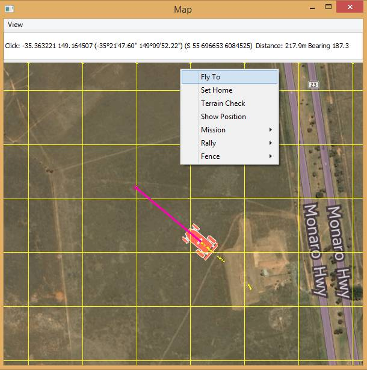

.. _rover-sitlmavproxy-tutorial:

============================
Rover SITL/MAVProxy Tutorial
============================

This tutorial provides a basic walk-through of how to use
:ref:`SITL <sitl-simulator-software-in-the-loop>` and
`MAVProxy <http://ardupilot.github.io/MAVProxy/>`__ for *Rover* testing.

Overview
========

Rover is an easy platform to get started with. Unlike Copter or Plane
there are no fast-moving propellers, so there is no need to arm motors.
As movement is along the ground, there is no need to consider taking off
or landing, and pausing/loitering/waiting is just "stopping". At the end
of initialization the Rover is ready to go!

The article is intended primarily for developers who want to test new
Rover builds and bug fixes using SITL and *MAVProxy*. It shows how to
use the different modes, run missions, set a geofence, and perform a
number of other basic testing tasks.

The tutorial is complementary to the topic :ref:`Using SITL for ArduPilot Testing <using-sitl-for-ardupilot-testing>`.

.. note::

   -  We use *MAVProxy* here, but you can :ref:`attach another ground station to SITL <using-sitl-for-ardupilot-testing_connecting_otheradditional_ground_stations>`
      if you prefer (similar instructions can be used in any GCS).
   -  This tutorial is for Rover - see
      :ref:`Copter <copter-sitl-mavproxy-tutorial>` and
      :ref:`Plane <plane-sitlmavproxy-tutorial>` for similar tutorials on the
      other vehicles.

Preconditions
=============

The tutorial assumes you have already set up :ref:`SITL on Windows <sitl-native-on-windows>` or
:ref:`Linux <setting-up-sitl-on-linux>` and that you have started SITL
using the ``--map`` and ``--console`` options:

::

    cd ~/ardupilot/APMrover2
    sim_vehicle.py --map --console

Arrange the *MAVProxy Command Prompt*, *Console* and *Map* conveniently
so you can observe the status and send commands at the same time.

.. image:: ../images/mavproxy_sitl_console_and_map.jpg
    :target: ../_images/mavproxy_sitl_console_and_map.jpg

Starting
========
Arm the rover by entering the following on the mavproxy console
::

    arm throttle

**Right-click** on the map at your target destination, select **Fly
to**, and enter an altitude (which is ignored). Rover will change to
``GUIDED`` mode, drive to the location, and then pause (still in GUIDED
mode).

   MAVProxy: Rover go tolocation

If you have a mission loaded, you can also simply change to AUTO mode to
run it:

::

    mode auto

.. tip::

   Any commands or parameters that are not relevant to a Rover are
   ignored (e.g. TAKEOFF command and any altitude information).

Guiding the vehicle
===================

The previous section covered almost everything you need to know about
moving the vehicle around the map in ``GUIDED`` mode.

You can also enter the target position manually on the command line
using the two formats below. If only the altitude is specified, the last
specified LAT/LON will be used.

::

    guided ALTITUDE
    guided LAT LON ALTITUDE

Just specifying the altitude (as 0) is useful if you need to pause then
restart a guided path. The commands below set the mode to HOLD and then
restart the vehicle travelling towards the previous point:

::

    GUIDED> mode hold
    HOLD> guided 0
    GUIDED> 

When you're finished you can return to the initial position by changing
to ``RTL`` mode (this also works in ``AUTO`` mode):

::

    GUIDED> mode rtl
    RLT> 

Running a mission
=================

You can load a mission at any time using the ``wp load`` command. After
you've taken off the current mission will start as soon as you change to
``AUTO`` mode.

The example below shows how to load and start one of the test missions,
skip to the second waypoint, and *loop* the mission:

::

    wp load ..\Tools\autotest\CMAC-circuit.txt
    mode auto
    wp set 2
    wp loop

.. note::

   Rover will only run :ref:`commands it supports <rover:common-mavlink-mission-command-messages-mav_cmd_commands_supported_by_rover>`
   (others are ignored). 

The `MAVProxy Waypoints documentation <http://ardupilot.github.io/MAVProxy/html/uav_configuration/waypoints.html>`__
lists the full set of available commands (or you can get them using
auto-completion by typing "wp" on the command line).

If you want to create a waypoint mission, this is most easily done on
the map:

#. Right-click on the map and then select **Mission \| Draw**.

   .. figure:: ../images/MAVProxyCopter_Mission_Draw.jpg
      :target: ../_images/MAVProxyCopter_Mission_Draw.jpg

      MAVProxy: Draw Mission Menu (This image is for Copter, but the behaviour is the same).

#. Left-click on the map where you want the points to appear.

   .. note::

      Nothing visible will happen when you make the first click.
      After the second click, lines will join your points to show the path
         
#. When you're done, you can loop the mission by right-clicking on the
   map and selecting **Mission \| Loop**.

This approach only allows you to create
:ref:`MAV_CMD_NAV_WAYPOINT <rover:mav_cmd_nav_waypoint>`
commands. You can edit missions and use other commands on Linux using
the *misseditor* module (``module load misseditor``). This is currently
broken on Windows. It is also possible to load other types of commands
from files.

.. tip::

   At any point you can pause the mission by setting the mode to
   ``HOLD``, and restart by setting it back to ``AUTO``.

Changing mode
=============

Rover supports a small number of modes which you can list in *MAVProxy*
with the ``mode`` command:

::

    GUIDED> mode
    GUIDED> ('Available modes: ', ['AUTO', 'GUIDED', 'MANUAL', 'LEARNING', 'RTL', 'INITIALISING', 'HOLD', 'STEERING'])

The useful modes for simulation are:

-  ``AUTO`` - Run a mission
-  ``GUIDED`` - Move where directed by GCS
-  ``RTL`` - Return to launch
-  ``HOLD`` - WAIT - pause mission/stop moving.

As shown in the previous section, you can change the mode by specifying
``mode modename``. Most of the modes can be set by just entering the
mode name, e.g. ``rtl``, ``auto``, ``hold``.

Testing the vehicle
===================

*MAVProxy* allows you to list all the parameters affecting the vehicle
and simulation using ``param show *``, and to set any parameter using:
``param set PARAM_NAME VALUE``. In addition to affecting the vehicle
itself some parameters simulate the performance/failure of specific
hardware components and the environment (for example, the wind). These
can be listed using: `:ref:`param show sim*``. The topic `Using SITL for ArduPilot Testing <using-sitl-for-ardupilot-testing>` explains more about how
you can test using SITL.
