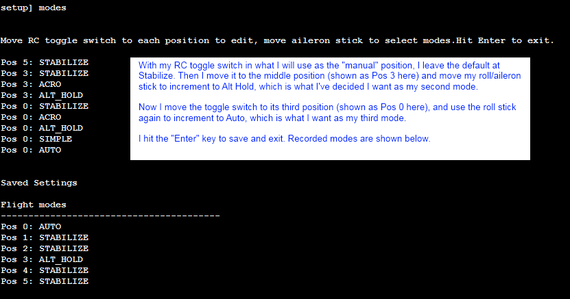

.. _setting-up-flight-modes-with-the-cli:

====================================
Setting up flight modes with the CLI
====================================

-  If you don't want to use the Mission Planner, you can set up your
   flight modes using the CLI (command line interface)
-  Connect your APM/PX to your computer using the mini USB cable
-  Go to the Mission Planner's Terminal window and press the "Connect to
   APM" or "Connect to PX4" button
-  At the prompt type ***setup*** (and press enter)
-  Type \ ***modes*** (and press enter)
-  Move your transmitter's flight mode switch (channel 5) to the
   position you want to assign and you should see the switches current
   flight mode be displayed
-  Move your aileron (aka roll) stick left or right to cycle through the
   various modes available.
-  Repeat for the other flight mode switch positions.
-  When you are done, press Enter to save and exit.

Below is an example output when setting the flight mode switch's 2nd and
3rd position to Alt Hold and Auto respectively

