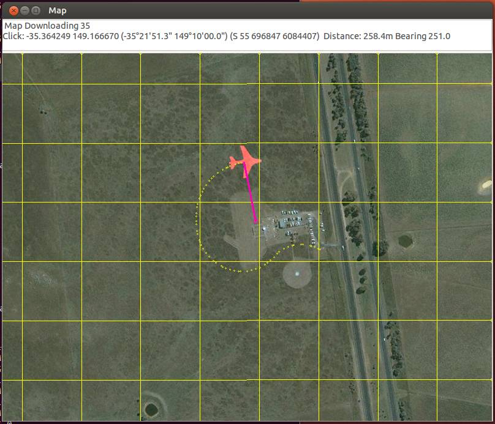
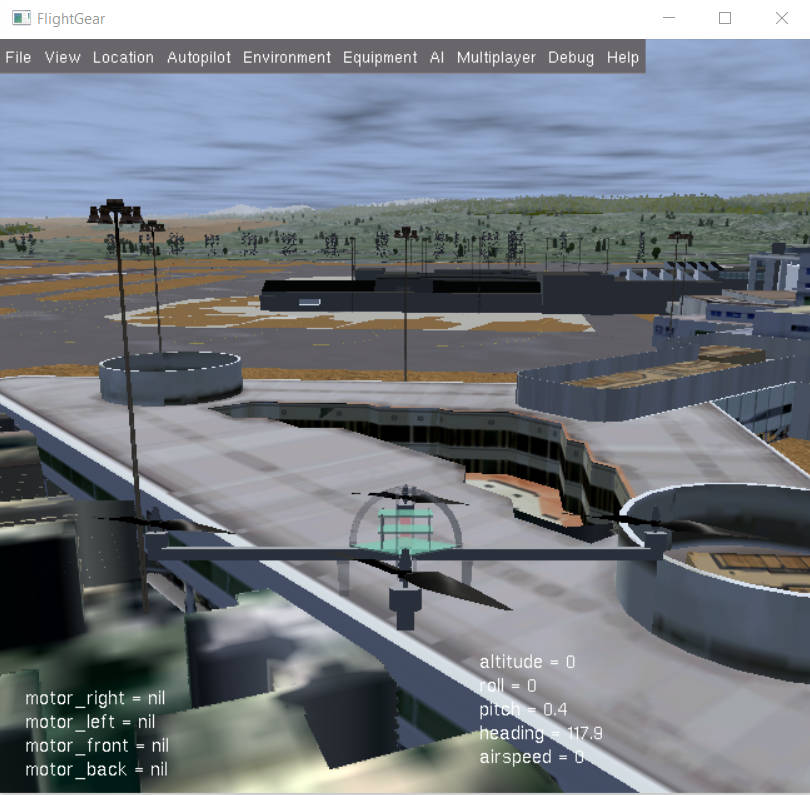

.. _setting-up-sitl-on-linux:

========================
Setting up SITL on Linux
========================

This page describes how to setup the :ref:`SITL (Software In The Loop) <sitl-simulator-software-in-the-loop>` on Linux. The specific
commands were tested on Ubuntu from 12.10 to 18.04.

Overview
========

The SITL simulator allows you to run Plane, Copter or Rover without any
hardware. It is a build of the autopilot code using an ordinary C++
compiler, giving you a native executable that allows you to test the
behaviour of the code without hardware.

SITL runs natively on Linux and Windows. See the separate :ref:`windows installation page <sitl-native-on-windows>`
for a windows install.

Install steps
=============

Please follow the instructions in :ref:`Setting up the Build Environment (Linux/Ubuntu) <building-setup-linux>` to set up the full environment, including SITL.

There is also a linked video below showing how to do the setup.

.. warning::

    The video hasn't been updated according to the text. Please read the written instructions in case of error.
    For example the video speak about ``sim_vehicle.sh`` where it is ``sim_vehicle.py`` now.

.. youtube:: pJGFkZmGV6o
    :width: 100%

Start SITL simulator
--------------------

To start the simulator first change directory to the vehicle directory.
For example, for the multicopter code change to **ardupilot/ArduCopter**:

::

   cd ardupilot/ArduCopter

Then start the simulator using **sim_vehicle.py**. The first time you
run it you should use the -w option to wipe the virtual EEPROM and load
the right default parameters for your vehicle.

::

    sim_vehicle.py -w

After the default parameters are loaded you can start the simulator
normally.  First kill the sim_vehicle.py you are running using Ctrl-C.  Then:

::

    sim_vehicle.py --console --map

.. tip::

   `sim_vehicle.py <https://github.com/ArduPilot/ardupilot/blob/master/Tools/autotest/sim_vehicle.py>`__
   has many useful options, ranging from setting the simulation speed
   through to choosing the initial vehicle location. These can be listed by
   calling it with the ``-h`` flag (and some are demonstrated in :ref:`Using SITL for ArduPilot Testing <using-sitl-for-ardupilot-testing>`).

.. tip::

   If the map tiles don't load, you can temporarily change the map provider in the map window by clicking View/Service.
   To keep the new map service between launches, add the following lines to the end of your ".bashrc" (change MicrosoftHyb to the provider you want):

   ::

     export MAP_SERVICE="MicrosoftHyb"

Learn MAVProxy
--------------

To get the most out of SITL you really need to learn to use MAVProxy.
Have a read of the `MAVProxy documentation <http://ardupilot.github.io/MAVProxy/>`__. Enjoy flying!

Updating MAVProxy and pymavlink
-------------------------------

New versions of MAVProxy and pymavlink are released quite regularly. If
you are a regular SITL user you should update every now and again using
this command

::

    pip install --upgrade pymavlink MAVProxy --user

FlightGear 3D View (Optional)
-----------------------------

Developers can optionally install the `FlightGear Flight Simulator <http://www.flightgear.org/>`__ and use it (in view-only mode)
to display a 3D simulation of the vehicle and its surroundings. This
provides a much better visualization than the 2D maps and HUD flight
displays provided by *MAVProxy* and *Mission Planner*.

   FlightGear:Simulated Copter at KSFO (click for larger view).

SITL outputs *FlightGear* compatible state information on UDP port 5503.
We highly recommend you start *FlightGear* before starting SITL
(although this is not a requirement, it has been found to improve
stability in some systems).

The main steps (tested on Ubuntu Linux 14.04 LTS) are:

#. Install FlightGear from the terminal:

   ::

       sudo apt-get install flightgear

#. Open a new command prompt and run the appropriate shell file for your
   vehicle in **/ardupilot/Tools/autotest/**:
   `fg_plane_view.sh <https://github.com/ArduPilot/ardupilot/blob/master/Tools/autotest/fg_plane_view.sh>`__
   (Plane) and
   `fg_quad_view.sh <https://github.com/ArduPilot/ardupilot/blob/master/Tools/autotest/fg_quad_view.sh>`__
   (Copter).

   This will start *FlightGear*.
   
#. Start SITL in the terminal in the normal way. In this case we're
   specifying the start location as San Francisco airport (KSFO) as this
   is an interesting airport with lots to see:

   ::

       sim_vehicle.py -L KSFO

   .. note::

      *FlightGear* will always initially start by loading scenery at
      KSFO (this is hard-coded into the batch file) but will switch to the
      scenery for the simulated location once SITL is started.

.. tip::

   If the vehicle appear to be hovering in space (no
      scenery) then *FlightGear* does not have any scenery files for the
      selected location. Choose a new location!

You can now takeoff and fly the vehicle as normal for
:ref:`Copter <copter-sitl-mavproxy-tutorial>` or
:ref:`Plane <plane-sitlmavproxy-tutorial>`, observing the vehicle movement
including pitch, yaw and roll.

Next steps
==========

After installation, see :ref:`Using SITL for ArduPilot Testing <using-sitl-for-ardupilot-testing>` for guidance on flying and
testing with SITL.
