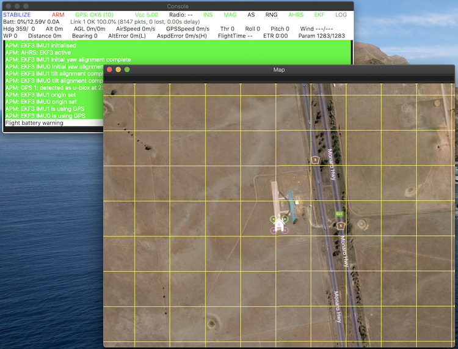

.. _setting-up-sitl-on-macosx:

===========================
Setting up SITL on Mac OS X
===========================

This page describes how to setup the :ref:`SITL (Software In The Loop) <sitl-simulator-software-in-the-loop>` on Mac OS X. The specific commands were tested on macOS Catalina 10.15.7 and macOS Big Sur 11.1.

Overview
========

The SITL simulator allows you to run Plane, Copter or Rover without any
hardware. It is a build of the autopilot code using an ordinary C++
compiler, giving you a native executable that allows you to test the
behaviour of the code without hardware.

SITL runs natively on Linux, Windows and Mac OSX.

Install steps
=============

This guide assumes that a build environment is already setup for Ardupilot. If that is not the case please follow the available guides to setup the build environment for Mac OSX. The following step provide a condensed versions of the steps to take.

Prerequisites
-------------

The following tools need to be installed to complete the installation. Between brackets the version used by the author at time of writing.

 * Xcode (12.4)
 * Xcode commandline tools (12.4)
 * Homebrew (2.7.5)
 * pyenv (1.2.22)

Preparing Python
----------------

Install the required python version using pyenv and activate it. This assumes pyenv is setup and initialized with 'pyenv init'.

::

	brew install readline openssl@1.1
	env PYTHON_CONFIGURE_OPTS="--enable-framework CC=clang" pyenv install 3.9.1
	pyenv shell 3.9.1
	pip install wheel
	pip install future pymavlink mavproxy

Start SITL simulator
--------------------

.. warning::

	Due to ideosyncracies with Python and using screens there are limitations when Python needs to use the screen to display a graphical UI. Python 3.9 solves part of the problem by no longer requiring a separate pythonw binary. However the requirement to run on the main display still stands. When observing the error "This program needs access to the screen. Please run with a Framework build of python, and only when you are logged in on the main display of your Mac.", disconnect external displays during startup. When SITL is started the windows can be moved around as normal.

To start the simulator first change directory to the vehicle directory.
For example, for the multicopter code change to **ardupilot/ArduCopter**:

::

   cd ardupilot/ArduCopter

Then select the correct python environment

::
	
	pyenv shell 3.9.1

Then start the simulator using **sim_vehicle.py**. The first time you
run it you should use the -w option to wipe the virtual EEPROM and load
the right default parameters for your vehicle.

::

    sim_vehicle.py -w

After the default parameters are loaded you can start the simulator
normally.  First kill the sim_vehicle.py you are running using Ctrl-C.  Then:

::

    sim_vehicle.py --console --map

.. tip::

   `sim_vehicle.py <https://github.com/ArduPilot/ardupilot/blob/master/Tools/autotest/sim_vehicle.py>`__
   has many useful options, ranging from setting the simulation speed
   through to choosing the initial vehicle location. These can be listed by
   calling it with the ``-h`` flag (and some are demonstrated in :ref:`Using SITL for ArduPilot Testing <using-sitl-for-ardupilot-testing>`).

.. tip::

   If the map tiles don't load, you can temporarily change the map provider in the map window by clicking View/Service.
   To keep the new map service between launches, add the following lines to the end of your ".bashrc" (change MicrosoftHyb to the provider you want):

   ::

     export MAP_SERVICE="MicrosoftHyb"

Learn MAVProxy
--------------

To get the most out of SITL you really need to learn to use MAVProxy.
Have a read of the :ref:`MAVProxy documentation <mavproxy:home>`. Enjoy flying!

Next steps
==========

After installation, see :ref:`Using SITL for ArduPilot Testing <using-sitl-for-ardupilot-testing>` for guidance on flying and testing with SITL.
