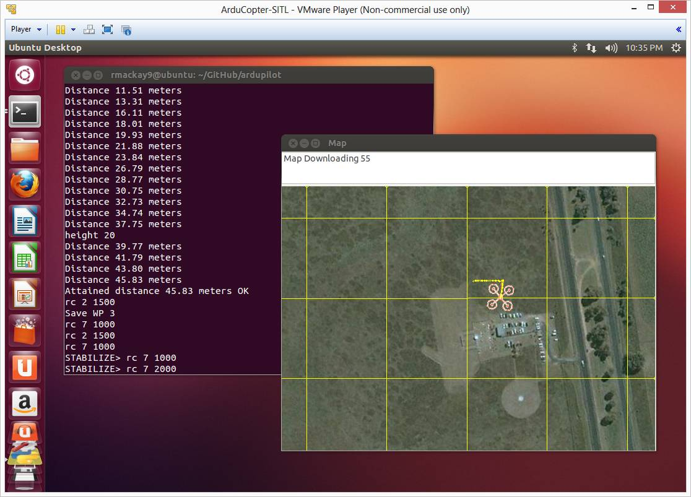
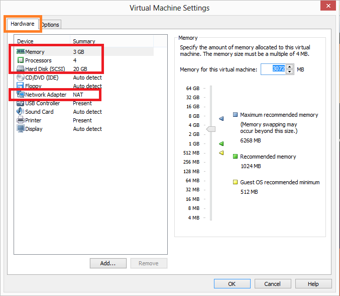
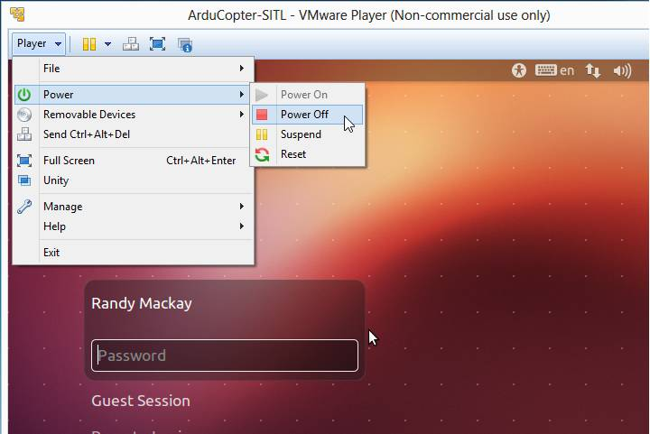
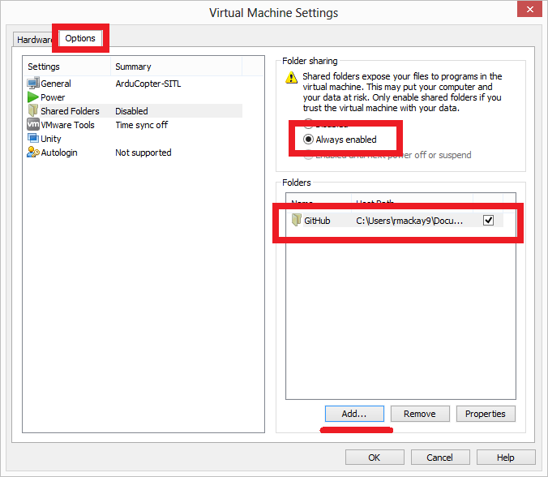
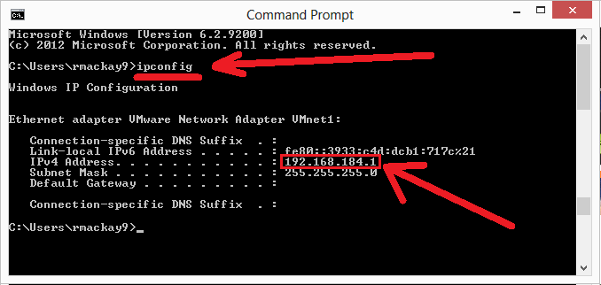
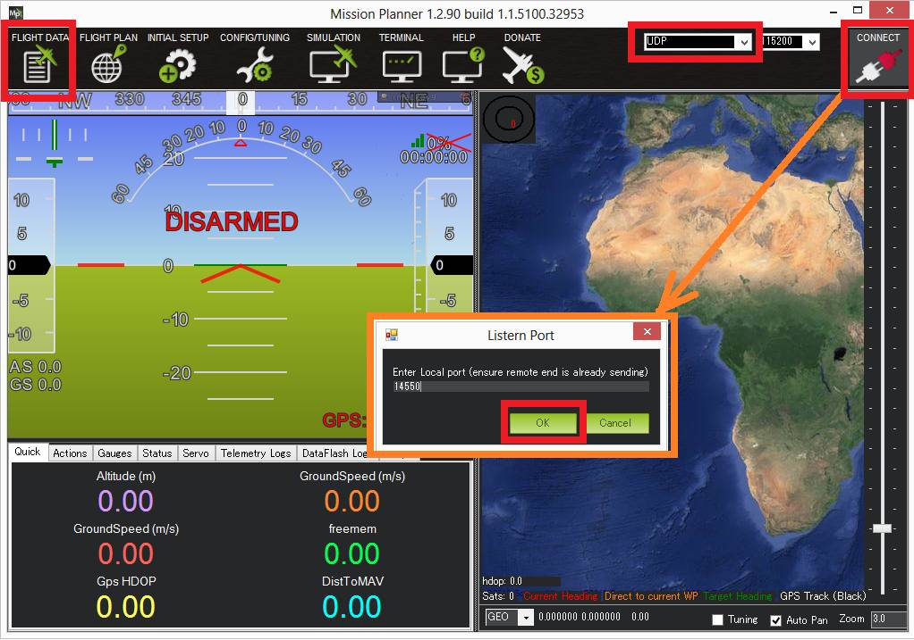
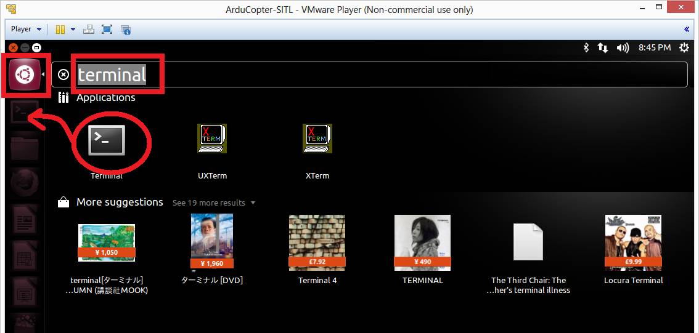
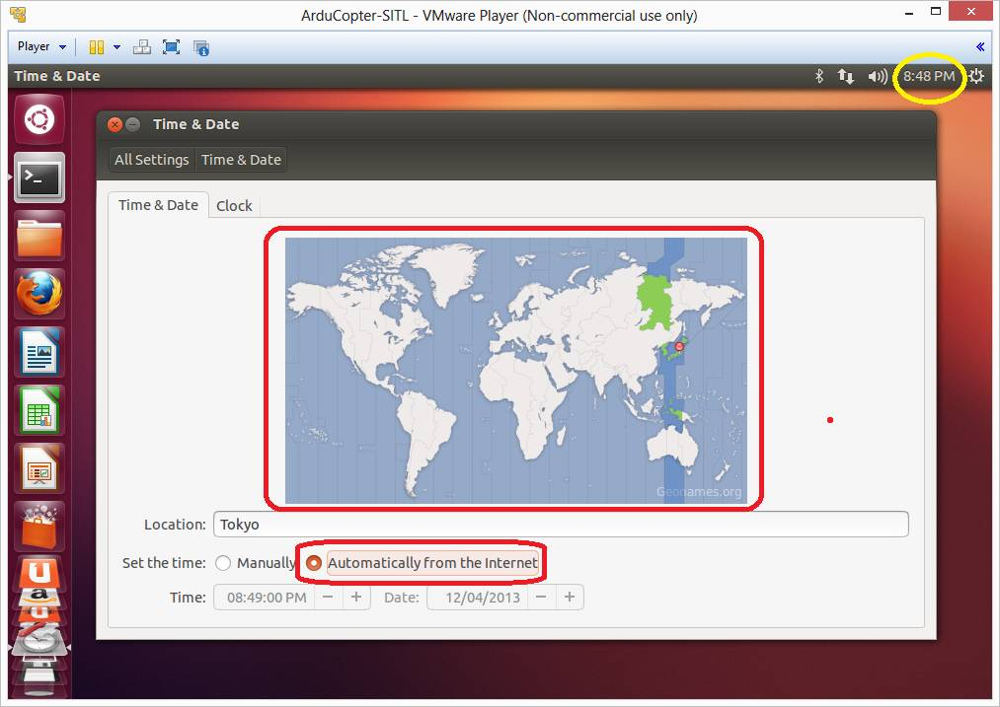

.. _setting-up-sitl-on-windows:

=============================================
SITL on Windows in a VMWare VM (Manual Setup)
=============================================

This article explains how to *manually* set up the :ref:`SITL ArduPilot Simulator <sitl-simulator-software-in-the-loop>` in a virtual machine
environment on Windows, and connect it to a Ground Control Station

.. tip::

   See :ref:`Setting up SITL using Vagrant <setting-up-sitl-using-vagrant>`
   for a more automated setup process.

Overview
========

The SITL (Software In The Loop) simulator allows you to run Plane,
Copter or Rover without any hardware. The simulator runs the normal
ArduPilot code as a native executable on a Linux PC. SITL can also be
run within a virtual machine on Windows, Mac OSX or Linux.

This article shows how to manually set up SITL on a Linux environment
hosted in a VMware virtual machine.

.. note::

   The instructions were tested on Windows 8 with VMware ver 7.1.0
   build-2496824 and Ubuntu 14.10. 

Preconditions
=============

Please note that before attempting this you should already have
:ref:`downloaded the code <where-to-get-the-code>` to your machine
and be able to :ref:`build it with Arduino <building-ardupilot-with-arduino-windows>` or
:ref:`Make <building-px4-with-make>`.

Step #1 - Install VMWare and create an Ubuntu Virtual Machine
=============================================================

1. Download and install `VMware <https://my.vmware.com/web/vmware/free#desktop_end_user_computing/vmware_player/6_0>`__ (look for VMware Player and VMware Player Plus for Windows)

2. Download the `Ubuntu iso <http://www.ubuntu.com/download/desktop/thank-you?country=--&version=14.04.2&architecture=amd64>`__

3. Start VMware and create new ubuntu machine by selecting Player > File
> New Virtual Machine

-  Enter your Full name, user name and password for the virtual machine.
   you will use these later when you log onto this virtual machine
-  Name your virtual machine (i.e. Copter-SITL)
-  Specify Disk Capacity - leave Max disk size as default 20GB, and
   "Split virtual disk into multiple files" checked
-  On next page of "New Virtual Machine Wizard" click the "Customize
   Hardware.." button
-  On the Hardware tab set Memory: 3GB,Processors: 4,Hard Disk:
   20GB,Network Adapter: NAT

Step #2 - Start the VM for the first time
=========================================

#. Power on the machine by double clicking on item just created in the
   VMware Player
#. Press "No" to any questions like "Cannot connect to the XXX device
   because no corresponding device is available on the host"
#. Enter your password when the login screen appears
#. Say "no" to any options to upgrade versions
#. Open firefox and make sure it can access some web page like
   www.ardupilot.org

   .. |Ubuntu_TestNetworkWithFirefox| image:: ../images/ubuntu_test_network_with_firefox.jpg
       :target: ../_images/ubuntu_test_network_with_firefox.jpg
   
#. Set the clock by double clicking on the top right corner, select your
   location on the map and "Set the time:" to "Automatically from the
   internet"

   |Ubuntu_setTimezone|
#. Setup a terminal short by clicking on the Dash Home icon on the top
   left, Type "terminal" and then drag the terminal applicatoin to the
   left start pane

   |Ubuntu_TerminalShortcut|

Step #3 - Setting up shared partition with Windows & Ubuntu Virtual Machine
===========================================================================

1. Ensure the VM is powered down by select it's name, then select the
drop-down beside the green play button and select "Power Off" if it's
not greyed

2.On VMware Player select Player > Manage > Virtual Machine Settings...
> Options Tab > Shared Folders

-  check "Always enabled", Add
-  "Host Path" to folder one level above where you have installed
   ardupilot software
-  check "Enable this share"

3. Power on the VM, enter your login information

4. Open Terminal window and type "ls /mnt/hgfs" and the share you set-up
should be visible

5. type "ln -s /mnt/hgfs/<foldername>" (where <foldername> is replaced
with the name of the folder you set-up) to create a symbolic link to the
shared folder from your home directory

Step #4 - install packages on your VM
=====================================

.. note::

   Most of these same dependencies will be installed when you do the
   next step (:ref:`SITL instructions for Linux <setting-up-sitl-on-linux>`).

Open up a terminal and type the following to update the list of packages
in the software center:

::

    sudo apt-get update

Then install the following packages (reply 'y' if it prompts you re
additional disk space used)

::

    sudo apt-get install python-dev dos2unix python-wxgtk2.8 python-matplotlib python-opencv python-pip g++ g++-4.7 gawk git ccache

    sudo pip install pymavlink
    sudo pip install mavproxy

If you wish to run Plane you will also need to install these packages:

::

    sudo apt-get install libexpat1-dev auto.conf libtool automake

Step #5 - Follow the Linux instructions
=======================================

Now that you have a Linux VM you should follow the :ref:`SITL instructions for Linux <setting-up-sitl-on-linux>`

.. _setting-up-sitl-on-windows_connecting_with_the_mission_planner:

Connecting with the Mission Planner
===================================

In addition to using the mavproxy ground station (the command line style
ground station written in python) it should be possible to connect with
the Mission Planner by appending the ``--viewerip=XXX.X.X.X`` to the end
of the start up command where the Xs are replaced with your machine's IP
address.  This address can be found by typing "ipconfig" into a command
prompt.

.. note::

   You will likely see many more than one IP address listed so you
   may need to try a few different addresses to find one that works.

So for this example the following would then be entered into the
terminal on the Ubuntu VM:

::

    ./Tools/autotest/autotest.py build.ArduCopter fly.ArduCopter --map --viewerip=192.168.184.1

Next connect with the mission planner after first setting the "COM Port"
to "UDP".

Dataflash logs
==============

After the simulation is run, dataflash logs named "Copter.flashlog" or
"CopterAVC.flashlog" will be created the "buildlogs" directory. This
directory is created at the same level as the ardupilot directory (i.e.
the top level directly that holds the "Copter", "Plane" and "libraries"
directories). Because of the inconvenient name you'll need to change the
file extension to ".log" before opening in Mission Planner.

Next steps
==========

To get the most out of SITL we recommend you `Learn MavProxy <http://ardupilot.github.io/MAVProxy/>`__.

The topic :ref:`Using SITL for ArduPilot Testing <using-sitl-for-ardupilot-testing>` explains how to use the
simulator, and covers topics like how to use SITL with Ground Stations
other than Mission Planner and MAVProxy.

