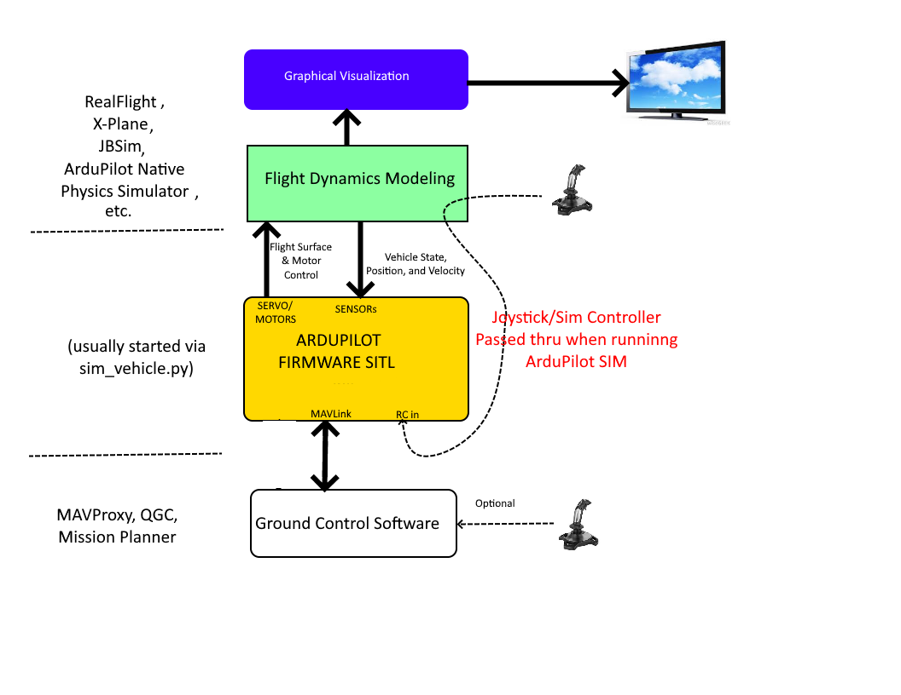

.. _simulation-2:

==========
Simulation
==========

.. image:: ../images/simulation-landingpage.jpg

Simulation allows for the safe testing of experimental code and settings. Crashing virtual vehicles is a lot cheaper than crashing real ones!

Overview
========

Simulation is implemented by using a Flight Dynamics Model (FDM) of the vehicle to simulate the physics involved with vehicle movement. It receives inputs from a SITL (Software in the Loop) program running the ArduPilot firmware (which are the firmware's servo/motor outputs) and outputs vehicle status,position, velocities, etc. that result from those inputs back to the firmware simulation. Just as sensors would in the real world case.

Pilot control is implemented either by joystick, dedicated simulation controller box(like Interlink), or by MAVLink commands from a Ground Control Station program (GCS), like MAVProxy or Mission Planner.

This is illustrated below:

ArduPilot provides a native firmware simulator + FDM program (all launched by sim_vehicle.py), often simply referred to as ``SITL``, which is usually used with its developer GCS, MAVProxy. ArduPilot's firmware simulator and FDM can also be used by Mission Planner for SITL simulations.

In addition, the ArduPilot firmware simulator element can also be interfaced to other FDM/Graphics programs that are normally used as stand-alone flight/vehicle simulators in order to get more realistic physics models and/or high definition vehicle graphics, such as RealFlight or X-Plane.

   .. tip::

      We recommend starting with ArduPilot's native :ref:`Software In The Loop (SITL) <sitl-simulator-software-in-the-loop>` because the setup is easiest, it does not require a flight controller, and all vehicle types are supported.

The most commonly used simulators are:

-  :ref:`SITL (Software In The Loop) <sitl-simulator-software-in-the-loop>` is the simulator most commonly used by developers. It is a simple simulator that is built within all SITL builds of ArduPilot. It is used by the :ref:`autotester <the-ardupilot-autotest-framework>` and other simulators below are actually built on top of SITL
-  :ref:`Gazebo <using-gazebo-simulator-with-sitl>` is the official DARPA virtual robotics simulator
-  :ref:`XPlane-10 <sitl-with-xplane>` a commercial flight simulator with a rich 3D interface   
-  :ref:`XPlane-10 Soaring<soaring-sitl-with-xplane>` soaring on XPlane-10
-  :ref:`RealFlight <sitl-with-realflight>` a commercial flight simulator with a rich 3D interface and ability to design custom vehicles
-  :ref:`Morse <sitl-with-morse>` a robotics simulation environment commonly used in research
-  :ref:`Replay <testing-with-replay>` has no graphical interface but allows re-running master from a dataflash log
-  :ref:`JSBSim <sitl-with-jsbsim>` is a sophisticated open-source plane and multicopter simulator with no graphical interface. It can be used with a wide variety of airframes.
-  :ref:`AirSim <sitl-with-airsim>` is an open-source, cross-platform simulator for drones & cars, built on Unreal Engine for physically and visually realistic simulations
-  :ref:`Silent Wings Soaring<soaring-sitl-with-silentwings>` 
-  :ref:`MATLAB and Simulink<sitl-with-MATLAB>` are numerical computing environments used for developing algorithms and plotting data developed by `MathWorks <https://www.mathworks.com/>`__.
-  :ref:`JSON interface<sitl-with-JSON>` The JSON interface is a generic interface protocol designed to be easy to implement for those developing physics backend. There are Python and MATLAB examples.
-  :ref:`Webots <sitl-with-webots>` is a simulator mainly used for robotics. It is easy to build many vehicles using it. ArduPilot has Rover, Quadcopter, and Tricopters examples that have been built especially for this simulator.

Less often used simulators include:

-  :ref:`Last Letter <using-last_letter-as-an-external-sitl-simulator>` is a simpler simulator (fixed wing only) with lower CPU requirements than most other simulators.
-  :ref:`CRRCSim <simulation-2sitl-simulator-software-in-the-loopusing-using-the-crrcsim-simulator>` is a less commonly used simulator for fixed wing and helictopers.
-  :ref:`SCRIMMAGE <sitl-with-scrimmage>` is an open-source vehicle simulator focused on collaborative robotics

List of simulators (so they can appear in the menu):

.. toctree::
    :maxdepth: 1

    SITL Simulator <sitl-simulator-software-in-the-loop>
    Gazebo <using-gazebo-simulator-with-sitl>
    XPlane-10 <sitl-with-xplane>
    XPlane-10 Soaring<soaring-sitl-with-xplane>
    RealFlight <sitl-with-realflight>
    Morse <sitl-with-morse>
    Replay <testing-with-replay>
    JSBSim <sitl-with-jsbsim>
    AirSim <sitl-with-airsim>
    Silent Wings Soaring<soaring-sitl-with-silentwings>
    Last Letter <using-last_letter-as-an-external-sitl-simulator>
    CRRCSim <simulation-2sitl-simulator-software-in-the-loopusing-using-the-crrcsim-simulator>
    HITL Simulators <hitl-simulators>
    Autotest Framework <the-ardupilot-autotest-framework>
    Unit Tests <unit-tests>
    SCRIMMAGE <sitl-with-scrimmage>
    Webots <sitl-with-webots>
    MATLAB and Simulink <sitl-with-MATLAB>
    JSON interface <sitl-with-JSON>
