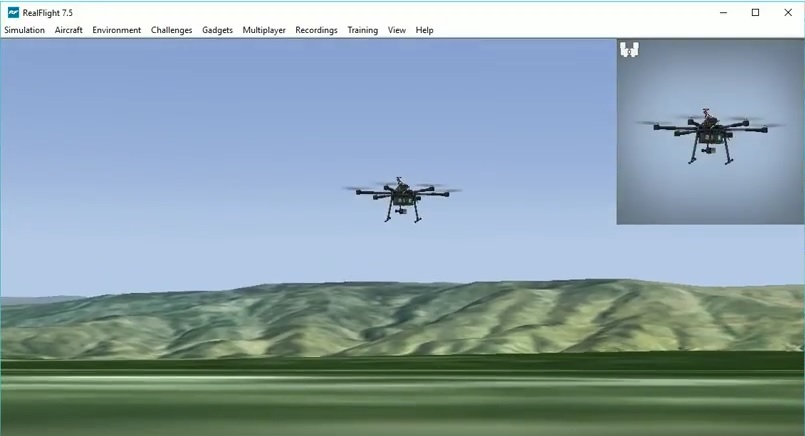

.. _simulation-2:

==========
Simulation
==========

Simulation allows for safe testing of experimental code and settings and crashing virtual vehicles is a lot cheaper than crashing real ones!

   .. tip::

      We recommend starting with :ref:`Software In The Loop (SITL) <sitl-simulator-software-in-the-loop>` because the setup is easiest, it does not require a flight controller, and all vehicle types are supported.

The most commonly used simulators are:

-  :ref:`SITL (Software In The Loop) <sitl-simulator-software-in-the-loop>` is the simulator most commonly used by developers. It is a simple simulator that is built within all SITL builds of ArduPilot. It is used by the :ref:`autotester <the-ardupilot-autotest-framework>` and other simulators below are actually built on top of SITL
-  :ref:`Gazebo <using-gazebo-simulator-with-sitl>` is the official DARPA virtual robotics simulator
-  :ref:`XPlane-10 <sitl-with-xplane>` a commercial flight simulator with a rich 3D interface   
-  :ref:`XPlane-10 Soaring<soaring-sitl-with-xplane>` soaring on XPlane-10
-  :ref:`RealFlight <sitl-with-realflight>` a commercial flight simulator with a rich 3D interface and ability to design custom vehicles
-  :ref:`Morse <sitl-with-morse>` a robotics simulation environment commonly used in research
-  :ref:`Replay <testing-with-replay>` has no graphical interface but allows re-running master from a dataflash log
-  :ref:`JSBSim <sitl-with-jsbsim>` is a sophisticated open-source plane and multicopter simulator with no graphical interface. It can be used with a wide variety of airframes.
-  :ref:`AirSim <sitl-with-airsim>` is an open-source, cross-platform simulator for drones & cars, built on Unreal Engine for physically and visually realistic simulations
-  :ref:`Silent Wings Soaring<soaring-sitl-with-silentwings>` 

Less often used simulators include:

-  :ref:`Last Letter <using-last_letter-as-an-external-sitl-simulator>` is a simpler simulator (fixed wing only) with lower CPU requirements than most other simulators.
-  :ref:`CRRCSim <simulation-2sitl-simulator-software-in-the-loopusing-using-the-crrcsim-simulator>` is a less commonly used simulator for fixed wing and helictopers.
-  :ref:`Hardware In the Loop <hitl-simulators>` (HITL) simulation runs ArduPilot on the flight controller using raw sensor data fed in from the simulated environment running on the desktop PC.  HITL is only supported for Plane.
-  :ref:`SCRIMMAGE <sitl-with-scrimmage>` is an open-source vehicle simulator focused on collaborative robotics

List of simulators (so they can appear in the menu):

.. toctree::
    :maxdepth: 1

    SITL Simulator <sitl-simulator-software-in-the-loop>
    Gazebo <using-gazebo-simulator-with-sitl>
    XPlane-10 <sitl-with-xplane>
    XPlane-10 Soaring<soaring-sitl-with-xplane>
    RealFlight <sitl-with-realflight>
    Morse <sitl-with-morse>
    Replay <testing-with-replay>
    JSBSim <sitl-with-jsbsim>
    AirSim <sitl-with-airsim>
    Silent Wings Soaring<soaring-sitl-with-silentwings>
    Last Letter <using-last_letter-as-an-external-sitl-simulator>
    CRRCSim <simulation-2sitl-simulator-software-in-the-loopusing-using-the-crrcsim-simulator>
    HITL Simulators <hitl-simulators>
    Autotest Framework <the-ardupilot-autotest-framework>
    SCRIMMAGE <sitl-with-scrimmage>
