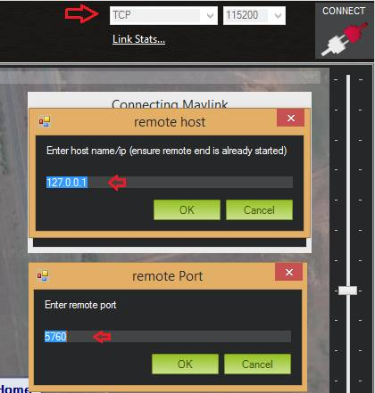

.. _sitl-native-on-windows:

==========================
Setting up SITL on Windows
==========================

This article shows how to build and run SITL *natively* on Windows. The
specific commands were tested on *Windows 8.1* using *Cygwin 2.0.0*,
*MAVProxy 1.4.19*, *Mission Planner 1.3.25*, and *AC3.3* (Copter).

Overview
========

The :ref:`SITL (Software In The Loop) <sitl-simulator-software-in-the-loop>` simulator is a build of
the ArduPilot code which allows you to run Plane, Copter or Rover
without any hardware.

SITL was originally developed on Linux, and but can now be built and
run *natively* on both Linux or Windows. It can also be run on
a virtual machine (Linux) hosted on Windows, Mac OSX, or Linux.

These instructions explain how to build SITL *natively* on Windows, and
how to interact with the simulator using
`MAVProxy <http://ardupilot.github.io/MAVProxy/>`__ and/or :ref:`Mission Planner <planner:home>`.

.. figure:: ../images/MAVProxy_Map_GuidedCopter.jpg
   :target: ../_images/MAVProxy_Map_GuidedCopter.jpg

   MAVProxy Map: Guiding a SimulatedCopter

Installation steps
==================

   .. tip::

      An automatic download and installation script for MAVProxy, Cygwin, JSBSim and ArduPilot can be found `here <https://raw.githubusercontent.com/ArduPilot/ardupilot/master/Tools/autotest/win_sitl/InstallDevEnvironmentAndAPMSource.ps1>`__. After downloading the file, right click -> Run in Powershell.
      
Install MAVProxy
----------------

*MAVProxy* is a fully-functioning but minimalist console-based GCS that
is commonly used for testing and developing ArduPilot:

-  `Download MAVProxy for Windows <http://firmware.ardupilot.org/Tools/MAVProxy/MAVProxySetup-latest.exe>`__ (latest build)
-  Install the executable, accepting the license and all other default settings.

Older builds can be obtained from
http://firmware.ardupilot.org/Tools/MAVProxy/.

Install Cygwin
--------------

`Cygwin <http://www.cygwin.com/>`__ provides the tools and libraries
that allow us to rebuild ArduPilot on Windows.

#. Download and run the `Cygwin 32-bit installer <https://cygwin.com/setup-x86.exe>`__ or the `Cygwin 64-bit installer <https://cygwin.com/setup-x86_64.exe>`__.

#. Accept the all the prompts (including default file locations) until
   you reach the *Select Packages* dialog.There are thousands of
   packages. The easiest way to find the packages is to search on the
   name. When you've found a needed package click on the **Skip** button
   to select it for download:

   .. figure:: ../images/Cygwin-select-install-gpp.png
      :target: ../_images/Cygwin-select-install-gpp.png

      Cygwin Installer: Select Package Dialog

#. Select the packages listed below (search using the text in the "Name"
   field):

   +----------------+----------------------------------------------------------------------------------+
   | Name           | Category / Name / Description                                                    |
   +================+==================================================================================+
   | autoconf       | Devel \| autoconf: Wrapper scripts for autoconf commands                         |
   +----------------+----------------------------------------------------------------------------------+
   | automake       | Devel \| automake: Wrapper scripts for automake and aclocal                      |
   +----------------+----------------------------------------------------------------------------------+
   | ccache         | Devel \| ccache: A C compiler cache for improving recompilation                  |
   +----------------+----------------------------------------------------------------------------------+
   | g++            | Devel \| gcc-g++ GNU Compiler Collection (C++)                                   |
   +----------------+----------------------------------------------------------------------------------+
   | git            | Devel \| git: Distributed version control system                                 |
   +----------------+----------------------------------------------------------------------------------+
   | libtool        | Devel \| libtool: Generic library support script                                 |
   +----------------+----------------------------------------------------------------------------------+
   | make           | Devel \| make: The GNU version of the 'make' utility                             |
   +----------------+----------------------------------------------------------------------------------+
   | gawk           | Interpreters \| gawk: GNU awk, a pattern scanning and processing language        |
   +----------------+----------------------------------------------------------------------------------+
   | libexpat       | Libs \| libexpat-devel: Expat XML parser library (development files)             |
   +----------------+----------------------------------------------------------------------------------+
   | libxml2-devel  | Libs \| libxml2-devel: Gnome XML library (development)                           |
   +----------------+----------------------------------------------------------------------------------+
   | libxslt-devel  | Libs \| libxslt-devel: XML template library (development files)                  |
   +----------------+----------------------------------------------------------------------------------+
   | python2-devel  | Python \| python2-devel: Python2 language interpreter (python3 does not work yet)|
   +----------------+----------------------------------------------------------------------------------+
   | procps         | System \| procps-ng: System and process monitoring utilities (required for pkill)|
   +----------------+----------------------------------------------------------------------------------+

#. If you want to compile the firmware as well then you should also install these packages:

   +----------------+----------------------------------------------------------------------------------+
   | Name           | Category / Name / Description                                                    |
   +================+==================================================================================+
   | patch          | Devel \| patch: Applies diff files                                               |
   +----------------+----------------------------------------------------------------------------------+
   | cmake          | Devel \| cmake: Cross-platform makefile generation system                        |
   +----------------+----------------------------------------------------------------------------------+
   | flex           | Devel \| flex: A fast lexical analizer generator                                 |
   +----------------+----------------------------------------------------------------------------------+
   | bison          | Devel \| bison: GNU yacc-compatible parser generator                             |
   +----------------+----------------------------------------------------------------------------------+
   | zip            | Devel \| zip: Info-ZIP compression utility                                       |
   +----------------+----------------------------------------------------------------------------------+
   | unzip          | Devel \| unzip: Info-ZIP decompression utility                                   |
   +----------------+----------------------------------------------------------------------------------+
   | python2-pip    | Python \| python2-pip: Python package instalation tool                           |
   +----------------+----------------------------------------------------------------------------------+

#. When all the packages are selected, click through the rest of the
   prompts and accept all other default options (including
   the additional dependencies).
#. Select **Finish** to start downloading the files.

#. If you want to compile the firmware as well then you also need to issue these commands on the cygwin prompt:

   ::

       pip2 install argparse
       pip2 install empy

Set up directories/paths in Cygwin
----------------------------------

To save having to set up paths every time you start SITL, it can be
helpful to set up the path to the **Tools/autotest** directory.

#. Open and then close the *Cygwin Terminal* from the desktop or start menu icon.

   .. tip::

      This will create initialisation files for the user in the Cygwin
      home directory (and display their locations). For example, a user's
      home directory might be located at
      **C:\\cygwin\\home\\user_name\\**.

#. Navigate the file system to the home directory and open the
   **.bashrc** files (e.g. **C:\\cygwin\\home\\user_name\\.bashrc**.
#. Add the path to your Ardupilot source to cygwin by adding the following line to the end of **.bashrc**. Note, that your source may not be in $HOME but in some other fixed path that starts with /cygdrive/c/Users/ 

   ::

       export PATH=$PATH:$HOME/ardupilot/Tools/autotest
       
       

The file will be loaded next time you open the *Cygwin terminal*.

.. tip::

   Cygwin will not be able to find **sim_vehicle.py** if you omit
   this step. This will be reported as a "command not found" error when you
   try and build: ``sim_vehicle.py --map``

Install required Python packages
--------------------------------

::

   python -m ensurepip --user
   python -m pip install --user future
   python -m pip install --user lxml
   python -m pip install --user uavcan

Download and make ArduPilot
---------------------------

Open (reopen) *Cygwin Terminal* and clone the Github `ArduPilot repository: <https://github.com/ArduPilot/ardupilot>`__

::

    git clone git://github.com/ArduPilot/ardupilot.git
    cd ardupilot
    git submodule update --init --recursive
    
If you have an existing clone of the ArduPilot repository, navigate to it in the terminal using "cd /cygdrive/drive/path" 
   ie "cd /cygdrive/c/Users/James/Documents/GitHub/ardupilot" (substitute your own path).

In the terminal navigate to the *ArduCopter* directory and run **make**
as shown:

::

    cd ~/ardupilot/ArduCopter
    make sitl -j4

The platform that is built depends on the directory where you run
**make** (so this this will build *Copter*).

.. note::

   An additional component is required before you can build Plane -
   see next step!

FlightGear 3D View (Optional)
-----------------------------

Developers can optionally install the `FlightGear Flight Simulator <http://www.flightgear.org/>`__ and use it (in view-only mode)
to display a 3D simulation of the vehicle and its surroundings. This
provides a much better visualization than the 2D maps and HUD flight
displays provided by *MAVProxy* and *Mission Planner*.

.. note::

   FlightGear support is currently only in master (January 2016). It
   should appear in the *next* versions of the vehicle codelines (not
   present on current versions: Copter 3.3, Plane 3.4, Rover 2.5).

.. figure:: ../images/flightgear_copter_windows.jpg
   :target: ../_images/flightgear_copter_windows.jpg

   FlightGear:Simulated Copter at KSFO (click for larger view).

SITL outputs *FlightGear* compatible state information on UDP port 5503.
We highly recommend you start *FlightGear* before starting SITL
(although this is not a requirement, it has been found to improve
stability in some systems).

The main steps are:

#. Download `FlightGear 3.4.0 <http://www.flightgear.org/download/>`__

   .. warning::

      At time
         of writing `version 3.4.0 is required on Windows <https://github.com/ArduPilot/ardupilot/issues/3422>`__.

#. Open a new command prompt and run the appropriate batch file for your
   vehicle in **/ardupilot/Tools/autotest/**:
   `fg_plane_view.bat <https://github.com/ArduPilot/ardupilot/blob/master/Tools/autotest/fg_plane_view.bat>`__
   (Plane) and
   `fg_quad_view.bat <https://github.com/ArduPilot/ardupilot/blob/master/Tools/autotest/fg_quad_view.bat>`__
   (Copter).

   This will start FlightGear.
#. Start SITL in Cygwin in the normal way. In this case we're specifying
   the start location as San Francisco airport (KSFO) as this is an
   interesting airport with lots to see:

   ::

       sim_vehicle.py -L KSFO

   .. note::

      *FlightGear* will always initially start by loading scenery at
         KSFO (this is hard-coded into the batch file) but will switch to the
         scenery for the simulated location once SITL is started.

.. tip::

   If the vehicle appear to be hovering in space (no
      scenery) then *FlightGear* does not have any scenery files for the
      selected location. Choose a new location!

You can now takeoff and fly the vehicle as normal for
:ref:`Copter <copter-sitl-mavproxy-tutorial>` or
:ref:`Plane <plane-sitlmavproxy-tutorial>`, observing the vehicle movement
including pitch, yaw and roll.

Troubleshooting
---------------

A very small number of users have reported build errors related to
Windows not setting paths correctly. For more information see `this issue <https://github.com/ArduPilot/ardupilot-wiki-issue-tracker/issues/156>`__.

.. _sitl-native-on-windows_running_sitl_andmavproxy:

Running SITL and MAVProxy
=========================

   .. tip::

      Use batch files to simplify the running of SITL down to a single double-click. See `here <https://github.com/ArduPilot/ardupilot/tree/master/Tools/autotest/win_sitl>`__ for some examples.
      
*MAVProxy* is commonly used by developers to communicate with SITL. To
build and start SITL for a 4-core CPU and then launch a *MAVProxy map*:

#. Navigate to the target vehicle directory (in this case Copter) in the
   *Cygwin Terminal* and call ``sim_vehicle.py`` to start SITL:

   ::

       cd ~/ardupilot/ArduCopter
       sim_vehicle.py --map --console

   If you get a windows security alert for the the firewall, allow the
   connection.

   .. tip::

      `sim_vehicle.py <https://github.com/ArduPilot/ardupilot/blob/master/Tools/autotest/sim_vehicle.py>`__
      has many useful build options, ranging from setting the simulation
      speed through to choosing the initial vehicle location. These can be
      listed by calling it with the ``-h`` flag (and some are demonstrated
      in :ref:`Using SITL for ArduPilot Testing <using-sitl-for-ardupilot-testing>`).

#. SITL and *MAVProxy* will start. *MAVProxy* displays three windows:

   -  A command prompt in which you enter commands to SITL
   -  A Console which displays current status and messages
   -  A map that shows the current position of the vehicle and can be
      used (via right-click) to control vehicle movement and missions.

   .. image:: ../images/mavproxy_sitl_console_and_map.jpg
       :target: ../_images/mavproxy_sitl_console_and_map.jpg

   .. tip::

      It is useful to arrange the windows as shown above, so you can
      observe the status and send commands at the same time.

#. Configure the vehicle by loading some standard/test parameters into
   the *MAVProxy command prompt*:

   ::

       param load ..\Tools\autotest\default_params\copter.parm

#. You can send commands to SITL from the command prompt and observe the
   results on the map.

   -  Change to GUIDED mode, arm the throttle, and then takeoff:

      ::

          mode guided 
          arm throttle
          takeoff 40

      Watch the altitude increase on the console.

      .. note::

         Takeoff must start within 15 seconds of arming, or the
         motors will disarm.

   -  Change to CIRCLE mode and set the radius to 2000cm

      ::

          mode circle
          param set circle_radius 2000

      Watch the copter circle on the map.

   -  When you're ready to land you can set the mode to RTL (or LAND):

      ::

          mode rtl

This is a very basic example. For links to more information on what you
can do with SITL and MAVProxy see the section: :ref:`Next Steps <sitl-native-on-windows_next_steps>`.

Adding additional GCS with MAVProxy
===================================

You can attach multiple additional ground control stations to SITL from
*MAVProxy*. The simulated vehicle can then be controlled and viewed
through any attached GCS.

First use the ``output`` command on the *MAVProxy command prompt* to
determine where *MAVProxy* is sending packets:

::

    GUIDED> output
    GUIDED> 2 outputs
    0: 127.0.0.1:14550
    1: 127.0.0.1:14551

This tells us that we can connect *Mission Planner* to either UDP port
14550 or 14551, as shown on the dialog below.

.. figure:: ../images/MissionPlanner_Connect_UDP.jpg
   :target: ../_images/MissionPlanner_Connect_UDP.jpg

   Mission Planner: Connecting to a UDPPort

.. tip::

   We could connect *APM Planner 2* to the remaining port. If we
   needed a third port, we could add it as shown:

   ::

       GUIDED> output add 1: 127.0.0.1:14553

*Mission Planner* can then be used to control the simulated vehicle in
exactly the same way as though it were a real vehicle. We can reproduce
the previous "takeoff-circle-land" example as shown below:

#. Change to GUIDED mode, arm the throttle, and then takeoff

   -  Open the *FLIGHT DATA* screen and select the *Actions* tab on the
      bottom left. This is where we can change the mode and set
      commands.

      .. figure:: ../images/MissionPlanner_Actions_GuidedModeArm.png
         :target: ../_images/MissionPlanner_Actions_GuidedModeArm.png

         Mission Planner: Actions Tab (Set Mode, Arm/Disarm)

   -  Select **Guided** in the *Mode selection list* and then press the
      **Set Mode** button.
   -  Select the **Arm/Disarm** button
   -  Right-click on the map and select Takeoff. Then enter the desired
      takeoff altitude

      .. figure:: ../images/MissionPlanner_Map_takeoff.jpg
         :target: ../_images/MissionPlanner_Map_takeoff.jpg

         Mission Planner Map: Takeoff Command

   .. note::

      Takeoff must start within 15 seconds of arming, or the motors
      will disarm.

#. Change to CIRCLE mode on the *Action* tab and watch the copter circle
   on the map.
#. You can change the circle radius in the *CONFIG/TUNING* screen.
   Select *Full Parameters List*, then the **Find** button and search
   for ``CIRCLE_MODE``. When you've changed the value press the **Write
   Params** button to save them to the vehicle.
#. When you're ready to land you can set the mode to RTL.

Running SITL with a GCS without MAVProxy
========================================

It is also possible to interact with SITL without using *MAVProxy* at
all using **ArduCopter.elf** (in the **ArduCopter** directory).

Run the file in the *Cygwin Terminal*, specifying a home position and
vehicle model as shown below:

::

    hamis_000@XPS12ultra ~/ardupilot/ArduCopter
    $ ./ArduCopter.elf --home -35,149,584,270 --model quad
    Started model quad at -35,149,584,270 at speed 1.0
    Starting sketch 'ArduCopter'
    Starting SITL input
    bind port 5760 for 0
    Serial port 0 on TCP port 5760
    Waiting for connection ....

The command output shows that you can connect to SITL using TCP/IP at
port 5760.

In *Mission Planner* we first change the link type to TCP and then press
the **Connect** button. Click through the \ *remote host* and *remote
Port* prompts as these default to the correct values.

   Mission Planner: Connecting toSITL using TCP

Mission Planner will then connect and can be used just as before.

.. tip::

   **ArduCopter.elf** has other startup options, which you can use
   using the -h command line parameter:

   ::

       ./ArduCopter.elf -h

Updating ArduPilot
==================

The ArduPilot source is cloned to the Windows Cygwin home directory
(e.g. **C:\\cygwin\\home\\user_name\\ardupilot**). Developers can edit
the source in **ardupilot/**, or update it using ``git pull``.

Similarly, the JSBSim source can be updated by calling ``git pull`` in
the **jsbsim/** directory.

Updating MAVProxy
=================

.. warning::

   The *MAVProxy 1.4.19 *\ installer does not properly remove all
   parts of preceding installations. Before installing a new version you
   must first delete the old directory: C\ **:\\Program Files
   (x86)\\MAVProxy\\**.

Simply `Download and Install MAVProxy for Windows <http://firmware.ardupilot.org/Tools/MAVProxy/MAVProxySetup-latest.exe>`__ (this
link always points to the latest version!)

.. _sitl-native-on-windows_next_steps:

Next steps
==========

SITL and MAVProxy can do a whole lot more than shown here, including
manually guiding the vehicle, and creating and running missions. To find
out more:

-  Read the `MAVProxy documentation <http://ardupilot.github.io/MAVProxy/>`__.
-  See :ref:`Using SITL for ArduPilot Testing <using-sitl-for-ardupilot-testing>` for guidance on flying
   and testing with SITL.

