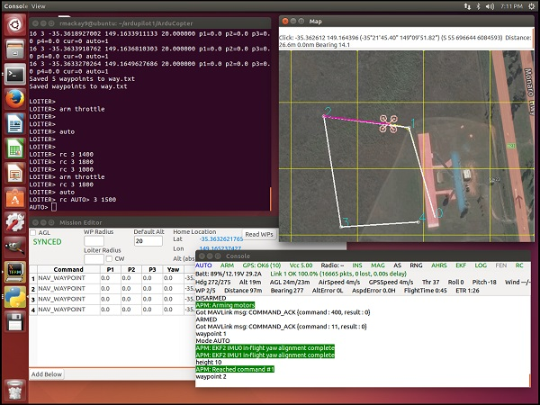

.. _sitl-simulator-software-in-the-loop:

=====================================
SITL Simulator (Software in the Loop)
=====================================

The SITL (software in the loop) simulator allows you to run Plane,
Copter or Rover without any hardware. It is a build of the autopilot
code using an ordinary C++ compiler, giving you a native executable that
allows you to test the behaviour of the code without hardware.

This article provides an overview of SITL's benefits and architecture.

Overview
========

SITL allows you to run ArduPilot on your PC directly, without any
special hardware. It takes advantage of the fact that ArduPilot is a
portable autopilot that can run on a very wide variety of platforms.
Your PC is just another platform that ArduPilot can be built and run on.

When running in SITL the sensor data comes from a flight dynamics model
in a flight simulator. ArduPilot has a wide range of vehicle simulators
built in, and can interface to several external simulators. This allows
ArduPilot to be tested on a very wide variety of vehicle types. For
example, SITL can simulate:

-  multi-rotor aircraft
-  fixed wing aircraft
-  ground vehicles
-  underwater vehicles
-  camera gimbals
-  antenna trackers
-  a wide variety of optional sensors, such as Lidars and optical flow
   sensors

Adding new simulated vehicle types or sensor types is straightforward.

A big advantage of ArduPilot on SITL is it gives you access to the full
range of development tools available to desktop C++ development, such as
interactive debuggers, static analyzers and dynamic analysis tools. This
makes developing and testing new features in ArduPilot much simpler.

Running SITL
============

The ArduPilot SITL environment has been developed to run natively on both
Linux and Windows. For setup instructions see :ref:`Setting Up SITL <SITL-setup-landingpage>`
for more information. Using SITL is explained in :ref:`Using SITL <using-sitl-for-ardupilot-testing>`. For examples of starting and using SITL for a particular vehicle see :ref:`sitl-examples` . 

SITL Architecture
=================

Note in the image below the port numbers are indicative only and can
vary.  For instance the ports between ArduPilot and the simulator
on the image are 5501/5502 but they can vary to be 5504/5505 or other
port numbers depending on your environment.

.. image:: ../images/ArdupilotSoftwareintheLoopSITL.jpg
    :target: ../_images/ArdupilotSoftwareintheLoopSITL.jpg

.. toctree::
    :maxdepth: 1

    Setting Up SITL <SITL-setup-landingpage>
    Using SITL <using-sitl-for-ardupilot-testing>
    Examples of using SITL by Vehicle <sitl-examples>
    SITL Serial Port Mapping <sitl-serial-mapping>
    SITL Parameter List <sitl-parameters>
