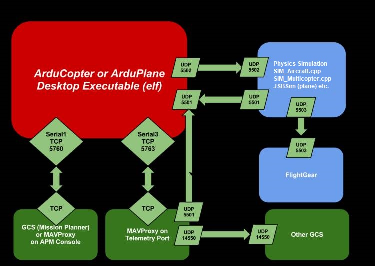

.. _sitl-simulator-software-in-the-loop:

=====================================
SITL Simulator (Software in the Loop)
=====================================

The SITL (software in the loop) simulator allows you to run Plane,
Copter or Rover without any hardware. It is a build of the autopilot
code using an ordinary C++ compiler, giving you a native executable that
allows you to test the behaviour of the code without hardware.

This article provides an overview of SITL's benefits and architecture.

Overview
========

SITL allows you to run ArduPilot on your PC directly, without any
special hardware. It takes advantage of the fact that ArduPilot is a
portable autopilot that can run on a very wide variety of platforms.
Your PC is just another platform that ArduPilot can be built and run on.

When running in SITL the sensor data comes from a flight dynamics model
in a flight simulator. ArduPilot has a wide range of vehicle simulators
built in, and can interface to several external simulators. This allows
ArduPilot to be tested on a very wide variety of vehicle types. For
example, SITL can simulate:

-  multi-rotor aircraft
-  fixed wing aircraft
-  ground vehicles
-  camera gimbals
-  antenna trackers
-  a wide variety of optional sensors, such as Lidars and optical flow
   sensors

Adding new simulated vehicle types or sensor types is straightforward.

A big advantage of ArduPilot on SITL is it gives you access to the full
range of development tools available to desktop C++ development, such as
interactive debuggers, static analyzers and dynamic analysis tools. This
makes developing and testing new features in ArduPilot much simpler.

Running SITL
============

The APM SITL environment has been developed to run natively on on both
Linux and Windows. For instructions see :ref:`Setting up SITL on Linux <setting-up-sitl-on-linux>` and :ref:`Setting up SITL on Windows <sitl-native-on-windows>`
for more information.

SITL Architecture
=================

Note in the image below the port numbers are indicative only and can
vary.  For instance the ports between ArduPilot and the simulator
on the image are 5501/5502 but they can vary to be 5504/5505 or other
port numbers depending on your environment.

.. toctree::
    :maxdepth: 1

    SITL on Linux <setting-up-sitl-on-linux>
    SITL on Windows <sitl-native-on-windows>
    SITL on Windows in a VM <setting-up-sitl-on-windows>
    SITL using Vagrant <setting-up-sitl-using-vagrant>
    Copter SITL/MAVProxy Tutorial <copter-sitl-mavproxy-tutorial>
    Plane SITL/MAVProxy Tutorial <plane-sitlmavproxy-tutorial>
    Rover SITL/MAVProxy Tutorial <rover-sitlmavproxy-tutorial>
    ArduPilot Testing using SITL <using-sitl-for-ardupilot-testing>
    Using Gazebo Simulator with SITL <using-gazebo-simulator-with-sitl>
    Using Last_letter Simulator with SITL <using-last_letter-as-an-external-sitl-simulator>
    Using the CRRCSim simulator <simulation-2sitl-simulator-software-in-the-loopusing-using-the-crrcsim-simulator>
    Using X-Plane 10 with SITL <sitl-with-xplane>
    Soaring SITL with X-Plane <soaring-sitl-with-xplane>
