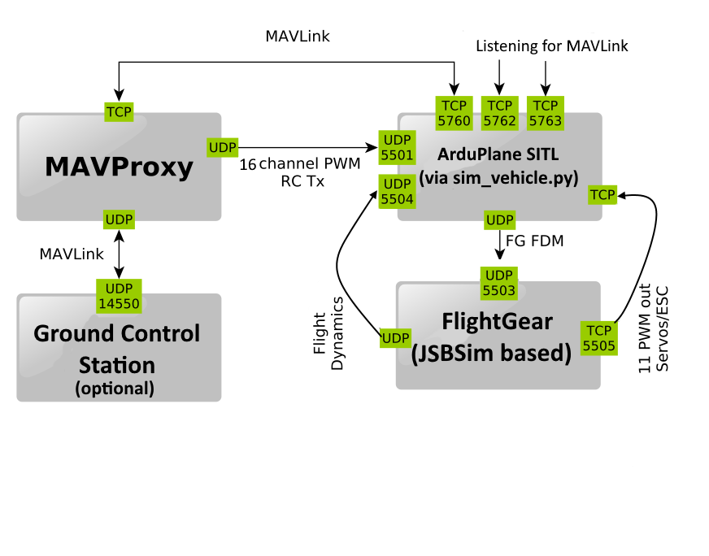

.. _sitl-with-jsbsim:

======================
Using SITL with JSBSim
======================

JSBSim is a sophisticated flight
simulator that is used as the core flight dynamics system for several
well known flight simulation systems.

In the past ArduPilot required a special version of JSBSim. As of
December 2018 that is no longer the case, and we can use the
standard JSBSim releases.

In order to build JSBSIM, you need Cmake, install it with :

::

    sudo apt-get install cmake

.. tip::

   The build commands below are contained within ``Tools/scripts/build-jsbsim.sh``.

In the same directory (your home directory) run these commands:

::

    git clone git://github.com/JSBSim-Team/jsbsim.git
    cd jsbsim
    mkdir build
    cd build
    cmake -DCMAKE_CXX_FLAGS_RELEASE="-O3 -march=native -mtune=native" -DCMAKE_C_FLAGS_RELEASE="-O3 -march=native -mtune=native" -DCMAKE_BUILD_TYPE=Release ..
    make -j2

Add JSBSim executable to your search path. Add the line at the end of your ".bashrc" in your home directory to automatically set the path whenever a new terminal is opened.

::

    export PATH=$PATH:$HOME/jsbsim/build/src

If using the JSBSim plane simulator you can specify a different JSBSim
model than the default Rascal110 by specifying the model name using the
-f parameter to sim_vehicle.py, like this:

::

    sim_vehicle.py -v ArduPlane -f jsbsim:MyModel --console --map

The model should be in the **Tools/autotest/aircraft/** directory.

Data Flow using JSBSim + Flightgear
===================================

