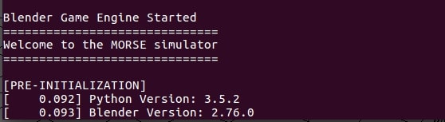

.. _sitl-with-morse:

=====================
Using SITL with Morse
=====================

..  youtube:: Zk8MYmt03-Q
    :width: 100%

`Morse <http://www.openrobots.org/morse/doc/stable/morse.html>`__ is
an open robotics platform that uses python APIs and the blender 3D
environment to create a complete robotics platform.

ArduPilot has a Morse SITL simulation backend that allows ArduPilot to
control vehicles created within Morse.

.. warning::

    Morse is no longer maintained so we recommend developers use :ref:`AirSim <sitl-with-airsim>` or :ref:`Webots <sitl-with-webots>`.

.. note::

    Morse has only been tested on Linux/Ubuntu environments

Installing Morse
================

`Official instructions can be found on openrobots.com <http://www.openrobots.org/morse/doc/stable/user/installation.html>`__. Morse uses the Blender Game Engine API to render the build scripts. If the user is installing Morse on Ubuntu 20.04 or later, install the software from the source(manual installation) as described on the Morse installation page(mentioned above). But for older Ubuntu  installs all you need is

::

   sudo apt install morse-simulator

Checking the blender version
----------------------------
As mentioned above, Morse relies on the Blender Game Engine for rendering the simulations. Given the fact that the newer Blender versions (**v2.80** and above) have discontinued the support for the game engine, users are requested to ensure that the installed `Blender version <https://download.blender.org/release/>`__ ranges between **v2.65**  to **v2.73** (Official version limit stated by Morse).

.. note::

  Blender **v2.74** - **v2.79** are also valid versions, as these versions also provide access to a stable Blender Game Engine. The below image shows ArduPilot's quadcopter Morse simulation running with Blender 2.76. 

Builder Scripts
===============

The Morse simulator has the concept of builder scripts, which are
python scripts setup to run within the Morse/Blender environment.

Some example builder scripts for use with ArduPilot are provided in the `ArduPilot/libraries/SITL/examples/Morse directory <https://github.com/ArduPilot/ardupilot/tree/master/libraries/SITL/examples/Morse>`__.

The examples include:

 - skid rover
 - separate Steering and Throttle rover
 - a simple quadcopter
 - a rover with a scanning laser rangefinder

These scripts setup the standard sensor suite that ArduPilot needs and
exports them using the socket API. It is recommended that you read
through both the rover.py and quadcopter.py examples to better
understand how to interface Morse with ArduPilot.

Running the Examples
====================

The following steps will get you running with the Skid Rover example.

- Ensure the :ref:`ArduPilot source code is installed on your machine <where-to-get-the-code>`
- Open a terminal and start the rover simulator from within your /ardupilot directory:

::

   morse run libraries/SITL/examples/Morse/rover_skid.py

- Open another terminal to /ardupilot directory and start ArduPilot SITL, using the morse-skid simulation backend

::

   Tools/autotest/sim_vehicle.py -v Rover --model morse-skid --add-param-file=libraries/SITL/examples/Morse/rover_skid.parm --console --map

- A window like below should appear:

  .. image:: ../images/morse_rover_sitl.jpg
    :target: ../_images/morse_rover_sitl.jpg

- Use the ArduPilot SITL console to control the vehicle (i.e. "arm throttle" to arm the vehicle, "rc 3 1800" to raise throttle to 80%, etc)

The following steps will get you running with the Separate Steering and Throttle Rover example.

::

   morse run libraries/SITL/examples/Morse/rover.py

- Open another terminal to /ardupilot directory and start ArduPilot SITL, using the morse-rover simulation backend

::

   Tools/autotest/sim_vehicle.py -v Rover --model morse-rover --add-param-file=libraries/SITL/examples/Morse/rover.parm --console --map

- Use the ArduPilot SITL console to control the vehicle (i.e. "arm throttle" to arm the vehicle, "rc 1 " to control steering "rc 3" to control throttle, etc)

To run the Quadcopter example:

- Open a terminal and start the quadcopter simulator from within your /ardupilot directory:

::

   morse run libraries/SITL/examples/Morse/quadcopter.py

- Start ArduPilot SITL, using the morse-quad simulation backend

::

   Tools/autotest/sim_vehicle.py -v ArduCopter --model morse-quad --add-param-file=libraries/SITL/examples/Morse/quadcopter.parm --console --map

- A window like below should appear:

  .. image:: ../images/morse_quad.jpg
    :target: ../_images/morse_quad.jpg
             
Note that in the image above a wire-frame view is shown instead of a
rendered 3D view. That is configured by setting fastmode=True in the
Environment() declaration in quadcopter.py. Using fast mode will lower
CPU usage a lot which is good for slow machines.

Laser Scanner Support
=====================

The Morse SITL backend supports a laser scanner sensor. This allows
you to use the proximity avoidance systems in ArduPilot with vehicles
created in Morse.

There is an example of a Rover setup with a laser scanner in the
rover_scanner.py script. Run it like this:

::

   morse run libraries/SITL/examples/Morse/rover_scanner.py

Then start ArduPilot SITL, using the morse-skid simulation backend

::

   Tools/autotest/sim_vehicle.py -v Rover --model morse-skid --add-param-file=libraries/SITL/examples/Morse/rover_scanner.parm --console --map

That will give you something like this:

  .. image:: ../images/morse_rover_scanner.jpg
    :target: ../_images/morse_rover_scanner.jpg

The red area shows the extent that the laser scanner proximity sensor is seeing.

Swarming Support
================

To start a three rover swarm open two terminals and cd to your /ardupilot directory:

- Run the following command to start Morse with three rovers side-by-side

::

   morse run libraries/SITL/examples/Morse/rover_follow.py

- Start the ArduPilot SITL environment with three rovers:

::

   libraries/SITL/examples/Morse/start_follow.sh

To connect with Mission Planner

- On the Windows machine open a terminal (on the windows machine) and type ``ipconfig`` to determine the machines IP address
- On the Ubuntu machine

  - open your favourite editor and edit ``libraries/SITL/examples/Morse/start_follow.sh``
  - modify line 7 of the script to set your windows machines IP address

::

   GCS_IP=192.168.2.48  <-- replace with your windows machine\'s IP address

- On the Windows machine start Mission Planner, set the connection type drop-down to "UDP" and press "Connect"
- The three vehicles should appear on the map. They can be controlled separately by changing the vehicle selector drop-down just below the "Connect" button

  .. image:: ../images/morse-rover-swarm-with-mp.png
    :target: ../_images/morse-rover-swarm-with-mp.png
