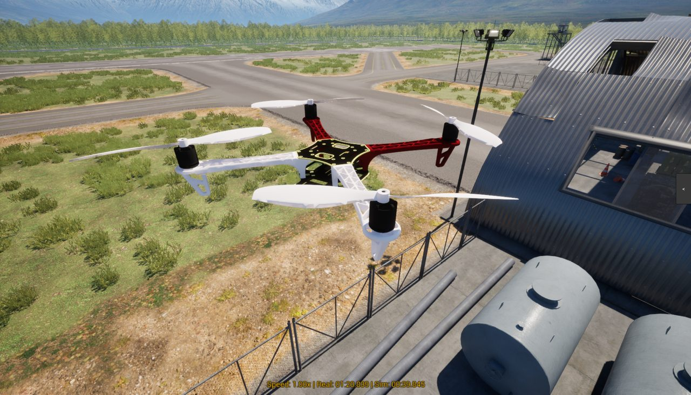

.. _sitl-with-pterosim:

========================
Using SITL with PteroSim
========================

`PteroSim <https://pterolabs.ai>`__ is a UAV simulator built on Unreal Engine 5 that can be used as a physics backend for SITL through the :ref:`JSON interface <sitl-with-JSON>`. PteroSim provides the 6-DOF flight dynamics, the visual scene and the simulated sensors, while ArduPilot runs as the flight controller.

   A quadcopter flown by ArduPilot SITL in PteroSim

PteroSim runs on Windows and Linux. It is closed source, but prebuilt binaries are published on `GitHub <https://github.com/PteroLabsAI/PteroSim-UAV-Simulator/releases>`__ and are free for personal, academic and other non-commercial use. Setup guides and the Python API reference are kept in the `PteroSim documentation <https://pterosimdocs.readthedocs.io/en/latest/>`__.

Supported Vehicles
==================

The steps on this page use a quadcopter, which is included in the free tier. Helicopter, coaxial helicopter, fixed wing, quadplane VTOL and tailsitter airframes are part of the paid tiers, and all of them can be flown with ArduPilot. See `pterolabs.ai <https://pterolabs.ai/#pricing>`__ for the licensing details.

Simulated IMU, GPS, barometer, airspeed and camera sensors are provided for all of them, and vehicles can be spawned and controlled from a Python API.

Installation
============

#. Download the archive for your platform from the `releases page <https://github.com/PteroLabsAI/PteroSim-UAV-Simulator/releases>`__ and extract it.
#. Run **PteroSim.exe** on Windows or **PteroSim.sh** on Linux.

Setting Up the Simulator
========================

#. Pause the simulation with the button at the top of the screen.
#. Press **Spawn** in the lower left corner and drag the vehicle you want to fly into the scene.
#. Set **Physics Hz** to 1000 with the slider at the top of the screen. This is the rate recommended for ArduPilot.
#. Select **ArduPilot** in the control source panel on the right hand side of the screen.
#. Resume the simulation.

PteroSim then waits for ArduPilot on UDP port 9002.

Starting SITL
=============

Start SITL on the machine where ArduPilot is built, pointing the JSON backend at the machine running PteroSim:

.. code-block:: bash

    sim_vehicle.py -v ArduCopter -f quad --model JSON:127.0.0.1 --console --map

Use ``127.0.0.1`` when SITL and PteroSim run on the same machine, otherwise use the address of the machine running PteroSim.

Frame parameters can be set on the command line. For example, a quadcopter in X configuration:

.. code-block:: bash

    sim_vehicle.py -v ArduCopter -f quad --model JSON:127.0.0.1 -P FRAME_TYPE=1

Once SITL has started, the vehicle can be armed and flown from MAVProxy, or from any other ground station connected to SITL.

Running SITL in WSL
-------------------

WSL2 has its own virtual network, so ``127.0.0.1`` inside WSL does not reach a simulator running on Windows. Get the address of the Windows host from WSL:

.. code-block:: bash

    ip route show default

which prints a line such as ``default via 172.20.0.1 dev eth0``, and pass that address to SITL:

.. code-block:: bash

    sim_vehicle.py -v ArduCopter -f quad --model JSON:172.20.0.1

The Windows firewall must allow inbound UDP traffic on the simulator port.

Troubleshooting
===============

If ArduPilot keeps waiting for the simulator, check that the simulation has been started in PteroSim, that the control source of the vehicle is set to **ArduPilot**, that the address given to ``--model JSON:`` is the machine running PteroSim, and that inbound UDP traffic on the simulator port is not blocked by a firewall.

Videos
======

Spawning a vehicle, connecting SITL and flying a mission from Mission Planner:

..  youtube:: uGROLUsJneE
    :width: 100%

An overview of the simulator:

..  youtube:: 8CDnchf_Ulk
    :width: 100%

Getting Help
============

Setup guides for each vehicle type are kept in the `PteroSim documentation <https://pterosimdocs.readthedocs.io/en/latest/sitl_simulation_ardupilot.html>`__. Problems with the simulator can be reported on its `issue tracker <https://github.com/PteroLabsAI/PteroSim-UAV-Simulator/issues>`__.
