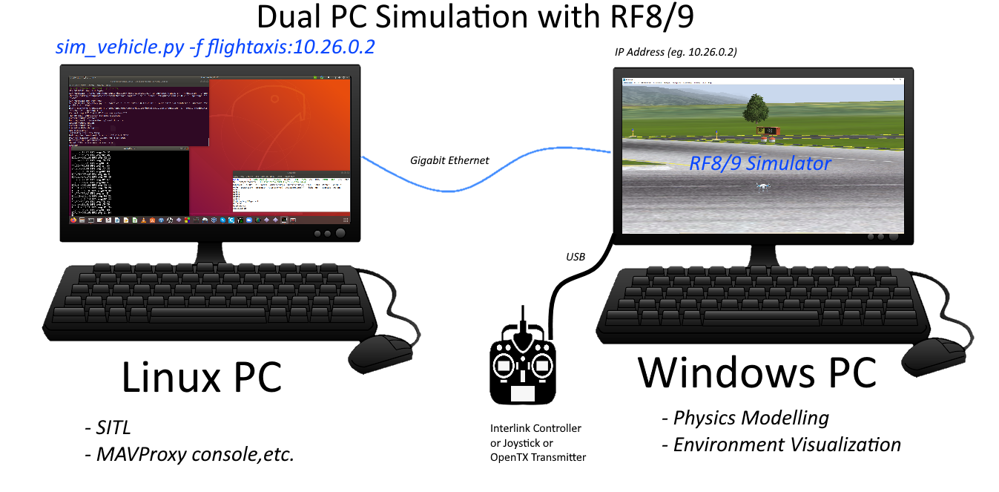

.. _sitl-with-realflight:

==========================
Using SITL with RealFlight
==========================

.. youtube:: 5XqQ52n_U8M
    :width: 100%

`RealFlight <http://www.realflight.com/>`__ is a commercial flight simulator with a 3D view, and the ability to design and test custom vehicles.

This simulator only runs on Windows and requires RealFlight version 8
or version 9. Note that RealFlight-X does not work with ArduPilot. If
you are installing for the first time then RealFlight version 9 is
recommended.

The quickest way to get started it to buy `RealFlight 9.5S <https://store.steampowered.com/app/1070820/RealFlight_95S/>`__ or `RealFlight Evolution <https://store.steampowered.com/app/2069310/RealFlight_Evolution//>`__ in `Steam <https://store.steampowered.com/>`__.

The following instructions assume that you have setup your Flight Control box method, using either the Interlink Controller normally sold with RealFlight, a joystick, or your OpenTX transmitter in joystick mode.

.. note:: Realflight will not start unless a joystick device is present. If you wish to only simulate AUTO missions, or things not requiring a lot of joystick/controller input, you can install a virtual joystick like `vJoy <http://vjoystick.sourceforge.net/site/index.php/download-a-install/download>`_. This will allow you to start Realflight uses this controller and control the vehicle via the Ground Control Station or even by the virtual screen joystick ("vJoy Feeder"program which is  installed at the same time the virtual device driver is installed).

If using an OpenTX transmitter as your joystick, see the last section on this page for setup instructions. After installing RealFlight, familiarize yourself with its operation a bit before proceeding.

Configure RealFlight
====================

  - Start RealFlight.
  - On RealFlight8/9, go to Settings->Physics and enable the "RealFlight Link" option and set "Pause Sim When in Background" and "Pause Sim when in Menu" options to No.
  - In RealFlight Evolution, press ESC, go to Settings->Physics->Quality and enable the "RealFlight Link" option and set "Pause Sim When in Background" and "Pauses Sim when in Menu" options to No.
  - Under "Physics" settings, change the option "Automatic Reset Delay(sec)" to 2.0.
  - Restart RealFlight.

If using RealFlight8/9, depending on your graphics card/processor and cpu power, you probably will need to reduce graphics to improve performance. You need to be running 200Hz or greater refresh rates in order to get best simulator performance. RealFlight Evolution has greatly improved performance and these reductions may not be required:

  - Under Simulation, Settings, Graphics, "Quality" set all values to "No" or "Low" (i.e. set "Clouds" to "No", "Water Quality" to "Low", etc)
  - Under "Hardware" set "Resolution" to "800 x 600 Medium(16 bit) and select "Full Screen" mode

  .. image:: ../images/realflight-settings-graphics.png
    :target: ../_images/realflight-settings-graphics.png

 .. note:: Under RealFlight's Simulation menu, Physics submenu, be sure its set at "Realistic" for best physics modeling and refresh rates.

For Evolution, you may be able to use the defaults since its graphics performance is improved. You can check the performance after connecting to SITL, as discussed below, by opening the "NavGuides" widget in Realflight. The "Graphics Frames/Sec" count needs to be over 200 for the vehicle to fly well. If it is too low, you can change similar settings in the "Settings->Graphics" Hardware and Quality sub-menus for items as described above until sufficient frame rates are obtained.

Loading a Model
===============
Normal RealFlight models must be modified to work with ArduPilot sim. Several models are provided by ArduPilot.Here is an example using the QuadCopterX Realflight model from ArduPilot.

  - Download the QuadcopterX from `ArduPilot/SITL_Models/RealFlight/Released_Models/MultiRotors/QuadCopterX/QuadcopterX-flightaxis_AV.RFX <https://github.com/ArduPilot/SITL_Models/blob/master/RealFlight/Released_Models/Multicopters/QuadCopterX/QuadcopterX-flightaxis_AV.RFX>`__.
  - Download the `parameter file for this model <https://github.com/ArduPilot/SITL_Models/blob/master/RealFlight/Released_Models/Multicopters/QuadCopterX/QuadCopterX.param>`__. Be sure its saved in text format.This will be used later.
  - Select Simulation("My RealFlight" in Evolution), Import, RealFlight Archive (RFX, G3X) and select the file QuadcopterX downloaded above.  A message, "..was successfully imported" should be displayed
  - Select Aircraft (under "Fly" in Evolution), Select Aircraft, (open "Custom Aircraft" section in Realflight) and select "QuadcopterX-flightaxis".  In the current state, the RC inputs come straight from the stick so it is not flyable.

  .. image:: ../images/realflight-select-aircraft.png
    :target: ../_images/realflight-select-aircraft.png

Connecting to Mission Planner's SITL
====================================

.. note:: On many older, yet Windows 10 compatible PCs, there may not be sufficient processing power to smoothly run the Mission Planner SITL simultaneously. ** This is more than just cosmetic. If RealFlight is lagging due to insufficient processing power, this WILL adversly affect the simulation, causing unexpected or strange behaviour and perhaps even crashes. ** See the next section on Dual PC setups, if you have another Windows PC, Linux box or Mac to split the processing loads.

- On Config/Tuning, Planner set the Layout drop-down to "Advanced"
- On the top menu bar, select Simulation
- From the "Model" drop-down, select "flightaxis" and push the Multirotor icon
- You will be asked if you want to simulate with the current developers branch code or with the current Stable code release. Select one.

.. note:: it is possible to simulate with your own custom code branch of ArduPilot. See :ref:`Mission Planner SITL with Custom Code<mp-sitl-custom-code>`.

  .. image:: ../images/realflight-mp-sitl.jpg
    :target: ../_images/realflight-mp-sitl.jpg

On the real-flight controller press the red "reset" button, or PC's space bar, to reset the vehicle's attitude and position and initialize the connection with SITL.

- the message "FlightAxis Controller Device has been activated." should appear and the motors should become quieter

If the vehicle's position is not reset, from within RealFlight:

  - Aircraft, Select Aircraft
  - Custom Aircraft, QuadcopterX-flightaxis
  - press OK
  - after the vehicles position is reset, press the transmitter's "Reset" button or PC spacebar again

At this point, load the parameter file you downloaded for this "QuadCopterX-flightaxis" model via Mission Planner. Use the Full Parameter List or Tree screens, and on the right-side, select ``Load from file`` and select the parameter file. You are now ready to arm and fly.

.. note:: as with a real vehicle, sometimes loading parameters "enables" other groups of parameters which will not be set during the first load. If you get a message when loading parameters that you have enabled others, reload the parameter file to change those newly revealed parameter groups.

.. _mp-sitl-custom-code:

Using Your Code Branch with Mission Planner SITL and RealFlight
---------------------------------------------------------------

Instead of using the Stable or Master code branch for simulation, you can use and test your own branch, if desired. The steps are:

- Start RealFlight with the desired Realflight vehicle that has been modified for use with flightaxis.
- In your GITHUB repository (not local) push your branch to it
- Under ACTIONS in your web GITHUB repo, select Cygwin Build, and the select branch you pushed that you want the sim to use
- Download and unzip its build aritfacts and select the ArduXXX.elf.exe file for the vehicle type and rename it, eliminating the .elf portion to a plain .exe file and place in your Documents/Mission Planner/sitl folder in place of the existing file, if present.
- Start the Mission Planner vehicle sim for the appropriate vehicle with the "do not download" checkbox ticked and flightaxis selected as above.

The simulation will begin using your code branch. Be sure to have the parameters set/updated for the RealFlight vehicle.

.. youtube:: VOnqlC-dbco

.. _sitl-on-wsl:

Connecting to SITL running in WSL on the same machine
=====================================================
Depending on your PC's power and version of RealFlight, it may be possible to run SITL under WSL and connect to RealFlight for the graphics and physics modeling. In this case you open the WSL instance and start SITL:

     - cd ArduCopter (See Note below)
     - for WSL1: type ``sim_vehicle.py -f flightaxis:127.0.0.1 - -map - -console``
     - for WSL2: you will need to determine the gateway for the virtual machine by using the command ``route -n``, then using the gateway ip in the SITL startup command for flightaxis: ``sim_vehicle.py -f flightaxis:<gateway ip addr> - -map - -console``

- back on RealFlight push the red "RESET" button on the transmitter, or spacebar on PC
- after about a minute, the vehicle should be visible on the SITL map
- from within SITL type ``param load <filename>``  to load the parameter found in the same directory as the model. You may have to load them again, after typing ``param fetch``, in order to load parameters that require enabling before presenting their parameter set.  And, in some cases, you may even need to restart SITL in order for some new parameters, such as output function changes, to take effect. 

.. tip:: the above can be avoided if you add the parameter file during the start of SITL with the "--add-param-file=*pathtofile* "....ie: sim_vehicle.py -f flightaxis:x.x.x.x - -map - -console --add-param-file=*pathtofile* -w. This adds the param file as a default and then wipes any previous param changes that may exist in the simulation directory.

- The performance of the connection can be checked, after connecting to SITL, by opening the "NavGuides" widget in Realflight. The "Graphics Frames/Sec" count should be over 200 for the vehicle physics and interactions with the simulation to be accurate.

.. note:: the above was for a Copter. Change the directory to ArduPlane or ArduRover for those types of vehicles before beginning sim_vehicle.py or add the -v <vehicle type> directive when starting it. You cannot use a host name for the the address of the windows machine, you must use an IP address.

Connecting to SITL running on a separate (or Virtual) machine:
==============================================================

This technique spreads the processing requirements between two PCs: one Windows machine running RealFlight and the physics/flight graphics, and another Linux PC or Linux VM running the SITL models. It also allows you to test and use locally generated code, rather than only the master branch, used by Mission Planner SITL.

- best performance is obtained using a direct Gigabit Ethernet connection between machines.
- determine the IP address of the Windows machine running RealFlight by opening a console and entering "ipconfig".The result will likely be something like 192.168.x.x OR 127.0.0.1 if running sitl on a Windows machine using :ref:`cygwin <building-setup-windows-cygwin>`, :ref:`Windows 11 WSL2 <building-setup-windows11>`, or :ref:`Windows 10 WSL <building-setup-windows10_new>`, or similar to 10.26.0.2 if using a direct ethernet connection.

.. note:: be sure that there is no firewall preventing communication between the PCs. You should be able to "ping" one from the other.

- on the separate machine where SITL will run, start SITL sim_vehicle.py with "-f flightaxis:192.168.x.x" or if using a traditional helicopter, "-f heli - -model flightaxis:192.168.x.x".

     - cd ArduCopter (See Note below)
     - sim_vehicle.py -f flightaxis:192.168.x.x - -map - -console.
     - then follow the remaining commands as in the :ref:`SITL under WSL <sitl-on-wsl>` section

Using ready-made models
=======================

As mentioned above, RealFlight allows designing your own custom vehicles including choosing the size, weight, appearance, and motor and control surface placement.

A number of custom models have been created by ArduPilot developers and stored in the `ArduPilot/SITL_Models repository <https://github.com/ArduPilot/SITL_Models>`__.
You should be able to :ref:`clone <git-clone>` this repo using ``git clone https://github.com/ArduPilot/SITL_Models.git`` and then load the models into RealFlight.
In the directory for each model there is a .parm file that can be loaded into SITL so that appropriate tunings parameters are set.

The SITL_Models folder has a RealFlight directory with a WIP sub-directory for models in progress, and a Released_Models directory, which have models that have been tested to work with the InterLink controllers and have README.md files describing thier setup and special features.

To import one of these models:

  - on RealFlight select Simulation >> Import >> RealFlight Archive (RFX, G3X) and select the model you're interested in
  - select Aircraft >> Select Aircraft and select the model imported from the above step

  .. image:: ../images/realflight-import-model.png
    :width: 70%
    :target: ../_images/realflight-import-model.png

  - from within SITL type ``param load <filename>``  to load the parameter found in the same directory as the model, as in the above example. You may have to load them again, after typing ``param fetch``, in order to load parameters that require enabling before presenting their parameter set.  And in some cases you may need to restart SITL in order for some parameters to take effect.

  .. image:: ../images/realflight-import-parms.png
    :width: 70%
    :target: ../_images/realflight-import-parms.png

OpenTX use with RealFlight and SITL
===================================

There are three approaches you can use. Minimal: which only setups up the AETR flight control axes, and Maximal: Which gets at least 7 channels to the SITL module, more closely emulating how you would really use the TX to fly the vehicle, and Interlink DX controller emulation.

Minimal: power up the TX, program a new plane model for use with the sim with the wizard, plug in USB, select joystick (later OpenTX versions allow permanent selection in the main radio setup page). Select Simulation-> Select controller in RealFlight. Select Taranis, and proceed to setup the aileron,elevator,rudder, and throttle and calibrate them. Now to change modes or set switches, you will need to use MAVProxy or Mission Planner commands.

Maximal: In additon to the above, setup the TX model with switches or sliders/pots for channels 5,6,7, and 8. Then add them for functions in the RealFlight controller setup. Do not be concerned about the function names, we just want them to be passed thru to the SITL model. Now you can assign ``RCx_OPTION`` functions to those channels in the model parameters.

InterLink DX/Elite controller emulation: This closely mimics these Interlink  controllers, normally sold with RealFlight. This allows the use of a transmitter with normal RealFlight simulations as well as SITL which closely matches the physical layout of the Interlink controllers. See :ref:`interlink-emulation` for setup details.

To setup a six position mode switch, you would do so just as explained :ref:`here<common-rc-transmitter-flight-mode-configuration>` for an OpenTX transmitter, but first calibrate the RealFlight  controller using a dual position switch on the mode channel. Then change the transmitter back to provide the six PWM levels. This required since RealFlight auto-scales from the calibration values, so if your six PWM levels are centered in the recognition ranges , then the channel's PWM extremes will not be used for calibration and the PWM levels will be altered by RealFlight before passing on to the SITL. 

.. toctree::
    :maxdepth: 1

    Interlink Emulation <interlink-emulation>
    Understanding SITL using RealFlight <flightaxis>

