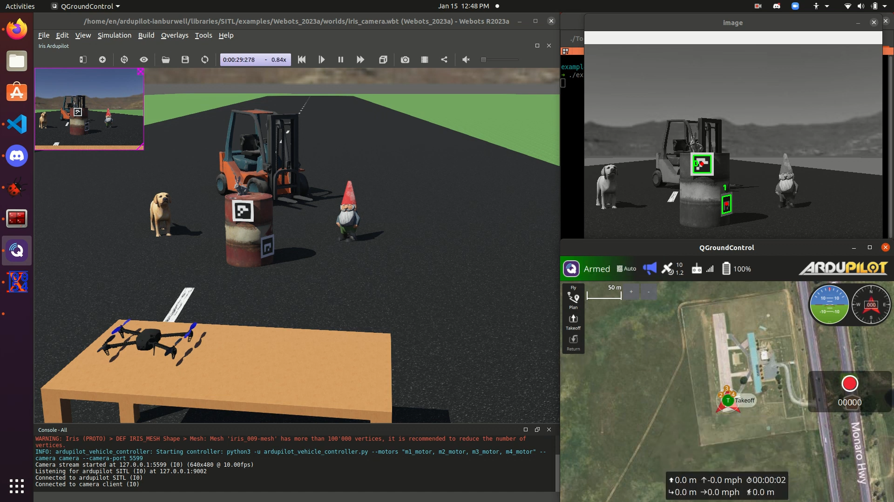
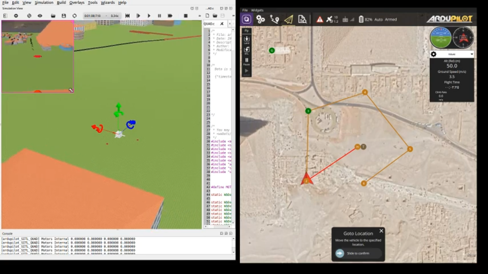

.. _sitl-with-webots:

================
SITL with Webots
================

`Webots <https://cyberbotics.com/>`__ is a multi-platform robotics simulator 
that has been in development since 1998 and is designed for professional use. 
ArduPilot has both Multirotor and Rover examples and supports the creation 
of new vehicles and worlds. As of writing, there is no 
fixed-wing support as it will require a custom 
`physics plugin <https://cyberbotics.com/doc/reference/physics-plugin>`__ to simulate lift.

Currently, there are two ArduPilot Webots robot controller implementations: 
a python-based controller and a C-based controller. 

.. toctree::
    :maxdepth: 1

    Webots Python Usage<sitl-with-webots-python>
    Webots C Usage<sitl-with-webots-cpp>

-------------
Webots Python
-------------
The Webots python controller is the newer implementation of the two options 
and supports the newest Webots versions (2023a and onwards).
It was designed to run without compilation on all operating systems while 
providing an easy way to create custom vehicles and worlds.

-------------
Webots C
-------------
The Webots C controller was the first Webots implementation in ArduPilot 
and supports Webots 2021b. This implementation also includes wind simulation 
through a custom physics plugin.

