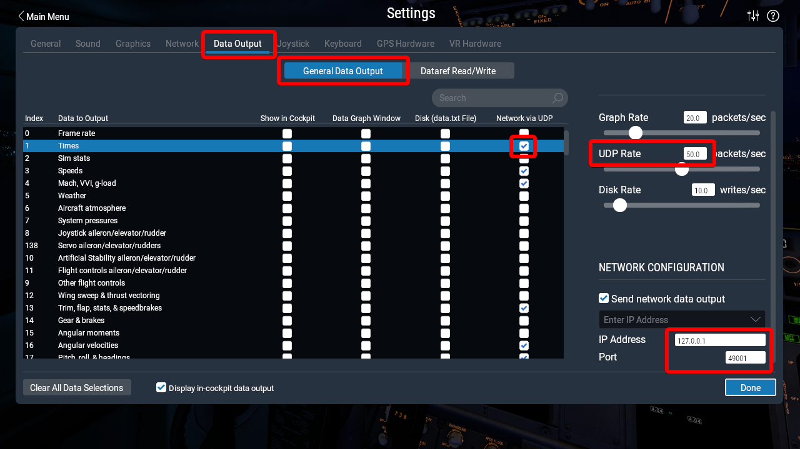
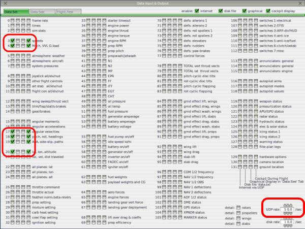

.. _sitl-with-xplane:

=============================
Using SITL with X-Plane 10/11
=============================

.. figure:: ../images/xplane-pt60.jpg
   :target: ../_images/xplane-pt60.jpg

This article describes how to use X-Plane 10 as a simulation backend for
ArduPilot :ref:`SITL <sitl-simulator-software-in-the-loop>`.

.. youtube:: llRii8hmG1M
    :width: 100%

Overview
========

X-Plane 10/11 is a commercial flight simulator with a rich networking
interface that allows it to be interfaced to other software. In this
case we will be interfacing it to the ArduPilot SITL system, allowing
ArduPilot to fly a wide variety of aircraft.

Using X-Plane with SITL is a good way to get some experience flying
ArduPilot and learning how to use the ground control station. It can
also be used to see how ArduPilot handles unusual aircraft and to
develop support for aircraft features that may not be available in
other simulator backends.

Before starting SITL the only thing you need to setup on X-Plane is
the network data to send the sensor data to the IP address of the
computer that will run ArduPilot. This can be the same computer that
is running X-Plane (in which case you should use an IP address of
127.0.0.1) or it can be another computer on your network.

Setup of X-Plane 11
===================

Go to *Settings* -> *Data Output* menu in X-Plane 11 and activate the *General Data Output* tab.
Check the *Network via UDP* column for at least one of the settings that ArduPilot will use (e.g. *Times* in the second row).
The other will be set with commands over network by ArduPilot itself, note that you can use that to verify a two-way connection.

In the right part of the interface, set *UDP Rate* to 50.0 and make sure that the checkbox below labeled *Send network data output* is set.
Set the *IP Address* field to the address of the computer running SITL.
Set *Port* field to 49001.

.. Verified that this is the correct port to set also when using 127.0.0.1; 49002 did not work

Setup of X-Plane 10
===================

Go to the Settings -> Net Connections menu in X-Plane and then to the
Data tab. Set the right IP address, and set the destination port
number as 49001. Make sure that the receive port is 49000 (the
default). If using loopback (ie. 127.0.0.1) then you also need to make
sure the "port that we send from" is not 49001. In the example below
49002 is used.

.. figure:: ../images/xplane-network-data.jpg
   :target: ../_images/xplane-network-data.jpg

You will also need to output data from X-Plane. Click on *Settings*, then *Data Input & Output*. Copy at least 1 setting from the screenshot below. ArduPilot will then send commands to X-Plane that will enable all of the output data fields that it needs to operate.

If you have a joystick then you can configure the joystick for
X-Plane. A joystick controlled by X-Plane will be available as R/C
input when ArduPilot is in control of X-Plane, allowing you to fly the
aircraft with the joystick in ArduPilot flight modes.

For joystick setup go to Settings -> Joystick and Equipment. You
should setup controls for roll, pitch, yaw and throttle. Note that
X-Plane has an unusual throttle setup where the bar is fully to the
left at full throttle and fully to the right at zero throttle.

.. figure:: ../images/xplane-joystick-setup.jpg
   :target: ../_images/xplane-joystick-setup.jpg

Right now you can't use the joystick for other than basic axes
controls, so you can't use it for flight mode changes. We may be able
to add support for that in the future.

Starting SITL
=============

There are three approaches to starting SITL with X-Plane depending on
what you are wanting to do.

  - running SITL from within MissionPlanner on Windows
  - building SITL yourself and connecting from your favourite GCS
  - building and running SITL using sim_vehicle.py and MAVProxy

The first approach is good if you just want to test ArduPilot with
SITL but you don't want to make changes to the code. MissionPlanner
will download a build of ArduPilot SITL for Windows that is either the current stable release version or a nightly build of the latest ArduPilot code that is under development.

The second approach is good if you want to do ArduPilot development
and try out code changes and you want to use a ground station of your
choice. Any ground station that supports MAVLink over TCP can be used.

The third approach is good if you want the full capabilities of
MAVProxy for ArduPilot SITL testing. MAVProxy has a rich graphing and
control capability that is ideal for long term ArduPilot software
development.

Using SITL from MissionPlanner
------------------------------

To start SITL directly from MissionPlanner go to the Simulation tab:

.. figure:: ../images/xplane-missionplanner2.jpg
   :target: ../_images/xplane-missionplanner2.jpg

In the Simulation screen you need to select Model "xplane" and then select
"Plane". At the moment we only support fixed wing and helicopter
aircraft in X-Plane with SITL. In the future we may support other
aircraft types. See below for more information on flying a helicopter.

When you select "Plane" MissionPlanner will present a selection for downloading the current stable release or a nightly build of ArduPilot. 

.. figure:: ../images/xplane-missionplanner3.jpg
   :target: ../_images/xplane-missionplanner3.jpg

You then need to load an appropriate set of parameters for the
aircraft (or setup the aircraft just like you would a real aircraft)
and enjoy flying as usual with MissionPlanner.

When setting up the aircraft it is useful to use the joystick to move
the control surfaces to make sure they are all going the right
way. You can change channel direction in the normal way with ArduPilot
parameters.

Using SITL with your own GCS
----------------------------

The second approach to running X-Plane 10/11 with SITL is to build
ArduPilot SITL manually and then run it from the cygwin command
line. You can then connect with your favourite GCS.

You should checkout the latest ArduPilot git tree in cygwin, and then
change directory to the top "ardupilot" directory. Then run the
following commands::

  $ modules/waf/waf-light configure --board sitl
  $ modules/waf/waf-light plane
  $ build/sitl/bin/arduplane --model xplane

.. figure:: ../images/xplane-waf.jpg
   :target: ../_images/xplane-waf.jpg

That will start SITL and wait for a GCS to connect. You should connect
on TCP port 5760 and configure ArduPilot as usual.

Using SITL with sim_vehicle.py
------------------------------

The sim_vehicle.py script gives you a lot of options for launching all
of the different simulation systems that work with ArduPilot,
including X-Plane.

To use sim_vehicle.py you will need to install MAVProxy. If you are on
Linux then make sure pip is installed and run::

  $ pip install --upgrade pymavlink mavproxy

If you are on Windows then download and install MAVProxy from
https://firmware.ardupilot.org/Tools/MAVProxy/

Then do a git checkout of ArduPilot master and change directory to the
ArduPlane directory. I like to create a sub-directory for each
aircraft I fly in SITL so that settings are remembered
per-aircraft. If you want to do that then create a subdirectory in the
ArduPlane directory and run sim_vehicle.py from there. In the
following example I will be using the PT60 aircraft in X-Plane, so I
create a PT60 directory::

  $ cd ArduPlane
  $ mkdir PT60
  $ cd PT60
  $ sim_vehicle.py -D -f xplane --console --map

Using SITL running inside WSL2
~~~~~~~~~~~~~~~~~~~~~~~~~~~~~~

The :ref:`currently recommended<dev:sitl-native-on-windows>` way of setting up SITL for Windows runs in Windows Subsystem for Linux, as explained in :ref:`building-setup-windows10_new` for Windows 10 systems or :ref:`building-setup-windows11` for Windows 11 systems.

To connect X-Plane and SITL in this environment you need to manually point each of them at the right address in the virtual network created between the two operating systems.

Find the address of Windows reachable from WSL by running ``ipconfig.exe`` in PowerShell or Command Prompt, and looking for the following device::

  Ethernet adapter vEthernet (WSL):
  
      Connection-specific DNS Suffix  . :
      IPv4 Address. . . . . . . . . . . : 172.25.64.1
      Subnet Mask . . . . . . . . . . . : 255.255.240.0
      Default Gateway . . . . . . . . . :

This is the address that you need to pass to the SITL instance running in WSL.
In this example it would look like the following::

  $ sim_vehicle.py -D -f xplane --sim-address 172.25.64.1

On the side of Linux, you can get the address with ``ip addr`` command, look for the address from the same subnet, i.e. with same prefix, as the one you found for Windows.
For example, the relevant block looks like this in Ubuntu 20.04::

  2: eth0: <BROADCAST,MULTICAST,UP,LOWER_UP> mtu 1500 qdisc mq state UP group default qlen 1000
      link/ether 00:15:5d:43:ee:d1 brd ff:ff:ff:ff:ff:ff
      inet 172.25.67.144/20 brd 172.25.79.255 scope global eth0
         valid_lft forever preferred_lft forever

Set this address (172.25.67.144 in this example) in the *IP Address* field shown in section `Setup of X-Plane 11`_ above

Flying a Helicopter
-------------------

It is also possible to fly a helicopter with XPlane-10/11. The setup is
similar to a plane, with two additional requirements:

  - you need to setup your XPlane joystick to map the collective stick
    to flaps
  - you need to map a key or joystick button to turn on and off the
    "generator1" electrical system

These strange requirements are because of limitations in the remote
control of helicopters in X-Plane 10. The flaps input is something
that ArduPilot SITL is able to read remotely while not interfering
with flight of the helicopter. The "generator1 on/off" is used to
simulate the interlock switch (channel 8) in ArduPilot helicopter
support.

Note that for "generator on/off" you do need to map two separate
events, one for on and one for off. If using a two position switch
then map one to the switch on position and the other to the switch off
position.

See this example for typical joystick setup

.. figure:: ../images/xplane-heli-joystick1.jpg
   :target: ../_images/xplane-heli-joystick1.jpg

and this one for mapping the generator on/off switch to a joystick
switch

.. figure:: ../images/xplane-heli-joystick2.jpg
   :target: ../_images/xplane-heli-joystick2.jpg

A full set of parameters for the Bell JetRanger Helicopter in X-Plane
10/11 are available here http://uav.tridgell.net/XPlane/

You also need to start SITL with the model set to "xplane-heli"
instead of "xplane" to activate Helicopter controls.

The startup procedure for a helicopter is:

   #. set interlock on (so RC input channel 8 is low)
   #. set zero collective (so RC input channel 3 is low)
   #. arm the helicopter
   #. set interlock off (so RC input channel 8 is high)
   #. wait for the head to reach full speed
   #. takeoff

.. youtube:: JNNSoMrAFn4
    :width: 100%
