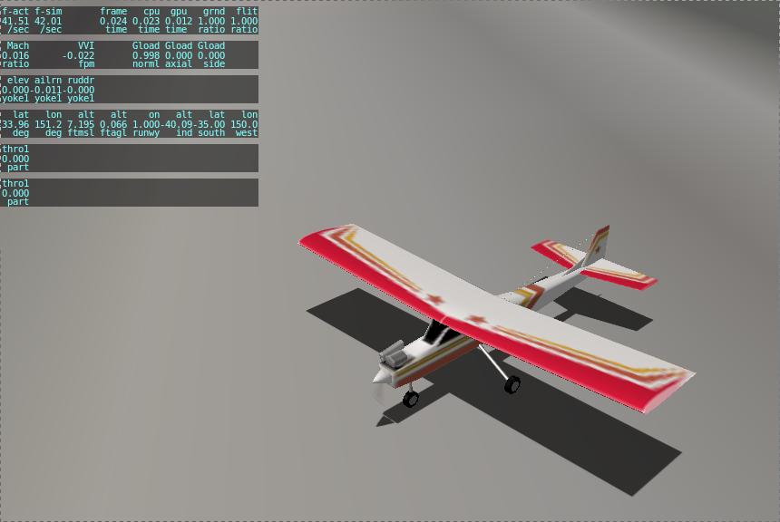
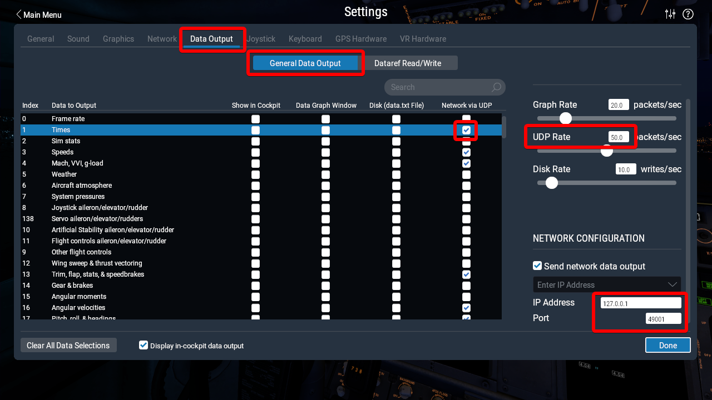
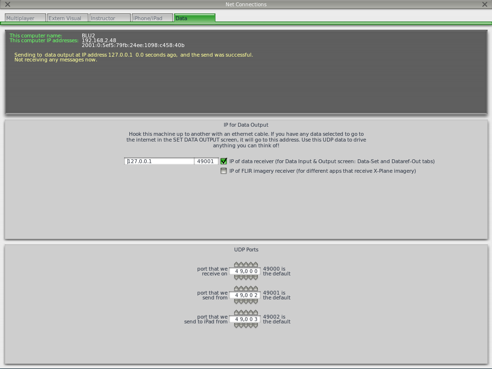
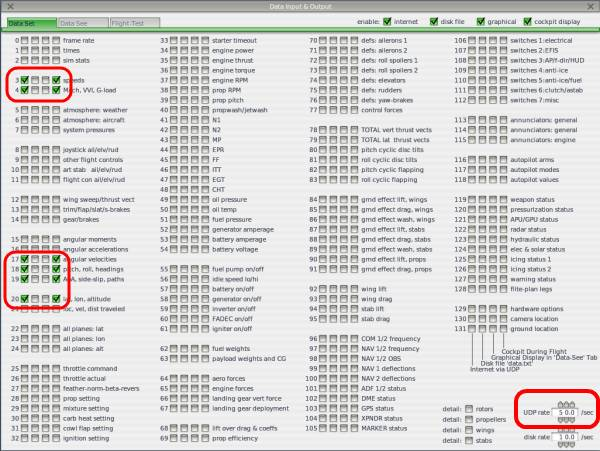
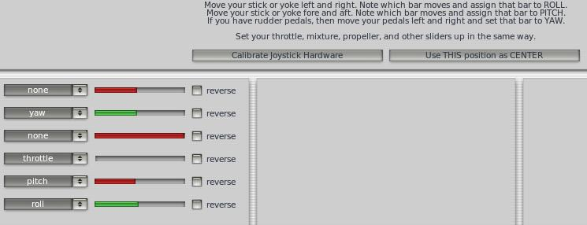
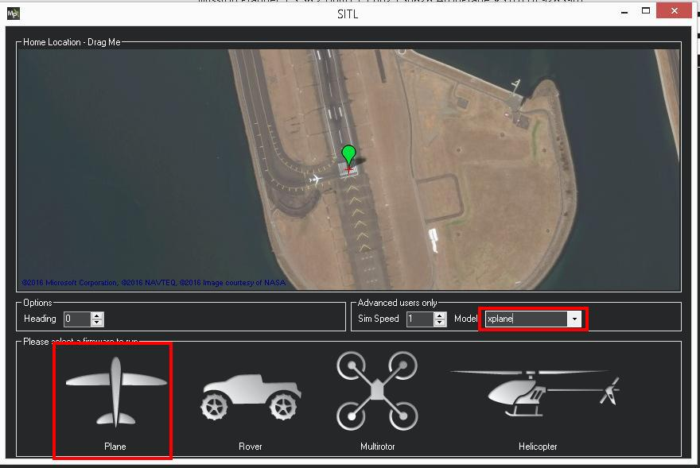
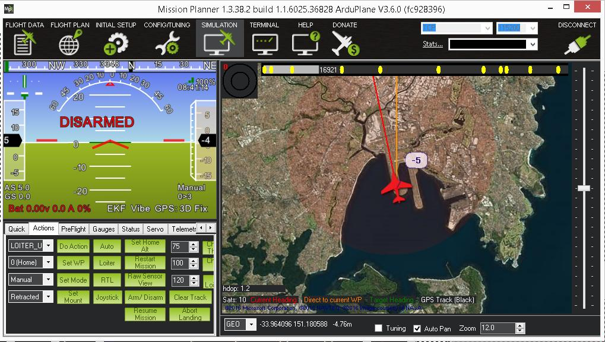

.. _sitl-with-xplane:

========================
Using SITL with X-Plane
========================

This article describes how to use X-Plane 10, 11 or 12 as a simulation backend for
ArduPilot :ref:`SITL <sitl-simulator-software-in-the-loop>`.

.. youtube:: llRii8hmG1M
    :width: 100%

Overview
========

X-Plane is a commercial flight simulator with a rich networking
interface that allows it to be interfaced to other software. In this
case we will be interfacing it to the ArduPilot SITL system, allowing
ArduPilot to fly a wide variety of aircraft.

Using X-Plane with SITL is a good way to get some experience flying
ArduPilot and learning how to use the ground control station. It can
also be used to see how ArduPilot handles unusual aircraft and to
develop support for aircraft features that may not be available in
other simulator backends.

Before starting SITL the only thing you need to setup on X-Plane is
the network data output, sending the sensor data to the IP address of the
computer that will run ArduPilot. This can be the same computer that
is running X-Plane (in which case you should use an IP address of
127.0.0.1) or it can be another computer on your network.

How it works
============

- SITL listens for X-Plane data on UDP port 49001 and sends its commands to X-Plane on UDP port 49000.
- X-Plane only needs to be told to send one data row to SITL. When the first packet arrives, SITL records the IP address it came from and sends all further commands there. It then tells X-Plane which other data rows it needs and turns off any it does not use, so the rest of the *Data Output* screen does not need to be set up by hand.
- SITL asks X-Plane for its version number and adjusts for the change in gyro data format introduced in X-Plane 12 automatically.
- ArduPilot's servo outputs are sent to X-Plane as datarefs (named X-Plane variables), using a JSON map file that is built into SITL: ``xplane_plane.json`` for Plane, and ``xplane_heli.json`` for Helicopter builds. The same file maps X-Plane joystick axes and buttons to ArduPilot RC input channels. The default maps can be viewed in the ArduPilot source at `Tools/autotest/models <https://github.com/ArduPilot/ardupilot/tree/master/Tools/autotest/models>`__.
- To change the mapping (for example for a different aircraft or joystick), copy the JSON file into the directory SITL is started from and edit it. The local file is used instead of the built-in one if it is present when SITL starts, and SITL reloads it automatically when it changes, as long as the vehicle is disarmed.
- X-Plane's sensor data is not good enough to run the EKF, so SITL sets these parameter defaults (parameters you have saved still take priority):

  - :ref:`AHRS_EKF_TYPE <plane:AHRS_EKF_TYPE>` = 10 (simulated EKF)
  - :ref:`GPS1_TYPE <plane:GPS1_TYPE>` = 100 (SITL GPS)
  - :ref:`INS_GYR_CAL <plane:INS_GYR_CAL>` = 0 (no gyro calibration at startup)
  - Plane only: :ref:`SERVO5_FUNCTION <plane:SERVO5_FUNCTION>` = 3 (flaps), with :ref:`SERVO5_MIN <plane:SERVO5_MIN>` = 1000 and :ref:`SERVO5_MAX <plane:SERVO5_MAX>` = 2000

Setup of X-Plane 11 and 12
==========================

Go to *Settings* -> *Data Output* menu in X-Plane and activate the *General Data Output* tab.
Check the *Network via UDP* column for at least one of the settings that ArduPilot will use (e.g. *Times* in the second row).
The others will be set with commands over the network by ArduPilot itself; note that you can use that to verify a two-way connection.

In the right part of the interface, set *UDP Rate* to 50.0 (recommended) and make sure that the checkbox below labeled *Send network data output* is set.
Set the *IP Address* field to the address of the computer running SITL.
Set *Port* field to 49001.

.. Verified that this is the correct port to set also when using 127.0.0.1; 49002 did not work

   X-Plane 11 Data Output screen

Setup of X-Plane 10
===================

Go to the Settings -> Net Connections menu in X-Plane and then to the
Data tab. Set the right IP address, and set the destination port
number as 49001. Make sure that the receive port is 49000 (the
default). If using loopback (ie. 127.0.0.1) then you also need to make
sure the "port that we send from" is not 49001. In the example below
49002 is used.

You will also need to output data from X-Plane. Click on *Settings*, then *Data Input & Output*. Copy at least 1 setting from the screenshot below. ArduPilot will then send commands to X-Plane that will enable all of the output data fields that it needs to operate.

Joystick
========

If you have a joystick connected to X-Plane, it will be available as R/C
input when ArduPilot is in control of X-Plane, allowing you to fly the
aircraft with the joystick in ArduPilot flight modes.

SITL reads X-Plane's raw joystick axes (1 to 6) and buttons, and maps
them to RC input channels using the JSON map file described in
`How it works`_. In the default maps, axes 6, 5, 4, 2 and 3 are RC
channels 1 to 5 (roll, pitch, throttle, yaw and channel 5), and
buttons 1 to 4 are RC channels 6 to 9. If your joystick's axes are
numbered differently, or the axis directions or ranges need changing,
edit the axis numbers and ``input_min``/``input_max`` values in a local
copy of the JSON file. Buttons can be used for flight mode changes or
any other RC channel function; a button entry whose ``mask`` includes
two bits gives a three position switch.

The joystick must be detected and calibrated in X-Plane under Settings -> Joystick and Equipment.
Note that X-Plane has an unusual throttle setup where the bar is fully to the
left at full throttle and fully to the right at zero throttle.

Starting SITL
=============

There are three approaches to starting SITL with X-Plane depending on
what you are wanting to do.

  - running SITL from within MissionPlanner on Windows
  - building SITL yourself and connecting from your favourite GCS
  - building and running SITL using sim_vehicle.py and MAVProxy

The first approach is good if you just want to test ArduPilot with
SITL but you don't want to make changes to the code. MissionPlanner
will download a build of ArduPilot SITL for Windows that is either the current stable release version or a nightly build of the latest ArduPilot code that is under development.

The second approach is good if you want to do ArduPilot development
and try out code changes and you want to use a ground station of your
choice. Any ground station that supports MAVLink over TCP can be used.

The third approach is good if you want the full capabilities of
MAVProxy for ArduPilot SITL testing. MAVProxy has a rich graphing and
control capability that is ideal for long term ArduPilot software
development.

The second and third approaches need an ArduPilot build environment. See :ref:`building-setup-linux`, :ref:`building-setup-mac`, or for Windows, :ref:`building-setup-windows10_new` or :ref:`building-setup-windows11` (which use WSL), and :ref:`setting-up-sitl-on-linux`.

Using SITL from MissionPlanner
------------------------------

To start SITL directly from MissionPlanner go to the Simulation tab:

In the Simulation screen you need to select Model "xplane" and then select
"Plane". Built-in JSON maps are provided for fixed wing and helicopter
aircraft; other aircraft, such as QuadPlanes, need their own JSON map
(see `How it works`_). See below for more information on flying a helicopter.

When you select "Plane" MissionPlanner will present a selection for downloading the current stable release or a nightly build of ArduPilot.

You then need to load an appropriate set of parameters for the
aircraft (see `Loading Parameters`_) and enjoy flying as usual with MissionPlanner.

Using SITL with your own GCS
----------------------------

The second approach is to build ArduPilot SITL yourself and run it
directly. From the top level ``ardupilot`` directory of an ArduPilot
git checkout, run::

  ./waf configure --board sitl
  ./waf plane
  build/sitl/bin/arduplane --model xplane

That will start SITL and wait for a GCS to connect. You should connect
on TCP port 5760 and configure ArduPilot as usual.

Using SITL with sim_vehicle.py
------------------------------

The sim_vehicle.py script gives you a lot of options for launching all
of the different simulation systems that work with ArduPilot,
including X-Plane. It uses MAVProxy as the GCS, which is installed as
part of the ArduPilot build environment setup.

It is useful to create a sub-directory for each
aircraft you fly in SITL so that settings, and any local JSON map file,
are kept per-aircraft. In the following example the PT60 aircraft in
X-Plane is used, so a PT60 directory is created::

  cd ArduPlane
  mkdir PT60
  cd PT60
  sim_vehicle.py -D -f xplane --console --map

If X-Plane is running on a different computer, ``-f xplane`` is all that is needed on the SITL side: X-Plane's *Data Output* IP address must be set to the SITL computer, and SITL replies to whichever address the data comes from.

.. note:: SITL running inside a Docker container may not be able to send commands back to X-Plane, because Docker changes the address the X-Plane data appears to come from. See `ArduPilot PR #32218 <https://github.com/ArduPilot/ardupilot/pull/32218>`__.

Using SITL running inside WSL2
~~~~~~~~~~~~~~~~~~~~~~~~~~~~~~

The :ref:`currently recommended<dev:sitl-native-on-windows>` way of setting up SITL for Windows runs in Windows Subsystem for Linux, as explained in :ref:`building-setup-windows10_new` for Windows 10 systems or :ref:`building-setup-windows11` for Windows 11 systems.

With X-Plane running on Windows and SITL running inside WSL2, X-Plane must be pointed at the WSL2 address of the Linux system. SITL does not need to be told the Windows address, because it replies to whichever address X-Plane's data comes from.

On the Linux side, get the address with the ``ip addr`` command and look for the ``eth0`` device.
For example, the relevant block looks like this in Ubuntu::

  2: eth0: <BROADCAST,MULTICAST,UP,LOWER_UP> mtu 1500 qdisc mq state UP group default qlen 1000
      link/ether 00:15:5d:43:ee:d1 brd ff:ff:ff:ff:ff:ff
      inet 172.25.67.144/20 brd 172.25.79.255 scope global eth0
         valid_lft forever preferred_lft forever

Set this address (172.25.67.144 in this example) in the *IP Address* field shown in `Setup of X-Plane 11 and 12`_ above, then start SITL as usual::

  sim_vehicle.py -D -f xplane --console --map

.. note:: The WSL2 address normally changes each time Windows restarts, so check it and update X-Plane's *IP Address* field if SITL stops receiving data. If WSL2 is configured to use mirrored networking mode, X-Plane and SITL share the network and 127.0.0.1 can be used instead.

Loading Parameters
==================

Parameter files (``.parm``) can be loaded with any GCS:

- MAVProxy: ``param load <filename>.parm``
- QGroundControl: *Vehicle Configuration* -> *Parameters* -> *Tools* -> *Load from file...*
- Mission Planner: *Config* -> *Full Parameter List* -> *Load from file*

Some parameters (for example servo functions) only take effect after a reboot, so reboot SITL after loading a complete parameter file.

Whichever parameters are used, the servo outputs must match the JSON map for the aircraft. For Plane, the default map expects outputs 1 to 5 to be aileron, elevator, throttle, rudder and flaps. When setting up the aircraft it is useful to use the joystick to move the control surfaces to make sure they are all going the right way. You can change channel direction in the normal way with ArduPilot parameters.

A parameter file for flying the Alia QuadPlane in X-Plane 12 is included in the ArduPilot source at `Tools/Frame_params/QuadPlanes/XPlane-Alia.parm <https://github.com/ArduPilot/ardupilot/blob/master/Tools/Frame_params/QuadPlanes/XPlane-Alia.parm>`__. Its VTOL motor outputs are not driven by the default ``xplane_plane.json`` map, so a local JSON map that sends them to the aircraft's engines is also needed.

Flying a Helicopter
===================

It is also possible to fly a helicopter with X-Plane. Use a Copter
helicopter build, for example::

  sim_vehicle.py -v ArduCopter -f xplane-heli --console --map

or ``build/sitl/bin/arducopter-heli --model xplane`` after ``./waf heli``.
Helicopter builds use the ``xplane_heli.json`` map, in which:

- outputs 1, 2 and 4 drive roll, pitch and yaw
- output 3 drives the collective
- output 8 drives the engine throttle, so set :ref:`SERVO8_FUNCTION <copter:SERVO8_FUNCTION>` to 31 (HeliRSC)
- joystick button 3 is a three position switch on RC channel 8, used as the motor interlock (:ref:`RC8_OPTION <copter:RC8_OPTION>` = 32)

The startup procedure for a helicopter is:

   #. set the motor interlock to disabled (RC input channel 8 low)
   #. set zero collective (RC input channel 3 low)
   #. arm the helicopter
   #. set the motor interlock to enabled (RC input channel 8 high)
   #. wait for the head to reach full speed
   #. takeoff

.. youtube:: JNNSoMrAFn4
    :width: 100%
