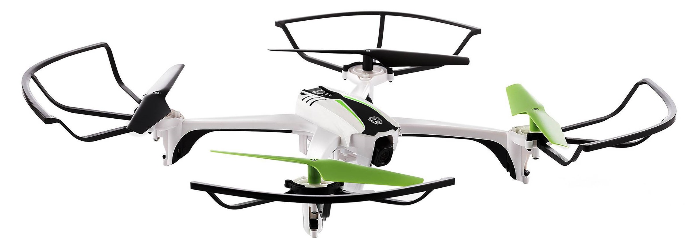

.. _skyviper:

==========================================
SkyRocket SkyViper (Developer Information)
==========================================

This page provides information for developers working with the SkyRocket SkyViper Ready-to-fly copter.

.. warning::

   Please do not attempt to claim under warranty if you make your device unbootable by flashing your own firmware.

.. note::

   These instructions relate to the current SkyViper2450GPS unit.  Previous iterations of this product - with the same name - did not incorporate ArduPilot.  In-store, the ArduPilot SkyViper2450GPS unit can be identified by the ArduPilot logo prominently displayed on the back of the box.

.. note::

   These instructions relate specifically to developing and updating the the Open Source code present on the drone.  For general help and information on the SkyViper, please visit SkyRocket's website: http://sky-viper.com/

.. warning::

   Update the firmware to the latest version before attempting to use your own code; there have been updates to the recovery firmware which make the system more resilient to faulting when upgrading.

Developing the ArduPilot firmware for SkyViper
==============================================

If you already have an ArduPilot repository:

::

   cd ardupilot
   git remote add skyrocket https://github.com/SkyRocketToys/ardupilot
   git fetch skyrocket

Otherwise:

::

   git clone https://github.com/SkyRocketToys/ardupilot

Once you have the repository:

::

   cd ardupilot
   git checkout skyviper-stable # or skyviper-latest
   git submodule update --init --recursive
   ./waf configure --board=px4-v3
   ./waf build --target=bin/arducopter
   ./Tools/scripts/make_abin.sh
   ls -l $PWD/arducopter.abin

That ``arducopter.abin`` can be uploaded using the web interface.

You can also push the firmware directly to the Sonix board, which will then flash the STM32 Flight Controller:

::

   cat arducopter.abin | nc 192.168.99.1 2020

On Windows you can install netcat (https://eternallybored.org/misc/netcat/) and then upload like this:

::

   nc -w30 192.168.99.1 2020 < arducopter.abin

.. note::

   The -w30 may be longer than you need, depending on your network and windows box. You can experiment with shorter timeouts for faster upload.

Flight Controller Recovery using the SD card
--------------------------------------------

If the Flight Controller becomes un-flashable at runtime, recovery is possible using the SD card at boot time.

Place a copy of ``arducopter.abin`` in the root directory of the SD card - but change its name to ``flight_fw.abin``

Rebooting will cause the Sonix board to flash the Flight Controller before the STM32 leaves the bootloader.

Sonix board Recovery using the SD card
--------------------------------------

In the rare event you may need to recover Sonix board using the SD card at the boot time.

Place a copy of FIRMWARE_660R_F.bin in the root directory of the SD card.

Rebooting with Sonix board bootloader pin pulled down will cause the Sonix board load firmware from SD card.
Sonix board bootloader pad is marked as TP4 next to Sonix chip. Need to remove metal shield to reach.

 - Temporarily solder thin wire to SD card slot metal part (GND).
 - Copy FIRMWARE_660R_F.bin to the root of SD card.
 - Connect battery while the other end of wire touching the pad.

If this boot process goes well, firmware file should be erased.

Developing the Sonix Firmware
=============================

::

   git clone https://github.com/SkyRocketToys/Sonix
   cd Sonix/buildscript
   git submodule update --init --recursive
   make oldconfig
   make clean && make mavlink && make && make install
   ls -l ../image/dashcam/FIRMWARE_660R.bin

``FIRMWARE_660R.bin`` can be uploaded using the web interface

You can also push the firmware directly to the Sonix board:

::

   cat FIRMWARE_660R.bin | nc 192.168.99.1 2018

On Windows you can install netcat (https://eternallybored.org/misc/netcat/) and then upload like this:

::

   nc -w30 192.168.99.1 2018 < FIRMWARE_660R.bin

.. note::

   The -w30 may be longer than you need, depending on your network and windows box. You can experiment with shorter timeouts for faster upload.

Developing the Transmitter Firmware
===================================

.. warning::

   The transmitter is relatively easy to make unbootable!  Recovery requires an ST-Link hardware tool and the ``stm8flash`` tool.  If you do not have access to those, you may wish to reconsider modifying your transmitter firmware!

::

   pip install --user IntelHex
   chmod +x $HOME/.local/bin/hex2bin.py
   chmod +x $HOME/.local/bin/bin2hex.py
   sudo apt-get install -y sdcc
   git clone https://github.com/SkyRocketToys/STM8TX
   cd STM8TX
   make
   ls -l txmain.img

``txmain.img`` can be flashed usng the web interface.  Once the image is transfered, the transmitter will need to be power-cycled for the upgrade to continue.  It will take about 15 seconds to flash the new firmware. The LEDs will flash alternately at 1Hz during upgrade.

MAVLink Access
==============

When on WiFi the drone broadcasts MAVLink traffic on UDP port 14550. Start up your favourite GCS and ask it to connect to port 14550 on UDP.

After connecting on WiFI you may wish to change the WiFi password or SSID on http://192.168.99.1/system.html
Note that to use the SkyViper app, the SSID must start with ``SKYVIPERGPS_``

Development Console
===================

For access to the internals of the video board (and many useful developer features) connect to TCP 192.168.99.1 port 2017. On Linux, install the ``rlwrap`` and ``nc`` tools, then:

::

   rlwrap nc 192.168.99.1 2017

On Windows you can install netcat (https://eternallybored.org/misc/netcat/) and then use the console like this:

::

   nc 192.168.99.1 2017

Transmitter Tricks
==================

Force-bind a transmitter
------------------------

 - Go to the transmitter tab of the status web page, and press the “Bind Transmitter” button. The drone will wait for a TX to startup in bind mode.
 - To start the TX in bind mode, power it on with the left (HOME) button pressed (for DSM2) or the right button pressed (for DSMX). Right now we are recommending DSM2, but that may change.

The TX uses beeps and LEDs to indicate status
---------------------------------------------

 - a 1Hz short beep when searching for a RX. The beeping stops when it connects to the RX.
 - a tune played on mode change
 - an inactivity alarm on no drone telemetry and no stick movement after 170 seconds. Power off at 180s.
 - battery alarm on battery failsafe

Use a different transmitter
---------------------------

You can bind another DSM2 (or possibly DSMX) compatible transmitter if you have one. The OrangeRX DSM2/DSMX JR module from hobbyking works well in a FrSky Taranis.
To use a different transmitter you will probably have to force the DSM protocol version. Settings are:

::

   BRD_RADIO_PROT=0 # for auto
   BRD_RADIO_PROT=1 # for DSM2 compatible transmitters
   BRD_RADIO_PROT=2 # for DSMX compatible transmitters

Mode1/Mode2
-----------

The default TX stick mapping is mode2. To change to mode1, go to the Flight Parameters page in the web interface (http://192.168.99.1/parameters.html) and choose the Radio category. Change ``BRD_RADIO_STKMD`` to your preferred RC mode. Modes 1, 2, 3 and 4 are supported.

Disabling RX Telemetry
----------------------

You can temporarily disable telemetry from the drone by setting the ``BRD_RADIO_TELEM`` parameters to zero. See the parameters page at http://192.168.99.1/parameters.html

When telemetry is disabled the TX will beep constantly as it tries to find the drone, and won’t update the buzzer or LEDs for fight mode changes.

Factory Test Mode for TX/RX
---------------------------

To facilitate rapid testing of transmitters in the factory there is a special factory test mode. This mode avoids the need to bind each transmitter, and gives fast startup on fixed channels.
Factory test mode can be setup for up to 8 test stations in the factory. Each test station should have its own test copter.
To setup a copter for factory test mode you need to set a receiving copter as the test copter for a particular test station. You do this by setting the ``BRD_RADIO_TESTCH`` parameter in the Radio parameters on http://192.168.99.1/parameters.html to a factory testing station number. This can be:

::

   0 : disabled, normal mode
   1: test station 1
   2: test station 2
   3: test station 3
   4: test station 4
   5: test station 5
   6: test station 6
   7: test station 7
   8: test station 8

You must reboot after setting this parameter.

To test a transmitter you need to boot it into test mode for the right test station. To do this you need to power on the transmitter with the left shoulder button pressed, and with the left stick in one of 4 possible positions:

::

   test station 1 = left stick fully up
   test station 2 = left stick fully left
   test station 3 = left stick fully down
   test station 4 = left stick fully right
   test station 5 = right stick fully up
   test station 6 = right stick fully left
   test station 7 = right stick fully down
   test station 8 = right stick fully right

When you startup in factory test mode the transmitter will play a different buzzer tune, and will bind immediately with the receiver. You can then do rapid testing on the Transmitter tab of the status page on the web interface at http://192.168.99.1/status.html
Each test station uses a different set of channels, so are unlikely to interfere with each other.

Log Files
=========

DataFlash logs are stored on the microSD card of the Sonix in the DATAFLASH directory. You can access them via the filesystem interface of the web interface. In order to enable logging while Disarmed, go to the web interface Flight Parameters page, select Logging, in the drop-down, and set LOG_DISARMED to 1:ENABLED. 

Logs are binary files and can be viewed in several log viewers, including MissionPlanner.

Factory Reset
=============

If all else fails put a file called ``FACRESET.TXT`` in the root of the microSD. It should do a factory reset on next boot.

Images of disassembled copter
=============================

https://goo.gl/photos/bVaZGGeVPrYcX2n4A

RTSP Protocol
=============
Video is transmitted with the RTSP protocol. Normally the SkyViper video app is used, but you can also view video with other RTSP viewers. The URL is:
rtsp://192.168.99.1/media/stream2
Viewing video works well with vlc and mplayer

WiFi Tricks
===========

WIFI.TXT
--------

You can put a file called ``WIFI.TXT`` in the root directory of the microSD card. That file contains SSID, password and channel information for the drone.
The format of the ``WIFI.TXT`` file is:

::

   SSID=YourSSID
   PASSWORD=YourPassword
   CHANNEL=YourWiFiChannel

It should have no spaces or tabs.

For example:

::

   SSID=SKYVIPERGPS_TEST1
   PASSWORD=factory1
   CHANNEL=3

Using WiFi Station Mode
-----------------------

Instead of acting as an Access Point you can setup your SkyViper to use an existing WiFi Access Point. To do that put a file called ``WIFI.TXT`` on the microSD card with the following content:

::

   STATION_SSID=yourSSID
   STATION_PASS=yourpassword

For example:

::

   STATION_SSID=MyMobilePhoneAP
   STATION_PASS=swordfish
