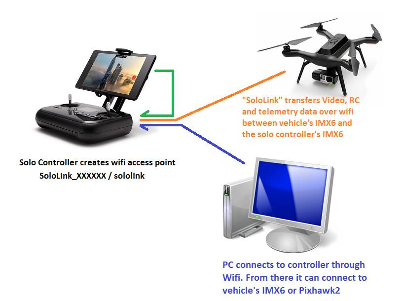

.. _solo:

================================
3DR Solo (Developer Information)
================================

This page provides instructions for developers working with the 3DR Solo
Ready-to-fly copter.  The comprehensive `3DR solo dev guide can be found here <http://dev.3dr.com/>`__.

Uploading custom firmware to the Pixhawk2
=========================================

-  Solo `can be flown with ardupilot/master <https://www.youtube.com/watch?v=WeOl7BficG0>`__ but
   when shipped by 3DR it runs a modified version of APM:Copter3.3.

   -  The firmware `can be found on Github here <https://github.com/3drobotics/ardupilot-solo/releases>`__.
   -  The source code can be found here:
      `ardupilot <https://github.com/3drobotics/ardupilot-solo/>`__,
      `PX4Firmware <https://github.com/3drobotics/PX4Firmware-solo>`__,
      `NuttX <https://github.com/ArduPilot/PX4NuttX>`__.

-  :ref:`Compile instructions are the same as for master ardupilot for a Pixhawk <building-the-code>` with the exception that the
   modified repos should be used.
-  After modifying/building the firmware, turn on the Solo and connect
   your PC's network to the Solo controller's access point using the
   same login/password used by the Solo app (by default these are
   something like: ``SoloLink_XXXXXX/sololink``).
-  Use *scp* to copy the **ArduCopter-v2.px4** file from your PC to
   **root@10.1.1.10:/firmware** (i.e. the firmware directory on the IMX6
   on the Solo vehicle).  Windows users in particular may want to
   install `Putty <http://www.putty.org/>`__ and use a command like
   below:

::

    C:\Progra~2\PuTTY\pscp.exe -pw SSH-PASSWORD -scp ArduCopter-v2.px4 root@10.1.1.10:/firmware/

.. note::

   The SSH-PASSWORD should be replaced with the actual ssh password
   for your vehicle. The default root password is TjSDBkAu.
   

-  Reboot the vehicle and the vehicle's IMX6 should load the firmware
   onto the Pixhawk2 (you should see the regular rainbow colours on the
   arm LEDs as the upload proceeds).
-  After uploading the firmware is moved to the **/firmware/loaded**
   directory.

Changing the controller mode
============================

-  ssh into the iMX6 board in your artoo (ssh root@10.1.1.1)
-  ::

       vi /firmware/cfg/stick-cfg-evt.cfg:

   **Mode 1:**

   ::

       throttle stick-id = 1, dir = 0
       roll stick-id = 2, dir = 0
       pitch stick-id = 3, dir = 1
       yaw stick-id = 0, dir = 0

   **Mode 3:**

   ::

       throttle stick-id = 1, dir = 0
       roll stick-id = 0, dir = 0
       pitch stick-id = 3, dir = 1
       yaw stick-id = 2, dir = 0

   **Mode 4:**

   ::

       throttle stick-id = 3, dir = 0
       roll stick-id = 0, dir = 0
       pitch stick-id = 1, dir = 1
       yaw stick-id = 2, dir = 0

-  Copy **/usr/bin/runStickCal.sh** to a new file (in the same
   directory) called **runStickMapper.sh**
-  Edit **runStickMapper.sh** and replace:

   ::

       stick-cal.py /dev/ttymxc1

   with

   ::

       stick-axis-cfg.py /dev/ttymxc1 /firmware/cfg/stick-cfg-evt.cfg

User supplied teardown video
============================

..  youtube:: qczQUKSmLV0
    :width: 100%
