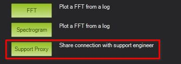
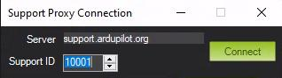

.. _support_proxy:

=====================
Partner Support Proxy
=====================

This page tells you how to take advantage of the ArduPilot MAVLink
support proxy at `support.ardupilot.org <https://support.ardupilot.org>`__. You have likely been directed here
by an ArduPilot support engineer who is wanting you to use the proxy
to allow the support engineer to connect to your vehicle to assist
you.

About the Support Proxy
-----------------------

The ArduPilot partner support proxy allows users vehicles running
ArduPilot to connect to a support engineer. Key features:

 - uses MAVLink2 signing to maintain security
 - does not need a public IP address for either user or support engineer

Connecting to the Support Proxy
-------------------------------

Your support engineer will have given you a number which you should
use when connecting. It will be a 5 or 6 digit number. In the diagrams
below we will use the example number '10001'. Please replace that with
the number you have been told to use.

To get started, select the Support Proxy option under Setup->Advanced
in MissionPlanner:

If you don't see this option then you have an old version of
MissionPlanner and should update to the latest release.

Next enter the 5 or 6 digit ID that your support engineer have you and press connect:

at this point you are streaming your mavlink data to the proxy
server. The support person will be able to connect and help you. You
can click the Stop button to stop forwarding your link.

.. note::

   Please close MissionPlanner completely when you have finished with
   your support session to ensure the port is released.

Connecting with QGroundControl
------------------------------

To forward your connection to the support engineer from QGroundControl
you need to use this configration setting:

You need to put support.ardupilot.org:XXXXX where XXXXX is the support
port number your support engineer has given you.

.. note::

   Please remember to untick the "Enable MAVLink forwarding" option
   when your support session is completed!

Connecting With MavProxy
------------------------

If you use mavproxy instead of MissionPlanner then you should add connect like this:

::

 mavproxy.py --console --map --out support.ardupilot.org:10001

or instead you can do “output add support.ardupilot.org:10001” from an already connected session.

CAN Management
--------------

Note that as CAN packets can be forwared over MAVLink you can
configure DroneCAN devices remotely via the proxy. Use the
MAVLink-CAN1 or MAVLink-CAN2 buttons in Setup->Optional
Hardware->DroneCAN to start looking at the remote CAN bus.

Connecting as a Support Engineer
--------------------------------

.. toctree::
    :maxdepth: 1

    Connection Info for Support Engineers <support_proxy_supportengineer>

