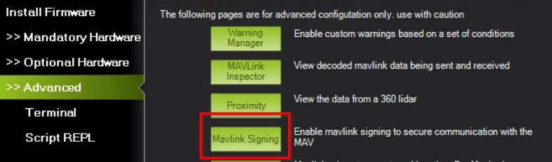
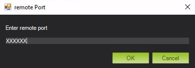

.. _support_proxy:

=========
Partner Support Proxy
=========

This page tells you how to take advantage of the ArduPilot MAVLink
support proxy at `support.ardupilot.org <https://support.ardupilot.org>`__. You have likely been directed here
by an ArduPilot support engineer who is wanting you to use the proxy
to allow the support engineer to connect to your vehicle to assist
you.

About the Support Proxy
-----------------------

The ArduPilot partner support proxy allows users vehicles running
ArduPilot to connect to a support engineer. Key features:

 - uses MAVLink2 signing to maintain security
 - does not need a public IP address for either user or support engineer

Connecting to the Support Proxy
-------------------------------

Your support engineer will have given you a number which you should
use when connecting. It will be a 5 or 6 digit number. In the diagrams
below we will use the example number '10001'. Please replace that with
the number you have been told to use.

To get started, select the Mavlink Mirror option under Setup->Advanced
in MissionPlanner:

Now choose "UDP client", make sure you tick the "Write access" tick
box and choose a baudrate. Any baud rate will do (it does not affect
the speed of the connection):

now click connect and choose support.ardupilot.org as the hostname:

now click OK and choose the port number you have been asked to
use. This is the 5 or 6 digit code the support engineer has given you:

at this point you are streaming your mavlink data to the proxy
server. The support person will be able to connect and help you.

.. note::

   Please close MissionPlanner completely when you have finished with
   your support session to ensure the port is released.

Connecting With MavProxy
------------------------

If you use mavproxy instead of MissionPlanner then you should add connect like this:

::

 mavproxy.py --console --map --out support.ardupilot.org:10001

or instead you can do “output add support.ardupilot.org:10001” from an already connected session.

Connecting as a Support Engineer
--------------------------------

If you are a support engineer you will have been given 3 pieces of
information:
 - the port number that you will connect on
 - the port number that your users will connect on
 - an initial randomly generated MAVLink2 signing pass phrase

To setup your support proxy port for MissionPlanner you need to use
the Advanced->Mavlink Signing tool:

In that tool you need to create a signing key using the pass phrase
you have been given:

.. image:: ../images/MissionPlanner_mavlink_signing2.jpg
    :target: ../_images/MissionPlanner_mavlink_signing2.jpg

Use the "Add" button to add the key, and the "Save" button to save it.

Once the signing key is setup you can start to accept connections from
users. You should direct your users to the instructions at the top of
this page.

To connect to your side of the proxy use the UDPCI connection method
in MissionPlanner:

.. image:: ../images/MissionPlanner_connect_UDPCI.jpg
    :target: ../_images/MissionPlanner_connect_UDPCI.jpg

After pressing connect choose "support.ardupilot.org" as the host:

.. image:: ../images/MissionPlanner_connect_host.jpg
    :target: ../_images/MissionPlanner_connect_host.jpg

and your support engineer port number as the port:

To change the pass phrase you use for your connection you can use
create and save a new key in the MAVLink Signing tool then select it
and press the "Use" button:

.. image:: ../images/MissionPlanner_signing_use.jpg
    :target: ../_images/MissionPlanner_signing_use.jpg

pressing "Use" will update the signing key for your support ID.

For technical support please contact Andrew Tridgell on your partner
support channel on discord.

Using MAVProxy as a Support Engineer
------------------------------------

An example shell script for connecting as a support engineer using
MAVProxy is `available here <https://github.com/ArduPilot/UDPProxy/blob/main/mav_support.sh>`__.

Source Code
-----------

The source code for the UDPProxy tool along with instructions for
installing it on your own machine are `available here <https://github.com/ArduPilot/UDPProxy>`__.
