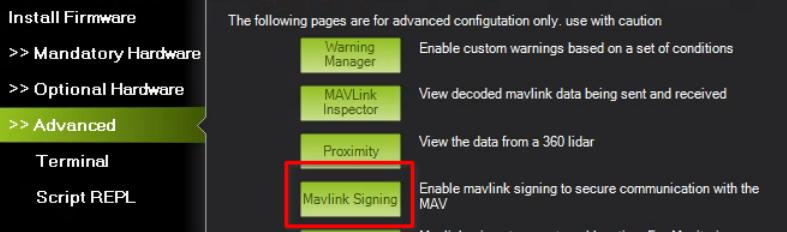
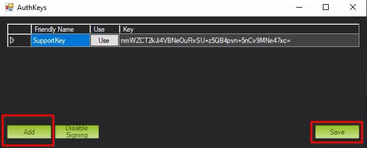
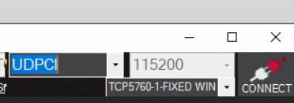
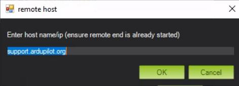
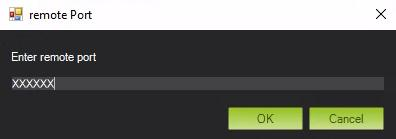
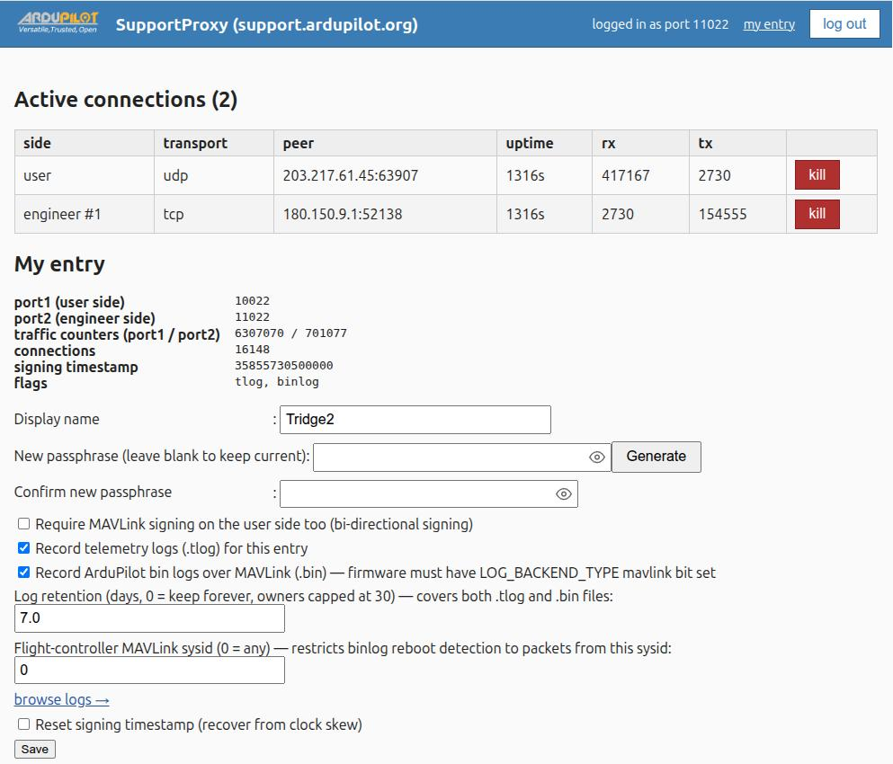
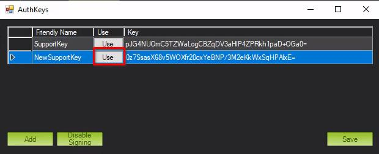
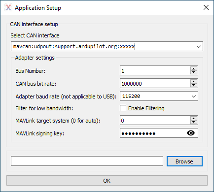

.. _support_proxy_supportengineer:

================================
Connecting as a Support Engineer
================================

.. note:: this page is for the use of ArduPilot support engineers. If you are a Partner or user, see :ref:`support_proxy` for instructions.

If you are a support engineer you will have been given 3 pieces of
information:

 - the port number that you will connect on
 - the port number that your users will connect on
 - an initial randomly generated MAVLink2 signing pass phrase

.. note::

   Your computers system clock must be accurate for the proxy to
   work. If it is off by more than one minute then signing may fail.

To setup your support proxy port for MissionPlanner you need to use
the Advanced->Mavlink Signing tool:

In that tool you need to create a signing key using the pass phrase
you have been given:

Use the "Add" button to add the key, and the "Save" button to save it.

Once the signing key is setup you can start to accept connections from
users. You should direct your users to the instructions at the top of
this page.

To connect to your side of the proxy use a TCP or UDPCI connection method
in MissionPlanner:

After pressing connect choose "support.ardupilot.org" as the host:

and your support engineer port number as the port:

Managing Your Connection with the Dashboard
-------------------------------------------

The proxy has a web dashboard at `support.ardupilot.org/dashboard
<https://support.ardupilot.org/dashboard>`__. Log in there with your
**support engineer port number** and your current pass phrase.

From the dashboard you can:

 - change the MAVLink2 signing pass phrase for your connection (use
   the "Generate" button to get a fresh random one, or type your own,
   then "Save"). This is the easiest way to rotate the pass phrase —
   it takes effect on the proxy immediately. The Mission Planner
   method below still works if you prefer it.
 - see which user and support-engineer connections are live right now
   (peer addresses, byte counts, link health), and drop a stuck
   connection if needed
 - optionally record the session: tick "record telemetry logs" to
   capture a MAVProxy-format ``.tlog`` of the session, and/or "record
   ArduPilot bin logs" to capture the vehicle's dataflash log over
   MAVLink as a ``.bin`` (the firmware must have the MAVLink logging
   backend enabled). Recorded logs are listed on the dashboard and
   can be downloaded there; a per-connection retention period
   controls how long they are kept.

ArduPilot partners with admin access can additionally manage every
connection from the dashboard and create new partner connections
(including a block of consecutive IDs in one step).

To change the pass phrase from Mission Planner instead, create and
save a new key in the MAVLink Signing tool then select it and press
the "Use" button:

pressing "Use" will update the signing key for your support ID.

If your stored signing timestamp gets ahead of your computer's clock
(for example after a clock change) signing can start failing with a
replay rejection. On the dashboard's edit page, tick "reset signing
timestamp" and Save to recover; if you don't have dashboard access,
ask for the timestamp to be reset.

For technical support please contact Andrew Tridgell on your partner
support channel on discord.

Useful Tips
-----------

When helping a user with remote tuning, having them run this `LUA Applet <https://github.com/ArduPilot/ardupilot/blob/master/libraries/AP_Scripting/applets/revert_param.md>`__ to allow you to instantly revert all tuning in case of an issue, may be useful.

Using MAVProxy as a Support Engineer
------------------------------------

An example shell script for connecting as a support engineer using
MAVProxy is `available here <https://github.com/ArduPilot/SupportProxy/blob/main/mav_support.sh>`__.

DroneCAN GUI Tool
------------------------------------

Enter "mavcan:udpout:support.ardupilot.org:" followed by your support engineer port number for the CAN interface and add your signing key. 

.. note:: The signing key in DroneCAN GUI Tool is the password entered into Mission Planner during key generation. It is not the key that Mission Planner displays.

Source Code
-----------

The source code for the SupportProxy tool (formerly UDPProxy) along
with instructions for installing it on your own machine are
`available here <https://github.com/ArduPilot/SupportProxy>`__.
