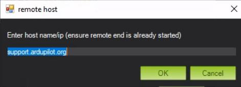
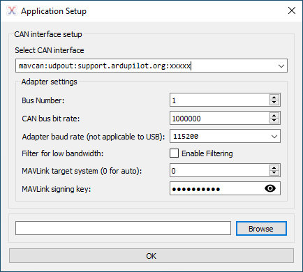

.. _support_proxy_supportengineer:

================================
Connecting as a Support Engineer
================================

.. note:: this page is for the use of ArduPilot support engineers. If you are a Partner or user, see :ref:`support_proxy` for instructions.

If you are a support engineer you will have been given 3 pieces of
information:

 - the port number that you will connect on
 - the port number that your users will connect on
 - an initial randomly generated MAVLink2 signing pass phrase

.. note::

   Your computers system clock must be accurate for the proxy to
   work. If it is off by more than one minute then signing may fail.

To setup your support proxy port for MissionPlanner you need to use
the Advanced->Mavlink Signing tool:

.. image:: ../images/MissionPlanner_mavlink_signing1.jpg
    :target: ../_images/MissionPlanner_mavlink_signing1.jpg

In that tool you need to create a signing key using the pass phrase
you have been given:

Use the "Add" button to add the key, and the "Save" button to save it.

Once the signing key is setup you can start to accept connections from
users. You should direct your users to the instructions at the top of
this page.

To connect to your side of the proxy use the UDPCI connection method
in MissionPlanner:

After pressing connect choose "support.ardupilot.org" as the host:

and your support engineer port number as the port:

.. image:: ../images/MissionPlanner_connect_port.jpg
    :target: ../_images/MissionPlanner_connect_port.jpg

To change the pass phrase you use for your connection you can use
create and save a new key in the MAVLink Signing tool then select it
and press the "Use" button:

pressing "Use" will update the signing key for your support ID.

For technical support please contact Andrew Tridgell on your partner
support channel on discord.

Useful Tips
-----------

When helping a user with remote tuning, having them run this `LUA Applet <https://github.com/ArduPilot/ardupilot/blob/master/libraries/AP_Scripting/applets/revert_param.md>`__ to allow you to instantly revert all tuning in case of an issue, may be useful.

Using MAVProxy as a Support Engineer
------------------------------------

An example shell script for connecting as a support engineer using
MAVProxy is `available here <https://github.com/ArduPilot/UDPProxy/blob/main/mav_support.sh>`__.

DroneCAN GUI Tool
------------------------------------

Enter "mavcan:udpout:support.ardupilot.org:" followed by your support engineer port number for the CAN interface and add your signing key. 

.. note:: The signing key in DroneCAN GUI Tool is the password entered into Mission Planner during key generation. It is not the key that Mission Planner displays.

Source Code
-----------

The source code for the UDPProxy tool along with instructions for
installing it on your own machine are `available here <https://github.com/ArduPilot/UDPProxy>`__.
