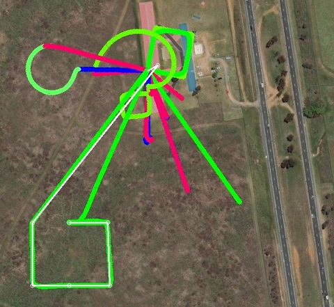

.. _the-ardupilot-autotest-framework:

==================
Autotest Framework
==================

ArduPilot's AutoTest suite allows for the creation of repeatable tests
which help prevent regressions in ArduPilot's behaviour.  It is based
on ArduPilot's :ref:`SITL <using-sitl-for-ardupilot-testing>`
architecture - i.e. a fully-software-based solution.

Using ArduPilot's AutoTest can:

   - make your development process more efficient by reducing time spent repeatedly running the same scenario in ``sim_vehicle.py``
   - allow you to repeatedly replicate bad behaviour in ArduPilot, and possibly ship that test to a developer capable of fixing the issue ("test-driven-development")
   - reduce the chances of a regression in ArduPilot's behaviour by locking in tests for that behaviour

Overview
========

The AutoTest suite is run on ArduPilot's autotest server on most
commits to the master branch, but can be run locally to vet software
changes.  Adding tests is straight-forward and encouraged to show how
patches improve flight behaviour.

Running AutoTest
================

.. warning::

   Don't run autotest.py with no parameters - unless you know what you are doing or like cleaning up large messes.

AutoTest requires a valid SITL environment to run.  Use the SITL instructions (:ref:`SITL <using-sitl-for-ardupilot-testing>`) to obtain a valid environment.  It is suggested the ArduPilot Vagrant virtual machine configuration files be used to obtain a working environement.

Invocation
----------

.. note::

   running autotest with high-levels of ``--speedup`` can result in enough network traffic that MAVProxy can't keep up.  Error such as "Set RC override timeout" or the vehicle entering GCS failsafe are typical of these failures.  Re-running will often allow the tests to pass.  Reducing the ``--speedup`` factor is typically sufficient to avoid this problem.

Help is available:

::

    pbarker@bluebottle:~/rc/ardupilot(master)$ ./Tools/autotest/autotest.py --helpUsage: autotest

    Options:
      -h, --help            show this help message and exit
      --skip=SKIP           list of steps to skip (comma separated)
      --list                list the available steps
      --viewerip=VIEWERIP   IP address to send MAVLink and fg packets to
      --map                 show map
      --experimental        enable experimental tests
      --timeout=TIMEOUT     maximum runtime in seconds
      --frame=FRAME         specify frame type
      --show-test-timings   show how long each test took to run

      Build options:
        --no-configure      do not configure before building
        --waf-configure-args=WAF_CONFIGURE_ARGS
                            extra arguments passed to waf in configure
        -j J                build CPUs
        --no-clean          do not clean before building
        --debug             make built binaries debug binaries

      Simulation options:
        --speedup=SPEEDUP   speedup to run the simulations at
        --valgrind          run ArduPilot binaries under valgrind
        --gdb               run ArduPilot binaries under gdb
        --gdbserver         run ArduPilot binaries under gdbserver
        -B BREAKPOINT, --breakpoint=BREAKPOINT
                            add a breakpoint at given location in debugger
    pbarker@bluebottle:~/rc/ardupilot(master)$ 

``autotest.py`` is invoked with a sequence of "steps" which will be executed in order:

::

    ./Tools/autotest/autotest.py build.Copter test.Copter

This command is valid in the root directory of an ArduPilot checkout.  It instructs AutoTest to build the ArduCopter SITL binary, start that binary, test it and then kill it.  The output (:ref:`sample <autotest-verbose>`) is extremely verbose, but a summary is given once all steps have been run.

.. toctree::
    :maxdepth: 1

     AutoTest Sample Output <autotest-verbose>

.. note:: 
   Older versions of ``autotest.py`` used these steps: ``build.ArduPlane build.ArduCopter build.APMrover2 build.ArduSub build.AntennaTracker fly.ArduCopter   
   fly.ArduCopter fly.ArduPlane fly.QuadPlane dive.ArduSub drive.APMrover2 drive.BalanceBot drive.balancebot fly.CopterAVC``
   
.. note::
   ``--list`` : list available steps (build, test, defaults, examples)

.. note::

   The ``--no-clean`` option can greatly reduce your development-cycle-time

.. note::

   When developing tests, consider omitting the "build" step - unless you are changing ArduPilot code.

Complex Invocation
..................

::

   ./Tools/autotest/autotest.py --no-clean build.Copter test.Copter build.Rover test.Rover test.Balancebot build.Plane test.Plane test.Quadplane build.Sub test.Sub build.Helicopter test.Helicopter build.Tracker test.Tracker

At time of writing, these invoke all the vehicle tests.  Expect these to take about 40 minutes to run.

Running a specific sub-test
...........................

To run a specific sub-test just add the test name with a '.' between the test and sub-test names. 

::

  ./Tools/autotest/autotest.py build.Plane test.Plane.ThrottleFailsafe

Using with GDB
..............

AutoTest can run the ArduPilot binary under gdb:

::

   ./Tools/autotest/autotest.py --no-clean --gdb --debug build.Copter test.Copter

In an X Windowing System environment, an xterm window will contain the GDB terminal; stderr from the ArduPilot binary will also appear in this window.  Where X is not available but `GNU screen <https://www.gnu.org/software/screen/>`__ is, a detached screen will be created with the same content.

You can insert a Python method call into your test to cause the autopilot to enter the attached debugger:

::

   self.send_debug_trap()

Using with Valgrind
...................

AutoTest can run the ArduPilot binary under the Valgrind memcheck tool.  This is useful for finding reading of uninitialised memory and the like.

.. warning::

   ArduPilot initialises most of its dynamically-allocated memory to zero by overriding the ``new`` function.  Some versions of Valgrind do not understand this.  The supplied xenial32 Vagrant virtual machine contains a version of Valgrind which does not suffer from this issue.

::

   ./Tools/autotest/autotest.py --no-clean --valgrind --debug build.Rover test.Rover

Special log files (e.g. ``arducopter-+-valgrind.log``) are created by autotest when run with this tool.  They should always be empty at the end of an autotest run.

Extracting Results
------------------

After AutoTest has run, several log files are available.

The log on ``autotest.py``'s stdout is obvious!

DataFlash files are available in the "logs" directory:

::

   pbarker@bluebottle:~/rc/ardupilot(master)$ ls -lt logs
   total 21356
   -rw-r--r-- 1 pbarker pbarker  8474624 Jul 27 12:07 00000003.BIN
   -rw-r--r-- 1 pbarker pbarker        3 Jul 27 12:06 LASTLOG.TXT
   -rw-r--r-- 1 pbarker pbarker 13307904 Jul 27 12:06 00000002.BIN
   -rw-r--r-- 1 pbarker pbarker    73728 Jul 27 12:05 00000001.BIN
   pbarker@bluebottle:~/rc/ardupilot(master)$

The MAVLink telemetry logs are present in the "buildlogs" directory.  This directory is typically created one-level-higher than the ArduPilot root directory.

::

   pbarker@bluebottle:~/rc/ardupilot(master)$ ls -l ../buildlogs/*tlog
   -rw-r--r-- 2 pbarker pbarker 2541216 Jul 27 12:11 ../buildlogs/Rover-test.tlog
   pbarker@bluebottle:~/rc/ardupilot(master)$

.. note::

   On the Vagrant virtual machine, the ArduPilot root directory is mounted on /vagrant.  The "vagrant" user has no permission to create the "buildlogs" directory in "/", so instead the buildlogs directory appears at /tmp/buildlogs

.. warning::

   Not all MAVLink traffic involved in the testing is present in the buildlogs tlog file.  Only traffic to/from MAVProxy itself (as opposed to additional MAVProxy --outputs) is present.  See AutoTest Structure for more information.

Correlation of Output Files with the autotest server
....................................................

`ArduPilot's autotest server <https://autotest.ardupilot.org/>`__ displays the results of the most recent AutoTest run.  If a test is failing on the autotest server, it should be possible to replicate that failure locally using ``autotest.py``

AutoTest's "Test Results" section reflects ``autotest.py``'s return value for each of the steps.

AutoTest's "Test Logs" section reflects the contents of the buildlogs directory.

AutoTest's "Flight Tracks" section's images can be created using the "convertgpx" step.

AutoTest Structure
==================

File Structure
--------------

Tools/autotest/autotest.py
    the main entry point to the autotest suite
Tools/autotest/arducopter.py
    contains tests for ArduCopter in both multicopter and helicopter form
Tools/autotest/apmrover2.py
    contains tests for ArduRover
Tools/autotest/ardusub.py
    contains tests for ArduSub
Tools/autotest/arduplane.py
    contains tests for ArduPlane
Tools/autotest/quadplane.py
    contains tests for ArduPlane's Quadplane code
Tools/autotest/pysim/util.py
    various utility functions used by AutoTest
Tools/autotest/common.py
    Contains a base class inheritted by the per-vehicle testing routines

Network Structure
-----------------

The AutoTest network plumbing is complicated.

From a test's perspective:

self.mavproxy
   An pexpect object used to interact with the MAVProxy process.  All MAVProxy commands are valid when sent to this object - e.g. ``set shownoise 0``

self.mav
   A mavudp object connected to a --output port provided by MAVProxy.  Traffic to this connection is not logged in the tlog.

self.mav.mav
   The mavudp's MAVLink object.  Can be used to send messages via MAVLink to the SITL binary: ``self.mav.mav.system_time_send(time.time() * 1000000, 0)``

RC Overrides
............

A test's call to ``self.set_rc(ch, value)`` effectively sets the RC
inputs for the simulated vehicle.  It is important to note that these
are not "RC overrides" - it is "real" simulated RC input.  The SITL
binary listens on a network port for packets of 8-bit or 16-bit quantities
representing the RC input.  MAVProxy is invoked in such a way that
data which it would otherwise have sent as MAVLink RC override
packets are delivered to that network socket instead.

Adding a Test
=============

.. note::

   The autotest script is in flux.  This documentation may be out of date.

The git commit e045f61473afa800afc241819cf890591fbecd5a in ArduPilot master's history is a reasonable example of adding an entirely new test to the ArduPilot suite.

Conducting an automated git bisect with an autotest
===================================================

`Tools/autotest/bisect-helper.py` can be used as the script argument to `git bisect run`.  It can run an autotest test - by name - and tell you which commit broke that test.

To accomplish this:

    - make sure you're not already running a bisect - `git bisect reset`
    - create a topic branch for your new test (based on master) which fails now but you know would have passed at some stage in the past
    - write your test - which should fail on your topic branch, and commit it
    - you can test your branch by creating a branch at some stage in the past and cherry-picking your test into that branch.  This may not be trivial depending on what changes have been made in the autotest framework
    - `cp Tools/autotest/bisect-helper.py /tmp`  # always use modern helper
    - `git bisect reset`
    - `git bisect start`
    - `git bisect bad`  - we know the test fails where it was written
    - `git bisect good HEAD~1024`  - this is where we know the test passes
    - `time git bisect run /tmp/bisect-helper.py --autotest --autotest-vehicle=Plane --autotest-test=NeedEKFToArm --autotest-branch=wip/bisection-using-named-test`

In the last command you need to specify the vehicle, new test name and the name of the topic branch which contains your new test.

After this has run you should know which commit broke the functionality being tested.  And you also have a new test for the regression suite which you should PR!
