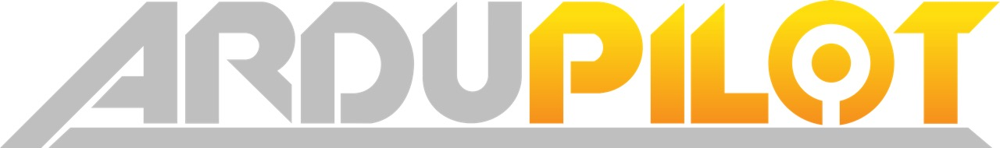

.. _trademark:

=========
Trademark
=========

"ArduPilot" is not a registered trademark and we do not believe that it is possible (nor should it be possible) for anyone to register it as a trademark because it is already in wide spread use.

As mentioned on the `License page <http://ardupilot.org/dev/docs/license-gplv3.html>`__ we greatly appreciate those companies and individuals who have incorporated the ArduPilot software into their products for sale.
A significant number have already done this and we expect many more to follow.

In general, the development team encourages the use of "ArduPilot" on products and services which incorporate the ArduPilot software but we request the following:

- The company has throughly tested the product with ArduPilot and provides after sales support to the buyer
- An official stable release of ArduPilot is used or a release sanctioned by one of the members of the ArduPilot development team
- The `ArduPilot license <http://ardupilot.org/dev/docs/license-gplv3.html>`__ is followed including allowing the owner of the product to upload custom or newer versions of ArduPilot to the flight controller (these custom versions do not actually need to work but it should be possible to upload them)
- The product is not intended to cause harm to people or property
- Please consider `becoming an ArduPilot partner <http://ardupilot.org/about/Partners>`__ to support the ongoing development and support of ArduPilot

If you have any further questions about using ArduPilot on your product, please get in touch with Andrew Tridgell or Randy Mackay through one of the methods listed on our `Contact Us page <http://ardupilot.org/copter/docs/common-contact-us.html>`__.

Below is the logo we use.  An equivalent .ai file can also be provided.

