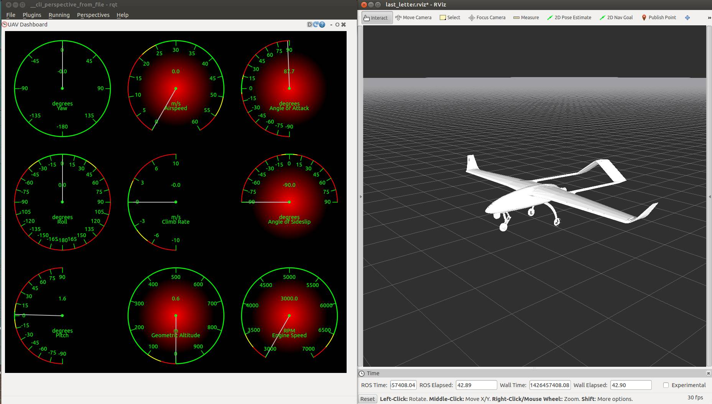

.. _using-last_letter-as-an-external-sitl-simulator:

===============================================
Using last_letter as an External SITL Simulator
===============================================

This article explains how to run
:ref:`SITL <sitl-simulator-software-in-the-loop>` for Plane using
`last_letter <https://github.com/Georacer/last_letter>`__ as the flight
simulation engine (instead of *JSBSim*).

.. note::

   Currently the *last_letter* simulator is in early development
   stage and also only supports fixed-wing aircraft. Expect frequent
   updates and changes in its architecture. Up-to-date documentation on
   *last_letter* is always found at its Github page.

Overview
========

Currently, the default simulation software for Plane SITL is
`JSBSim <http://jsbsim.sourceforge.net/>`__. While this is a renowned
simulation solution for fixed-wing aircraft, it is primarily targeted
towards full-scale vehicles and focuses on relevant features such as
fuel management, variable pitch drives and oleos. After many years of
life it is difficult to modify to cater for UAV-specific applications.
Moreover it is paired with `FlightGear <http://www.flightgear.org/>`__
as the visualizer, which is a quite a demanding piece of software in
terms of system resources.

In contrast, during the development of a robotic platform it is often
more important to have easy access to the system states, be able to
change simulator components easily, add new subsystems, and interface
with other packages.

The `Robotics Operating System <http://www.ros.org/>`__ (ROS) framework
is a potential answer to this need. It is a software framework which
resides on top of the operating system, orchestrating the execution of
multiple programs and the communication between them. It provides the
tools to compile programs written in C++ and Python and monitor their
execution. It is specifically targeted for development of modular
robotics applications by providing standardized message headers,
universally useful system tools, logging capabilities, execution across
multiple machines and most importantly a large codebase of
user-submitted, stand-alone packages, fit for diverse applications.

*last_letter* is a flight simulator written mostly in C++ under the ROS
framework. It incorporates a modular description of the airplane model,
modeling aerodynamics, propeller and motor dynamics, ground reactions,
wind and gust disturbances and much more. Its structure allows for
relatively easy coding of additional functions, and offers the potential
for a unified simulator for all platforms, compatibility with other ROS
packages and a modular, detailed simulation solution.

Preconditions
=============

ROS version
-----------

*Last_letter* is being developed under *ROS Indigo*, and this is the
only supported version.

.. tip::

   *Last_letter* was originally developed under ROS Hydro, and no
   code changes were required during the transition. While ROS Hydro is no
   longer supported, developers that need to use *last_letter* on this
   version may find it still works.

Operating System requirements
-----------------------------

The selected operating system must be `compatible with ROS Indigo <http://wiki.ros.org/indigo/Installation>`__ in order to run
*last_letter*.

We recommend Ubuntu 14.04.2 as this is the platform used for developing
*last_letter* and is also known to be compatible with SITL. Ubuntu
Linux 13.10 and 14.04 are also supported by both *ROS Indigo* and SITL.

Installation
============

First install the Plane SITL on your Linux machine, as described
:ref:`Setting up SITL on Linux <setting-up-sitl-on-linux>`.

Like any other set of ROS packages, *last_letter* and its companion
library packages **last_letter_msgs**, **uav_utils**, **math_utils**
and **rqt_dashboard** require ROS to be present on your system. If you
have previous experience with ROS and have it on your system,
installation of\ *last_letter* is as simple as cloning the package
files in your workspace. If not, the following instructions will guide
you through the process.

ROS installation
----------------

Follow the `instructions on the ROS website <http://wiki.ros.org/indigo/Installation/Ubuntu>`__ to install
*ROS Indigo* in your machine.

Workspace creation
------------------

After installing ROS you need to create a ROS Workspace. This is the
directory where custom software packages (packages which are not part of
the official ROS repository) are created, copied or edited. This is also
where the ROS compiler (also known as *catkin*) looks for your code.

Follow these `instructions to create your workspace <http://wiki.ros.org/ROS/Tutorials/InstallingandConfiguringROSEnvironment#Create_a_ROS_Workspace>`__.
They instruct you to create your workspace under your home folder, but
it can also be created elsewhere. Just be sure you have full rights to
this folder, so a subfolder in your home folder is a good choice. Make
sure ``$ROS_PACKAGE_PATH`` sees your **catkin_ws/src** folder.

.. tip::

   You probably don't want to source your workspace path every time
   you open a new console. To avoid this, add the following line to your
   **/home/<username>/.bashrc** file (assuming that you created your catkin
   workspace directly under your home folder).

   ::

       source ~/catkin_ws/devel/setup.bash

Cloning the last_letter simulator files
----------------------------------------

Execute the following commands in your console to download and compile
the simulator (without the comments):

::

    roscd
    cd ../src #Navigate in your ROS user source files directory
    git clone https://github.com/Georacer/last_letter.git #Clone the simulator files
    roscd
    cd .. #Navigate in your ROS workspace
    catkin_make #Compile the files

Compilation may take a while.

Testing everything is installed properly
----------------------------------------

In a console, run:

::

    roslaunch last_letter launcher.launch

This should start the simulator and open a 3D simulation environment
using an application called *RViz*. The *rqt_gui* application will
start as well; this is where the avionics instruments are displayed.

If everything went smoothly, you can close everything and proceed to
interface *last_letter* with Plane SITL.

Using last_letter as the physics simulator for SITL
====================================================

Follow the :ref:`Plane SITL instructions <setting-up-sitl-on-linux>` to
download and compile the Plane code. Make sure your local git branch is
checked out on ``master``.

When everything is done, enter the Plane directory and start the SITL
simulation:

::

    cd ~/ardupilot/ArduPlane
    sim_vehicle.py -f last_letter --console --map

This will run SITL, Plane, MAVProxy and *last_letter* along with *RViz*
all in one go (the *RViz* visualizer may take several seconds to start).
This procedure will automatically invoke the *last_letter* launch file
and set the ``Plane`` parameter to ``true`` so that the communication
nodes between *last_letter* and Plane are raised. If *last_letter*
communicates with Plane correctly, the MAVProxy console should display
3D satellite fix and track 10 satellites.

When you start sim_vehicle.py an xterm will be created which launches
ArduPilot and last_letter. If you have troubles running the simulator
then finding this (minimised) xterm and looking at the debug output
there can be very helpful.

You can issue commands or RC overrides using MAVProxy as normal.

Missing features
================

At time of writing (17 March, 2015), *last_letter* does not support the
common initialization arguments (such as starting location). Moreover,
the MAVProxy commands which would control the JSBSim simulator (such as
the wind and pause commands) are not supported.

Currently, the only way to select the aircraft and alter its initial
states is by editing the parameter files of the simulator, as described
in `the corresponding manual page <https://github.com/Georacer/last_letter/blob/master/last_letter/doc/manual/parameterFiles.md>`__.

Running last_letter in a virtual machine
=========================================

*Last_letter* has been successfully run within virtual machines using
the configurations described in its `compatibility information <https://github.com/Georacer/last_letter/blob/master/last_letter/doc/manual/compatibility.md>`__.
To test the performance of the simulator in a particular environment,
look at the xterm window assigned for the simulator output: There should
be a framerate message, updating every 5 seconds.

Currently, Plane and SITL are set to run at a nominal 500Hz. A frequency
of over 480Hz indicates that the simulator is running at an acceptable
speed.
