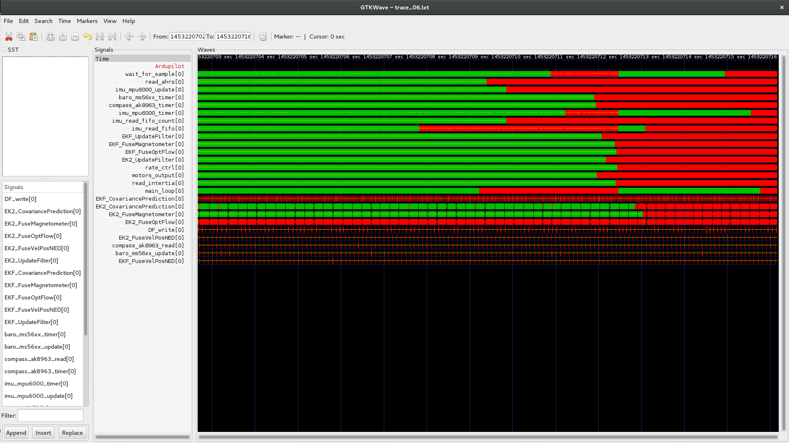
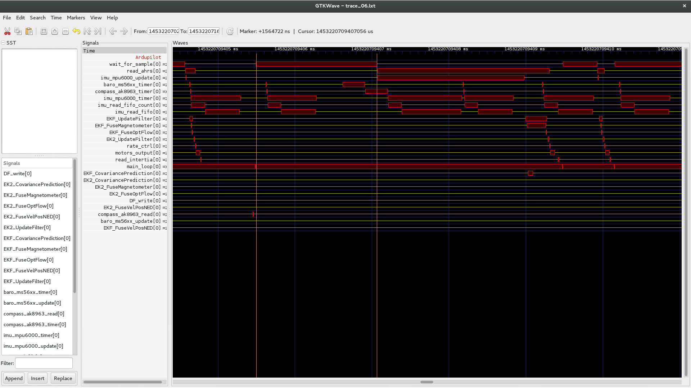
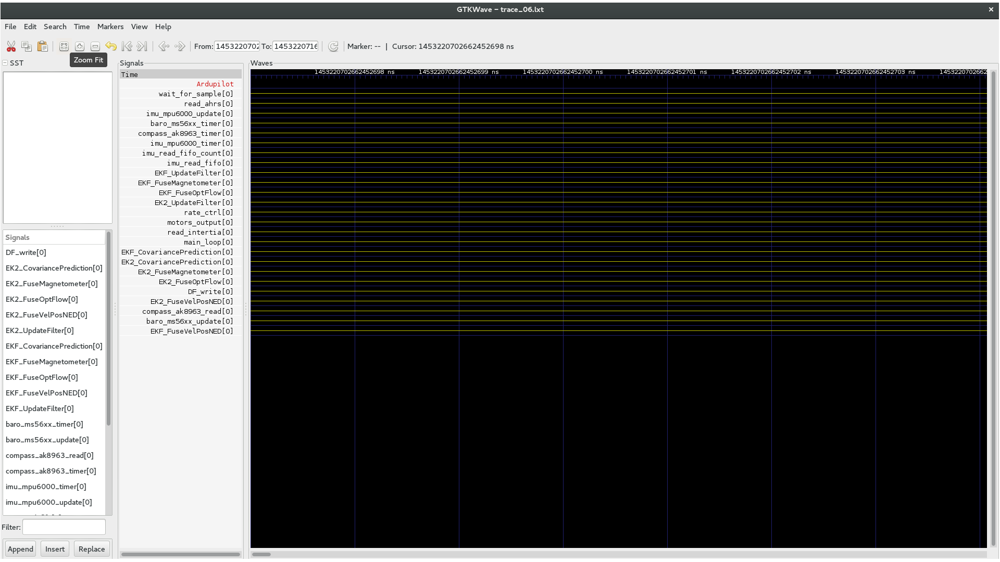

.. _using-linux-trace-toolkit-ng-lttng-to-trace-ardupilot-in-realtime:

========================================================================
Using Linux Trace Toolkit ng (LTTng) to Create Realtime ArduPilot Traces
========================================================================

This article explains how to use `LTTng <https://lttng.org>`__ for
creating runtime traces for ArduPilot running on Linux boards (only).

Overview
========

Tracing is a technique used to record the real-time behaviour of a
software in memory and analyze the execution of the code off-line. It
can be very useful to understand the interaction between threads,
processes, the duration of certain events and the sequencing of some
operations.

*LTTng* is a Linux tool that can be used to trace either a userspace
application, or the Linux kernel itself. It produces trace files that
can be analyzed later, mostly off-board. Lttng's implementation in APM
uses userspace tracing but you can at the same time monitor what's going
on inside the kernel, provided the kernel has tracepoints enabled (in
its config).

*LTTng* has been integrated using the
`Perf_Lttng <https://github.com/ArduPilot/ardupilot/blob/master/libraries/AP_HAL_Linux/Perf_Lttng.cpp>`__
class, which handles 3 operations: ``Begin``, ``End``, ``Count``. You
add tracing to your code by calling the performance utility methods in
`Perf.cpp <https://github.com/ArduPilot/ardupilot/blob/master/libraries/AP_HAL_Linux/Perf.cpp>`__.

Monitoring APM with LTTng
=========================

In order to monitor APM with *LTTng*, the first thing to do is to install LTTng
on your board. The *LTTng* documentation explains how to install it on your Linux
distribution `here <https://lttng.org/docs/#doc-installing-lttng>`__. If
there is no official package for your Linux distribution, you can also
build it from the sources as explained
`here <http://lttng.org/download/#build-from-source>`__

.. note::

   You can't build statically with *LTTng* enabled because it calls
   dlopen. On bebop I had to build the whole system with armhf
   toolchain, which is not the one used by default.

Putting trace events inside the code
------------------------------------

In order to trace ArduPilot, you call the following performance utility
methods:

::

    hal.util->perf_begin(my_perf);

::

    hal.util->perf_end(my_perf);

Before calling these functions, ``my_perf`` needs to be allocated

::

    AP_HAL::Util::perf_counter_t my_perf = hal.util->perf_alloc(AP_HAL::Util::PC_ELAPSED, "my_perf");

An example of adding multiple perf events can be seen in `this patch <https://github.com/jberaud/ardupilot/commit/4bd763d58a6b529630629ad581de198f9d6e6731>`__.

Trace capture
-------------

Enable trace events in ArduPilot
~~~~~~~~~~~~~~~~~~~~~~~~~~~~~~~~

Once you have the modified version of ArduPilot launched on your board
and *LTTng* tools installed, you can check that ArduPilot *LTTng* events
are available on your board's console terminal using the following
command:

.. code:: bash

    lttng list --userspace

This should output a list of events including:

::

    ardupilot:count (loglevel: TRACE_DEBUG_LINE (13)) (type: tracepoint)
    ardupilot:end (loglevel: TRACE_DEBUG_LINE (13)) (type: tracepoint)
    ardupilot:begin (loglevel: TRACE_DEBUG_LINE (13)) (type: tracepoint)

.. tip::

   Refer to the `LTTng documentation <https://lttng.org/docs/#doc-tracing-the-linux-kernel>`__
   for information on how to list kernel events.

Capturing a trace session
~~~~~~~~~~~~~~~~~~~~~~~~~

A trace session can be started, stopped, re-started and destroyed.

Destroying a trace session doesn't delete the traces from permanent
storage but means that you have to restart a new session if you want to
continue capturing.

#. Create session:

   ::

       lttng create -o my_trace_directory

#. Enable ArduPilot events:

   ::

       lttng enable-event --userspace ardupilot:count
       lttng enable-event --userspace ardupilot:end
       lttng enable-event --userspace ardupilot:begin

   To enable kernel events, see `these instructions <https://lttng.org/docs/#doc-tracing-the-linux-kernel>`__.

#. Start capturing:

   ::

       lttng start

#. To stop capturing:

   ::

       lttng stop

#. If you have *babeltrace* installed on board, you can view the result
   in text:

   ::

       lttng view

#. Restart or destroy your session:

   ::

       lttng destroy

Analyzing the trace
===================

In order to analyze your trace, first copy the trace directory you
indicated at session creation to your computer.

Babeltrace
----------

You can analyze the trace using *babeltrace*. This is a command line
tool that is able to translate the trace into text format:

::

    babeltrace my_trace_directory

The result is a series of events with the according timestamps and the
number of the CPU they have been running on.

To go further with that, you can use `babeltrace's python bindings <http://diamon.org/babeltrace/docs/python/>`__ to write a
python program analyzing the trace you have captured.

Trace compass
-------------

`Trace compass <https://projects.eclipse.org/projects/tools.tracecompass>`__ is
an Eclipse plugin that can read *LTTng* traces and display them in a UI
that is adapted to some analyzes.

Lttng2lxt
---------

Trace compass is very powerful but up to now, I haven't been able to
analyze userspace traces in a convenient way.

*Lttng2lxt* is an open source tool written by Ivan Djelic from Parrot.
It is a very simple command line tool that generate waveforms readable
by `gtkwave <http://gtkwave.sourceforge.net/>`__. I have added support
for ArduPilot events to *lttng2lxt*.

In order to use it, get the sources from my github repository:

::

    git clone https://github.com/jberaud/lttng2lxt

You will have to install \ *libbabeltrace-ctf-dev*
and \ *libbabeltrace*. On Debian or Ubuntu do this with the following
command:

::

    sudo apt-get install libbabeltrace-ctf-dev libbabeltrace

Compile it:

::

    sudo make install

Use it to generate a *gtkwave* waveform file:

::

    lttng2lxt my_trace_directory

This will produce a file called **my_trace_directory.lxt**.

Analyzing your trace using gtkwave
----------------------------------

First install *gtkwave*. On Debian or Ubuntu you can do this with the
command:

::

    sudo apt-get install gtkwave

Then open your trace using *gtkwave*:

::

    gtkwave -A my_trace_directory.lxt

Use the **Zoom fit** button |zoom_fit|.

The result should look like this:

You can then zoom in or out and see the exact execution sequence, with
the associated timings

You can therefore measure the duration of an event with the cursors (use
the mouse middle button to set the first cursor)

