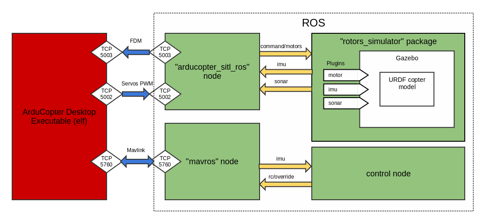

.. _using-rosgazebo-simulator-with-sitl:

====================================
Using ROS/Gazebo Simulator with SITL
====================================

This article explains how to use
`ROS <http://wiki.ros.org/>`__/`Gazebo <http://gazebosim.org/>`__
simulator as the external simulator for Copter.

Overview
========

ROS and Gazebo are a well-known and respected robotics framework and
simulator:

-  The ROS framework contains many "packets" of software for performing
   robotics tasks. It allows you to model the environment (including
   indoor environments with walls, doors etc) and run your own control
   algorithms for autonomous flight.
-  Gazebo supports several different Copter models (at time of writing
   there are 6 URDF models in the
   `rotors_simulator <https://github.com/alexbuyval/rotors_simulator>`__
   package). These can be extended to include support for additional
   sensors and other behaviours.

.. tip::

   The ROS/Gazebo is particularly useful for defining autonomous
   indoor flights.

This article shows how you can replace the default SITL Copter
simulation with one supplied by Gazebo and control the autopilot using
the ROS framework (instead of
:ref:`Mavproxy <copter-sitl-mavproxy-tutorial>` or some other Ground
Control System).

An architectural overview of how ROS/Gazebo integrate with SITL is shown
below:

   Architecture Diagram: Using SITL with ROS and Gazebo

Preconditions
=============

Operating System requirements
-----------------------------

The selected operating system must be `compatible with ROS Indigo <http://wiki.ros.org/indigo/Installation>`__ in order to run all
necessary ROS packets.

We recommend Ubuntu 14.04.2 as this is the platform used for testing
this approach and is also known to be compatible with SITL.

ROS requirements
----------------

At time of writing only *ROS Indigo* is supported.

Installation
============

ArduPilot installation
----------------------

First download the ardupilot on your Linux machine.

::

    git clone https://github.com/alexbuyval/ardupilot
    git checkout RangeFinderSITL2

ROS installation
----------------

Follow the `instructions on the ROS website <http://wiki.ros.org/indigo/Installation/Ubuntu>`__ to install
*ROS Indigo* in your machine.

Workspace creation
------------------

After installing ROS you need to create a ROS Workspace. This is the
directory where custom software packages (packages which are not part of
the official ROS repository) are created, copied or edited. This is also
where the ROS compiler (also known as *catkin*) looks for your code.

Follow these `instructions to create your workspace <http://wiki.ros.org/ROS/Tutorials/InstallingandConfiguringROSEnvironment#Create_a_ROS_Workspace>`__.
They instruct you to create your workspace under your home folder, but
it can also be created elsewhere. Just be sure you have full rights to
this folder (a subfolder in your home folder is a good choice). Make
sure ``$ROS_PACKAGE_PATH`` sees your **catkin_ws/src** folder.

Clone/install needed ROS packages
---------------------------------

Execute the following commands in your console to install pre-built ROS
packages:

::

    sudo apt-get install ros-indigo-octomap-msgs

Execute the following commands in your console to clone all necessary
ROS packages:

::

    roscd
    cd ../src #Navigate in your ROS user source files directory
    git clone https://alexbuyval@bitbucket.org/alexbuyval/arducopter_sitl_ros.git
    git clone https://github.com/PX4/mav_comm.git
    git clone https://github.com/alexbuyval/rotors_simulator.git 
    git clone https://github.com/ethz-asl/glog_catkin.git
    git clone https://github.com/catkin/catkin_simple.git
    cd rotors_simulator
    git checkout sonar_plugin
    cd ../..
    wstool init src 
    wstool set -t src mavros --git https://github.com/alexbuyval/mavros.git
    wstool update -t src 
    rosdep install --from-paths src --ignore-src --rosdistro indigo -y

Compile your catkin workspace. It may take some time.

::

    cd .. #Navigate in your ROS workspace
    catkin_make #Compile the files

Set up PATH to build tools
--------------------------

You need to set up the PATH to the build tools (located in
**/ardupilot/Tools/autotest**) so that the build system can find
**sim_vehicle.sh**.

Navigate the file system to the home directory and open the **.bashrc**
file. Add the following line to the end of **.bashrc**:

::

    export PATH=$PATH:$HOME/ardupilot/Tools/autotest

.. note::

   Use your own path to ardupilot folder in the line above!

Start the Simulator and ROS/Gazebo
==================================

Enter the ArduCopter directory and start the SITL simulation:

::

    cd ~/ardupilot/ArduCopter
    sim_vehicle.sh -f arducopter_sitl_ros --console

If everything works properly you will see a *Gazebo* window similar to
the one the below:

.. figure:: ../../../images/GazeboWithTerminal.jpg
   :target: ../_images/GazeboWithTerminal.jpg

   Gazebo Window with Terminal

To check that all ROS nodes work properly you can run *rqt* utility with
*Nodes Graph* plugin. The node graph must look like the one below:

.. figure:: ../../../images/ROSNodeGraph.png
   :target: ../_images/ROSNodeGraph.png

   ROS Node Graph

You can find ROS topics using the *Topic monitor* plugin in RQT (see
image below):

.. figure:: ../../../images/RosTopics.jpg
   :target: ../_images/RosTopics.jpg

   ROS Topic Monitor

Some topics can be used to control the copter - e.g.
*mavros/rc/override/*. Using this topic you can send a command to copter
which override regular RC control. See
`mavros wiki <http://wiki.ros.org/mavros>`__ for details.

.. note::

   By default I run 'mavteleop' node which publishes control messages
   into *mavros/rc/override_joy/* (not *mavros/rc/override/*). I am using
   it to combine the joystick control with automatic control. So if you are
   going to use only a joystick control, please replace this topic on
   *mavros/rc/override/* in mavteleop script

Example of control node
=======================

You can try a `simple control node <https://bitbucket.org/alexbuyval/um_pixhawk>`__ for hovering above
a visual marker. This node uses
`ar_track_alvar <http://wiki.ros.org/ar_track_alvar>`__ node to detect
and compute position of visual marker. Also this node combines control
messages from joy (**mavros/rc/override_joy/** topic) with PD control.
So you can use a joystick for altitude control or manual control when
the copter doesn't see a visual marker.

Installation
------------

Execute the following command in your console to install the marker
detector package:

::

    sudo apt-get install ros-indigo-ar-track-alvar

Execute the following command in your console to clone the
control package:

::

    roscd
    cd ../src #Navigate in your ROS user source files directory
    git clone https://alexbuyval@bitbucket.org/alexbuyval/um_pixhawk.git

Run the control node
--------------------

Execute the following command in separate console window after you have
run the SITL simulation:

::

    roslaunch um_pixhawk hovermarker.launch

Then you should arm the copter and set ``ALT_HOLD`` mode using your
joystick. On Saitek ST290Pro joystick you should push '4' button to set
``ALT_HOLD`` mode and '2' button to arm the Copter.  Then you can set a
desired altitude, again using the joystick.

.. note::

   This node assumes that you rae using a Saitek ST290Pro joystick.
   If you are using a different joystick you will need to copy the
   **mavros/mavros_extras/launch/st290_joy.yaml** file and change its
   settings as required for your joystick model.

Set the altitude to about two meters. You should then see the Copter
hover above the marker as shown in the video below:

..  youtube:: -GLAiLSGvXE
    :width: 100%
