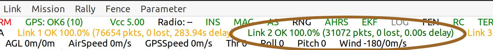
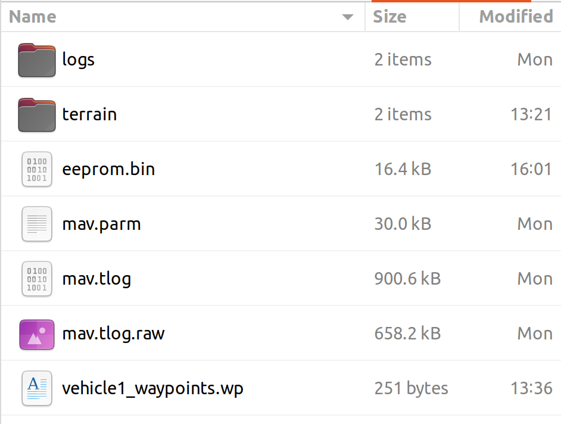
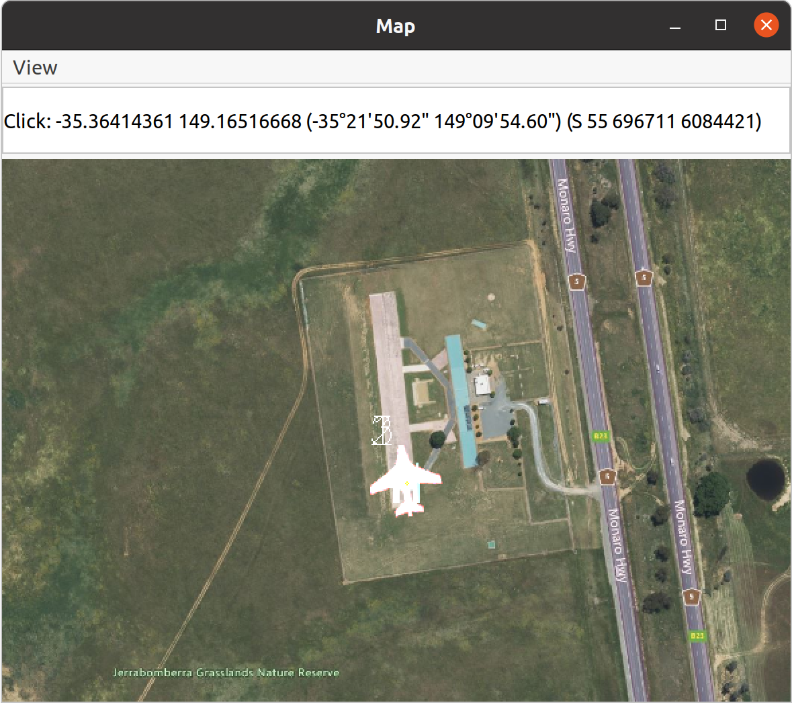
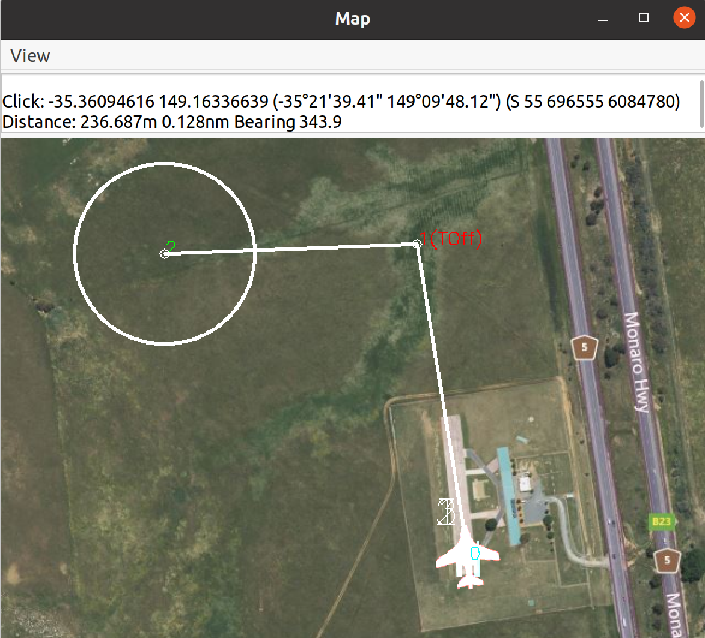
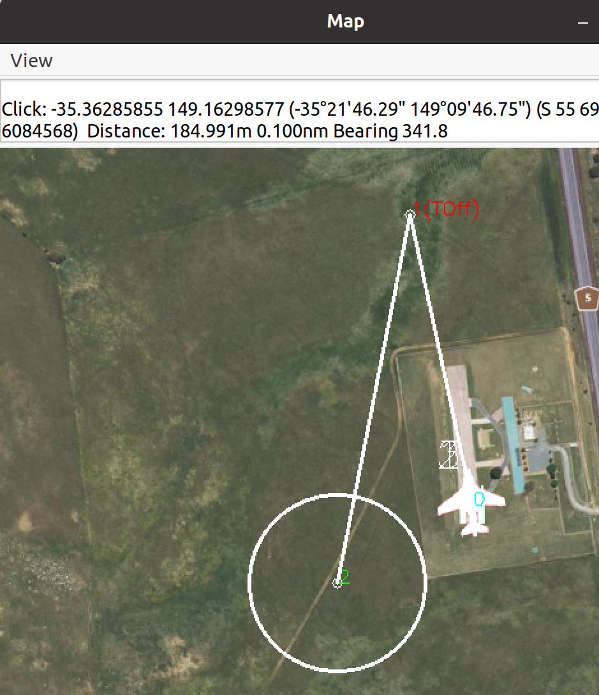
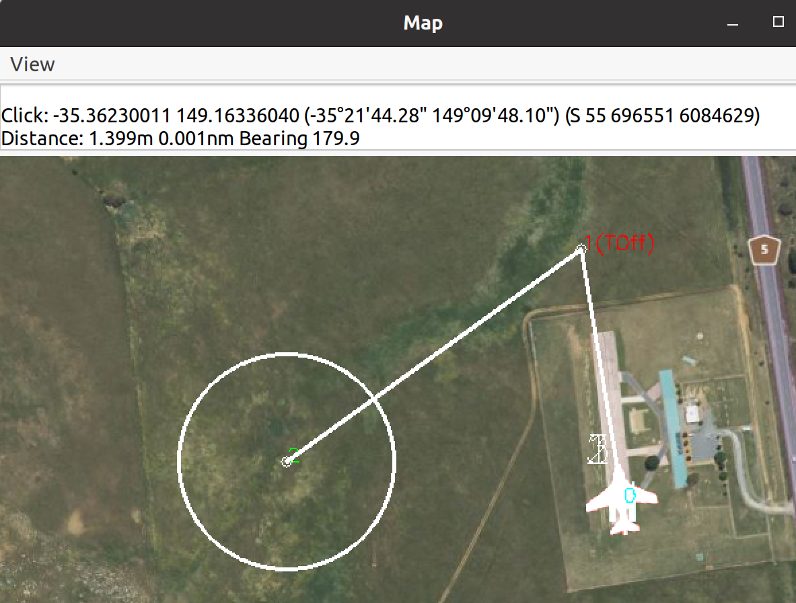
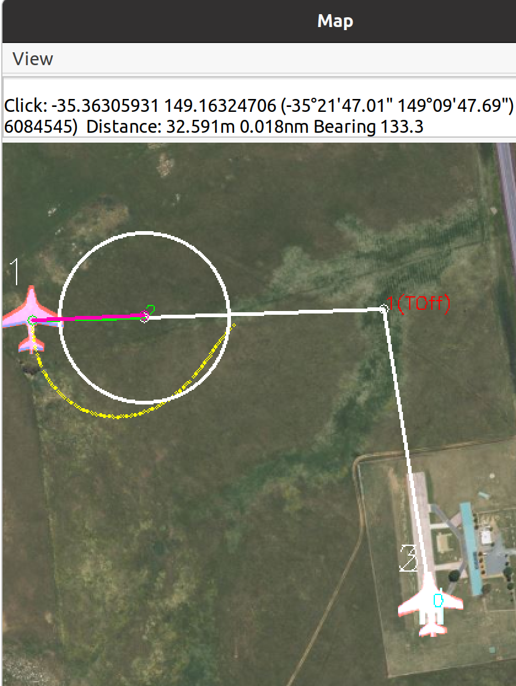
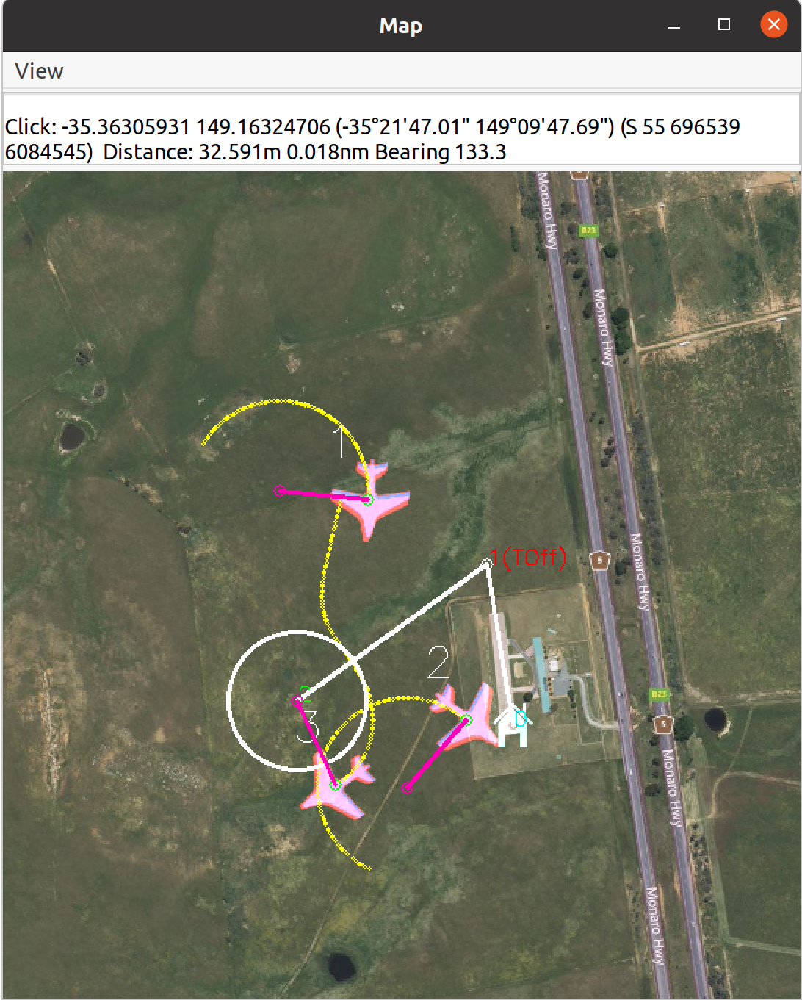
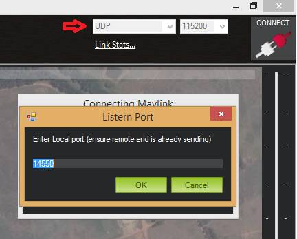
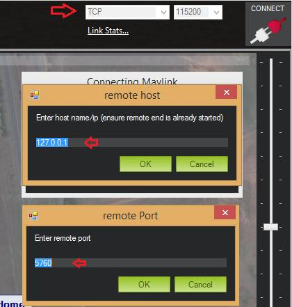

.. _using-sitl-for-ardupilot-testing:

==========
Using SITL
==========

This article describes how :ref:`SITL <sitl-simulator-software-in-the-loop>`
and :ref:`MAVProxy <mavproxy-developer-gcs>` can be used to change the environment,
simulate failure modes, and configure the vehicle with optional components.
It also explains how to :ref:`connect to different GCSs <using-sitl-for-ardupilot-testing_connecting_otheradditional_ground_stations>`.

.. note::

   This page assumes you have already cloned the repository and set up the build environment - see :ref:`Building the code <building-the-code>`

.. tip::

   If you're just getting started with MAVProxy and SITL you may wish
   to start by reading the :ref:`Copter SITL/MAVProxy Tutorial <copter-sitl-mavproxy-tutorial>`
   (or equivalent tutorials for the other vehicles).

.. note::

   These instructions generally use
   :ref:`MAVProxy <mavproxy-developer-gcs>` to
   describe operations (e.g. setting parameters) because it presents a
   simple and consistent command-line interface (removing the need to
   describe a GCS-specific UI layout). Many of these operations can also
   be performed in *Mission Planner* (through the *Full Parameters List*) or any other GCS.

..  youtube:: Ewh0fKGEJL4
    :width: 100%

A startup script, ```sim_vehicle.py`` is provided to automatically build the SITL firmware version for the current code branch, load the simulation models, start the simulator, setup environment and vehicle parameters, and start the MAVProxy GCS. Many script start-up parameters can be specified, type this for a full list:

::

    sim_vehicle.py --help


Selecting a vehicle/frame type
==============================

The simulation will default to the vehicle type in the directory in which it is started. You can select the vehicle type if starting from the ardupilot directory by starting the simulator calling **sim_vehicle.py** with the ``-v`` parameter.

::

     sim_vehicle.py -v ArduPlane --console --map

The frame type can also be changed with the ``-f`` parameter.

::

    sim_vehicle.py -v ArduPlane -f quadplane --console --map
    

Frame Types:
------------

A partial listing of frame types is show below. For a current list, just type:

::

    sim_vehicle.py --help


+--------------------------+------------------------+
+          Vehicle         +       Frame Type       +
+--------------------------+------------------------+
+                          + plane (default if -f   +
+                          + is not used)           +
+                          +------------------------+
+ Plane                    + quadplane              +
+                          + firefly plane-dspoilers+
+                          + plane-elevon plane-jet +
+                          + plane-tailsitter plane-+
+                          + vtail quadplane-cl84   +
+                          + quadplane-tilthvec     +
+                          + quadplane-tilttri      +
+                          + quadplane-tilttrivec   +
+                          + quadplane-tri          +
+--------------------------+------------------------+
+                          + quad (default if -f    +
+                          + is not used)           +
+                          +------------------------+
+                          + coaxcopter  dodeca-hexa+
+ Copter                   + heli heli-compound     +
+                          + heli-dual hexa hexa-cwx+
+                          + hexa-dji octa octa-cwx +
+                          + octa-dji octa-quad     +
+                          + octaquad-cwx  tri  cwx +
+                          + singlecopter  y6 djix  +
+--------------------------+------------------------+
+                          + rover (default if -f   +
+  Rover                   + is not used)           +
+                          +------------------------+
+                          + balancebot rover-skid  +
+                          + sailboat sailboat-motor+
+--------------------------+------------------------+

.. note:: It is important to select the proper frame type. This not only loads the correct parameter set, but also selects the correct physics model. In real life, for example, you can configure and setup the ArduPlane firmware for any QuadPlane, but you cannot do that in SITL without having selected the exact QuadPlane frame type for the simulation to get the correct physics model.


Setting vehicle start location
==============================

You can start the simulator with the vehicle at a particular location by
calling **sim_vehicle.py** with the ``-L`` parameter and a named
location in the
`ardupilot/Tools/autotest/locations.txt <https://github.com/ArduPilot/ardupilot/blob/master/Tools/autotest/locations.txt>`__
file.

For example, to start Copter in *Ballarat* (a named location in
**locations.txt**) call:

::

    cd ArduCopter 
    sim_vehicle.py -L Ballarat --console --map

.. note::

   You can add your own locations to the file. The order is Lat,Lng,Alt,Heading where alt is MSL and in meters, and heading is degrees.
   If the flying location is well-used then consider adding it to the project via a pull request.

.. note::

   You can add your own private locations to a local locations.txt
   file, in the same format as the main file.  On linux the file is
   located in ``$HOME/.config/ardupilot/locations.txt`` - you will
   need to create this file using your favourite text editor.

Simulating On-Board OSD
=======================

When starting SITL, you can have it display a simulation of the integated OSD, if the autopilot includes one. Add the ``--osd`` option when starting SITL:

::

    sim_vehicle.py -v ArduPlane --console --map --osd
    
.. note:: the OSD emulation displays OSD panel items and locations, but it does not allow multiple screens, nor units other than metric


.. _using-sitl-for-ardupilot-testing_loading_a_parameter_set:

Loading a parameter set
=======================

When starting SITL the first time, the device may be configured with
"unforgiving" parameters. Typically you will want to replace these with
values that simulate more realistic vehicle and environment conditions.
Useful parameter sets are provided in the autotest source for
`Copter <https://github.com/ArduPilot/ardupilot/blob/master/Tools/autotest/default_params/copter.parm>`__,
`Plane <https://github.com/ArduPilot/ardupilot/blob/master/Tools/autotest/default_params/plane.parm>`__,
and
`Rover <https://github.com/ArduPilot/ardupilot/blob/master/Tools/autotest/default_params/rover.parm>`__.

.. tip::

   This only needs to be done once, after loading, the parameters are
   stored in the simulated EEPROM.

The MAVProxy commands to load the parameters for Copter, Rover and Plane
(assuming the present working directory is a vehicle directory like
**/ardupilot/ArduCopter/**) are shown below:

::

    param load ../Tools/autotest/default_params/copter.parm

::

    param load ../Tools/autotest/default_params/plane.parm

::

    param load ../Tools/autotest/default_params/rover.parm

You can re-load the parameters later if you choose, or revert to the
default parameters by starting SITL (**sim_vehicle.py**) with the
``-w`` flag.

.. note:: You may have to load them again, after typing ``param fetch``, in order to load parameters that require enabling before presenting their parameter set.  And, in some cases, you may even need to restart SITL in order for some new parameters, such as output function changes, to take effect. This can be avoided if you add the parameter file during the start of SITL with the "--add-param-file=*pathtofile* "....ie: sim_vehicle.py -f flightaxis:192.168.x.x - -map - -console --add-param-file=*pathtofile* -w. This adds the param file as a default and then wipes any previous param changes that may exist in the simulation directory. 

Parameters can also be saved. For example, to save the parameters into
the present working directory you might do:

::

    param save ./myparams.parm

Setting parameters
==================

Many of the following tasks involve setting parameter values over
MAVLink, which you do using the ``param set`` command as shown:

::

    param set PARAMETERNAME VALUE

All available parameters can be listed using ``param show``. The
SITL-specific parameters start with ``SIM_``, and can be obtained using:

::

    param show SIM_*

.. tip::

   A table of user settable SITL-specific parameters can be found in `SITL.cpp <https://github.com/ArduPilot/ardupilot/blob/master/libraries/SITL/SITL.cpp>`__
   When you change a parameter the value remains in the virtual EEPROM
   after you restart SITL. Remember to change it back if you don't want it
   any more (or :ref:`reload/reset the parameters <using-sitl-for-ardupilot-testing_loading_a_parameter_set>`). 

Testing RC failsafe
===================

To test the behaviour of ArduPilot when you lose remote control (RC),
set the parameter ``SIM_RC_FAIL=1``, as shown:

::

    param set SIM_RC_FAIL 1

This simulates the complete loss of RC input. If you just want to
simulate low throttle (below throttle failsafe level) then you can do
that with the RC command:

::

    rc 3 900

Testing GPS failure
===================

To test losing GPS lock, use ``SIM_GPS_DISABLE``:

::

    param set SIM_GPS_DISABLE 1

You can also enable/disable a 2nd GPS using ``SIM_GPS2_DISABLE``.

Testing GPS-for-Yaw
===================

To test GPS-for-Yaw using two simulated UBlox GPSs:

::

    param set EK3_SRC1_YAW 2
    param set GPS_AUTO_CONFIG 0
    param set GPS_TYPE 17
    param set GPS_TYPE2 18
    param set GPS_POS1_Y -0.2
    param set GPS_POS2_Y 0.2
    param set SIM_GPS_POS_Y -0.2
    param set SIM_GPS2_POS_Y 0.2
    param set SIM_GPS2_DISABLE 0
    param set SIM_GPS2_HDG 1

Reboot SITL and the heading should be visible in the GPS2_RAW message's yaw field:

::

    status GPS2_RAW

To test using a single NMEA GPS:

::

    param set EK3_SRC1_YAW 2
    param set GPS_TYPE 5
    param set SIM_GPS_TYPE 5
    param set SIM_GPS_HDG 1

Reboot SITL and the heading should be visible in the GPS_RAW_INT message's yaw field:

::

    status GPS_RAW_INT

Testing the effects of vibration
================================

To test the vehicle's reaction to vibration, use ``SIM_ACC_RND``. The
example below adds 3 m/s/s acceleration noise:

::

    param set SIM_ACC_RND 3

Testing the effects of wind
===========================

The wind direction, speed and turbulence can be changed to test their
effect on flight behaviour. The following settings changes the wind so
that it blows from the South at a speed of 10 m/s.

::

    param set SIM_WIND_DIR 180
    param set SIM_WIND_SPD 10

To see other wind parameters do:

::

    param show sim_wind*


Adding a Gimbal
===============

SITL can simulate a virtual gimbal.

.. note::

   Gimbal simulation causes SITL to start sending
   `MOUNT_STATUS <https://mavlink.io/en/messages/ardupilotmega.html#MOUNT_STATUS>`__
   messages. These messages contain the orientation according to the last
   commands sent to the gimbal, not actual measured values. As a result, it
   is possible that the true gimbal position will not match - i.e. a
   command might be ignored or the gimbal might be moved manually. Changes
   are not visible in Mission Planner.

First start the simulator and use the following commands to set up the
gimbal mount:

::

    # Specify a servo-based mount:
    param set MNT_TYPE 1

    # Set RC output 6 as pan servo:
    param set SERVO6_FUNCTION 6

    # Set RC output 8 as roll servo:
    param set SERVO7_FUNCTION 8

Then stop and re-launch SITL with the ``-M`` flag:

::

    sim_vehicle.py -M

Adding a Rangefinder
====================

SITL can simulate an analog rangefinder, which is very useful for
developing flight modes that can use a rangefinder. To set it up use the
following commands:

::

    param set SIM_SONAR_SCALE 10
    param set RNGFND1_TYPE 1
    param set RNGFND1_SCALING 10
    param set RNGFND1_PIN 0
    param set RNGFND1_MAX_CM 5000
    param set RNGFND1_MIN_CM 0

    # Enable rangefinder for landing (Plane only!)
    param set RNGFND_LANDING 1

The above commands will set up an analog rangefinder with a maximum range
of 50 meters (the 50m comes from an analog voltage range of 0 to 5V, and
a scaling of 10). After making the above changes you need to restart
SITL.

Then to test it try this:

::

    module load graph
    graph RANGEFINDER.distance

Then try a flight and see if the graph shows you the rangefinder
distance.

.. tip::

   You can also use the following commands to graph rangefinder
   information (defined as *MAVProxy* aliases):

   -  ``grangealt`` - graph rangefinder distance and relative altitude.
   -  ``grangev`` - rangefinder voltage
   -  ``grange`` - graph "rangefinder_roll"

Adding an Optical Flow sensor
=============================

A virtual optical flow sensor can be added enabling a RangeFinder (see "Adding a Rangefinder" above) and then setting these parameters:

::

    param set SIM_FLOW_ENABLE 1
    param set FLOW_TYPE 10

Then restart SITL. After setting it up try this:

::

    module load graph
    graph OPTICAL_FLOW.flow_comp_m_x OPTICAL_FLOW.flow_comp_m_y

Go for a flight and see if you get reasonable data.

Adding an RPM sensor
====================

You can add an RPM sensor like this:

::

    param set RPM_TYPE 1
    
This allows to display and log your virtual motor's rotational speed.

Adding Wheel Encoders
=====================

You can test two virtual wheel encoders like this:

::

    param set AHRS_EKF_TYPE 3
    param set EK2_ENABLE 0
    param set EK3_ENABLE 1
    param fetch
    param set EK3_SRC1_POSXY 0
    param set EK3_SRC1_VELXY 7
    param set EK3_SRC1_VELZ 0
    param set GPS_TYPE 0
    param set WENC_TYPE 10
    param fetch
    param set WENC_POS_Y 0.075
    param set WENC2_TYPE 10
    param set WENC2_POS_Y -0.075
    param set ARMING_CHECK 60918 (to disable GPS checks)

The restart SITL and right mouse button click on the map and select "Set Origin (with height)" and the vehicle should appear on the map.  It may also be useful to enter "map set showsimpos 1" to make the vehicle's actual position visible.

Adding Range Beacons
====================

You can test a virtual range beacons by setting the following parameters

::

    param set AHRS_EKF_TYPE 3
    param set EK2_ENABLE 0
    param set EK3_ENABLE 1
    param fetch
    param set EK3_GPS_TYPE 3
    param set GPS_TYPE 0
    param set BCN_TYPE 10
    param fetch
    param set BCN_LATITUDE -35.363261
    param set BCN_LONGITUDE 149.165230
    param set BCN_ALT 584

The restart SITL and the vehicle should appear on the map.  After perhaps 30seconds it should shift to its normal starting position.

Testing Precision Landing
-------------------------

.. note::

   These instructions are written assuming ArduCopter

Enable Precision Landing, and set the precision landing backend type to SITL:

::

   param set PLND_ENABLED 1
   param fetch
   param set PLND_TYPE 4
   param set SIM_PLD_ENABLE 1
   param set SIM_PLD_LAT -35.3632
   param set SIM_PLD_LON 149.1652

A rangefinder is currently required for precision landing.  Enable a simulated rangefinder:

::

   param set RNGFND1_TYPE 1
   param set RNGFND1_MIN_CM 0
   param set RNGFND1_MAX_CM 4000
   param set RNGFND1_PIN 0
   param set RNGFND1_SCALING 12.12

Restart the simulation.
   
Takeoff and fly a bit, then switch into land:

::

   arm throttle
   rc 3 1800
   mode land
   rc 3 1500

Check the logs for precision landing messages:

::

   ls -lt logs

Choose the youngest, then:

::

   mavlogdump --type PL logs/<youngest>


Testing Vicon (aka Vision Positioning)
--------------------------------------

Start SITL, wiping parameters:

::

   ./Tools/autotest/sim_vehicle.py -v ArduCopter --gdb --debug -w

Enable EKF3, disable GPS and set Serial5 protocol to mavlink so as to accept vision-position-estimate and vision-speed-estimate messages:

::

    param set AHRS_EKF_TYPE 3
    param set EK2_ENABLE 0
    param set EK3_ENABLE 1
    param fetch
    param set EK3_SRC1_POSXY 6
    param set EK3_SRC1_POSZ 6
    param set EK3_SRC1_VELXY 6
    param set EK3_SRC1_VELZ 6
    param set EK3_SRC1_YAW 6
    param set VISO_TYPE 2
    param set SERIAL5_PROTOCOL 2
    param set GPS_TYPE 0 (optional)
    param set ARMING_CHECK 388598 (optional, to disable GPS checks)
    param fetch

Restart the simulation, attaching a simulated Vicon system to uartF (which corresponds to ``SERIAL5``):

::

   ../Tools/autotest/sim_vehicle.py --map --console -A "--uartF=sim:vicon:"

The console should indicate no GPS is present:

::

   GPS: 0 (0)

Vision position estimates should now be being fed into ArduCopter:

::

   STABILIZE> status VICON_POSITION_ESTIMATE
   STABILIZE> 43371: VICON_POSITION_ESTIMATE {usec : 38380000, x : 0.0, y : 0.0, z : -0.0999755859375, roll : 0.0, pitch : 0.0, yaw : -0.122173137963}


You should also receive a startup message from the EKF:

::

   APM: EKF3 IMU0 is using external nav data
   APM: EKF3 IMU0 initial pos NED = 0.0,0.0,-0.1 (m)
   APM: EKF3 IMU1 is using external nav data
   APM: EKF3 IMU1 initial pos NED = 0.0,0.0,-0.1 (m)

Use MAVProxy's right-click context menu item to ``Set Origin (with alt)``

Arm in loiter, takeoff and fly somewhere:

::

   loiter
   arm throttle
   rc 3 1800
   rc 2 1400

Other SITL vicon settings are hel in SIM_VICON_xx parameters:

::

   param show SIM_VICON*

Accessing log files
===================

SITL supports both Block Logging and SD card storage DataFlash logs (same as other types of ArduPilot
ports). The SD card logs are stored in a "logs" subdirectory in the directory
where you start SITL. The Block Flash logs are stored in the blackbox.bin file.
You can also access the logs via MAVLink using
a GCS, but directly accessing SD card emulated logs in the logs/ directory is usually
more convenient.

To keep your logs organised it is recommended you start SITL using the
"--aircraft NAME" option. That will create a subdirectory called NAME
which will have flight logs organised by date. Each flight will get its
own directory, and will include the parameters for the flight plus any
downloaded waypoints and rally points.

Graphing vehicle state
======================

MAVProxy allows you to create graphs of inputs, outputs, internal variables, etc. by loading the ``graph`` module.  You can then create graphs of vehicle state using the graph command. For example, to graph the RC channel 3 input during the simulation:

::

    graph RC_CHANNELS.channel3_raw

As with most commands, you can type ``graph`` and then double tab to see available completions. In the example above the `RC_CHANNELS` group contains the 16 rc channels, so typing ``graph RC_CHANNELS``, then double tab would show those.

Since these are rather long to type, MAVProxy allows for the creation of shorter aliases.  There have been many aliases created in a file present in the ArduPilot source tree in the Tools/vagrant sub-directory called **mavinit.scr**. If this file is copied and placed in your home directory and renamed to **.mavinit.scr**, it will be used upon *MAVProxy's* initialization.  Common ones are: *g* for graph, *grc* to graph the RC inputs, *gservo8* to graph the first 8 output channels instead of typing long item names eight times, etc. Using this alias initialization file also has the advantage of automatically loading the graph module upon startup, so you will not have to load it.


Using a joystick
================

It can be useful to use a joystick for input in SITL. The joystick can
be a real RC transmitter with a USB dongle for the trainer port, or
something like the RealFlight interlink controller or a wide range of
other joystick devices.

Before you use the joystick support you may need to remove debug
statements from the python-pygame joystick driver on Linux. If you don't
then you may see lots of debug output like this:

::

    SDL_JoystickGetAxis value:-32768:

To remove this debug line run this command:

::

    sudo sed -i 's/SDL_JoystickGetAxis value/\x00DL_JoystickGetAxis value/g' /usr/lib/python2.7/dist-packages/pygame/joystick.so

note that this needs to be one long command line. Ignore the line
wrapping in the wiki. If you have installed the joystick support using the instructions on setting up the ArduPilot code building environment, then this will probably NOT be required.

Then to use the joystick run:

::

    module load joystick

If you want to add support for a new joystick type then you need to add a file for it following these `instructions <https://github.com/ArduPilot/MAVProxy/blob/master/docs/JOYSTICKS.md>`__ . Note that you can also use this information to customize the operation of your joystick if it already supported. Just modify it file appropriately.

Using real serial devices
=========================

Sometimes it is useful to use a real serial device in SITL. This makes
it possible to connect SITL to a real GPS for GPS device driver
development, or connect it to a real OSD device for testing an OSD.

To use a real serial device you can use a command like this:

::

    sim_vehicle.py -A "--uartB=uart:/dev/ttyUSB0" --console --map

what that does it pass the --uartB argument to the ardupilot code,
telling it to use /dev/ttyUSB0 instead of the normal internal simulated
GPS for the 2nd UART. You can find the SITL serial port mappings :ref:`here <learning-ardupilot-uarts-and-the-console>`

Any of the 5 UARTs can be configured in this way, using uartA to uartE.
The standard serial ports SERIAL1 and SERIAL2 are uartC and uartD respectively.

Typically serial devices can be connected to a computer's USB port through
an FTDI adapter, but note that these generally do not support half-duplex.
In order to communicate with devices in this way you should make sure your 
user has appropriate access on linux-type systems to the dialout group. On
WSL it is also usually necessary to setup the port once the device has been connected
before trying to interact with it through SITL. For instance for COM22:

::

    stty -F /dev/ttyS22 raw 115200

You can set additional parameters on the uart in the connection string, so for instance
to use a device on SERIAL1 at 115k baud only, specify:

::

    sim_vehicle.py -v ArduCopter -A "--uartC=uart:/dev/ttyUSB0:115200" --console --map

Similar to this if you were running a vehicle in SITL via Cygwin on
Microsoft Windows and you wanted to send the MAVLink output through a
connected radio on COM16 to AntennaTracker you can use a command like
this - note under Cygwin comm ports are ttyS and they start at 0 so 15
is equivalent to COM16:

::

    sim_vehicle.py -A "--uartC=uart:/dev/ttyS15" --console --map

.. _using-sitl-for-ardupilot-testing_connecting_otheradditional_ground_stations:


Changing the speed of the simulation
====================================

Most of the simulator backends support changing the speed while
running. Just set the SIM_SPEEDUP parameter as needed. A value of 1
means normal wall-clock time. A value of 5 means 5x realtime. A value
of 0.1 means 1/10th of real time.

Testing Compass Calibration
===========================

A quick way to test compass calibration in SITL is with the
"calibration" vehicle model. To use this with plane do this:

::

   sim_vehicle.py -D -f plane --model calibration --console --map

then do:

:: 

   servo set 5 1250

This will start the vehicle moving through a "compass dance". You can
start a compass calibration to test changes to the calibrator
code. Using this in combination with the SIM_SPEEDUP parameter can be useful.

The calibration vehicle module has a lot of other features too. See
`http://guludo.me/posts/2016/05/27/compass-calibration-progress-with-geodesic-sections-in-ardupilot/
<http://guludo.me/posts/2016/05/27/compass-calibration-progress-with-geodesic-sections-in-ardupilot/>`__
for details.

Connecting other/additional ground stations
===========================================

SITL can connect to multiple ground stations by using *MAVProxy* to
forward UDP packets to the GCSs network address. Alternatively SITL can
connect to a GCS over TCP/IP without using *MAVProxy*.

To start SITL without starting MAVProxy use the ``--no-mavproxy`` option. SITL will be
listening for a GGS station to connect via UDP port 14550 or TCP port 5760.

.. _using-sitl-for-ardupilot-testing_sitl_with_mavproxy_udp:

SITL with MAVProxy (UDP)
------------------------

SITL can connect to multiple ground stations by using *MAVProxy* to
forward UDP packets to the GCSs network address (for example, forwarding
to another Windows box or Android tablet on your local network). The
simulated vehicle can then be controlled and viewed through any attached
GCS.

First find the IP address of the machine running the GCS. How you get
the address is platform dependent (on Windows you can use the 'ipconfig'
command to find the computer's address).

Assuming the IP address of the GCS is 192.168.14.82, you would add this
address/port as a *MAVProxy* output using:

::

    output add 192.168.14.82:14550

The GCS would then connect to SITL by listening on that UDP port. The
method for connecting will be GCS specific (we show :ref:`how to connect for Mission Planner <using-sitl-for-ardupilot-testing_connecting_mission_planner_udp>` below).

.. tip::

   If you're running the GCS on the **same machine** as SITL then an
   appropriate output may already exist. Check this by calling ``output``
   on the *MAVProxy command prompt*:

   ::

       GUIDED> output
       GUIDED> 2 outputs
       0: 127.0.0.1:14550
       1: 127.0.0.1:14551

   In this case we can connect a GCS running on the same machine to UDP
   port 14550 or 14551. We can choose to connect another GCS to the
   remaining port, and add more ports if needed. 

   
.. _using-sitl-for-ardupilot-testing_sitl_without_mavproxy_tcp:

Multi-Aircraft SITL with MAVProxy
----------------------------------

Multiple aircraft can be simulated in SITL with MAVProxy. This feature owes much to prior work here: https://ardupilot.org/mavproxy/docs/getting_started/multi.html 

To access this feature use both the number (-n) or count (--count) as well as the auto-sysid (--auto-syid) features of sim_vehicle.py like so:

::

    sim_vehicle.py -v ArduPlane -n3 --auto-sysid

Now MAVProxy will receive messages on the console from all aircraft. Verifying a connection to multiple vehicles is as simple as checking the MAVProxy console -- https://ardupilot.org/mavproxy/docs/modules/console.html. The following is an image of the console when connected to vehicle 2:



Use vehicle <n> to set the active vehicle (using 1-based indexing). Use alllinks <cmd> to send <cmd> to all vehicles in turn. For example, alllinks mode rtl will set RTL mode on all vehicles.

**Note** while the vehicles use 1-based indexing, the logs use 0-based. So a multi-vehicle plane that was labeled 1 at the MAVProxy prompt will be labeled 0 in the logs. Subdirectories for each vehicle will be formed based on where you started up MAVProxy. For example, a log directory for vehicle 0 looks like this:



The eeprom.bin file contains a copy (among other things) of all the parameters for vehicle 0. The logs directory has all the dataflash logs for the vehicle, and terrain directory has all the Shuttle Radar Topograph Mission terrain tiles.

It is possible to specify the desired instance numbers (-i) to the sim_vehicle.py call, which results in precise log indexing:

::

    sim_vehicle.py -v ArduPlane -n3 --auto-sysid -i "1 2 3"

Be sure to verify the MAVProxy map and missions before takeoff. An example map at the default airfield before we takeoff looks like this:



Load missions for each aircraft before takeoff. At the MAVProxy prompt, verify a connection to vehicle 1 by entering:

::

    MANUAL> vehicle 1

To use sample waypoints, just load them as follows:

::

    MANUAL> wp load 0/vehicle1_waypoints.wp

The waypoints loaded on the map are as in the figure:



This is a sample mission that is just a takeoff waypoint followed by an unlimited loiter waypoint.

Load the other two missions by setting the appropriate vehicle and their waypoint files. For example, a mission set for the other two vehicles looks like:





**Please note this is for demonstration ONLY!!** The missions for all vehicles pass very close to each other and they are not altitude deconflicted either. If this is meant for real aircraft then more care is needed to be certain about your multi-aircraft configuration!

That said, takeoff aircraft 1 by proceeding to AUTO mode:

::
    
    MANUAL> vehicle 1

::
    
    MANUAL> Set vehicle 1 (link 1)

::
    
    MANUAL> arm throttle

::
    
    MANUAL> AUTO

Vehicle 1 should proceed to the unlimited loiter waypoint:



All three vehicles loitering together:



Flight is also possible in non-auto modes (e.g., via the MAVProxy takeoff command) but that is left as an exercise to the reader.

SITL without MAVProxy (TCP)
---------------------------

It is also possible to interact with SITL over TCP/IP by starting it
using \ *vehicle_name*.\ **elf** (e.g. **/ArduCopter/ArduCopter.elf**).
*MAVProxy* is not needed when using this method.

Run the file in the *Cygwin Terminal*, specifying a home position and
vehicle model as shown below:

::

    $ ./ArduCopter.elf --home -35,149,584,270 --model quad
    Started model quad at -35,149,584,270 at speed 1.0
    Starting sketch 'ArduCopter'
    Starting SITL input
    bind port 5760 for 0
    Serial port 0 on TCP port 5760
    Waiting for connection ....

The command output shows that you can connect to SITL using TCP/IP at
the network address of the **machine SITL is running on** at port 5760.

.. tip::

   **ArduCopter.elf** has other startup options, which you can use
   using the -h command line parameter:

   ::

       ./ArduCopter.elf -h

.. _using-sitl-for-ardupilot-testing_connecting_mission_planner_udp:

Connecting Mission Planner (UDP)
--------------------------------

First set up SITL to :ref:`output UDP packets to the address/port of the computer running *Mission Planner* <using-sitl-for-ardupilot-testing_sitl_with_mavproxy_udp>`.

In *Mission Planner* listen to the specific UDP port by selecting
**UDP** and then the **Connect** button. Enter the port to listen on
(the default port number of 14550 should be correct if SITL is running
on the same computer).



   Mission Planner: Connecting to a UDPPort

Connecting to Mission Planner (TCP)
-----------------------------------

First set up SITL :ref:`for use with TCP <using-sitl-for-ardupilot-testing_sitl_without_mavproxy_tcp>`.

In *Mission Planner* connect to SITL by selecting **TCP** and then the
**Connect** button. Enter the \ *remote host* and *remote Port* of the
machine running SITL. *Mission Planner* will then connect and can be
used just as before.

.. tip::

   If SITL is running on the same machine as *Mission Planner* you can
   click through the \ *remote host* and *remote Port* prompts as these
   default to the correct values.



   Mission Planner: Connecting toSITL using TCP
