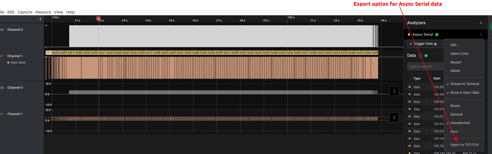

.. _using-sitl-for-ardupilot-testing:

==========
Using SITL
==========

This article describes how :ref:`SITL <sitl-simulator-software-in-the-loop>` can be used to change the environment, simulate failure modes, and configure the vehicle with optional components.

SITL can be run under Linux using a tool named ``sim_vehicle.py`` from a Linux or WSL2 command line, or through :ref:`Mission Planner's Simulation feature <mission-planner-simulation>`. It can also be run in conjunction with a graphics visualization and/or physics modeling program like :ref:`Realflight<sitl-with-realflight>`.

In addition to running the simulation, a ground control station program will need to be run concurrently in order to control the simultion. With ``sim_vehicle.py``, `MAVProxy <https://ardupilot.org/mavproxy/index.html>`__ is automatically started. When using Mission Planner's simulation feature, it is used. You can also have more than one GCS attached, see :ref:`connect to different GCSs <using-sitl-for-ardupilot-testing_connecting_otheradditional_ground_stations>`.

.. note::

   This page assumes you have already cloned the repository and set up the build environment if you wish to simulate your own code - see :ref:`Building the code <building-the-code>`, although this is not needed if using :ref:`Mission Planner's Simulation feature <mission-planner-simulation>` since it can easily run simulations on the current development code or stable code versions.

.. tip::

   If you're just getting started with MAVProxy and SITL you may wish
   to start by reading the :ref:`Copter SITL/MAVProxy Tutorial <copter-sitl-mavproxy-tutorial>`
   (or equivalent tutorials for the other vehicles).

.. note::

   These instructions generally use
   :ref:`MAVProxy <mavproxy-developer-gcs>` to
   describe operations (e.g. setting parameters) because it presents a
   simple and consistent command-line interface (removing the need to
   describe a GCS-specific UI layout). Many of these operations can also
   be performed in *Mission Planner* (through the *Full Parameters List*) or any other GCS.

..  youtube:: Ewh0fKGEJL4
    :width: 100%

Using sim_vehicle.py
====================

A startup script, ```sim_vehicle.py`` is provided to automatically build the SITL firmware version for the current code branch, load the simulation models, start the simulator, setup environment and vehicle parameters, and start the MAVProxy GCS. Many script start-up parameters can be specified, type this for a full list:

::

    sim_vehicle.py --help


Selecting a vehicle/frame type
------------------------------

The simulation will default to the vehicle type in the directory in which it is started. You can select the vehicle type if starting from any directory by starting the simulator calling **sim_vehicle.py** with the ``-v`` parameter.

::

     sim_vehicle.py -v ArduPlane --console --map

The frame type can also be changed with the ``-f`` parameter.

::

    sim_vehicle.py -v ArduPlane -f quadplane --console --map


Frame Types:
~~~~~~~~~~~~

A partial listing of frame types is show below. For a current list, just type:

::

    sim_vehicle.py --help


+--------------------------+------------------------+
+          Vehicle         +       Frame Type       +
+--------------------------+------------------------+
+                          + plane (default if -f   +
+                          + is not used)           +
+                          +------------------------+
+ Plane                    + quadplane              +
+                          + firefly plane-dspoilers+
+                          + plane-elevon plane-jet +
+                          + plane-tailsitter plane-+
+                          + vtail quadplane-cl84   +
+                          + quadplane-tilthvec     +
+                          + quadplane-tilttri      +
+                          + quadplane-tilttrivec   +
+                          + quadplane-tri          +
+                          + plane-3d               +
+--------------------------+------------------------+
+                          + quad (default if -f    +
+                          + is not used)           +
+                          +------------------------+
+                          + coaxcopter  dodeca-hexa+
+ Copter                   + heli heli-compound     +
+                          + heli-dual hexa hexa-cwx+
+                          + hexa-dji octa octa-cwx +
+                          + octa-dji octa-quad     +
+                          + octaquad-cwx  tri  cwx +
+                          + singlecopter  y6 djix  +
+--------------------------+------------------------+
+                          + rover (default if -f   +
+  Rover                   + is not used)           +
+                          +------------------------+
+                          + balancebot rover-skid  +
+                          + sailboat sailboat-motor+
+--------------------------+------------------------+

.. note:: It is important to select the proper frame type. This not only loads the correct parameter set, but also selects the correct physics model. In real life, for example, you can configure and setup the ArduPlane firmware for any QuadPlane, but you cannot do that in SITL without having selected the exact QuadPlane frame type for the simulation to get the correct physics model. If a frame type is not selected, a default set for the vehicle type will be loaded, as indicated above.


Setting vehicle start location
------------------------------

You can start the simulator with the vehicle at a particular location by
calling **sim_vehicle.py** with the ``-L`` parameter and a named
location in the
`ardupilot/Tools/autotest/locations.txt <https://github.com/ArduPilot/ardupilot/blob/master/Tools/autotest/locations.txt>`__
file.

For example, to start Copter in *Ballarat* (a named location in
**locations.txt**) call:

::

    cd ArduCopter 
    sim_vehicle.py -L Ballarat --console --map

.. note::

   You can add your own locations to the file. The order is Lat,Lng,Alt,Heading where alt is MSL and in meters, and heading is degrees.
   If the flying location is well-used then consider adding it to the project via a pull request.

.. note::

   You can add your own private locations to a local locations.txt
   file, in the same format as the main file.  On linux the file is
   located in ``$HOME/.config/ardupilot/locations.txt`` - you will
   need to create this file using your favourite text editor.

.. _using-sitl-for-ardupilot-testing_loading_a_parameter_set:

Loading a different default parameter set
-----------------------------------------

A set of default parameters are automatically selected by the frame type. However, you may select a different parameter file by using the ``--add-param-file=`` option, instead of manually loading them via the GCS after the simulation starts:

::

    sim_vehicle.py -v ArduPlane --console --map --add-param-file=<path to file>

the default working directory will be the directory in which sim_vehicle.py was started.

.. note:: the "default" parameter set emulates the parameter default values contained in the firmware. These are used at startup for parameters, UNLESS the user has previously changed them for a parameter(s), in which case those changed values are used. In SITL, these changes are stored in a file in the simulation startup directory named ``eeprom.bin``. If you wish to startup with only the default values, either that file can be erased, or the ``-w`` options can be used.

::

    sim_vehicle.py -v ArduPlane --console --map --add-param-file=<path to file> -w

Adding Simulated Peripherals into the Simulation
------------------------------------------------

See :ref:`adding_simulated_devices`

Using real serial devices
-------------------------

Sometimes it is useful to use a real serial device in SITL. This makes
it possible to connect SITL to a real GPS for GPS device driver
development, or connect it to a real OSD device for testing an OSD.

To use a real serial device you can use a command like this:

::

    sim_vehicle.py -A "--serial2=uart:/dev/ttyUSB0" --console --map

what that does it pass the --serial2 argument to the ardupilot code,
telling it to use /dev/ttyUSB0 instead of the normal internal simulated
GPS. You can find the SITL serial port mappings :ref:`here <learning-ardupilot-uarts-and-the-console>`

Any of the 8 UARTs can be configured in this way, using serial0 to serial7.

Typically serial devices can be connected to a computer's USB port through
an FTDI adapter, but note that these generally do not support half-duplex.
In order to communicate with devices in this way you should make sure your 
user has appropriate access on linux-type systems to the dialout group. On
WSL it is also usually necessary to setup the port once the device has been connected
before trying to interact with it through SITL. For instance for COM22:

::

    stty -F /dev/ttyS22 raw 115200

You can set additional parameters on the uart in the connection string, so for instance
to use a device on SERIAL1 at 115k baud only, specify:

::

    sim_vehicle.py -v ArduCopter -A "--serial1=uart:/dev/ttyUSB0:115200" --console --map

Similar to this if you were running a vehicle in SITL via Cygwin on
Microsoft Windows and you wanted to send the MAVLink output through a
connected radio on COM16 to AntennaTracker you can use a command like
this - note under Cygwin comm ports are ttyS and they start at 0 so 15
is equivalent to COM16:

::

    sim_vehicle.py -A "--serial1=uart:/dev/ttyS15" --console --map

Swarming with SITL
------------------

SITL has support for launching multiple vehicles from a single command.
With this method, SITL is restricted to launching vehicles of the same type.

When launching multiple vehicles, each one will need a unique SysId parameter: :ref:`SYSID_THISMAV<SYSID_THISMAV>`.
The easiest method to avoid SysId conflicts is with the ``--auto-sysid`` option.

The number of vehicles is set with ``--count`` option.

Up to this point, all the vehicles would spawn in the same default location and intersect.

To avoid that, they must be spawned in unique locations.
There are two primary approaches, using either a swarm offset line or a swarm configuration file.
Both require a location to be set with ``--location``.

When using a swarm offset line, the option ``--auto-offset-line 90,10`` will space the 
vehicles out at a line with heading of 90 degrees orientation. The vehicles will be spaced 10
meters apart. Thus, they will be spread out east-west.

Putting it all together for five Copter vehicles on an auto-offset-line at CMAC:

::

    sim_vehicle.py -v Copter --map --console --count 5 --auto-sysid --location CMAC --auto-offset-line 90,10


The other way to spawn the vehicles is the swarm configuration file.
An example configuration is found in ``Tools/autotest/swarminit.txt``, with the file format described in the header.
This allows configurable ENU offsets as well as an initial absolute heading for each vehicle.

::

    sim_vehicle.py -v Copter --map --console --count 5 --auto-sysid --location CMAC --swarm Tools/autotest/swarminit.txt

:ref:`MavProxy's Multiple Vehicle Guide <mavproxy:multi>` contains information to control the swarm.

Replaying serial data from Saleae Logic data captures
=====================================================

Saleae Logic is often used when decoding and debugging protocols for the first time.  The "async serial" analyzers can export the data to a CSV, and this data can then be replayed through ArduPilot's simulated UARTDriver to test parsing of that data.

Serial data is replayed into the simulation at the same rate it appeared on the wire when taking the trace, preserving frame-gaps and the like.

After you have Logic decoding the serial stream, export the data using this interface element:



That data should be in this format:

::

   Time [s],Value,Parity Error,Framing Error
   109.557104960000004,0x9B,,
   109.590780800000005,0x00,,
   109.609869119999999,0x00,,
   109.610386399999996,0x00,,
   109.613748799999996,0x00,,
   109.614266079999993,0x6B,,
   109.616231679999999,0x00,,
   109.744313439999999,0x0A,,
   109.744830719999996,0x89,,

Place this capture file into the root directory of your ArduPilot repository checkout.

Specify the schema and filename on the ``sim_vehicle.py`` command-line.  The following example inserts a breakpoint where the data is being read into the parser:

::

   ./Tools/autotest/sim_vehicle.py  --gdb --debug -v plane -A --serial5=logic_async_csv:hobbywing-platinum-pro-v3.csv --speedup=1 -B AP_HobbyWing_Platinum_PRO_v3::update

.. note::

   Your ``SERIAL5_PROTOCOL`` must be set appropriately for this data to be read.

.. note::

   There is a 5s simulated-time delay before data is fed into the simulation from the file.

Using a different GCS instead of MAVProxy
-----------------------------------------

Start ``sim_vehicle`` without starting MAVProxy using the ``--no-mavproxy`` option. SITL will be
listening for any GGS station to connect via TCP port 5760.

Many GCS can only initiate the connection via TCP. For Mission Planner or QGC, select TCP, the host ip that sim_vehicle is running on or 127.0.0.1 if running locally, and connect.

.. figure:: ../images/MissionPlanner_ConnectTCP.jpg
   :target: ../_images/MissionPlanner_ConnectTCP.jpg

   Mission Planner: Connecting toSITL using TCP

Using a different GCS instead of MAVProxy (via UDP)
---------------------------------------------------

To connect another GCS using the ``--no-mavproxy`` option and UDP requires adding a startup option to have the simulation output heartbeats on UDP so the GCS can connect:

::

    sim_vehicle.py -A "--serial0=udpclient<gcs ip>:14550" --console --map

where <gcs ip> would be 127.0.0.1 if the GCS is on the same PC or the ip address of a remote PC running a GCS

In Mission Planner, connect to the SITL UDP port by selecting
**UDP** and then the **Connect** button. Enter the port to listen on
(the default port number of 14550 should be correct if SITL is running
on the same computer).

.. figure:: ../images/MissionPlanner_Connect_UDP.jpg
   :target: ../_images/MissionPlanner_Connect_UDP.jpg

   Mission Planner: Connecting to a UDPPort

Using Mission Planner's Simulation feature
==========================================

Instead of using ``sim_vehicle.py`` under Linux or WSL, you can also simulate using Mission Planner's simulation feature.

See :ref:`mission-planner-simulation`

.. _using-sitl-for-ardupilot-testing_connecting_otheradditional_ground_stations:

Connecting other/additional ground stations
===========================================

SITL can connect to multiple ground stations by using MAVProxy or Mission Planner to
forward UDP packets to the GCSs network address.

.. _using-sitl-for-ardupilot-testing_sitl_with_mavproxy_udp:

Using MAVProxy (UDP) forwarding
-------------------------------

Multiple ground stations can be connected to SITL by using MAVProxy to
forward UDP packets to the GCSs network address (for example, forwarding
to another Windows box or Android tablet on your local network). The
simulated vehicle can then be controlled and viewed through any attached
GCS.

First find the IP address of the machine running the GCS. How you get
the address is platform dependent (on Windows you can use the 'ipconfig'
command to find the computer's address).

Assuming the IP address of the GCS is 192.168.14.82, you would add this
address/port as a MAVProxy output using:

::

    output add 192.168.14.82:14550

The GCS would then connect to SITL by listening on that UDP port.

.. tip::

   If you're running the GCS on the **same machine** as SITL then an
   appropriate output may already exist. Check this by calling ``output``
   on the *MAVProxy command prompt*:

   ::

       GUIDED> output
       GUIDED> 2 outputs
       0: 127.0.0.1:14550
       1: 127.0.0.1:14551

   In this case we can connect a GCS running on the same machine to UDP
   port 14550 or 14551. We can choose to connect another GCS to the
   remaining port, and add more ports if needed. 

Using Mission Planner Forwarding
--------------------------------

Mission Planner can forward to other GCS using it Mavlink Mirror. Under SETUP/Advanced/Mavlink Mirror set the connection type (usually UDP Client), baud rate (11520 for UDP),optional write access to allow the connecting GCS to changes things, and press connect. A listening GCS will automtically connect to SITL.

.. image:: ../../../images/mavlink-forwarding.jpg
  :target: ../_images/mavlink-forwarding.jpg

SITL Simulation Parameters
==========================

.. toctree::
     :maxdepth: 1

     SITL_simulation_parameters

Adding simulated devices to sim_vehicle
=======================================

.. toctree::
   :maxdepth: 1

   adding_simulated_devices

Accessing log files
===================

SITL supports both Block Logging and SD card storage DataFlash logs (the same as used with physical autopilots). The SD card logs are stored in a "logs" subdirectory in the directory
where you start sim_vehicle or in Mission Planner's sitl/logs directory in the its documents folder. The Block Flash logs are stored in the blackbox.bin file.
You can also access the logs via MAVLink using a GCS, but directly accessing SD card emulated logs in the logs/ directory is usually more convenient.

To keep your logs organized it is recommended you start SITL using the
"--aircraft NAME" option. That will create a subdirectory called NAME
which will have flight logs organized by date. Each simulation run will get its
own directory, and will include the parameters for the flight plus any
downloaded waypoints and rally points.

Graphing vehicle state
======================

MAVProxy allows you to create graphs of inputs, outputs, internal variables, etc. by loading the ``graph`` module.

::


    module load graph


You can then create graphs of vehicle state using the graph command. For example, to graph the RC channel 3 input during the simulation:

::

    graph RC_CHANNELS.channel3_raw

As with most commands, you can type ``graph`` and then double tab to see available completions. In the example above the `RC_CHANNELS` group contains the 16 rc channels, so typing ``graph RC_CHANNELS``, then double tab would show those.

Since these are rather long to type, MAVProxy allows for the creation of shorter aliases.  There have been many aliases created in a file present in the ArduPilot source tree in the Tools/vagrant sub-directory called **mavinit.scr**. If this file is copied and placed in your home directory and renamed to **.mavinit.scr**, it will be used upon *MAVProxy's* initialization.  Common ones are: *g* for graph, *grc* to graph the RC inputs, *gservo8* to graph the first 8 output channels instead of typing long item names eight times, etc. Using this alias initialization file also has the advantage of automatically loading the graph module upon startup, so you will not have to load it.

Mission Planner allows graphing using the "tuning" box in the DATA tab's map screen. Checking that box will open a graph screen. Double clicking it will present a selection dialog of what messages/data to graph.

Using a joystick
================

It can be useful to use a joystick for input in SITL. The joystick can
be a real RC transmitter with a USB dongle for the trainer port, or
something like the RealFlight interlink controller or a wide range of
other joystick devices.

Before you use the joystick support you may need to remove debug
statements from the python-pygame joystick driver on Linux. If you don't
then you may see lots of debug output like this:

::

    SDL_JoystickGetAxis value:-32768:

To remove this debug line run this command:

::

    sudo sed -i 's/SDL_JoystickGetAxis value/\x00DL_JoystickGetAxis value/g' /usr/lib/python2.7/dist-packages/pygame/joystick.so

note that this needs to be one long command line. Ignore the line
wrapping in the wiki. If you have installed the joystick support using the instructions on setting up the ArduPilot code building environment, then this will probably NOT be required.

Then to use the joystick in MAVProxy run:

::

    module load joystick

If you want to add support for a new joystick type then you need to add a file for it following these `instructions <https://github.com/ArduPilot/MAVProxy/blob/master/docs/JOYSTICKS.md>`__ . Note that you can also use this information to customize the operation of your joystick if it already supported. Just modify it file appropriately.

To use a joystick in Mission Planner under Windows, be sure to setup the joystick using Window's Game Controller control panel, then under Mission Planners DATA screen Actions tab, click Joystick, then setup the axes and buttons, and enable it. See :ref:`common-joystick` for more information.
