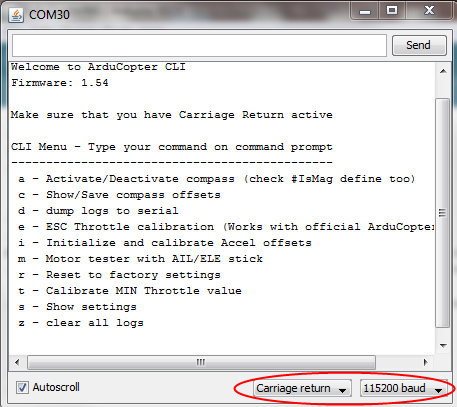
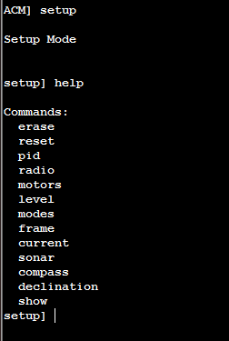

.. _using-the-command-line-interface:

================================
Using the Command Line Interface
================================

.. warning::

   The CLI is being phased out on all platforms. The features were
   massively cut down with AC3.1.5 and then it was removed for the APM2
   completely anyway with AC3.2. All CLI functions are now available via
   regular MAVLink commands in the GCSs. This article has been moved to the
   dev wiki and may be considered deprecated.

MOVE ALL THE CLI INFO TO THIS PAGE 

ALSO Mission Planer Terminal 

Overview
========

The Command Line Interface (CLI) is an alternative to the Configurator.
It does most of what the Configurator does, but in a text interface. One
reason to use this is that you may not be able to run the Configurator
(if you're running Linux, for example, or a Mac without a Windows
emulator). You may also prefer it because it's fast and clean. (There
are also a few commands that are only available in the CLI).

The way the CLI is used is by sliding the slider switch on the IMU board
towards the servo connectors.

**Don't forget to return it to the other position before you fly!**

Now open the Arduino serial monitor, setting baud rate to 115200 baud
and ensuring that "Carriage Returns" are enabled. You should see a
command line on the monitor:

Available commands
==================

Commands that are supported from current CLI are:

**a - Activate/Deactivate compass**

Every second 'a' activates / deactivates your compass usage inside
program. You also need to check that #define IsMAG is selected inside
program

**c - Compass offset calibration**

Roll/Pitch/Move/Rock/Twist your quad on every direction, even upside
down until offset numbers are not changing. After values are as desired
hit 'Enter' to save values and to exit back to main menu

**e - ESC Max Throttle calibration**

Official Copter ESCs (and few others too, you can test) supports
automatic max/min throttle calibrations.

#. SAFETY! Disconnect your propellers first!
#. Activate this calibration
#. Disconnect your battery but keep USB cable connected
#. Move your throttle stick to "full"
#. Connect your battery and listen normal ESC beepboop.. reboot sounds

   #. After ESCs send Beep Beep sound, move your throttle to minimum
   #. Listen final beep sound from ESCs

#. Give small throttle to your APM:Copter to see that all motors spins
   same speed

   #. If they do not spin, redo calibration

Hit 'Enter' to disarm all motors and to exit from ESC Calibration

If you are not using the official APM:Copter ESCs, you can manually
calibrate them one by one by connecting each ESC to your RC receiver's
channel 3 output. Unplug your battery, move transmitter throttle stick
to full, and reconnect the battery. Wait for the beeps to stop, then
bring the throttle stick down to the minimum again. Repeat for all four
ESCs.

**i - Initialize and calibrate Accel offsets**

Place your APM:Copter on level surface and reset its 0-Level with this
command. It takes some seconds until samples will be collected. During
calibration do not touch/move or in any other ways make your APM:Copter
to move.

**m - Motor tester with AIL/ELE stick**

Users can easily test that their ESC/Motors are connected correctly.
Move your AIL/ELE stick to up/down/left/right and corresponding motor
should start pulsing slowly. Correct motor rotation directions are shown
:ref:`here <copter:connect-escs-and-motors>`.

SAFETY! Disconnect propellers before doing your test.

If your motors does not follow your stick input eg. stick to full right
and left motors starts, change ESC cable on your Power Distributor PCB
or in APM connectors depending where you have connected your ESCs.

**r - Reset Factory settings**

With every new revision you need to reset our EEPROM (just in case).

**t - Calibrate MIN Throttle value**

Read minimum throttle value from your radio. Place throttle at minimum
and activate this test, Min throttle value is needed for all altitude
hold features and general motor operations.

**s - Show settings**

Printout most important settings to your serial port.

To use the CLI normally to prepare your quad for flight, you need to go
through a small number of steps.

-  Upload the code with the mission planner or Arduino.
-  In the terminal screen, hit "Enter" three times at startup if you're
   not automatically given the CLI entry prompt.

There are three menus in the CLI and you can type "help" at any time to
see the available menus or commands. Typing "setup" will get you into
the setup menu.

SETUP MENU COMMANDS
===================

-  Type "reset" to erase the EEPROM and start from scratch. This is an
   important step to prevent bad/old values from being loaded into a
   updated firmware installation. Note, after you do this, you will have
   to run through the

   :ref:`ESC calibration process <copter:esc-calibration>` again.
-  After rebooting the APM, connect your radio and enter "radio". You
   will be prompted to move your controls to their extremes and press
   the enter key to save the values. You should center your trims before
   running this command!
-  Run the "level" command with your copter on a perfectly level
   surface. Failing to do this step could lead to a very unstable
   copter.
-  Run "frame" to see what orientation you have setup for your copter.
   "x" is the default. "frame +" for example will enable a plus frame
-  Run "modes" to setup your flight modes. The roll stick selects modes,
   the yaw stick selects Simple mode on or off. Move your three position
   switch and set each mode. Press the enter key to save.
-  Enter "sonar on" to enable sonar
-  Enter "compass on" to enable compass
-  Enter "declination 14.25" to save the declination for the compass in
   decimal degrees.
-  Enter "exit" to leave setup.

TEST MENU COMMANDS
==================

-  Type "test" to enter the test menu from the top menu
-  Type "radio" to see the output of the radio values. Move the
   roll/pitch stick to the lower right and look for the value 4500, 4500
   (or near that value.) Throttle should be 0 - 800. Yaw is -4500(left)
   and 4500 (right).

That's it. You should be ready to fly.

AC2CLI

Using the Command Line Interpreter (CLI) to configure APM:Copter
----------------------------------------------------------------

You don't need to use the Mission Planner to set up APM:Copter (and
there are some advanced configuration options not covered by the Mission
Planner). You can also use APM's built-in Command Line Interpreter (CLI)
over a serial terminal, which will work on any computer and operating
system. It is only available via the USB cable; it cannot be used via a
Xbee/3DR wireless connection.

You will also need to use the CLI for such functions as assigning your
preferred flight modes to your RC transmitter's toggle switches. See the
menu descriptions below for instructions.

You can enter the CLI by hitting "Enter" three times in the Mission
Planner Terminal screen.

When you open it, it will look like this (with a more recent version
number of the software displayed):

.. image:: ../images/AC2_CLI.png
    :target: ../_images/AC2_CLI.png

If you're not using Windows, you can also use the Serial Monitor built
into Arduino (remember to select the right baud rate and enable CRs as
shown here):

.. image:: ../images/arduinoserialmon.png
    :target: ../_images/arduinoserialmon.png

Once you are in the CLI, you can type "help" at any menu and get a full
list of available commands.

There are three top-level menus: Setup, Test and Logs.

.. image:: ../images/CLI1.png
    :target: ../_images/CLI1.png

Each has sub-menus, whose command can also be seen by typing "help" when
you are in that section.

Setup Menu
----------

CLI interactive setup - You must go through each item and set the values
to match your hardware

"setup" menu:commands:
======================

-  **erase**: When installing ACM for the first time, run this to erase
   bad values from EEPROM -- just in case!
-  **reset**: Performs factory reset and initialization of EEPROM values
-  **radio**: Records the limits of ALL radio channels - very
   important!!!
-  **motors**: Interactive setup of your ESC and motors. Enter this
   mode, then plug-in battery, move your RC transmitter's pitch/roll
   sticks in each direction to make the prop in that direction spin (so
   moving the stick up will make the front rotor spin on a quad, and
   moving it right will make the right rotor spin). For copters with
   more than four motors, it will spin groups of motors, with the one
   closest to the direction of the stick going fastest.
-  **level**: Sets initial value of accelerometers - hold copter level
-  **modes**: Sets the flight modes assigned to each switch position
   (you have 5 available). Use your aileron/roll stick on your RC
   transmitter to scroll through the options. Full right moves forward
   through the list; full left moves back. Hit enter to save your
   settings and exit this mode.
-  **frame**: Sets your frame config: (x, +, v (Octo))
-  **current**: Enables an AttoPilot current sensor: (on, off, milliamp
   hours)
-  **sonar**: Enable sonar sensor. Sensor hooks to the "pitot" port
   which is an analog input (on, off). See installation details
   :ref:`here <copter:common-rangefinder-landingpage>`.
-  **compass**: Enables the compass (on, off)
-  **declination**: Sets your local declination value -- lookup online
   for accuracy (decimal degrees)
-  **show**: A formatted output of all the settings

Test Menu
---------

.. image:: ../images/CLI3.png
    :target: ../_images/CLI3.png

"test" menu commands:
=====================

-  **pwm**: Outputs the pwm values of all 8 radio channels
-  **radio**: Outputs the control values of all 8 radio channels in
   degrees x 100 or other value (see radio.pde)
-  **failsafe**: (Not currently used)
-  **stabilize**: Lets you test the stabilization with debugging output
   to the terminal (may spin the props -- not recommended for flying).
-  **gps**: Outputs GPS data. Note: typically you must be outside to get
   GPS lock. It can take two minutes or more to achieve lock at first
   power on.
-  **adc**: Outputs raw adc values
-  **imu**: Outputs euler angles
-  **battery**: Outputs voltage readings to analog in 0-3
-  **tune**: (Not currently used)
-  **current**: Outputs voltage and current from an AttoPilot current
   sensor. Motors will spin, so disconnect your four-wire cable or take
   off your props!
-  **relay**: Toggles the relay
-  **waypoints**: Dumps stored waypoint commands
-  **altitude**: Displays output from onboard barometric pressure sensor
-  **sonar**: Displays output from sonar sensor (if attached and
   enabled)
-  **compass**: Outputs compass angles in degrees (0 = north)
-  **xbee**: Outputs an XBEE sequence used for range testing
-  **eedump**: Raw output of bytes in EEPROM
-  **rawgps**: Outputs raw, unparsed GPS data
-  **mission**: Writes a default mission to EEPROM (null, 'wp').
   Choosing 'wp' option will send the copter 15 meters North and back
   again.

Logs Menu
---------

.. image:: ../images/CLI4.png
    :target: ../_images/CLI4.png

"logs" menu commands:
=====================

See the :ref:`datalogging page <copter:common-downloading-and-analyzing-data-logs-in-mission-planner>`
to better understand how to dump logs and how to set the types of data
you want to record.
