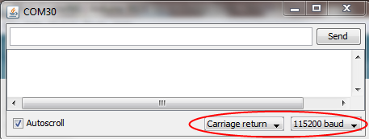
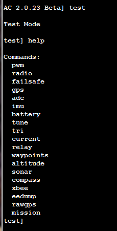

.. _using-the-command-line-interpreter-to-configure-apmcopter:

====================================================
Using the Command Line Interface to Configure Copter
====================================================

.. warning::

   The CLI is being phased out on all platforms. The features were
   massively cut down with AC3.1.5 and then it was removed for the APM2
   completely anyway with AC3.2. All CLI functions are now available via
   regular MAVLink commands in the GCSs. This article has been moved to the
   dev wiki and may be considered deprecated.

You don't need to use the Mission Planner to set up Copter (and there
are some advanced configuration options not covered by the Mission
Planner). You can also use APM's built-in Command Line Interpreter (CLI)
over a serial terminal, which will work on any computer and operating
system. It is only available via the USB cable; it cannot be used via a
Xbee/3DR wireless connection.

You will also need to use the CLI for such functions as assigning your
preferred flight modes to your RC transmitter's toggle switches. See the
menu descriptions below for instructions.

You can enter the CLI by hitting "Enter" three times in the Mission
Planner Terminal screen.

When you open it, it will look like this (with a more recent version
number of the software displayed):

If you're not using Windows, you can also use the Serial Monitor built
into Arduino (remember to select the right baud rate and enable CRs as
shown here):

Once you are in the CLI, you can type "help" at any menu and get a full
list of available commands.

There are three top-level menus: Setup, Test and Logs.

Each has sub-menus, whose command can also be seen by typing "help" when
you are in that section.

Setup Menu
==========

.. image:: ../images/CLI2.png
    :target: ../_images/CLI2.png

CLI interactive setup - You must go through each item and set the values
to match your hardware

"setup" menu:commands:
======================

-  **erase**: When installing ACM for the first time, run this to erase
   bad values from EEPROM -- just in case!
-  **reset**: Performs factory reset and initialization of EEPROM values
-  **radio**: Records the limits of ALL radio channels - very
   important!!!
-  **motors**: Interactive setup of your ESC and motors. Enter this
   mode, then plug-in battery, move your RC transmitter's pitch/roll
   sticks in each direction to make the prop in that direction spin (so
   moving the stick up will make the front rotor spin on a quad, and
   moving it right will make the right rotor spin). For copters with
   more than four motors, it will spin groups of motors, with the one
   closest to the direction of the stick going fastest.
-  **level**: Sets initial value of accelerometers - hold copter level
-  **modes**: Sets the flight modes assigned to each switch position
   (you have 5 available). Use your aileron/roll stick on your RC
   transmitter to scroll through the options. Full right moves forward
   through the list; full left moves back. Hit enter to save your
   settings and exit this mode.
-  **frame**: Sets your frame config: (x, +, v (Octo))
-  **current**: Enables an AttoPilot current sensor: (on, off, milliamp
   hours)
-  **sonar**: Enable sonar sensor. Sensor hooks to the "pitot" port
   which is an analog input (on, off).
-  **compass**: Enables the compass (on, off)
-  **declination**: Sets your local declination value -- lookup online
   for accuracy (decimal degrees)
-  **show**: A formatted output of all the settings

Test Menu
=========

"test" menu commands:
=====================

-  **pwm**: Outputs the pwm values of all 8 radio channels
-  **radio**: Outputs the control values of all 8 radio channels in
   degrees x 100 or other value (see radio.pde)
-  **failsafe**: (Not currently used)
-  **stabilize**: Lets you test the stabilization with debugging output
   to the terminal (may spin the props -- not recommended for flying).
-  **gps**: Outputs GPS data. Note: typically you must be outside to get
   GPS lock. It can take two minutes or more to achieve lock at first
   power on.
-  **adc**: Outputs raw adc values
-  **imu**: Outputs euler angles
-  **battery**: Outputs voltage readings to analog in 0-3
-  **tune**: (Not currently used)
-  **current**: Outputs voltage and current from an AttoPilot current
   sensor. Motors will spin, so disconnect your four-wire cable or take
   off your props!
-  **relay**: Toggles the relay
-  **waypoints**: Dumps stored waypoint commands
-  **altitude**: Displays output from onboard barometric pressure sensor
-  **sonar**: Displays output from sonar sensor (if attached and
   enabled)
-  **compass**: Outputs compass angles in degrees (0 = north)
-  **xbee**: Outputs an XBEE sequence used for range testing
-  **eedump**: Raw output of bytes in EEPROM
-  **rawgps**: Outputs raw, unparsed GPS data
-  **mission**: Writes a default mission to EEPROM (null, 'wp').
   Choosing 'wp' option will send the copter 15 meters North and back
   again.

Logs Menu
=========

"logs" menu commands:
=====================

Datalogging

You can use the on-board 16Mb datalogging memory to record information
about your flight and the APM’s performance.

Please note that before using the logging for the first time you must
"erase" the logs using the CLI (see below). If you do not take this step
then you will likely see a lot of invalid logs.

Normally, the slider switch on the IMU shield should be towards the
inside of the board, which is data logging/flight mode. But if you boot
up with it towards the edge of the board, it will go into the CLI mode.
Using the Arduino IDE serial monitor, you can type "logs" to manage and
read your log files:

Reading and analyzing logs with the Mission Planner
===================================================

The easiest way to download and analyze your log files is with the
Mission Planner, which will allow you to graph data, generate KML files
for Google Earth and otherwise manage the data flexibly.

Reading logs through the CLI
============================

You can also download data files with the CLI. Enter it by
typing ``logs`` in the CLI and hitting the enter key. Here are the
available commands:

-  **"dump *n*"**: Dump log number *n*.
-  **"dump 0"**: Dump and erase all logs.
-  **"erase"**: Erase all logs.
-  **"enable *name*"**: Enable logging *name*. Use "all" to enable
   everything.
-  **"disable *name*"**: Disable logging *name*. Use "all" to disable
   everything.

Here are the field names that can be logged, with the default state shown:

+------------------+---------------+--------------------------------------------------------------------------------------------------------------------+
| **Log name**     | **Default**   | **Function**                                                                                                       |
+------------------+---------------+--------------------------------------------------------------------------------------------------------------------+
| ATTITUDE_FAST    | DISABLED      | Logs basic attitude info to the dataflash at 50Hz (uses more space)                                                |
+------------------+---------------+--------------------------------------------------------------------------------------------------------------------+
| ATTITUDE_MED     | DISABLED      | Logs basic attitude info to the dataflash at 10Hz (uses less space than LOG_ATTITUDE_FAST)                         |
+------------------+---------------+--------------------------------------------------------------------------------------------------------------------+
| GPS              | ENABLED       | Logs GPS info to the dataflash at 10Hz.                                                                            |
+------------------+---------------+--------------------------------------------------------------------------------------------------------------------+
| PM               | DISABLED      | Logs IMU performance monitoring info every 20 seconds.                                                             |
+------------------+---------------+--------------------------------------------------------------------------------------------------------------------+
| CTUN             | ENABLED       | Logs control loop tuning info at 10 Hz. This information is useful for tuning servo control loop gain values.      |
+------------------+---------------+--------------------------------------------------------------------------------------------------------------------+
| NTUN             | ENABLED       | Logs navigation tuning info at 10 Hz. This information is useful for tuning navigation control loop gain values.   |
+------------------+---------------+--------------------------------------------------------------------------------------------------------------------+
| MODE             | DISABLED      | Logs changes to the flight mode upon occurrence.                                                                   |
+------------------+---------------+--------------------------------------------------------------------------------------------------------------------+
| RAW              | DISABLED      | Logs raw accelerometer and gyro data at 50 Hz (uses more space).                                                   |
+------------------+---------------+--------------------------------------------------------------------------------------------------------------------+
| CMD              | ENABLED       | Logs new commands when they process.                                                                               |
+------------------+---------------+--------------------------------------------------------------------------------------------------------------------+
| CURRENT          | DISABLED      | Logs current sensor if connected and enabled                                                                       |
+------------------+---------------+--------------------------------------------------------------------------------------------------------------------+
| MOTORS           | DISABLED      | Logs motor commands                                                                                                |
+------------------+---------------+--------------------------------------------------------------------------------------------------------------------+
